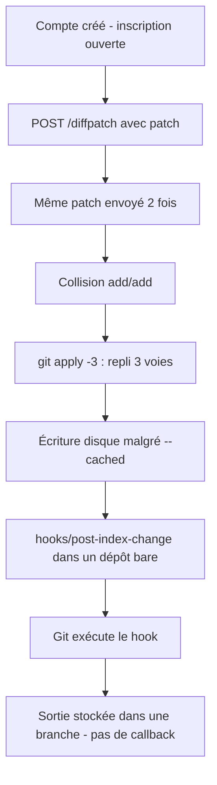
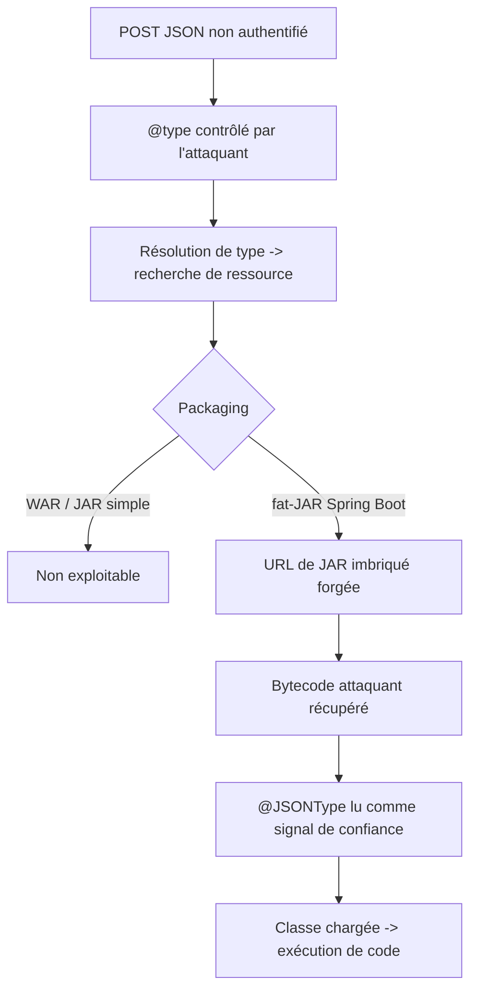

# Tech — Détail du lundi 3 août 2026

## 1. Gitea CVE-2026-60004 — un patch qui devient un hook Git et exécute du shell

**Source :** Gitea Security Advisory GHSA-rcr6-4jqh-j84m — https://github.com/go-gitea/gitea/security/advisories/GHSA-rcr6-4jqh-j84m
**Date :** avis publié le 28 juillet 2026, correctif 1.27.1 le 27 juillet

### Contexte

Gitea est la forge Git auto-hébergée légère qu'on installe pour ne pas dépendre de GitHub. Elle expose une API REST assez large, dont un endpoint `POST /api/v1/repos/{owner}/{repo}/diffpatch` qui applique un patch fourni par le client. Utile pour de l'automatisation, sans intérêt offensif apparent : il faut être authentifié et avoir le droit d'écriture sur le dépôt.

C'est là que la configuration par défaut change tout. Une installation Gitea non modifiée laisse l'inscription ouverte, n'exige ni validation d'email ni approbation manuelle, ne marque pas les nouveaux comptes comme restreints et n'impose aucune limite de création de dépôts. Autrement dit, un visiteur anonyme peut s'inscrire, créer son propre dépôt, et remplir la condition « utilisateur authentifié avec droit d'écriture » en trente secondes. La barrière d'authentification existe, mais elle ne barre rien.

La faille a été signalée par le chercheur Shai Rod (NightRang3r). Elle est notée CVSS 9,8 et affecte les versions 1.17 à 1.27.0.

### Comment ça marche

Le raisonnement mérite d'être déroulé, parce qu'il illustre un piège Git que tu peux reproduire ailleurs.

L'endpoint applique le patch dans un **clone bare temporaire** partagé. Un dépôt bare n'a pas de copie de travail : son répertoire racine *est* le `$GIT_DIR`. Les hooks vivent donc directement dans `<racine>/hooks/`, et non dans `.git/hooks/`.

Les builds vulnérables invoquent `git apply` avec `--index`, `--recount`, `--cached` et `--binary`, en ajoutant l'option `-3` — repli en fusion à trois voies — quand le serveur tourne sous Git 2.32 ou plus récent. En théorie `--cached` garantit que rien n'est écrit sur le disque : Git ne touche que l'index.

L'attaque exploite précisément l'exception. L'attaquant soumet **deux fois le même patch**, ce qui crée une collision add/add : le même chemin est ajouté deux fois. Le repli à trois voies se déclenche pour résoudre le conflit, et dans ce chemin de code Git écrit le fichier indexé sur le disque, malgré `--cached`. Comme la racine du dépôt bare est le `$GIT_DIR`, un fichier exécutable placé au chemin `hooks/post-index-change` atterrit dans le répertoire de hooks — et devient actif. Git l'exécute lui-même pendant la mise à jour de l'index.

Le PoC ne demande même pas de callback sortant : le hook stocke sa sortie dans des objets Git, crée une branche contenant le résultat, et l'attaquant la récupère par smart HTTP authentifié. Aucun trafic sortant à détecter.



Le correctif tient en une ligne conceptuelle : Gitea a changé le clone temporaire de **bare** à **non-bare**. La racine n'est alors plus le `$GIT_DIR`, et un fichier écrit sous `hooks/` retombe dans l'arbre de travail, inoffensif. Le commentaire du commit avertit explicitement que les commandes Git utilisant `--index` peuvent opérer sur l'arbre de travail.

### En pratique — exemple de code

Vérifier ta version et corriger :

```bash
# 1. Version installée
gitea --version            # ou : docker exec gitea gitea --version

# 2. Corriger : 1.27.1 minimum
docker compose pull && docker compose up -d

# 3. Mitigation partielle en attendant : fermer l'inscription (app.ini)
#    [service]
#    DISABLE_REGISTRATION = true
#    REQUIRE_SIGNIN_VIEW  = true
```

Chercher un hook déposé — la trace la plus directe d'exploitation :

```bash
# Hooks non standard dans les dépôts servis (post-index-change n'est jamais légitime ici)
find /var/lib/gitea/data/gitea-repositories -type f -path '*/hooks/*' \
  -newermt '2026-07-01' -perm -u+x -print

# Branches créées récemment par un compte inattendu
git -C /var/lib/gitea/data/gitea-repositories/<owner>/<repo>.git \
  for-each-ref --sort=-committerdate --format='%(committerdate:iso) %(refname) %(authoremail)' | head
```

### Pourquoi ça compte pour toi

Si tu héberges une Gitea pour ton équipe, passe en 1.27.1 aujourd'hui : le PoC est public et l'inscription ouverte est le défaut. En cas de compromission, l'attaquant obtient les privilèges du compte système Gitea — donc les secrets d'environnement, les identifiants de base, les credentials OAuth et l'accès réseau interne de la machine. Fermer l'inscription réduit la surface mais ne corrige rien : tout utilisateur existant ayant un droit d'écriture reste capable d'exploiter la faille.

### Points de vigilance

Le correctif apparaît dans les release notes sous « MISC : refactor git patch apply », pas sous SECURITY. Si tu tries tes mises à jour en lisant le changelog, tu l'as manqué.

---

## 2. Fastjson CVE-2026-16723 — RCE non authentifiée dans les fat-JAR Spring Boot, sans correctif 1.x

**Source :** Alibaba Security Advisory (fastjson2 wiki) — https://github.com/alibaba/fastjson2/wiki/Security-Advisory:-Remote-Code-Execution-in-fastjson-1.2.68%E2%80%931.2.83
**Date :** avis publié le 21 juillet 2026

### Contexte

Fastjson est la bibliothèque JSON d'Alibaba pour Java, largement présente dans l'écosystème backend chinois et, par transitivité, dans beaucoup de dépendances tierces ailleurs. Sa branche 1.x traîne un historique de failles lié à `AutoType` : la capacité à instancier une classe arbitraire indiquée par un champ `@type` dans le JSON. Après une longue série de contournements, Alibaba a fini par désactiver `AutoType` par défaut et introduit `SafeMode`, qui refuse purement et simplement `@type`. La version 1.2.83 était la recommandation officielle depuis 2022.

CVE-2026-16723 remet en cause cette recommandation, puisque 1.2.83 est elle-même dans la plage affectée (1.2.68 à 1.2.83). Le score CVSS attribué par Alibaba est 9,0. La faille a été signalée par Kirill Firsov (FearsOff).

Deux caractéristiques la rendent inhabituelle. Elle ne nécessite **pas** l'activation d'`AutoType`. Et elle ne nécessite **aucun gadget** dans le classpath — pas de chaîne de désérialisation à assembler à partir de bibliothèques présentes. Les mainteneurs ont vérifié la chaîne sur Spring Boot 2.x, 3.x et 4.x, avec JDK 8, 11, 17 et 21.

### Comment ça marche

Le point d'entrée est la résolution de type de Fastjson. Une valeur `@type` contrôlée par l'attaquant peut être transformée non pas en instanciation directe, mais en **recherche de ressource de classe**. C'est cette bascule — de « charger une classe connue » vers « aller chercher une ressource » — qui ouvre la porte.

Le second maillon est spécifique au packaging. Un fat-JAR Spring Boot n'est pas un JAR ordinaire : il embarque les dépendances sous forme de JAR imbriqués, et Spring Boot fournit son propre `ClassLoader` capable de résoudre des URL de la forme `jar:file:...!/BOOT-INF/lib/x.jar!/...`. Un chemin de JAR imbriqué forgé permet donc d'atteindre du bytecode contrôlé par l'attaquant. Enfin, une annotation `@JSONType` présente dans cette ressource est interprétée comme un signal de confiance, ce qui laisse la classe passer les contrôles de type de Fastjson et être chargée.

Firsov décrit également une variante sur JDK récent qui télécharge un JAR distant puis le référence via `/proc/self/fd`.



Le périmètre est donc étroitement lié au packaging : Alibaba liste comme **non affectés** les JAR simples, les uber-JAR génériques, et les déploiements WAR sur Tomcat ou Jetty. Les points d'entrée à surveiller sont `JSON.parse`, `JSON.parseObject(String)` et `JSON.parseObject(String, Class)`. Attention : lier l'entrée à une classe fixe ne suffit pas si cette classe contient un champ `Object` ou `Map` où la charge peut être imbriquée.

Aucune version 1.x corrigée n'existe à ce jour. ThreatBook déclare avoir observé de l'exploitation réelle le 22 juillet ; Imperva rapporte de l'activité contre des organisations de la finance, de la santé et du commerce, principalement aux États-Unis. Aucun des deux ne publie de compte de requêtes ni de compromission confirmée, et l'évaluation CISA-ADP du 23 juillet marque l'exploitation à `none`.

### En pratique — exemple de code

Inventorier la dépendance, y compris en transitif :

```bash
# Repérer fastjson 1.x, direct ou transitif
mvn dependency:tree -Dincludes=com.alibaba:fastjson
./gradlew dependencies --configuration runtimeClasspath | grep -i fastjson

# Vérifier ce qui est réellement embarqué dans l'artefact livré
unzip -l app.jar | grep -i 'fastjson'
```

Palliatifs, par ordre de préférence :

```bash
# 1) Migration cible : fastjson2 (non affecté, chemin de résolution différent)
#    <groupId>com.alibaba.fastjson2</groupId><artifactId>fastjson2</artifactId>

# 2) SafeMode : refuse tout @type, casse le polymorphisme voulu
java -Dfastjson.parser.safeMode=true -jar app.jar

# 3) Build restreint, si SafeMode est trop brutal
#    <artifactId>fastjson</artifactId><version>1.2.83_noneautotype</version>
```

Recherche d'indicateurs côté logs applicatifs :

```bash
# Requêtes contenant un @type, surtout avec un chemin de JAR imbriqué
grep -aE '"@type"' access.log | grep -aE 'BOOT-INF/lib|jar:file:|/proc/self/fd' | head -50
```

### Pourquoi ça compte pour toi

Tu es surtout concerné en tant que consommateur indirect : Fastjson arrive souvent par une dépendance tierce, pas par un choix explicite. Lance l'inventaire même si tu n'as jamais écrit `JSON.parseObject`. Si un service Java exposé de ton SI est packagé en fat-JAR Spring Boot avec Fastjson 1.x, considère-le comme exploitable sans authentification et applique `SafeMode` en attendant la migration vers fastjson2.

### Limites

`SafeMode` casse tout usage légitime du polymorphisme via `@type`. Teste-le en recette avant la production : un service qui désérialise des hiérarchies de types peut cesser de fonctionner.
