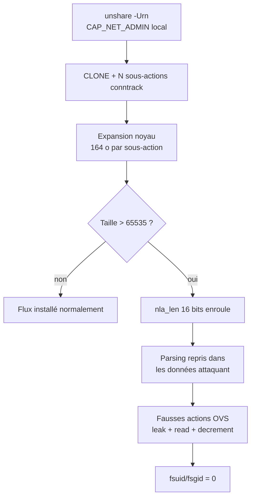
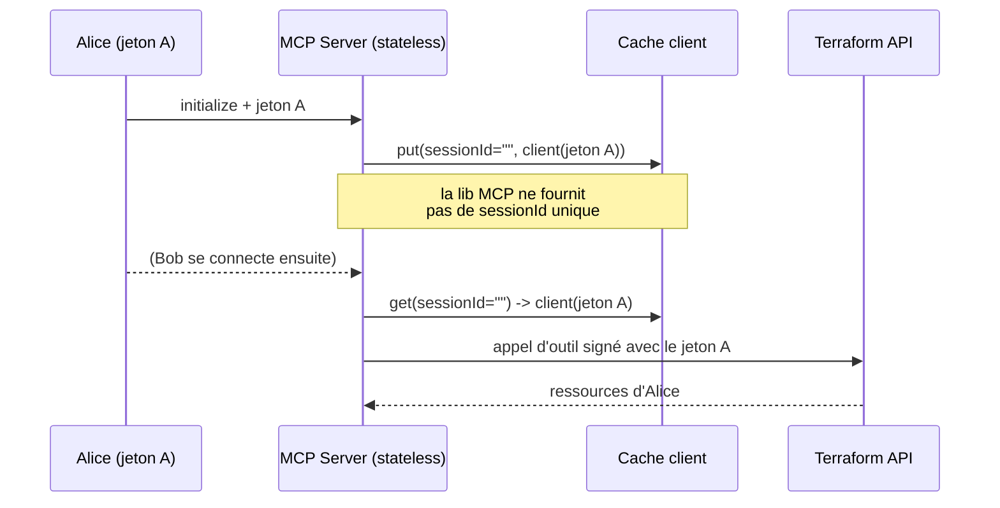
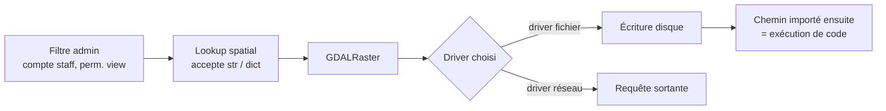

# Tech — Détail du jeudi 6 août 2026

## 1. OVSwrap (CVE-2026-64531) — un dépassement d'entier 16 bits dans Open vSwitch donne le root local

**Source :** The Hacker News — https://thehackernews.com/2026/08/new-ovswrap-linux-kernel-flaw-lets.html
**Date :** 5 août 2026

### Contexte

Open vSwitch (OVS) est le commutateur virtuel utilisé par OpenStack, Kubernetes CNI et la plupart des stacks de virtualisation réseau. Il a deux moitiés : un démon en espace utilisateur, `ovs-vswitchd`, et un *datapath* dans le noyau Linux qui exécute réellement les flux. La faille est dans le datapath, pas dans le démon. Conséquence directe : tu n'as besoin ni d'un bridge OVS existant, ni d'`ovs-vswitchd` lancé, ni de `CAP_NET_ADMIN` sur l'hôte.

Le bug a été divulgué le 28 juillet 2026 par Asim Manizada, qui l'avait signalé à `security@kernel.org` le 19 juin. L'assignation dangereuse existait depuis 13 ans, mais un plafond de 32 Kio sur le flux total d'actions générées empêchait de l'atteindre. Un commit de mars 2025 a retiré ce plafond parce qu'il provoquait des échecs imprévisibles sur de gros déploiements OpenStack. Le fil de revue parlait fiabilité ; personne n'a relié la suppression de la garde à la troncature qu'elle masquait.

### Comment ça marche

Le mécanisme se déroule en cinq temps, et il vaut la peine de le suivre pas à pas parce que c'est un cas d'école de dépassement d'entier.

**Un.** OVS stocke les actions de flux générées sous forme d'attributs Netlink. Un attribut Netlink porte un champ de longueur `nla_len` codé sur **16 bits**. Plafond structurel : 65 535 octets pour un attribut imbriqué.

**Deux.** L'attaquant crée un espace de noms utilisateur et réseau privé avec `unshare -Urn`. À l'intérieur, il obtient `CAP_NET_ADMIN` — une capacité qui ne vaut que dans ce namespace, mais qui suffit à atteindre le chemin d'installation de flux.

**Trois.** Il soumet une action `CLONE` bourrée de centaines de sous-actions `conntrack`. Sur x86-64, le noyau développe chaque sous-action en 164 octets. Quelques centaines suffisent à dépasser 65 535 octets.

**Quatre.** Le noyau écrit la taille réelle dans le champ 16 bits. La valeur **enroule** (wrap). Le code suivant fait confiance à cette longueur tronquée et reprend l'analyse *à l'intérieur* des données `conntrack` — c'est-à-dire dans une zone entièrement contrôlée par l'attaquant, où de fausses actions OVS attendent déjà.

**Cinq.** Comme le point d'atterrissage est déterministe dans le même tampon contigu, aucun *heap grooming* n'est nécessaire. Manizada parle d'une corruption mémoire « à la fiabilité d'un bug de logique ».

L'exploit chaîne ensuite trois primitives : fuite de pointeur noyau via une fausse action `OUTPUT`, lecture arbitraire via une action `SET` de tunnel forgée, puis décrément ciblé lors du démontage d'un pointeur `tun_dst` forgé. Sur les noyaux récents, il décrémente `fsuid` et `fsgid` d'un processus hôte jusqu'à zéro.



### En pratique — exemple de code

Le contrôle le plus rapide n'est pas `lsmod`. Résoudre le nom de famille Generic Netlink d'`openvswitch` suffit à charger le module automatiquement : un `lsmod` vide ne prouve rien.

```bash
# --- Diagnostic ---
# Le module est-il DISPONIBLE (et non « chargé ») ? C'est ça qui compte.
modinfo openvswitch >/dev/null 2>&1 && echo "openvswitch disponible -> exposé"

# Les user namespaces non privilégiés sont-ils ouverts ? (1 = oui, route locale ouverte)
sysctl -n kernel.unprivileged_userns_clone 2>/dev/null
cat /proc/sys/user/max_user_namespaces

# --- Mitigation intérimaire, si tu n'utilises PAS Open vSwitch ---
# Bloque les CHARGEMENTS FUTURS du module.
echo 'install openvswitch /bin/false' | sudo tee /etc/modprobe.d/ovswrap.conf

# Attention : un module déjà résident en mémoire n'est pas concerné par l'override.
sudo rmmod openvswitch 2>/dev/null || echo "module résident -> planifier un reboot"
```

Le correctif amont est parti dans les branches stables le 24 juillet. Premières versions corrigées : **5.15.212, 6.1.178, 6.6.145, 6.12.97, 6.18.40, 7.1.5**. Les séries 6.13 à 6.17, 6.19 et 7.0 sont en fin de vie et ne recevront pas de correctif amont. Ces numéros ne suffisent pas : les noyaux de distribution portent des backports, donc le tracker du fournisseur reste la source de vérité.

### Pourquoi ça compte pour toi

Si tu exposes un hôte partagé — CI mutualisée, serveur web multi-clients, nœud Kubernetes avec des workloads peu fiables — OVSwrap transforme un compte compromis en compromission totale de la machine. Sur Ubuntu 24.04, AppArmor bloque la création directe de namespace, mais le PoC contourne via `aa-exec -p trinity`. Applique le noyau de ton fournisseur ; sinon, bloque le module et planifie un redémarrage.

### Points de vigilance

Désactiver les user namespaces non privilégiés ferme la route « utilisateur local ordinaire », mais **pas** celle d'un conteneur qui détient déjà `CAP_NET_ADMIN` sur un namespace réseau qu'il contrôle. Manizada décrit cette direction comme théoriquement atteignable sans l'avoir démontrée. Le dépôt du PoC fournit aussi une garde eBPF d'urgence pour les environnements qui doivent garder OVS et les namespaces actifs.

---

## 2. Terraform MCP Server (CVE-2026-16498) — quand le serveur croit que la couche MCP isole les tenants

**Source :** The Hacker News — https://thehackernews.com/2026/08/veeam-terraform-mcp-django-patch.html
**Date :** 5 août 2026

### Contexte

Le serveur MCP de Terraform relie un assistant IA à Terraform via le Model Context Protocol. HashiCorp l'a passé en disponibilité générale en juin 2026 et a poussé le déploiement **centralisé partagé** : une instance, plusieurs développeurs, transport Streamable HTTP. Le mode `stdio` — un processus local, un seul utilisateur — n'est pas concerné.

Trois failles ont été divulguées le 28 juillet et corrigées en 1.1.0 (sortie le 14 juillet, suivie de 1.2.0 le 4 août). La plus grave est notée **CVSS 10,0**. Elle n'est pas due à un bug de crypto ni à une injection : c'est une hypothèse fausse sur la couche du dessous.

### Comment ça marche

Le serveur maintient un **cache de clients Terraform**. Chaque utilisateur fournit son propre jeton Terraform ; le serveur construit un client avec ce jeton et le range dans le cache pour ne pas le reconstruire à chaque appel d'outil. La question centrale : *quelle clé sert à ranger et retrouver ce client ?*

La réponse choisie a été **l'identifiant de session MCP**. C'est un choix raisonnable en apparence : une session = un utilisateur. Sauf que la bibliothèque MCP sous-jacente, **en mode stateless, n'attribue pas d'identifiants de session uniques**. Le cache se retrouve donc avec une clé constante ou dégénérée : le premier client mis en cache est servi à tout le monde. Le jeton Terraform d'Alice exécute les appels d'outil de Bob, quel que soit le jeton que Bob a fourni.

CVE-2026-16496 (CVSS 8,9) est la variante en mode **stateful** — celui qui est *par défaut* pour un déploiement central. Là, les identifiants de session existent bien, mais le cache utilise l'ID de session comme unique clé de recherche, **sans lier le client mis en cache au jeton qui l'a créé**. Qui obtient l'ID de session d'un autre exécute des appels avec le client Terraform de la victime.

CVE-2026-14869 (CVSS 8,6) complète le tableau : le middleware rejetait une adresse Terraform fournie par le client quand elle arrivait en en-tête HTTP, mais pas quand la même valeur passait en paramètre de requête. Un appelant non authentifié atteignant l'écouteur pouvait faire envoyer le bearer token du serveur vers son propre endpoint. SSRF classique, causé par deux chemins de validation désynchronisés.



### En pratique — exemple de code

Le motif à retenir est général : **ne dérive jamais l'isolation d'un identifiant fourni par la couche en dessous ; lie le cache au secret lui-même.**

```go
// Avant — la clé de cache vient de la couche MCP.
// En mode stateless, sessionID est vide/constant -> un seul client pour tous.
func (s *Server) clientFor(ctx context.Context, token string) *tf.Client {
    sessionID := mcp.SessionIDFrom(ctx)      // hypothèse : unique par utilisateur
    if c, ok := s.cache.Get(sessionID); ok {
        return c                              // <-- rend le client d'un AUTRE tenant
    }
    c := tf.New(token)
    s.cache.Set(sessionID, c)
    return c
}

// Après — la clé dérive du secret présenté, pas de la session.
// Deux jetons différents ne peuvent structurellement pas partager une entrée.
func (s *Server) clientFor(ctx context.Context, token string) *tf.Client {
    sum := sha256.Sum256([]byte(token))       // ne jamais stocker le jeton en clair
    key := hex.EncodeToString(sum[:])
    if c, ok := s.cache.Get(key); ok {
        return c
    }
    c := tf.New(token)
    s.cache.Set(key, c)
    return c
}
```

Aucune des trois failles n'est au KEV au 5 août et aucun PoC public n'est sorti. Passe en 1.1.0 minimum. Si tu ne peux pas mettre à jour tout de suite, restreins l'accès réseau à l'écouteur Streamable HTTP et traite les IDs de session MCP comme des valeurs sensibles.

### Pourquoi ça compte pour toi

Tu vas déployer des serveurs MCP internes — Azure DevOps, base de données, CI. Retiens la question à poser à chaque fois : *sur quoi repose l'isolation entre utilisateurs, et est-ce que la couche en dessous garantit vraiment cette propriété ?* Une clé de cache dérivée d'un identifiant non garanti unique est le même bug qu'un `HttpClient` statique partageant un `Authorization` par défaut. Vérifie aussi tes chemins de validation : en-tête et query string doivent passer par le même contrôle.

### Limites

Attention à la lecture des scores. Veeam note en CVSS 4.0 et HashiCorp en 3.1 : le 9,5 de Veeam et le 10,0 d'HashiCorp ne sont pas la même mesure. Et le 10,0 vise le mode stateless, qu'un opérateur doit activer délibérément, tandis que le 8,9 vise le mode stateful, qui est le défaut. Ce qui te concerne dépend de ta configuration, pas du chiffre le plus élevé.

---

## 3. Django 6.0.8 et 5.2.17 — CVE-2026-15307 : les lookups spatiaux GeoDjango pouvaient écrire un fichier

**Source :** Django Software Foundation — https://www.djangoproject.com/weblog/2026/aug/04/security-releases/
**Date :** 4 août 2026

### Contexte

GeoDjango est la couche géospatiale de Django. Elle s'appuie sur GDAL, une bibliothèque C qui lit et écrit des dizaines de formats raster. Django 6.0.8 et 5.2.17, sortis le 4 août, corrigent quatre CVE ; une seule est classée *high* selon la politique de sévérité du projet, et c'est celle-là.

Ce n'est pas la première fois que ce coin du code attire l'attention. En février, le projet corrigeait CVE-2026-1207, une injection SQL dans les lookups raster PostGIS. CrowdSec a publié une règle de détection le 18 février, observé les premières attaques le 26, puis un sondage régulier visant à localiser les déploiements Django adossés à PostGIS. Le code est sous surveillance.

### Comment ça marche

Le mécanisme tient en trois maillons.

**Maillon 1 — la coercition trop permissive.** Les lookups spatiaux acceptaient des valeurs de type `str` et `dict`. Quand la valeur *ressemblait* à un raster, Django la passait telle quelle à `GDALRaster`.

**Maillon 2 — GDAL fait ce qu'on lui demande.** `GDALRaster` accepte une spécification de source. Selon le driver sélectionné, construire l'objet peut **écrire un fichier sur le disque** ou faire **émettre une requête réseau** au processus Django. Ce ne sont pas des bugs de GDAL : c'est son contrat. Le bug est de laisser une entrée utilisateur atteindre ce contrat.

**Maillon 3 — l'escalade vers l'exécution.** Écrire un fichier n'est pas grave en soi. Écrire un fichier à un emplacement que l'application importe ensuite — un répertoire sur le `PYTHONPATH`, un dossier de templates, un chemin de plugin — l'est. Le chemin documenté aboutit alors à une exécution de code distant.

Le chemin d'attaque documenté passe par l'admin Django et exige un compte **staff** avec la permission `view` sur un modèle enregistré comportant un champ spatial. Ce n'est donc pas une attaque pré-authentifiée : c'est une escalade depuis un compte à droits de lecture, ce qui reste sérieux dans une équipe où beaucoup de gens ont un accès admin en lecture.



Le correctif interdit les valeurs `dict` et les chaînes qui ne sont pas des `GEOSGeometry` valides **dans les lookups spatiaux**. C'est un changement **rétro-incompatible** assumé. L'affectation directe sur un champ de modèle continue d'accepter ces types.

### En pratique — exemple de code

```python
# --- Avant 6.0.8 : ces deux formes passaient dans un lookup spatial ---
from myapp.models import Parcelle

# Une chaîne quelconque, ou un dict décrivant une source raster,
# arrivait jusqu'à GDALRaster -> écriture disque ou requête réseau.
Parcelle.objects.filter(zone__contains=request.GET["z"])       # z fourni par l'utilisateur
Parcelle.objects.filter(zone__contains={"srid": 4326, ...})    # dict accepté

# --- Après 6.0.8 / 5.2.17 : le lookup refuse dict et str non-GEOS ---
from django.contrib.gis.geos import GEOSGeometry
from django.core.exceptions import ValidationError

try:
    # Parse explicitement : tu contrôles le format, et l'erreur est la tienne.
    zone = GEOSGeometry(request.GET["z"])       # lève GEOSException si invalide
except Exception:
    raise ValidationError("Géométrie invalide")

Parcelle.objects.filter(zone__contains=zone)    # seul un GEOSGeometry passe

# L'affectation directe sur le champ reste permissive — ne l'alimente pas
# avec une entrée non validée pour autant.
parcelle.zone = zone
```

Les trois autres CVE sont plus légères : XSS stocké dans l'admin via des valeurs `URLField` rendues en lien (CVE-2026-15920, *moderate*), déni de service par `GEOMETRYCOLLECTION` profondément imbriqués provoquant un segfault GEOS (CVE-2026-15830, désormais limité à 198 collections), et consommation mémoire dans `check_for_language()` (CVE-2026-15337, codes de langue > 500 caractères rejetés).

### Pourquoi ça compte pour toi

Tu fais du Symfony et du .NET plus que du Django, mais le motif est transposable directement : une couche de requête qui accepte des types « pratiques » et les transmet à une bibliothèque native dont le contrat inclut des effets de bord. Pense `TypeConverter` en .NET, désérialiseurs Doctrine, ou tout mapping qui accepte un `object`. Ferme le type en entrée, parse explicitement, et n'hérite jamais de la permissivité d'une lib C.

### Limites

Les branches non maintenues — Django 5.1, 5.0, 4.2 — n'ont pas été évaluées et peuvent être affectées. Le sondage observé depuis février repère les applications adossées à PostGIS, mais ne fournit pas de compte staff : la reconnaissance qui a trouvé ces déploiements s'arrête un cran avant l'exploitation de cette faille-ci.
