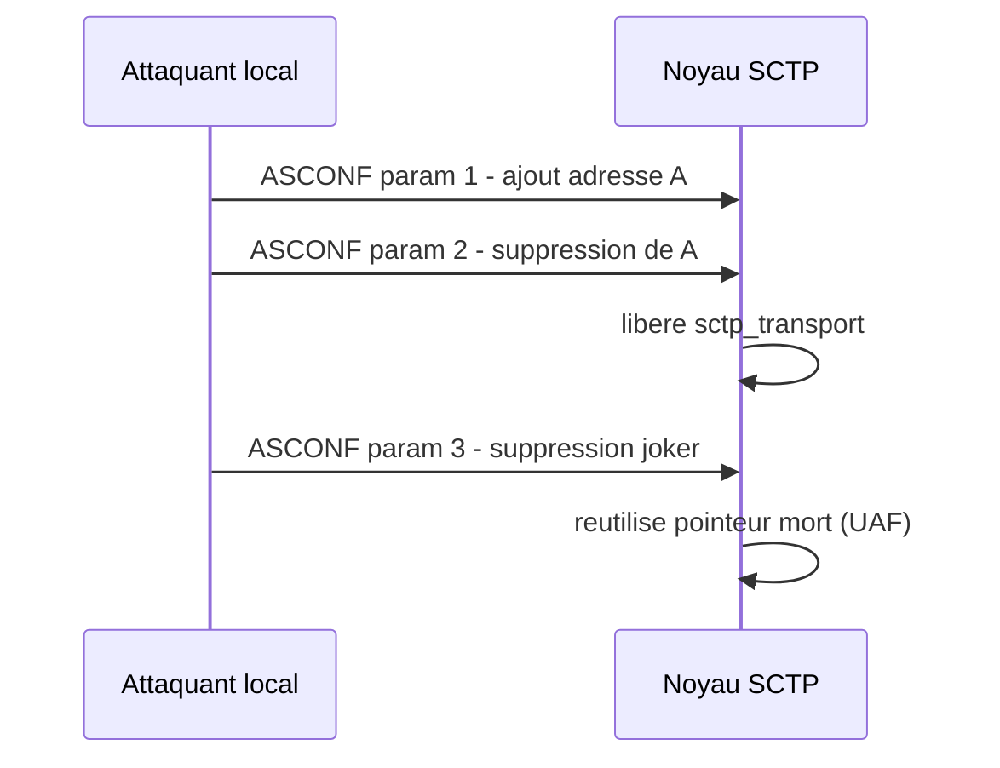
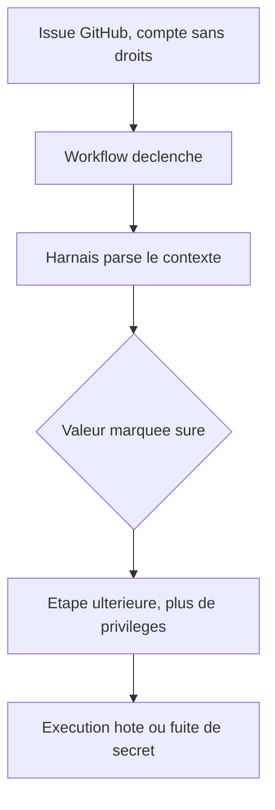
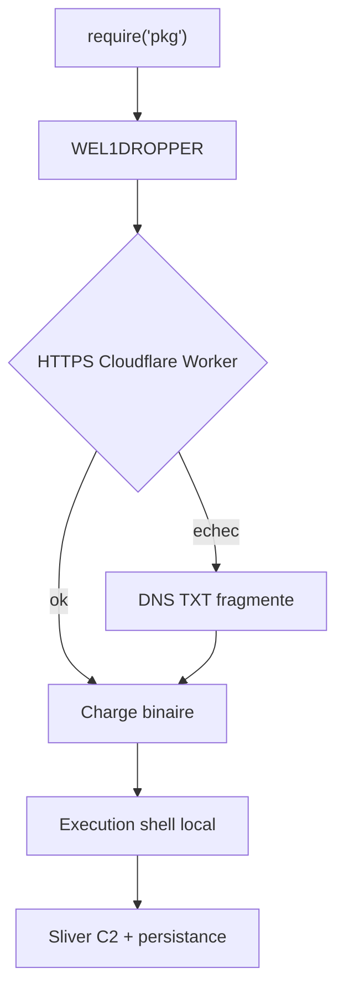

# Tech — Détail du samedi 8 août 2026

## 1. SCTPhantom (CVE-2026-64564) — un use-after-free de 2008 dans SCTP donne le root et sort du conteneur

**Source :** The Hacker News — https://thehackernews.com/2026/08/18-year-old-linux-sctp-flaw-could-let.html
**Date :** 7 août 2026

### Contexte

SCTP est un protocole de transport moins connu que TCP, conçu pour faire passer une même connexion par plusieurs chemins réseau simultanément. Chaque chemin est représenté côté noyau par une structure `sctp_transport`. Une fonctionnalité compagnon, la reconfiguration dynamique d'adresses (ASCONF), permet à un pair d'ajouter ou de retirer des adresses en cours de connexion.

Le bug se situe précisément là. Il date de Linux 2.6.25, en 2008, et il est présent dans tous les noyaux publiés depuis. Il a été trouvé par Corvus AI, un pipeline de recherche multi-agents que Tencent a construit pour l'audit de noyau — le même mois que GhostLock, dans la même veine de failles dormantes exhumées par assistance machine.

### Comment ça marche

Le défaut est une confusion d'identité entre deux adresses, dans une même opération.

1. Un paquet ASCONF arrive. Le noyau détermine le `sctp_transport` **contre lequel** il traite ce paquet, à partir de l'adresse source du paquet.
2. Le message ASCONF contient des paramètres. L'un d'eux est une demande de suppression d'adresse, avec l'adresse cible **à l'intérieur du message**.
3. Le noyau valide la demande de suppression en la comparant à l'adresse source du paquet.
4. Mais il agit sur le chemin qu'il a sélectionné à partir de l'adresse contenue dans le message.

Ces deux adresses peuvent différer. C'est tout le problème : la vérification porte sur une chose, l'action sur une autre.

Le scénario d'exploitation tient dans un seul message. Ce message porte trois paramètres à la suite : une adresse `A`, une suppression de cette même adresse `A`, puis une suppression joker (`wildcard`). La deuxième opération libère la structure de chemin. La troisième réutilise le pointeur devenu mort. La connexion pointe alors sur de la mémoire que le noyau a déjà rendue — un use-after-free classiquement transformable en écriture arbitraire, donc en root.

Le correctif est aussi simple que le bug : refuser une suppression visant le chemin contre lequel le message est en cours de traitement.



Sur la portée réelle, il faut être précis. La faille est **locale**, pas distante, et exige que SCTP soit accessible sur la cible. Tencent Zhuque Lab dit avoir obtenu le root sur ses builds de test pour Debian 13, Ubuntu 24.04, Rocky Linux 9, RHEL 9 et OpenCloudOS. Le laboratoire affirme aussi être sorti d'un conteneur en conservant le profil seccomp par défaut, sans `CAP_NET_ADMIN` ni `CAP_SYS_ADMIN` — six tentatives sur huit. Une première version de leur exploit exigeait les sysctls `net.sctp.addip_enable` et `addip_noauth_enable` ; ils ont ensuite trouvé une voie qui active les fonctionnalités par socket, laissant les sysctls intacts. Personne n'a reproduit ces résultats en dehors du laboratoire, et l'avis openKylin sur le même bug ne va pas au-delà du panic et du déni de service.

### En pratique — exemple de code

```bash
# 1. SCTP est-il seulement chargé ? Si non, tu n'es pas exposé.
lsmod | grep -w sctp

# 2. Vérifier la version — mais NE PAS s'y fier seule :
#    les distributions rétroportent le correctif sans changer le numéro.
uname -r        # correctifs upstream : 7.1.6, 6.18.42, 6.12.101, 6.6.148 (3 août)

# 3. Mitigation la plus fiable si tu n'utilises pas SCTP : bloquer le module.
echo 'install sctp /bin/true' | sudo tee /etc/modprobe.d/disable-sctp.conf
sudo rmmod sctp 2>/dev/null || true
```

### Pourquoi ça compte pour toi

Si tu fais tourner des conteneurs multi-tenants ou de la CI qui exécute du code non fiable, la revendication d'évasion suffit à prioriser le patch. Sur un serveur applicatif classique .NET ou PostgreSQL, tu n'utilises pas SCTP : bloque le module, et la surface d'attaque disparaît sans attendre le redémarrage de maintenance.

### Points de vigilance

Un second use-after-free de chemin fantôme dans le même code a été corrigé le 6 août, **après** la publication des noyaux stables du 3 août. Ces noyaux ne le portent donc pas. Le score CVSS reste instable : 8,5 en v4 selon Tencent, ni score ni classification CWE côté NVD au 7 août.

---

## 2. Claude Code et Gemini CLI — une issue GitHub atteint les secrets du runner CI

**Source :** The Hacker News — https://thehackernews.com/2026/08/claude-code-and-gemini-cli-flaws-let.html
**Date :** 7 août 2026

### Contexte

Brancher un agent de code sur ta CI est devenu banal : un workflow se déclenche sur une issue ou une pull request, l'agent lit le contexte, propose un correctif. Novee Security a testé les agents d'Anthropic, Google et OpenAI dans la configuration que chaque éditeur livre par défaut — sur leurs propres dépôts. Résultat présenté à Black Hat USA le 5 août : une issue GitHub ouverte par un compte sans aucun droit sur le dépôt suffisait à exécuter du code sur les runners CI d'Anthropic et Google. Sur celui d'OpenAI, elle suffisait à détourner le run suivant de l'agent.

Deux CVE en sont sorties. Les deux sont corrigées.

### Comment ça marche

Le point commun des trois cas n'est pas le modèle, mais le **harnais** : le code entre le modèle et le monde réel, qui décide de ce qui s'exécute vraiment. Le motif se répète : une partie du code marque une valeur comme sûre, et une partie ultérieure agit sur cette valeur avec plus d'autorité.

**Gemini CLI — CVE-2026-12537 (CVSS v4 10,0).** Injection de commande OS dans le lanceur de conteneur, atteinte via un fichier `.gemini/.env` fabriqué. Un attaquant non privilégié exécute du code sur l'hôte d'une plateforme CI headless **avant que le bac à sable ne démarre**. Le modèle n'est pas impliqué : il n'y a personne à convaincre. Corrigé en Gemini CLI 0.39.1 et run-gemini-cli 0.1.22. Une seconde faiblesse du même avis : la liste blanche d'outils n'était analysée qu'à l'enregistrement de l'outil, jamais appliquée à l'exécution — et sous `--yolo`, chaque commande demandée par le modèle était auto-approuvée.

**Claude Code — CVE-2026-54316.** Le compteur public de téléchargements de Hugging Face est transformé en canal d'exfiltration : la clé API fuit un caractère à la fois, chaque caractère encodé par un téléchargement observable. Corrigé en 2.1.163 ; toutes les versions de 0.2.54 à 2.1.163 sont affectées. L'exploitation exige d'introduire du contenu non fiable dans le contexte de Claude Code. Une seconde chaîne, sans CVE : le validateur de commandes retire les portions entre guillemets simples avant d'exécuter ses 23 contrôles — comportement correct pour bash — si bien qu'une charge placée dans la valeur de `git push --receive-pack`, un flag que git exécute, atteignait le runner intacte.

**Codex — pas de CVE.** Le dépôt `openai/codex` lançait deux passes Codex dans un même job partageant un checkout. La première passe pouvait écrire `AGENTS.md`, le fichier que la seconde charge comme ses propres instructions. Échouer à la validation JSON entre les deux passes était précisément ce qui lançait la seconde. Le workflow actuel sépare les passes en jobs distincts, avec `drop-sudo` et un bac à sable en lecture seule.



### En pratique — exemple de code

```yaml
# Avant — l'agent tourne sur le déclencheur d'issue avec les secrets du dépôt
on:
  issues:
    types: [opened]
permissions:
  contents: write
  id-token: write
jobs:
  triage:
    runs-on: ubuntu-latest
    steps:
      - uses: actions/checkout@v4
      - uses: google-github-actions/run-gemini-cli@v0   # < 0.1.22 : RCE hôte

# Après — l'entrée non fiable est isolée, l'agent n'a rien à voler
on:
  issues:
    types: [opened]
permissions:
  contents: read          # aucun droit d'écriture
  issues: write
jobs:
  triage:
    runs-on: ubuntu-latest
    steps:
      - uses: actions/checkout@v4
      - uses: google-github-actions/run-gemini-cli@v0.1.22   # correctif
        # agent en DERNIÈRE étape du job : rien de privilégié ne s'exécute après
```

### Pourquoi ça compte pour toi

Fais l'inventaire de tout workflow qu'un utilisateur externe peut déclencher — issue, commentaire, PR de fork. Monte Gemini CLI en 0.39.1, run-gemini-cli en 0.1.22, Claude Code en 2.1.163. Traite les fichiers d'instructions du dépôt (`AGENTS.md`, `CLAUDE.md`) comme de l'entrée non fiable, et place l'agent en dernière étape du job pour qu'il ne laisse rien derrière lui.

### Limites

Aucune des deux CVE n'est au catalogue KEV de la CISA au 7 août, et rien dans les sources ne montre une utilisation contre une cible réelle. Un dépôt public se présentant comme laboratoire de reproduction pour la faille Claude Code existe depuis le 18 juin. Attention aussi aux scores : Anthropic classe sa faille Modérée à 6,0 en CVSS v4, le NVD lui donne 9,1 en v3.1 — ce ne sont pas des échelles comparables.

---

## 3. Près de 800 paquets npm malveillants qui se déclenchent au `require()`, pas au `postinstall`

**Source :** The Hacker News — https://thehackernews.com/2026/08/nearly-800-malicious-npm-packages.html
**Date :** 7 août 2026

### Contexte

La détection des paquets npm malveillants s'est structurée autour d'un signal dominant : les hooks de cycle de vie. Un `preinstall` ou `postinstall` qui télécharge et exécute quelque chose, c'est le motif que scannent les outils de sécurité de chaîne d'approvisionnement. Cette campagne, tracée par OpenSourceMalware et par Sonatype sous le nom Flooding Dropper, l'esquive intégralement.

Près de 800 paquets ont été publiés avec des noms générés — typosquat aléatoire, ou ce que le chercheur Paul McCarty appelle du « AI slop squatting ». Aucun n'a de hook. À la place, chaque paquet livre un README qui **demande au développeur** de le charger avec `require()`. Le code malveillant s'exécute au premier import.

### Comment ça marche

La charge s'appelle WEL1DROPPER. Son déroulé, étape par étape :

1. Au `require()`, le downloader identifie le système d'exploitation et l'architecture du processeur de l'hôte.
2. Il demande une charge compatible à l'un de trois hôtes Cloudflare Workers (`oob-worker.cf103-070.workers[.]dev` et deux jumeaux).
3. **Si le HTTPS échoue**, il bascule sur un canal de secours DNS : il interroge un enregistrement TXT sur `c.<domaine>` pour obtenir un nombre de fragments, accepté entre 1 et 2 000.
4. Il demande ensuite les enregistrements TXT numérotés, concatène les chaînes retournées, et décode le tout en Base64 vers un tampon binaire.
5. La charge est écrite dans un dossier temporaire et exécutée via `/bin/sh` sur Linux et macOS, `cmd.exe` sur Windows.

Le canal DNS est le point remarquable. Beaucoup d'environnements CI et de réseaux d'entreprise filtrent le HTTP sortant mais laissent le DNS passer intégralement — il faut bien résoudre des noms. Le fragmentage en TXT transforme la résolution de noms en canal de transfert de fichier.

Les charges finales sont spécifiques à la plateforme. La version Windows patche ETW et AMSI pour aveugler la supervision, cherche des artefacts de bac à sable, persiste via une clé Run du registre et une tâche planifiée. La version macOS fait le même profilage anti-debug puis persiste via un LaunchAgent. La version Linux est un ELF packé UPX qui aboutit au déploiement de Sliver, un framework de commande et contrôle open source.

Détail de camouflage : chaque paquet contient un `lib/telemetry.js` implémentant un SDK de télémétrie plausible — et la même logique de downloader. Ce fichier n'est jamais importé par le point d'entrée. Il est là pour qu'une revue rapide voie du code de profilage d'apparence légitime.



### En pratique — exemple de code

```js
// Motif du README malveillant — aucun hook, donc aucun signal `postinstall`.
// L'exécution a lieu au moment de l'import, dans ton processus Node.
const helper = require('some-typosquatted-utils');  // <- déclenche WEL1DROPPER
```

```bash
# Neutraliser la classe entière de vecteurs "hook" ET limiter l'import surprise
npm config set ignore-scripts true          # coupe pre/post install globalement
npm ci --ignore-scripts                     # en CI : builds reproductibles

# Repérer un import inattendu avant qu'il ne s'exécute
npm pack <paquet> && tar -tzf <paquet>-*.tgz         # inspecter le contenu
grep -rn "dns.resolveTxt\|Buffer.from(.*'base64')" node_modules/<paquet>/
```

### Pourquoi ça compte pour toi

`--ignore-scripts` ne te protège plus : ce vecteur s'exécute à l'import. Épingle tes versions, préfère `npm ci` sur un lockfile relu, et méfie-toi de tout paquet dont le README te demande explicitement comment le charger. Sur ton front Angular, un seul `require()` de dépendance transitive dans un outil de build suffit.

### Points de vigilance

Unit 42 documente en parallèle dix paquets npm livrant un voleur de crypto obfusqué, et des paquets npm et PyPI orientés exfiltration d'identifiants cloud et de secrets CI/CD GitHub Actions. Des domaines russes présents dans la charge macOS suggèrent un ciblage financier régional, mais l'infrastructure Cloudflare Workers est indifférente à la géographie de la victime.
