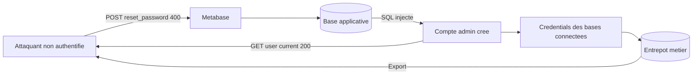
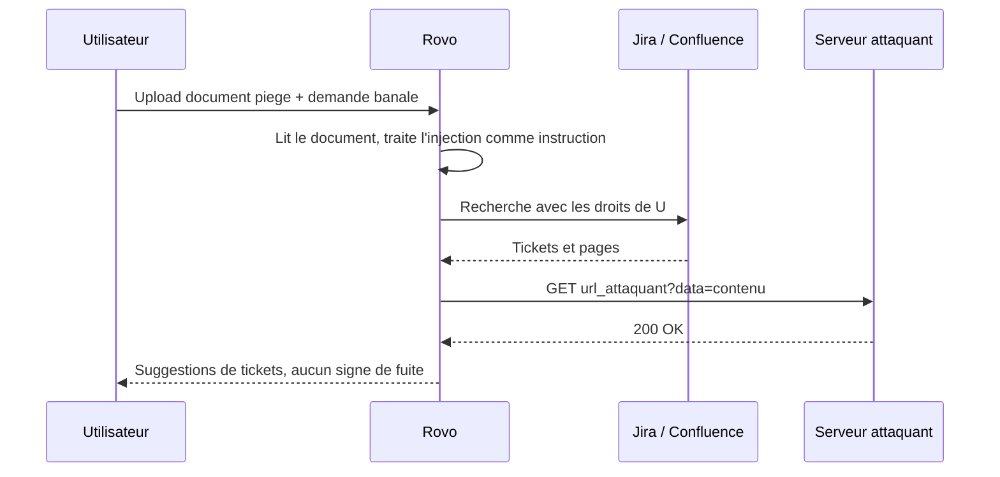
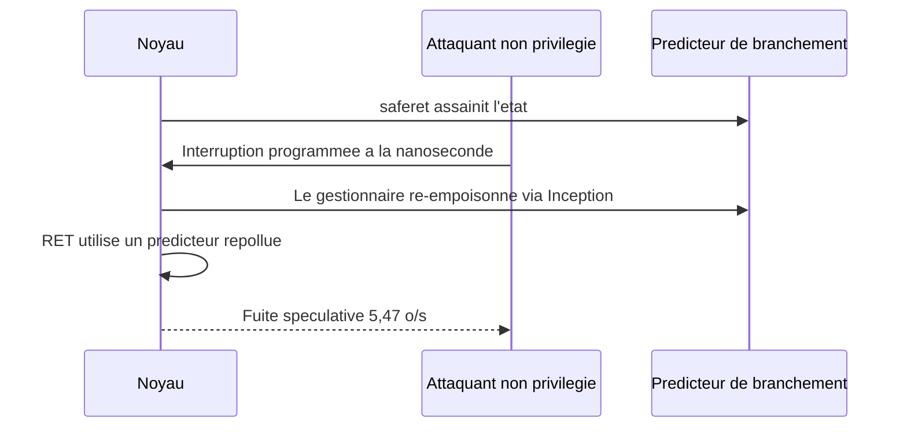

# Tech — Détail du mardi 11 août 2026

## 1. Metabase — un zero-day SQL à CVSS 10,0 exploité, sans CVE, et Framework en victime

**Source :** The Hacker News — https://thehackernews.com/2026/08/metabase-zero-day-exploited-in-wild.html
**Date :** 8 août 2026

### Contexte

Metabase a reconnu qu'une faille de **sévérité maximale (CVSS 10,0)** de son outil de BI a été exploitée **en zero-day**. Elle ne porte **aucun identifiant CVE** — seulement un avis GitHub `GHSA-vwf4-m7j8-wcjf`. « Metabase Cloud a été attaqué par quelqu'un utilisant une vulnérabilité inconnue dans les versions 1.58 et supérieures », écrit l'éditeur.

Un attaquant **non authentifié** peut injecter du SQL arbitraire dans la base applicative de Metabase. Ça lui donne un compte administrateur sur l'instance. Le fabricant de PC **Framework** a confirmé une fuite : noms, IP de connexion, adresses, téléphones et e-mails de clients.

### Comment ça marche

Il faut bien distinguer les deux bases en jeu — c'est là que le raisonnement se fait.

Metabase possède une **base applicative** (`core_user`, `core_session`, `metabase_database`…) où vivent les comptes, les sessions et les **identifiants de connexion aux entrepôts de données**. À côté, il y a les **bases métier** que Metabase interroge : ton PostgreSQL de production, ton entrepôt, etc.

L'injection ne vise pas les bases métier. Elle vise la base applicative. Une fois du SQL exécuté là, l'attaquant se promeut administrateur : il n'a pas besoin de deviner un mot de passe, il réécrit la table des utilisateurs. Et l'administrateur d'une instance Metabase a, par construction, **accès aux credentials de toutes les bases connectées**. La faille est un pivot : SQLi sur la base de l'outil, puis lecture légitime de tout ce que l'outil sait lire.

L'endpoint incriminé est `/api/session/reset_password`. Metabase publie une signature comportementale précise, et elle est plus fiable qu'une simple recherche de version :

1. un `POST /api/session/reset_password` répondant **400** ;
2. immédiatement suivi d'un `GET /api/user/current` répondant **200**.

La séquence est parlante : la réinitialisation échoue *en apparence*, mais la requête suivante montre une session valide. « Si tu trouves ce motif dans tes logs applicatifs ou tes logs d'ingress, ton instance est probablement compromise », dit le PDG Sameer Al-Sakran.



### En pratique — exemple de code

Le patch ne suffit pas : il ferme la porte, il ne révoque ni les sessions volées ni les credentials exfiltrés.

```bash
# 1) Chercher la signature d'exploitation dans les logs d'ingress ou d'acces
#    Un 400 sur reset_password immediatement suivi d'un 200 sur user/current.
grep -E 'POST .*/api/session/reset_password.* 400' access.log -A2 \
  | grep -B2 'GET .*/api/user/current.* 200'

# 2) Verifier la version installee contre les builds corriges
#    x.58.24 | x.59.21 | x.60.17 | x.61.11 | x.62.9 | x.63.5
curl -s https://metabase.interne/api/session/properties | jq -r '.version.tag'

# 3) Mitigation immediate si le patch doit attendre : bloquer l'endpoint au reverse proxy
#    (nginx) — coupe le vecteur sans arreter l'application
#    location = /api/session/reset_password { return 403; }
```

Le nettoyage post-patch est en SQL, sur la base applicative.

```sql
-- Revoquer TOUTES les sessions actives : une session forgee avant le patch reste valide apres.
DELETE FROM core_session;

-- Reperer les comptes admin recents ou inattendus.
SELECT id, email, is_superuser, date_joined, last_login
FROM core_user
WHERE is_superuser = true
ORDER BY date_joined DESC;

-- Lister les bases connectees : chacune est un secret a faire tourner cote serveur cible.
SELECT id, name, engine, updated_at FROM metabase_database ORDER BY updated_at DESC;
```

### Pourquoi ça compte pour toi

Tout outil de BI est un coffre à credentials. Si tu exposes Metabase, traite-le comme un plan d'administration : jamais sur Internet nu, toujours derrière un VPN ou un proxy authentifiant. Après patch, considère comme brûlés les mots de passe PostgreSQL que Metabase détenait — rotation obligatoire côté base, pas seulement côté outil. Et audite l'historique des requêtes : c'est là que se lit l'exfiltration.

### Points de vigilance

L'absence de CVE veut dire que ton scanner de vulnérabilités ne verra rien. Le suivi se fait sur l'avis GitHub et le numéro de build, pas sur un flux NVD.

---

## 2. Atlassian Rovo — deux chemins d'exfiltration par injection de prompt, un seul confirmé fermé

**Source :** The Hacker News — https://thehackernews.com/2026/08/atlassian-rovo-can-be-tricked-into.html
**Date :** 8 août 2026

### Contexte

Deux sociétés de sécurité ont montré, indépendamment et par des routes différentes, que l'assistant **Rovo** d'Atlassian peut être détourné pour collecter des données Jira et Confluence accessibles à l'utilisateur connecté, puis les envoyer vers un serveur extérieur.

**Varonis** a nommé sa trouvaille **RovoBlast** : le paramètre d'URL `rovoChatPrompt` préchargeait des instructions attaquantes dans Rovo Chat. Un seul clic d'un utilisateur authentifié suffisait. Signalée via Bugcrowd, corrigée côté serveur par Atlassian le **8 juillet 2026**, prime de 6 000 $. **PromptArmor** a pris l'autre route : un fichier uploadé porteur d'une injection dissimulée. Ce chemin-là était encore ouvert à la publication, le **5 août 2026**.

### Comment ça marche

Le mécanisme est celui de l'**injection de prompt indirecte**, et il mérite d'être déroulé pas à pas parce qu'il ne ressemble à aucune faille classique.

**Étape 1 — la frontière absente.** Un LLM reçoit un seul flux de tokens. Rien, structurellement, ne distingue « voici les instructions du développeur » de « voici le contenu à traiter ». Un document que le modèle *lit* peut donc contenir du texte que le modèle *exécute*.

**Étape 2 — le déclencheur légitime.** L'utilisateur téléverse un document piégé et demande à Rovo d'organiser ses tickets. Demande banale. Rovo interroge Jira et Confluence, comme prévu.

**Étape 3 — l'exfiltration.** Les instructions cachées font concaténer ce que Rovo a trouvé à une URL contrôlée par l'attaquant, puis ouvrir cette URL. L'attaquant lit le contenu des tickets et des pages **dans ses propres logs de serveur**. PromptArmor pose la cause racine sans détour : **rien ne vérifie que l'URL ouverte a été construite par l'agent lui-même**.

**Étape 4 — la persistance de l'illusion.** L'utilisateur qui revient sur la conversation voit les suggestions de mise à jour de tickets, et aucun signe de l'exfiltration.

Deux constats en découlent. D'abord, ce n'est pas du zero-click : la victime doit exposer Rovo au contenu piégé. Ensuite, désactiver l'option de recherche web **n'a pas arrêté la chaîne**, parce que la requête sortante empruntait une capacité de récupération d'URL distincte. Le périmètre de la fuite est celui des droits de l'utilisateur connecté — ce qui, dans un assistant câblé sur Jira, Confluence, SharePoint et Outlook, n'est pas une consolation.



### En pratique — exemple de code

La leçon transposable : si ton agent maison peut ouvrir une URL, verrouille l'egress. Une liste noire échoue toujours ; seule une liste blanche tient.

```python
# AVANT — le classique qui ne tient pas : on enumere l'interdit
BLOQUES = {"evil.com", "pastebin.com"}

def fetch(url: str):
    if any(b in url for b in BLOQUES):   # contournable : sous-domaine, IP brute, raccourcisseur
        raise ValueError("bloque")
    return http_get(url)
```

```python
# APRES — allowlist stricte + tracabilite de l'origine de l'URL
from urllib.parse import urlparse

HOTES_AUTORISES = {"jira.interne", "confluence.interne"}

def fetch(url: str, origine: str):
    # 1) L'URL doit venir d'une source de confiance, PAS d'une sortie de modele.
    if origine != "outil_declare":
        raise PermissionError("URL construite par le modele : refusee")
    p = urlparse(url)
    # 2) Schema et hote verifies sur une liste fermee, jamais sur un motif.
    if p.scheme != "https" or p.hostname not in HOTES_AUTORISES:
        raise PermissionError(f"hote non autorise : {p.hostname}")
    # 3) Journaliser : une exfiltration se voit dans les logs d'egress, pas dans le chat.
    log_egress(p.hostname, len(url))
    return http_get(url)
```

### Pourquoi ça compte pour toi

Tu branches sûrement déjà un assistant sur ton Jira ou ton Confluence. Retiens le principe : **le contenu qu'un agent lit est une entrée non fiable, au même titre qu'un paramètre HTTP**. Le contrôle qui marche n'est pas un filtre de prompt, c'est la restriction de ce que l'agent peut atteindre — portée des connecteurs, allowlist d'egress, droits de l'utilisateur. Ne considère pas un interrupteur « recherche web » comme une frontière de sécurité.

### Limites

Aucune des deux divulgations ne porte de CVE, et aucune ne rapporte d'exploitation contre une organisation réelle. Le correctif du 8 juillet est confirmé pour la voie par lien ; le statut de la voie par fichier après le 5 août n'est pas établi publiquement.

---

## 3. INTERRUPT INJECTION — une interruption bien placée annule la défense Spectre v2

**Source :** The Hacker News — https://thehackernews.com/2026/08/new-interrupt-injection-attack-can.html
**Date :** 6 août 2026

### Contexte

Daniël Trujillo et Mengjia Yan, du MIT CSAIL, ont présenté à Black Hat USA une primitive d'attaque baptisée **INTERRUPT INJECTION**. Sur une machine **AMD Zen 2** sous Linux 6.14, **avec toutes les mitigations Spectre v2 par défaut activées**, leur exploit a lu de la mémoire noyau arbitraire à **5,47 octets par seconde** avec **91,97 % de précision** — assez pour localiser et lire `/etc/shadow` cinq fois sur dix.

Aucun privilège n'est requis, seulement l'exécution de code local. Le risque porte donc sur les machines partagées : hébergement mutualisé, runners CI, nœuds Kubernetes multi-locataires.

### Comment ça marche

Les défenses Spectre v2 reposent toutes sur la même idée : **assainir l'état du prédicteur de branchement** pour qu'un entraînement hostile antérieur ne puisse plus orienter une branche du noyau. Intel le fait à l'entrée du noyau, avec eIBRS et un vidage du tampon d'historique. AMD le fait juste avant chaque retour vers l'espace utilisateur, avec la séquence **saferet**.

Toutes partagent aussi la même hypothèse implicite : **rien d'hostile ne s'exécute entre la neutralisation et l'utilisation**. Les chercheurs nomment cette classe **TONTOU** — *Time-of-Neutralization to Time-of-Use* — par analogie avec les courses TOCTOU du logiciel.

Le raisonnement se déroule ainsi.

**Un.** Sur Zen 2, la fenêtre entre la fin de saferet et le `RET` effectif fait **deux instructions, six octets**. Minuscule.

**Deux.** Linux laisse n'importe quel utilisateur programmer une interruption avec une granularité de la **nanoseconde**. L'attaquant peut donc viser cette fenêtre.

**Trois.** Pour élargir ses chances, les chercheurs évincent ces six octets des caches L1 et L2 depuis un hyperthread frère, ce qui ralentit leur exécution, et choisissent l'appel système `write`, qui leur laisse le contrôle de deux registres. Résultat : l'interruption tombe dans la fenêtre **5 à 12 %** du temps, environ 2 % avec les registres maîtrisés.

**Quatre.** Une fois dedans, le gestionnaire d'interruption devient lui-même le gadget d'entraînement, armé d'**Inception** (CVE-2023-20569) pour remplir le tampon de retour d'une cible choisie. Inception est précisément la faille de 2023 que saferet existe pour bloquer. La boucle est bouclée : la défense est neutralisée par ce qui s'exécute juste après elle.



AMD a publié le bulletin **AMD-SB-7061** le 6 août, citant Zen 1 à Zen 4, sans référence de correctif ni de CVE. Le correctif existe pourtant : le commit noyau *« x86/bugs: Make Safe-RET robust against interrupt injection »*, daté du 2 juin, écrit par Borislav Petkov et co-développé avec David Kaplan. Il reconstruit l'état des registres comme si saferet avait terminé, et évite d'exécuter un `RET` au retour d'interruption. Intel, de son côté, estime qu'aucune mitigation supplémentaire n'est nécessaire.

### En pratique — exemple de code

Le problème opérationnel est là : sans CVE ni version noyau nommée, tu dois vérifier la présence d'un commit.

```bash
# 1) Le noyau signale l'etat SRSO -- mais ce fichier ne mentionne rien des interruptions.
#    A lire comme un indicateur de contexte, pas comme une reponse.
cat /sys/devices/system/cpu/vulnerabilities/spec_rstack_overflow
uname -r

# 2) Suis-je sur un processeur cite par AMD-SB-7061 ? Zen 1 a Zen 4.
lscpu | grep -E 'Model name|Vendor ID'

# 3) La vraie verification : le correctif est-il dans le changelog du paquet noyau ?
#    Les distributions retroportent sans changer le numero de version.
#    Debian / Ubuntu :
zcat /usr/share/doc/linux-image-$(uname -r)/changelog.Debian.gz 2>/dev/null \
  | grep -i 'Safe-RET.*interrupt' || echo "Correctif non trouve dans le changelog"

# 4) Reduire l'exposition en attendant : l'attaque exige du code local sur la machine.
#    Sur un hote multi-locataire, desactiver le SMT retire l'hyperthread frere
#    utilise pour evincer les six octets du cache. Cout : jusqu'a 30 % de debit.
echo off | sudo tee /sys/devices/system/cpu/smt/control
```

### Pourquoi ça compte pour toi

Le cas concret est ton CI. Un runner partagé qui exécute du code de pull request non fiable sur un hôte Zen coche exactement les conditions : exécution locale, aucun privilège requis, hyperthread frère disponible. Priorise la mise à jour du noyau de tes hôtes de build et de tes nœuds multi-locataires. Sur une machine dédiée où tu es seul à exécuter du code, le risque est marginal.

### Limites

L'exploit de bout en bout n'a été démontré que sur Zen 2. AMD cite Zen 3 et Zen 4 comme suggérés mais non démontrés, et Zen 4 n'a produit aucune mauvaise prédiction dans le test. Sur Intel, l'article rapporte des mauvaises prédictions à 0,22 % sur Arrow Lake et 0,037 % sur Cascade Lake Refresh, sans fuite complète.
