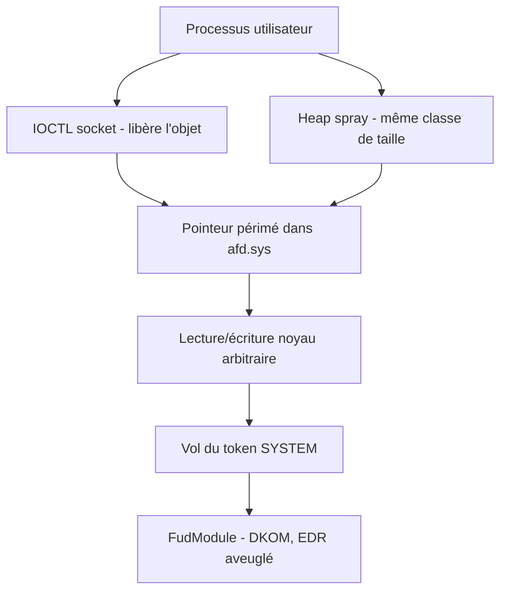
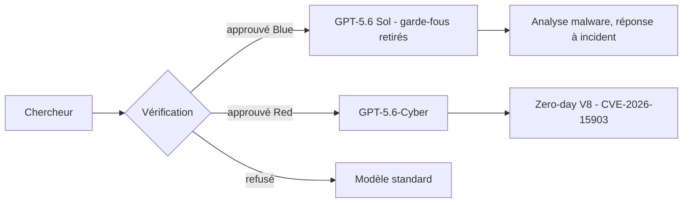

# Tech — Détail du mercredi 12 août 2026

## 1. CVE-2026-68820 — un use-after-free dans `afd.sys`, exploité par Lazarus pour charger FudModule

**Source :** Tenable — https://www.tenable.com/blog/microsofts-august-2026-patch-tuesday-addresses-398-cves-cve-2026-68820
**Date :** 11 août 2026

### Contexte

Le Patch Tuesday d'août 2026 corrige **398 CVE** : 42 critiques, 355 importantes, une modérée. Trois zero-days, dont **un seul exploité dans la nature** — CVE-2026-68820. Son score CVSS est modeste, 7,0, et Microsoft le classe « important ». C'est exactement le genre de ligne qu'un tri par sévérité laisse en bas de pile.

Ce serait une erreur. La faille touche **`afd.sys`**, l'*Ancillary Function Driver for WinSock* : le pilote en mode noyau qui porte l'API sockets de Windows. Il est présent partout, accessible depuis n'importe quel processus utilisateur qui ouvre une socket, et il tourne en Ring 0. Check Point attribue l'exploitation au groupe nord-coréen **Lazarus**, qui l'utilise pour déployer une nouvelle version de **FudModule**, son rootkit en mode noyau.

### Comment ça marche

Un **use-after-free** est un bug de gestion de durée de vie. Le pilote alloue un objet dans le pool noyau, le libère, mais conserve un pointeur vers l'ancienne adresse. Si quelque chose réutilise cette mémoire avant que le pointeur soit consulté, le pilote travaille sur des données choisies par l'attaquant.

La chaîne d'exploitation classique sur `afd.sys` se déroule en quatre temps.

1. **Déclencher la libération.** Le code utilisateur enchaîne des opérations sur une socket — typiquement une séquence d'`IOCTL` — de façon à ce que le pilote libère une structure tout en gardant une référence dessus. La course est souvent gagnée en jouant sur deux threads.
2. **Reprendre le trou (heap spray).** L'attaquant alloue immédiatement de nombreux objets de **même taille** dans le même pool noyau. L'allocateur, qui recycle par classe de taille, replace très probablement un objet contrôlé exactement là où était la structure libérée.
3. **Provoquer le déréférencement.** Le pilote suit son pointeur périmé. Il lit maintenant des champs fabriqués : un pointeur de fonction, une longueur, une adresse de destination.
4. **Convertir en primitive.** L'objectif n'est pas de planter mais d'obtenir une **lecture/écriture arbitraire en noyau**. De là, l'attaquant réécrit le jeton du processus courant pour lui donner celui de SYSTEM.

Le rôle de **FudModule** vient après. C'est un rootkit qui pratique le *Direct Kernel Object Manipulation* : une fois en Ring 0, il modifie les structures noyau pour aveugler l'EDR — désactivation des callbacks de notification, retrait du processus des listes énumérées. D'où l'enchaînement typique de Lazarus : une élévation locale sert de porte d'entrée à une persistance qui rend l'hôte muet.

Et c'est pour ça que le CVSS de 7,0 trompe. « Local » veut dire « après un premier accès ». Or un premier accès — macro, paquet npm malveillant, phishing — c'est la partie facile.



### En pratique — exemple de code

```powershell
# 1. Le correctif est-il posé ? Vérifie la version du pilote, pas juste le KB.
Get-Item C:\Windows\System32\drivers\afd.sys |
  Select-Object -ExpandProperty VersionInfo |
  Format-List FileVersion, ProductVersion

# 2. Inventaire des mises à jour du mois sur le parc
Get-HotFix | Where-Object InstalledOn -ge '2026-08-11' |
  Select-Object HotFixID, InstalledOn, Description
```

```kusto
// 3. Chasse (Defender / Sentinel) — un processus non signé qui charge un pilote
// juste après une élévation est le signal FudModule le plus exploitable.
DeviceEvents
| where Timestamp > ago(14d)
| where ActionType in ("DriverLoad", "NtAllocateVirtualMemoryApiCall")
| where InitiatingProcessSignerType == "Unsigned"
| project Timestamp, DeviceName, InitiatingProcessFileName, FileName, ActionType
| order by Timestamp desc
```

### Pourquoi ça compte pour toi

Ta machine de dev et tes agents de build sont la cible idéale : ils ont des jetons de service, des clés de signature et un accès au registre de paquets. Patche-les avant les serveurs métier — l'inversion habituelle des priorités est ici la bonne. Et retiens la règle de tri : « exploité dans la nature » passe devant un CVSS 9,8 théorique. Un score mesure un impact potentiel, pas une probabilité.

### Points de vigilance

Deux autres corrections méritent le même jour : **CVE-2026-62893** (Windows Deployment Services, TFTP, RCE pré-auth, CVSS 9,8) et **CVE-2026-62823** (DHCP Server, dépassement de tas, CVSS 8,8). Si tu n'utilises pas WDS, désactive le rôle — c'est plus robuste qu'un correctif.

---

## 2. SAP CVE-2026-58231 — CVSS 10,0 sur Commerce Cloud, l'adaptateur Data Hub sans authentification

**Source :** Onapsis — https://onapsis.com/blog/sap-security-patch-day-august-2026/
**Date :** 11 août 2026

### Contexte

Le même 11 août, SAP publie son *Security Patch Day* : 28 nouvelles notes de sécurité, une *GitHub Security Advisory* et deux mises à jour de notes existantes — 31 éléments au total, dont **5 critiques**. La plus grave est **CVE-2026-58231**, notée **10,0**, le maximum de l'échelle CVSS v3.

Elle touche **SAP Commerce Cloud**, plus précisément le **Data Hub Adapter**, sur les versions `COM_CLOUD 2211` et `2211-JDK21`. Il s'agit d'une **autorisation défaillante** (*improper authorization*) : un attaquant distant contourne l'authentification et atteint des composants internes. SAP estime l'impact maximal sur la confidentialité, l'intégrité et la disponibilité, avec exécution de code plausible.

### Comment ça marche

Le Data Hub est le composant d'intégration de SAP Commerce. Son rôle : ingérer des données de systèmes amont — ERP, PIM, référentiels produits — et les publier vers la plateforme e-commerce. Il est conçu pour être appelé par des machines, en flux, sans interaction humaine.

C'est précisément là que naît le défaut de conception le plus fréquent dans ce type de brique. Deux hypothèses implicites s'y installent :

**Hypothèse 1 — « ce composant n'est joignable que depuis le réseau interne ».** Vraie sur le schéma d'architecture, fausse dès qu'un ingress, un load balancer mutualisé ou une règle de pare-feu temporaire l'expose. Les scanners d'exposition trouvent régulièrement des Data Hub joignables depuis Internet.

**Hypothèse 2 — « l'appelant est déjà authentifié en amont ».** Quand l'adaptateur suppose que le filtre d'authentification a tourné avant lui, il ne revérifie pas. Une route mal couverte par la chaîne de filtres — un chemin non listé, une variante d'URL, un verbe HTTP inattendu — et le contrôle saute entièrement.

Une *improper authorization* à CVSS 10,0 signale que ces deux hypothèses tombent en même temps : accessible à distance, et sans authentification requise pour atteindre du code sensible. À partir de là, l'attaquant parle aux composants internes avec les privilèges d'intégration — c'est-à-dire les plus larges du système, puisque le Data Hub doit pouvoir écrire dans le catalogue.

La leçon transposable dépasse SAP : **l'authentification doit être vérifiée au point d'exécution, pas supposée au point d'entrée**. C'est le même raisonnement que pour tes contrôleurs ASP.NET Core — un `[Authorize]` sur le contrôleur ne protège pas un endpoint minimal déclaré ailleurs.

### En pratique — exemple de code

```bash
# 1. Suis-je exposé ? Le Data Hub écoute typiquement sur 8080/9090 selon le déploiement.
#    Depuis une machine HORS du réseau applicatif, pas depuis le cluster.
curl -sS -o /dev/null -w '%{http_code}\n' \
  https://datahub.exemple.com/datahubwebservice/v1/pools

# Tout ce qui n'est pas 401/403 depuis l'extérieur est une anomalie à traiter :
# un 200 ou un 500 signifie que la requête atteint le composant.
```

```nginx
# 2. Mesure d'urgence si le correctif ne peut pas être posé tout de suite :
#    couper l'accès externe au chemin d'intégration, garder l'accès interne.
location /datahubwebservice/ {
    allow 10.0.0.0/8;      # réseau d'intégration uniquement
    deny  all;             # tout le reste, y compris Internet
    proxy_pass http://datahub-backend;
}
```

```bash
# 3. Chercher a posteriori les appels non authentifiés qui ont abouti
grep -E '"(GET|POST) /datahubwebservice/' access.log \
  | awk '$9 ~ /^(200|201|500)$/ {print $1, $7, $9}' \
  | sort | uniq -c | sort -rn | head -20
```

### Pourquoi ça compte pour toi

Tu ne gères sans doute pas SAP Commerce, mais tu écris des adaptateurs d'intégration. Pose-toi la question sur les tiens : est-ce que l'autorisation est vérifiée **dans** le handler, ou déléguée à un filtre en amont qu'un nouveau endpoint peut contourner ? Et vérifie l'exposition réseau réelle depuis l'extérieur, pas sur le schéma. Les deux contrôles prennent une heure.

### Pour aller plus loin

SAP corrige aussi deux injections de code dans **SAP MII** (Manufacturing Integration and Intelligence) et une corruption mémoire non authentifiée sur le chemin du protocole **DIAG** d'ABAP.

---

## 3. OpenAI Daybreak Blue / Red et GPT-5.6-Cyber — le dual-use passe par un palier d'accès

**Source :** Help Net Security — https://www.helpnetsecurity.com/2026/08/11/openai-gpt-5-6-cyber-model/
**Date :** 11 août 2026

### Contexte

Les modèles généralistes refusent une part importante des requêtes de sécurité offensive. C'est voulu, et c'est un problème pour les défenseurs : analyser un malware, écrire un exploit de preuve pour valider un correctif, tester ses propres services — ces tâches ressemblent beaucoup, vues de loin, à celles d'un attaquant. Les équipes rouges internes se heurtent donc à des refus sur du travail parfaitement légitime.

Le 11 août, OpenAI répond par une architecture d'accès plutôt que par un assouplissement global. Le programme **Daybreak** se découpe en deux paliers, et un modèle spécialisé apparaît.

### Comment ça marche

**Palier Daybreak Blue.** Accès à GPT-5.6 Sol avec les **garde-fous cyber au niveau système retirés**. Le périmètre annoncé est défensif : découverte de vulnérabilités, analyse de malware, réponse à incident, validation de correctifs. Le modèle sous-jacent est le modèle généraliste ; ce sont les filtres de politique qui changent.

**Palier Daybreak Red.** Accès à **GPT-5.6-Cyber**, un modèle **construit sur GPT-5.6 Sol mais entraîné spécifiquement** à la recherche de vulnérabilités avancée, à la validation d'exploits et au test de sécurité. Ce n'est plus un assouplissement de filtres, c'est un modèle différent.

**Le chiffre clé.** En évaluation interne, GPT-5.6-Cyber **traite 95 % des requêtes cyber avancées**, très au-dessus de GPT-5.5-Cyber comme de GPT-5.6 Sol. C'est la mesure qui compte : la valeur d'un modèle offensif se joue autant sur son taux d'acceptation que sur sa compétence brute. Un modèle brillant qui refuse une requête sur deux est inutilisable dans une boucle d'audit.

**La preuve terrain.** OpenAI indique que le modèle a trouvé **deux vulnérabilités jusqu'alors inconnues dans V8**, le moteur JavaScript de Chrome. Les deux ont été signalées à Google, qui en a corrigé une sous **CVE-2026-15903**. Trouver un bug inédit dans V8 n'est pas anodin : c'est une des bases de code les plus auditées au monde, et le terrain de jeu historique des meilleurs chercheurs.

Le point à retenir dépasse OpenAI. Le contrôle de sécurité se déplace du **modèle** vers l'**identité de l'appelant**. Ce n'est plus « ce prompt est-il acceptable » mais « cet utilisateur est-il approuvé pour ce palier ». Techniquement, cela déplace toute la surface de risque vers le processus d'approbation et la gestion des identifiants d'accès. Une clé API Daybreak Red volée n'est plus une clé API : c'est un accès à un chercheur en vulnérabilités.



### En pratique — exemple de code

Ce que tu peux appliquer dès maintenant, sans accès au programme : traiter tout identifiant de modèle « offensif » comme un secret de niveau production, et garder une trace de chaque usage.

```yaml
# .github/workflows/security-review.yml
# Le principe transposable : accès élevé => environnement protégé + traçabilité.
name: security-review
on: { workflow_dispatch: }
permissions:
  contents: read          # jamais write sur un job qui manipule une clé sensible
jobs:
  review:
    runs-on: ubuntu-latest
    environment: security-elevated   # approbation manuelle requise par GitHub
    steps:
      - uses: actions/checkout@v5
      - name: Analyse assistée du diff
        env:
          MODEL_KEY: ${{ secrets.CYBER_MODEL_KEY }}   # jamais en clair, jamais en variable de repo
        run: ./scripts/review-diff.sh   # journalise prompt + réponse dans l'audit trail
```

```bash
# Détecter une fuite de clé d'accès élevé dans l'historique, avant qu'elle serve
git log -p --all -S 'CYBER_MODEL_KEY' -- . | head -50
gitleaks detect --source . --redact --report-format sarif --report-path leaks.sarif
```

### Pourquoi ça compte pour toi

Deux conséquences directes. Côté défense, le délai entre publication d'un correctif et exploit fonctionnel se réduit encore : ton SLA de patch doit suivre, surtout sur les composants exposés. Côté opérationnel, si ton entreprise obtient un accès Daybreak, traite la clé comme un identifiant d'administration — coffre-fort, rotation courte, journalisation de chaque appel. Une clé qui fuit devient une capacité offensive clé en main.

### Limites

Les chiffres cités sont ceux d'OpenAI, issus de ses propres évaluations. Aucune vérification indépendante n'était disponible à la publication.
