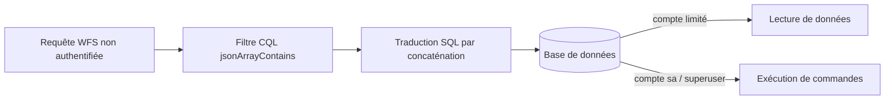
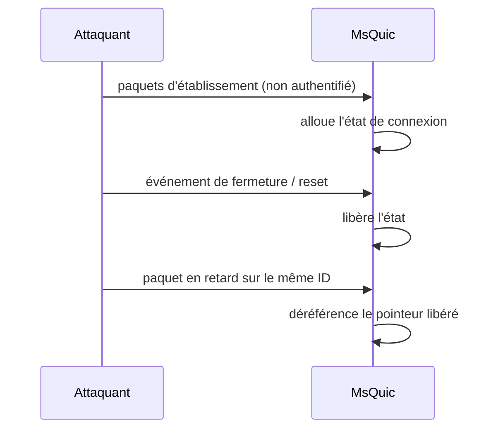
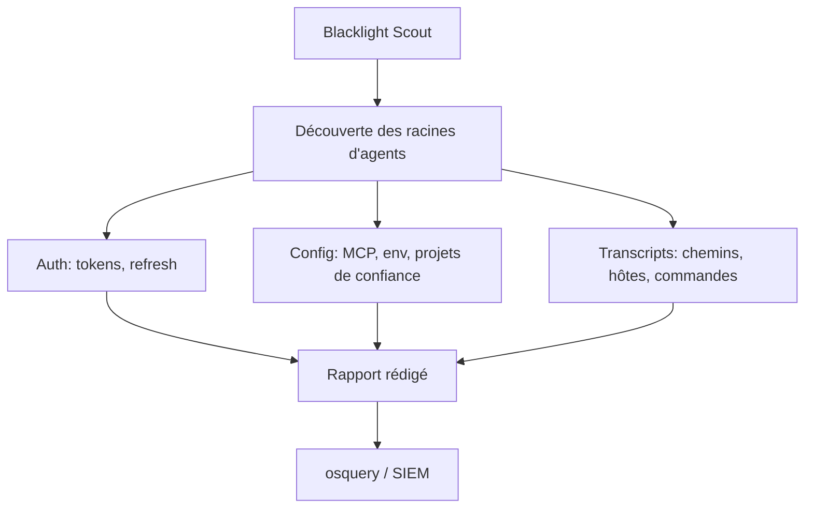

# Tech — Détail du vendredi 14 août 2026

## 1. GeoServer `jsonArrayContains` — un zero-day SQLi sans CVE ni correctif, déjà sondé

**Source :** The Hacker News — https://thehackernews.com/2026/08/unpatched-geoserver-zero-day-targeted.html
**Date :** 13 août 2026 (divulgation initiale le 12 août 2026, 10 h 46 UTC)

### Contexte

GeoServer est le serveur de données géospatiales open source de référence : il expose des couches cartographiques via WMS, WFS et WCS, en s'appuyant sur GeoTools et, le plus souvent, sur une base PostGIS ou SQL Server. On le trouve dans les collectivités, les opérateurs de réseaux, la logistique — et très souvent exposé sur Internet, parce que sa raison d'être est de servir des tuiles à des clients web.

Le 12 août, un chercheur pseudonyme a publié sur X, sans coordination préalable, une injection SQL non authentifiée dans la fonction de filtre `jsonArrayContains`. Son message précise le point clé : « dans le cas d'une base en `sa`, il est naturellement possible d'obtenir une RCE ». Au 13 août, la faille n'a **ni identifiant CVE ni correctif éditeur**. watchTowr a observé des centaines de tentatives, venant d'un petit groupe d'adresses IP, dans les heures suivant la publication.

### Comment ça marche

Le mécanisme demande de comprendre ce qu'est un *filtre* dans GeoServer.

**Étape 1 — le langage de filtre.** Les protocoles OGC permettent au client d'envoyer une expression de filtrage (CQL ou OGC Filter) dans la requête HTTP. `jsonArrayContains(attribut, chemin, valeur)` teste si un champ JSON contient une valeur donnée. C'est une fonctionnalité normale, appelable par n'importe quel client.

**Étape 2 — la traduction en SQL.** GeoServer ne filtre pas en mémoire : il traduit le filtre en clause `WHERE` et laisse la base travailler. C'est ce qui rend l'outil rapide sur de gros jeux de données.

**Étape 3 — la faille.** Pour un test JSON, la traduction produit du SQL spécifique au dialecte, souvent construit par concaténation de chaînes plutôt que par paramètres liés. Si un argument fourni par l'utilisateur — typiquement le chemin JSON — est concaténé sans échappement, l'attaquant contrôle une portion de la requête.

**Étape 4 — de la SQLi à la RCE.** L'injection seule donne déjà la lecture arbitraire de la base. Le passage à l'exécution de code dépend entièrement des **droits du compte de connexion**. Sur SQL Server avec un compte membre de `sysadmin`, les chemins classiques restent disponibles : `xp_cmdshell`, ou l'écriture de fichier via des procédures étendues. Sur PostgreSQL avec un superutilisateur, `COPY ... FROM PROGRAM` joue le même rôle. C'est le sens exact de la mention « `sa` » : ce n'est pas la faille qui donne le shell, c'est le compte surprivilégié derrière.



### En pratique — exemple de code

Repérer tes instances exposées et vérifier les droits du compte de connexion — c'est le levier que tu contrôles aujourd'hui, en l'absence de patch.

```bash
# 1) Inventorier les GeoServer joignables depuis l'extérieur.
#    La page d'accueil renvoie le numéro de version dans le HTML.
for h in $(cat hotes.txt); do
  printf '%s ' "$h"
  curl -s -m 5 "https://$h/geoserver/web/" | grep -oiE 'GeoServer [0-9.]+' | head -1
done

# 2) Chercher la fonction dans les logs d'accès : c'est ton indicateur de sondage.
grep -iE 'jsonArrayContains' /var/log/geoserver/access.log | awk '{print $1}' | sort -u
```

Le correctif structurel, côté base — à faire même après publication d'un patch :

```sql
-- Avant : GeoServer se connecte avec un compte tout-puissant.
-- Une SQLi devient alors directement une RCE sur l'hôte de la base.
--   PostgreSQL : rôle SUPERUSER   |   SQL Server : membre de sysadmin

-- Après : compte dédié, lecture seule sur le seul schéma servi.
CREATE ROLE geoserver_ro LOGIN PASSWORD '...' NOSUPERUSER NOCREATEDB NOCREATEROLE;
REVOKE ALL ON SCHEMA public FROM geoserver_ro;
GRANT USAGE ON SCHEMA carto TO geoserver_ro;
GRANT SELECT ON ALL TABLES IN SCHEMA carto TO geoserver_ro;
-- COPY ... FROM PROGRAM exige le rôle pg_execute_server_program : ne pas l'accorder.
```

### Pourquoi ça compte pour toi

Tu as du PostgreSQL en production. La leçon transposable n'est pas « patche GeoServer », c'est « vérifie sous quel rôle chaque application se connecte ». Une SQLi dans une de tes API .NET ou Symfony ne donne un shell que si le compte applicatif est superutilisateur. Cette séparation de privilèges est ton dernier rempart quand le zero-day arrive avant le correctif — c'est exactement le cas ici.

### Points de vigilance

Pas de CVE signifie que tes scanners de vulnérabilités ne remonteront rien. La détection passe donc par les logs applicatifs, pas par l'inventaire. Ajoute une règle WAF sur le motif `jsonArrayContains` dans les paramètres de requête, en journalisation d'abord pour mesurer les faux positifs — la fonction a des usages légitimes.

---

## 2. CVE-2026-62815 — un use-after-free dans MsQuic, RCE non authentifiée à CVSS 9,8

**Source :** Cisco Talos — Microsoft Patch Tuesday for August 2026 — https://blog.talosintelligence.com/microsoft-patch-tuesday-for-august-2026/
**Date :** 11 août 2026

### Contexte

MsQuic est l'implémentation open source de QUIC par Microsoft. Elle n'est pas cantonnée à un produit : elle sert de transport à HTTP/3 dans IIS et HTTP.sys, à SMB over QUIC, et à plusieurs services internes de Windows. Une faille dans MsQuic ne se corrige donc pas application par application — elle traverse la pile.

CVE-2026-62815 est classée RCE critique à CVSS 9,8. Le trio qui produit ce score : pas d'authentification, pas d'interaction utilisateur, faible complexité d'attaque. C'est le profil qui rend un ver possible.

### Comment ça marche

QUIC n'est pas TCP. Il tourne sur UDP et implémente en espace utilisateur ce que TCP fait dans le noyau : établissement de session, retransmission, contrôle de congestion, multiplexage de flux. Chaque connexion est identifiée par un *connection ID* et non par le quadruplet IP/port, ce qui permet la migration de connexion — passer du Wi-Fi à la 5G sans rouvrir la session.

Cette souplesse a un coût : le suivi d'état. Le use-after-free classique dans ce contexte suit toujours le même scénario en trois temps.

**Un objet d'état est alloué** pour une connexion, un flux ou un contexte cryptographique.

**Un événement le libère** — fermeture de connexion, expiration, réinitialisation de flux, échec de négociation.

**Un paquet arrivé ensuite déréférence le pointeur** parce qu'un chemin de code — souvent le traitement asynchrone d'un paquet déjà en file — ne revérifie pas la validité de l'objet.

Deux propriétés de QUIC amplifient le problème. D'abord l'arrivée dans le désordre est **normale** : sur UDP, le protocole doit accepter des paquets en retard, donc le code a de nombreux chemins qui traitent un paquet après un changement d'état. Ensuite le handshake est chiffré et fusionné avec TLS 1.3 : une bonne partie du traitement d'état se fait **avant** toute authentification du pair, ce qui explique le « non authentifié ».

L'exploitation typique consiste à reprendre l'allocation libérée avec des données contrôlées — *heap grooming* — puis à déclencher le déréférencement pour détourner un pointeur de fonction.



### En pratique — exemple de code

Le patch est la seule vraie réponse. En attendant la fenêtre de maintenance, tu peux réduire la surface : QUIC est presque toujours *optionnel*, avec un repli sur TCP.

```powershell
# 1) Recenser ce qui écoute en UDP/443 sur tes serveurs.
Get-NetUDPEndpoint -LocalPort 443 |
  Select-Object LocalAddress, OwningProcess,
    @{n='Processus';e={ (Get-Process -Id $_.OwningProcess).ProcessName }}

# 2) Désactiver HTTP/3 côté HTTP.sys : les clients retombent sur HTTP/2 en TCP.
#    Mitigation temporaire, à retirer une fois le correctif appliqué.
New-ItemProperty -Path 'HKLM:\SYSTEM\CurrentControlSet\Services\HTTP\Parameters' `
  -Name 'EnableHttp3' -Value 0 -PropertyType DWord -Force
Restart-Service HTTP -Force
```

Côté Kestrel, si tu as activé HTTP/3 dans une API .NET :

```csharp
// Avant : Kestrel négocie HTTP/3 sur UDP/443 -> MsQuic est sur le chemin.
builder.WebHost.ConfigureKestrel(o =>
    o.ListenAnyIP(443, l => l.Protocols = HttpProtocols.Http1AndHttp2AndHttp3));

// Après (temporaire) : on retire HTTP/3, le client bascule en HTTP/2 sur TCP.
builder.WebHost.ConfigureKestrel(o =>
    o.ListenAnyIP(443, l => l.Protocols = HttpProtocols.Http1AndHttp2));
```

### Pourquoi ça compte pour toi

Tu as peut-être activé HTTP/3 sur une API .NET pour gagner en latence mobile, sans réaliser que ça t'abonne au cycle de correctifs de MsQuic. Fais l'inventaire de ce qui écoute en UDP/443 et vérifie que tu sais désactiver HTTP/3 rapidement. Sur une pile réseau, le repli protocolaire est ton disjoncteur — encore faut-il l'avoir testé avant l'incident.

### Pour aller plus loin

MsQuic est aussi utilisée hors Windows, notamment via des bindings dans des runtimes tiers, et .NET l'embarque pour son support QUIC. La correction Windows ne couvre pas nécessairement une copie vendorée dans un conteneur Linux. Vérifie la version de la bibliothèque native dans tes images, pas seulement le niveau de patch de tes serveurs.

---

## 3. Blacklight (SpecterOps) — inventorier ce que Claude Code, Codex et Cursor laissent sur ton disque

**Source :** Cyber Security News — https://cybersecuritynews.com/blacklight-toolkit/
**Date :** 13 août 2026

### Contexte

Les agents de code se sont installés sur les postes de développement en dix-huit mois. Ils écrivent du code, exécutent des commandes, inspectent des dépôts, appellent des ressources cloud. Pour cela, ils gardent de l'état **en local** : jetons d'authentification, configuration, historique de sessions.

SpecterOps a publié le 12 août une recherche accompagnée d'un outil open source, **Blacklight**, qui recense ces artefacts sur Windows, macOS et Linux. Le cadrage est explicite : un profil d'agent de code doit être traité comme un profil de navigateur ou une configuration de CLI cloud — c'est-à-dire comme une cible de post-exploitation de premier plan.

### Comment ça marche

Blacklight procède par couches, et c'est ce découpage qui en fait un outil de défense plutôt qu'un simple collecteur.

**Couche 1 — découverte (Blacklight Scout).** Un chargeur discret parcourt le système de fichiers, identifie les racines d'agents installés, et remonte les chemins intéressants avec leur taille et leur fraîcheur. Il ne **lit pas** le contenu. C'est le point important : on cartographie l'exposition sans aggraver le risque en centralisant des secrets.

**Couche 2 — triage.** Les artefacts sont classés par valeur. Trois familles se dégagent.

Les **fichiers d'authentification** d'abord — `.codex/auth.json` et équivalents Claude Code. Ils portent access tokens, refresh tokens, identifiants de compte et métadonnées de session. Un access token valide permet de se faire passer pour la session de l'utilisateur ; un refresh token donne un accès de plus longue durée.

Les **fichiers de configuration** ensuite. Ils révèlent les modèles utilisés, les projets marqués de confiance, les règles d'approbation de commandes, les paramètres de bac à sable, les variables d'environnement et la configuration des serveurs MCP. Ces variables contiennent parfois des clés d'API ou des identifiants cloud. Même vides de secrets, elles dessinent la carte des services auxquels le poste a droit.

Les **transcripts de session** enfin, les plus sous-estimés. Ils exposent chemins internes, noms de dépôts, sorties de débogage, instructions de déploiement, URLs et noms d'hôtes internes. Sans contenir un seul secret, ils fournissent à un attaquant le contexte métier et la liste des cibles suivantes.

**Couche 3 — analyse hors ligne.** Les fichiers sélectionnés sont traités par `blacklight sessions`, qui produit des rapports classés avec indicateurs **rédigés**. Les exécutables Windows sont conçus pour ne jamais imprimer secrets, identités ni points de terminaison. Une passerelle vers Nemesis et TruffleHog permet un balayage de secrets plus poussé si tu l'assumes.

**Couche 4 — surveillance continue.** Des configurations osquery sont fournies. Sur Windows, l'événement 4663 avec l'audit du système de fichiers activé et des SACL posées sur les chemins sensibles ; sur macOS et Linux, la télémétrie d'événements fichiers, à calibrer sous peine de noyer le SIEM.



### En pratique — exemple de code

Le triage manuel, sans installer quoi que ce soit, pour évaluer ton exposition en cinq minutes :

```bash
# Ce qui existe sur le poste, avec date de dernière écriture (aucun contenu lu).
for d in ~/.codex ~/.claude ~/.cursor ~/.config/Cursor ~/.antigravity; do
  [ -d "$d" ] && find "$d" -maxdepth 2 -type f \
      \( -name 'auth*.json' -o -name '*credential*' -o -name 'settings.json' \) \
      -printf '%TY-%Tm-%Td  %10s  %p\n'
done

# Les permissions comptent autant que le contenu : 0600 attendu, pas 0644.
stat -c '%a %n' ~/.codex/auth.json 2>/dev/null
```

Et la contre-mesure la plus directe, avant toute surveillance :

```bash
# Avant : profil d'agent lisible par tout processus tournant sous ton compte.
# Après : restriction stricte + audit de lecture sur le fichier de jetons.
chmod 700 ~/.codex ~/.claude
chmod 600 ~/.codex/auth.json

# Linux (auditd) : journaliser toute lecture du fichier de jetons.
sudo auditctl -w "$HOME/.codex/auth.json" -p r -k agent_tokens
```

### Pourquoi ça compte pour toi

Tu fais tourner des agents de code sur ta machine de dev, avec accès à tes dépôts et probablement à des identifiants cloud. Un infostealer qui atteint ton profil utilisateur ramasse désormais bien plus qu'un cookie de navigateur. Fais l'inventaire, restreins les permissions des répertoires d'agents, et purge tes transcripts anciens — ils décrivent ton infrastructure aussi bien qu'un schéma d'architecture.

### Limites

Blacklight est un outil de sécurité offensif autant que défensif : les mêmes chemins servent à un attaquant après compromission. Le publier ne crée pas le risque, il le documente — mais l'inventaire devient urgent, pas optionnel. Prévois aussi une politique de rétention : sans elle, tu accumules des mois de contexte opérationnel en clair sur des postes portables.
