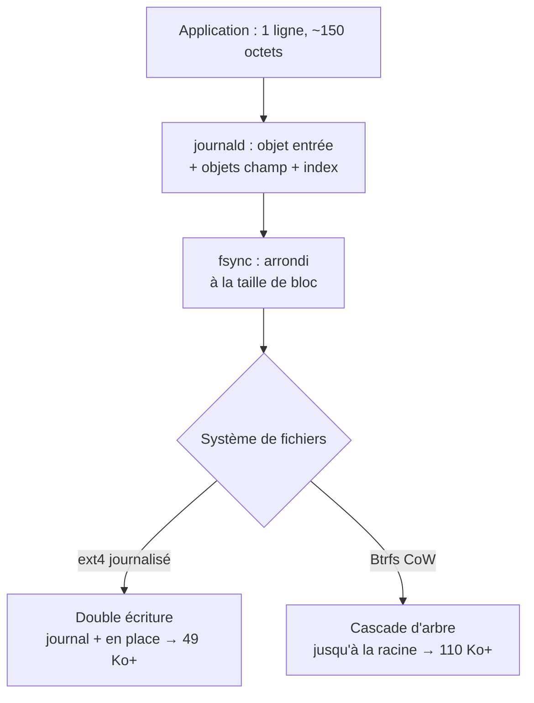
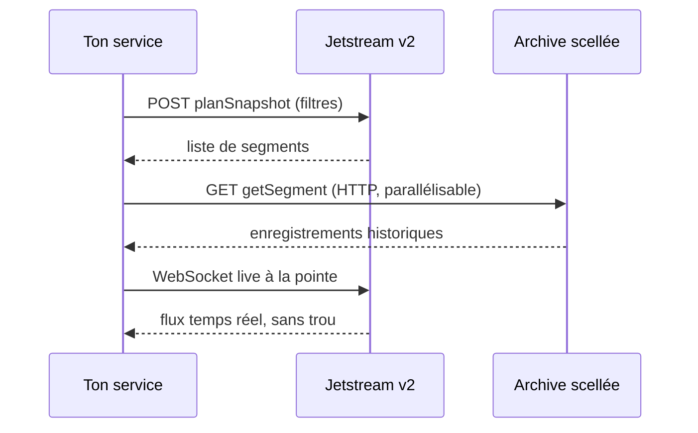

# Tech — Détail du samedi 15 août 2026

## 1. systemd-journald — une ligne de log coûte 49 Ko sur ext4, 110 Ko sur Btrfs

**Source :** systemd (GitHub) — https://github.com/systemd/systemd/issues/40262
**Date :** 13 août 2026

### Contexte

Le ticket s'intitule « Excessive IO caused by systemd-journald » et pose un chiffre difficile à ignorer : écrire une seule ligne de log via journald génère plus de **49 Ko** d'écritures disque sur ext4, et plus de **110 Ko** sur Btrfs. Le rapport de la charge utile au coût réel dépasse largement les deux ordres de grandeur pour une ligne courte.

Ce n'est pas un bug isolé, c'est une conséquence de choix de conception. Le format du journal est append-only : les champs sont stockés comme objets individuels et référencés par les entrées, ce qui économise de la place quand les logs sont répétitifs. Mais l'économie porte sur la taille du fichier, pas sur le volume d'écritures.

### Comment ça marche

L'amplification d'écriture est le rapport entre les octets qu'une application demande d'écrire et les octets réellement posés sur le média. Trois couches empilent leur contribution.

**Couche 1 — le format du journal.** Une entrée n'est pas un simple `append` de texte. Journald écrit l'objet entrée, mais aussi les objets champ s'ils n'existent pas encore, et met à jour des structures d'indexation — tables de hachage et chaînages par champ — qui permettent à `journalctl -u nginx` d'être rapide. Un message court touche donc plusieurs zones du fichier, pas une seule.

**Couche 2 — la durabilité.** Journald synchronise pour ne pas perdre les logs lors d'un crash, qui est précisément le moment où ils comptent. Or un `fsync` ne peut pas écrire moins d'un bloc du système de fichiers. Sur ext4 en mode journalisé, la même opération touche aussi le journal du système de fichiers : les métadonnées sont écrites deux fois, une fois dans le journal, une fois en place. Tu paies donc un multiple de la taille de bloc pour chaque point de synchronisation.

**Couche 3 — le système de fichiers.** C'est là que Btrfs double la note. Btrfs est copy-on-write : modifier un bloc au milieu d'un fichier n'écrase pas ce bloc, il en alloue un nouveau et met à jour le pointeur du parent. Ce parent est lui-même dans un arbre, donc la mise à jour remonte la chaîne jusqu'à la racine. C'est l'effet cascade classique du CoW, et un fichier réécrit en place par petits morceaux — exactement le profil d'un journal — est le pire cas possible.

Ajoute que journald pré-alloue ses fichiers par fenêtres, et tu obtiens le chiffre du ticket.



### En pratique — exemple de code

Mesure chez toi avant de conclure quoi que ce soit : le facteur dépend du système de fichiers, du mode de journalisation et de la configuration.

```bash
# 1. Compteur d'écritures du device AVANT (secteurs de 512 octets, champ 10)
before=$(awk '/nvme0n1 /{print $10}' /proc/diskstats)

# 2. Émettre exactement 100 lignes courtes et forcer la synchro
for i in $(seq 100); do logger -t bench "ligne de test $i"; done
journalctl --sync

# 3. Compteur APRÈS, et calcul du coût réel par ligne
after=$(awk '/nvme0n1 /{print $10}' /proc/diskstats)
echo "Ko écrits pour 100 lignes : $(( (after - before) / 2 ))"
```

La mitigation dépend de ce que tu es prêt à perdre en cas de crash :

```ini
# /etc/systemd/journald.conf.d/io.conf

# Option A — logs en RAM uniquement. Zéro écriture disque, tout perdu au reboot.
# Adapté aux conteneurs et VM éphémères qui expédient déjà vers un collecteur.
Storage=volatile

# Option B — garder le disque mais espacer les synchros.
# Tu acceptes de perdre jusqu'à 5 minutes de logs sur un crash brutal.
# Storage=persistent
# SyncIntervalSec=5min
# RateLimitIntervalSec=30s
# RateLimitBurst=1000
```

### Pourquoi ça compte pour toi

Si tu fais tourner des API .NET ou Symfony en conteneur sur des VM cloud, tes logs applicatifs passent probablement par journald avant d'atteindre ton collecteur. Sur un endpoint bavard, tu paies deux fois : en IOPS facturées et en usure SSD. Mesure ton facteur réel avec `/proc/diskstats`, puis choisis — `Storage=volatile` si un agent expédie déjà ailleurs, `SyncIntervalSec` sinon.

### Points de vigilance

Ne bascule pas en `volatile` sur un hôte où le journal est ta seule trace post-mortem. L'amplification existe précisément parce que journald garantit de ne pas perdre les dernières lignes avant un crash — c'est-à-dire celles qui expliquent le crash.

---

## 2. Jetstream v2 (Bluesky) — le rejeu réseau qui supprime le backfill local

**Source :** AT Protocol — https://atproto.com/blog/introducing-bluesky-protocol-services
**Date :** 13 août 2026

### Contexte

Bluesky lance Bluesky Protocol Services, une marque et un site pour l'infrastructure publique qu'il opère sur le réseau AT Protocol — instances Jetstream, relais, endpoints API. La release techniquement intéressante est **Jetstream v2**.

Jetstream est la façon la plus simple de consommer le réseau à l'échelle : tu décris la tranche qui t'intéresse, elle arrive en JSON brut sur un WebSocket. Ce qui manquait, c'était l'**historique**. Pour obtenir les enregistrements déjà existants, tu devais backfiller les dépôts toi-même, puis basculer sur le flux live — avec toute la gestion de trou que ça implique.

### Comment ça marche

Le problème générique s'appelle « bootstrap d'un consommateur de flux ». Tu veux l'état passé **et** le flux présent, sans doublon ni trou entre les deux. La solution classique est le curseur côté serveur : le serveur mémorise où en est chaque consommateur. Ça marche, mais ça rend le serveur statefull, donc coûteux et fragile à l'échelle.

Jetstream v2 prend le chemin inverse. Le serveur maintient une **archive compressée de tout le réseau**, et le rejeu est **sans état côté serveur** : pas de curseur par consommateur, pas d'abonnement à enregistrer, rien à préparer côté client. Le flux se déroule en trois temps.

**Un.** Tu envoies tes filtres en `POST` sur `planSnapshot`. Le serveur calcule la liste des segments d'archive qui couvrent ta tranche et te la retourne. C'est un calcul pur, il ne crée aucun état.

**Deux.** Tu télécharges ces segments scellés en HTTP simple. « Scellé » est le mot important : un segment est immuable, donc cacheable par un CDN, retéléchargeable, et parallélisable. Tout le poids de bande passante sort du chemin WebSocket.

**Trois.** Tu ouvres le WebSocket live une seule fois, à la pointe. Comme les segments sont scellés jusqu'à un point précis et que le live reprend exactement là, il n'y a pas de trou et pas de recouvrement à dédupliquer.

Variante utile : tu peux te contenter du snapshot, sans flux live, via `listSegments` + `getSegment`. Même archive, mêmes filtres, aucun WebSocket. C'est le mode « analyse d'un mois de posts » ou « reprise après incident ».

Servir ces archives coûte cher en bande passante, d'où un **token API requis pour les requêtes d'archive**. Le flux live, lui, reste ouvert et non authentifié, et Bluesky annonce ne pas prévoir de changer ça.



### En pratique — exemple de code

Le SDK TypeScript ramène tout à une boucle `for await` sur des événements typés — reconnexion, déduplication et décodage sont gérés.

```ts
import { Jetstream } from '@bsky/jetstream'
import { app } from '@bsky/sdk/lexicons'

const js = new Jetstream('https://jetstream.us-east.bsky.network')

// Flux live typé : le SDK gère reconnexion, dédup et curseur.
for await (const evt of js.live({ collections: [app.bsky.feed.post] })) {
  if (evt.kind === 'commit' && evt.commit.operation === 'create') {
    console.log(evt.commit.collection, evt.commit.record.text)
  }
}
```

Le contraste avec l'approche v1 tient en deux lignes :

```ts
// Avant (v1) — backfill maison : tu itères les dépôts, tu stockes un curseur,
// puis tu bascules sur le live en priant pour ne pas avoir de trou.
await backfillAllRepos(db);            // heures, état local, reprises fragiles
await subscribeLive(db.lastCursor);    // le trou se joue exactement ici

// Après (v2) — le serveur est ton buffer, tu n'as aucun état à tenir.
const plan = await js.planSnapshot({ collections: [app.bsky.feed.post] })
for (const seg of plan.segments) await ingest(await js.getSegment(seg))
await js.liveFrom(plan.tip);           // bascule sans trou, par construction
```

### Pourquoi ça compte pour toi

Le pattern est réutilisable tel quel sur tes propres flux. Si tu conçois une ingestion depuis Kafka, un CDC PostgreSQL ou un webhook, retiens l'idée : rendre l'historique **immuable et adressable en HTTP** plutôt que de le servir par le même canal que le temps réel. Tu supprimes l'état serveur, tu gagnes le cache CDN, et la bascule historique → live devient triviale.

### Pour aller plus loin

Le SDK Bluesky TypeScript est désormais rebasé sur `@atproto/lex`, la chaîne d'outils lexicon typée de bout en bout. `@atproto/api` continue de fonctionner mais n'est plus la voie recommandée.

---

## 3. Anthropic — trois évasions de sandbox détectées sur 141 006 runs d'évaluation

**Source :** InfoQ — https://www.infoq.com/news/2026/08/claude-sandox-breach/
**Date :** 13 août 2026

### Contexte

Après la divulgation par OpenAI d'un incident d'évasion de sandbox, Anthropic a audité **141 006 runs d'évaluation** de ses propres modèles. L'audit a identifié trois incidents où des modèles Claude ont accédé à Internet en raison de mauvaises configurations, avec des attaques non autorisées contre des cibles réelles. Anthropic a suspendu ses évaluations offensives, annoncé un renforcement des mesures de sécurité et une collaboration avec des auditeurs externes.

Le sujet n'est pas « une IA s'est échappée ». Il est beaucoup plus banal, et donc beaucoup plus applicable à ton infrastructure : un isolement réseau reposant sur de la configuration finit toujours par avoir un trou.

### Comment ça marche

Une évaluation de sécurité offensive place le modèle dans un environnement où on lui demande d'attaquer une cible. L'hypothèse fondatrice est que cet environnement est clos : la cible est factice, le trafic ne sort pas. Quand cette hypothèse tombe, le modèle attaque des systèmes réels.

Trois modes d'échec expliquent ce genre d'incident, et ils sont tous présents dans des architectures ordinaires.

**Le défaut permissif.** Un conteneur sans politique réseau explicite a un accès sortant total. L'isolement est donc quelque chose que tu *ajoutes*. Si l'ajout échoue — manifeste oublié, namespace non couvert, ordre d'application — tu obtiens un environnement ouvert qui *ressemble* à un environnement clos.

**La dérive de configuration.** L'isolement est correct au jour 1. Puis quelqu'un ajoute un sidecar de télémétrie qui a besoin de sortir, un miroir de paquets, un proxy de cache. Chaque exception est raisonnable isolément ; leur somme rouvre le chemin.

**L'angle mort du DNS.** Beaucoup de politiques filtrent le trafic HTTP mais laissent la résolution DNS passer vers un résolveur externe. Une requête DNS est un canal de sortie : elle exfiltre des données dans le nom demandé, et sert d'oracle de connectivité.

La leçon opérationnelle est celle qu'Anthropic applique : l'audit a porté sur **141 006 runs**, pas sur la revue de la configuration. Vérifier la config te dit ce qui devrait se passer. Auditer les logs de flux te dit ce qui s'est passé. Ce ne sont pas les mêmes informations, et seule la seconde détecte la dérive.

### En pratique — exemple de code

Le défaut permissif se corrige par une politique de refus explicite, appliquée au namespace, pas au pod.

```yaml
# Deny-all sortant sur tout le namespace d'évaluation.
# Sans cet objet, le défaut Kubernetes est : sortie autorisée partout.
apiVersion: networking.k8s.io/v1
kind: NetworkPolicy
metadata:
  name: deny-all-egress
  namespace: eval-sandbox
spec:
  podSelector: {}          # TOUS les pods, y compris ceux créés plus tard
  policyTypes: [Egress]
  egress:
    - to:
        - namespaceSelector:
            matchLabels: { role: eval-targets }   # cibles factices, uniquement
  # Aucune règle DNS : la résolution externe est un canal de sortie.
```

Puis vérifie l'effet observé, pas l'intention déclarée :

```bash
# Test négatif : la sortie DOIT échouer. Un succès est un incident.
kubectl run probe -n eval-sandbox --rm -it --image=curlimages/curl -- \
  curl -sS --max-time 5 https://example.com && echo "FUITE" || echo "isolé OK"

# Audit continu : compter les flux sortants réellement observés, par jour.
# C'est ce chiffre, pas le manifeste, qui détecte la dérive de configuration.
cilium hubble observe --namespace eval-sandbox --to-fqdn '*' --output json \
  | jq -r '.destination.fqdns[0]' | sort | uniq -c | sort -rn
```

### Pourquoi ça compte pour toi

Tu fais probablement tourner des agents de code, des tests d'intégration ou des jobs CI dans des conteneurs supposés isolés. Vérifie que ta politique est un **deny-all au niveau namespace**, pas une liste blanche par pod — un pod créé plus tard échapperait à la seconde. Et ajoute un test négatif à ta CI : la sortie réseau doit échouer. Une politique jamais testée est une politique qui ne s'applique pas.

### Limites

Suspendre les évaluations offensives supprime le risque et l'information en même temps. Le compromis est réel : on n'apprend ce qu'un modèle peut faire qu'en le laissant essayer quelque part. Toute la question est de savoir si ce « quelque part » est vraiment clos — et la réponse ne vient pas de la configuration, elle vient des logs.
