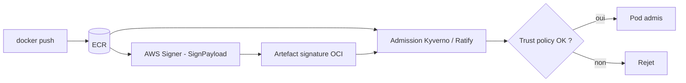
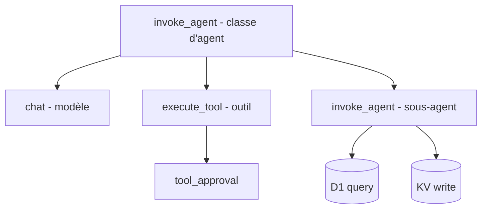

# Tech — Détail du dimanche 16 août 2026

## 1. Amazon ECR Managed Signing — signer les images au registre, et pourquoi ça change la question posée

**Source :** The New Stack — https://thenewstack.io/unsigned-container-images-ai/
**Date :** 14 août 2026

### Contexte

La plupart des organisations qui savent qu'elles devraient signer leurs images ne le font pas. Pas par désaccord, mais parce que le chemin est long : installer Notation CLI ou Cosign, posséder ses clés, gérer certificats, rotation et listes de révocation, puis câbler tout ça dans chaque pipeline. Sur une entreprise à plusieurs milliers de pipelines configurés différemment, le déploiement se compte en semaines ou en mois.

Le billet, signé par une manager d'ingénierie d'Amazon ECR, pose d'abord un diagnostic utile et indépendant du produit : **la plupart des équipes ne vérifient pas des images, elles vérifient des adresses**. Une policy d'admission autorise les images du compte registre, les credentials de push appartiennent au pipeline, un scanner bloque les CVE critiques. Ça arrête beaucoup d'attaques. Ça ne distingue pas une bonne image d'une mauvaise une fois à l'intérieur du périmètre, parce que la provenance registre est une affirmation sur un **emplacement**, pas sur une **origine**. Un token CI fuité, un rôle cross-account mal configuré ou une étape de build compromise produisent une image qui a l'air légitime. Le digest pinning te garantit que tu as reçu les octets demandés, pas que c'étaient les bons octets à demander.

L'argument « ère IA » tient aussi : poids de modèles, datasets, runtimes d'inférence et outillage d'agents s'expédient désormais en artefacts OCI. Un checkpoint PyTorch picklé n'a aucun CVE à confronter. Le format `.safetensors` supprime le chemin d'exécution de code, mais ne dit rien sur **qui** a produit les poids. Le scan répond « qu'y a-t-il dedans ? » ; il ne répondra jamais « d'où ça vient, et est-ce que quelqu'un y a touché ? ».

### Comment ça marche

La signature est une chaîne à trois maillons, et chacun doit tenir.

**Signer** : produire une signature au build ou au push, liant le digest de l'image à une identité vérifiable. La question dure est la garde de la clé privée. Managed Signing y répond en ne te la donnant pas : tu configures un profil dans AWS Signer, qui épingle l'algorithme, une période de validité et l'identité qui apparaîtra dans la signature. Signer conserve certificat et clé. Aucune clé ne se retrouve dans un dépôt, un runner ou un log. La validité par défaut est de 135 mois — c'est la révocation, pas l'expiration, que tu utiliseras en vrai.

Ce qui est signé est plus étroit qu'on ne le croit : un petit payload Notary dont le `targetArtifact` décrit le **manifeste** de l'image (media type, digest, taille), pas les octets de l'image. Comme le matériel signé est content-addressed, la vérification devient une affirmation sur des octets exacts. La signature atterrit dans le même dépôt, en artefact OCI détaché de type `application/vnd.cncf.notary.signature`, avec un descripteur `subject` pointant le digest du manifeste. Une image peut porter plusieurs signatures de profils différents.

La signature est **asynchrone**, et le raisonnement mérite d'être retenu : un appel synchrone transformerait un throttling ou une baisse de disponibilité en `docker push` échoué, et mettrait la latence de signature devant chaque pipeline. Le push commit d'abord, ECR appelle `SignPayload` ensuite.

**Vérifier** et **imposer** se passent en aval, et c'est là que le design devient lisible.



L'admission travaille dans l'ordre : résoudre la référence en digest, récupérer la signature via l'API OCI Referrers, valider l'enveloppe contre sa chaîne de certificats, remonter cette chaîne jusqu'à la racine du trust store, confronter l'identité signataire à `trustedIdentities`, vérifier la révocation. Révoquer un profil fait échouer la vérification partout où il est reconnu : les nouvelles admissions s'arrêtent immédiatement, les pods en cours reprennent la règle à leur prochain reschedule.

### En pratique — exemple de code

C'est ton opérateur cluster qui écrit la trust policy et l'importe avec `notation policy import`. Le fichier est court et relisible — c'est le point.

```json
{
  "version": "1.0",
  "trustPolicies": [
    {
      "name": "aws-signer-tp",
      "registryScopes": ["*"],
      "signatureVerification": { "level": "strict" },
      "trustStores": ["signingAuthority:aws-signer-ts"],
      "trustedIdentities": [
        "arn:aws:signer:us-east-1:111122223333:/signing-profiles/platform_images"
      ]
    }
  ]
}
```

Traduction : un workload ne tourne que s'il porte une signature qui remonte à la racine AWS Signer **et** qui a été produite par ce profil précis. Tout le reste est rejeté à l'admission.

### Pourquoi ça compte pour toi

Si tu déploies des conteneurs .NET ou Symfony, ta question de sécurité n'est plus seulement « quelles CVE » mais « qui a construit ça ». Retiens surtout le principe transposable hors AWS : signer sans imposer à l'admission ne change strictement rien. Commence par le contrôleur d'admission et la trust policy ; la mécanique de signature vient après.

### Limites

Le billet est sponsorisé par AWS Marketplace, et l'honnêteté du texte sur ce point mérite d'être notée : un attaquant qui compromet totalement une identité signataire produit une image malveillante valablement signée. La signature ne rend pas la falsification impossible, elle la rend **cadrée, attribuable et révocable**.

---

## 2. Cloudflare agent tracing — des spans pour les agents, et une facture au 1er octobre

**Source :** InfoQ — https://www.infoq.com/news/2026/08/cloudflare-agent-tracing/
**Date :** 15 août 2026

### Contexte

Cloudflare a lancé l'agent tracing, premier composant de Cloudflare Agents. Le problème posé est le bon : **un agent peut renvoyer HTTP 200 et avoir échoué**. Il choisit le mauvais outil, transmet un contexte périmé à un sous-agent, ou brûle des tokens dans une boucle de retry. Ta télémétrie applicative te montrera la requête API et la requête SQL, jamais le comportement d'agent qui les a causées.

Workers tracing instrumentait déjà la couche infra : appels `fetch`, lectures KV, requêtes D1. Jusqu'ici, les traces d'un agent tournant sur Workers portaient ces spans d'infrastructure sans rien autour. L'agent tracing ajoute la couche manquante.

### Comment ça marche

Chaque tour de conversation produit un trace unique, avec quatre types de spans : invocation d'agent, appel de modèle, exécution d'outil, approbation. Le modèle utilisé et la consommation de tokens sont attachés en métadonnées. Le travail des sous-agents s'imbrique sous l'opération qui l'a invoqué, si bien qu'un agent parent déléguant à un sous-agent qui appelle un modèle, lance un outil, interroge D1 et écrit dans KV apparaît en une seule cascade traversant les deux couches.



Trois champs relient les spans au dashboard : un **nom d'agent** pour l'implémentation logique, un **ID d'agent** pour l'instance, un **ID de conversation**. Cloudflare met explicitement en garde contre le fait de dériver le nom d'agent d'un identifiant de requête ou d'utilisateur, ce qui multiplierait les agents distincts dans la vue.

Deux avertissements structurent l'usage. D'abord, le span d'approbation représente des événements de cycle de vie **dans une invocation de Worker** : il ne mesure pas le temps qu'une personne met à répondre entre deux invocations. La latence humaine, sans doute le chiffre le plus intéressant d'un workflow d'approbation, n'est pas ce que le span enregistre. Ensuite, Cloudflare écrit que les traces ne sont ni un enregistrement complet ni sans perte, que les payloads subissent des limites de taille de span — messages longs, raisonnement, arguments et résultats d'outil peuvent être tronqués — et que le session replay n'affiche pas les images. Traiter le replay comme une piste d'audit plutôt que comme une aide au debug ne tient pas.

Le piège opérationnel est ailleurs : **les défauts d'enregistrement des payloads sont incohérents selon le harnais**. Think ne stocke ni messages ni payloads d'outils sauf si `storeMessages` et `storeTools` sont posés sur la classe d'agent, et `wrapAISDK()` se comporte pareil. Flue, lui, stocke par défaut messages, instructions système, définitions d'outils, arguments et résultats — il faut `content: false` pour l'en empêcher. Même fonctionnalité de plateforme, défauts de confidentialité opposés, et ces payloads transportent régulièrement des données personnelles ou des secrets.

### En pratique — exemple de code

Le réflexe à avoir tient en deux lignes de config, et il dépend du harnais que ton équipe a déjà choisi.

```ts
// Think / wrapAISDK : rien n'est stocké tant que tu ne l'actives pas.
// Opt-in explicite -> tu décides ce qui part en télémétrie.
export class SupportAgent extends Agent {
  static storeMessages = true;   // messages du modèle
  static storeTools = true;      // arguments et résultats d'outils
}

// Flue : tout est stocké par défaut, y compris instructions et secrets.
// À poser AVANT la première mise en prod si tu traites des données perso.
const agent = createFlueAgent({
  model,
  tracing: { content: false },   // coupe l'enregistrement des payloads
});
```

Le détail de facturation récompense la lecture attentive : l'unité mesurée n'est pas ce que la vue Agents affiche. **Chaque span compte pour un événement d'observabilité**, y compris les spans internes du SDK et les opérations Worker que le dashboard ne montre pas. À partir du 1er octobre 2026, Workers Free couvre 200 000 événements par jour avec trois jours de rétention, Workers Paid inclut 20 millions par mois avec sept jours de rétention, puis 0,60 $ par million supplémentaire.

### Pourquoi ça compte pour toi

Si tu instrumentes des agents, tu retiens trois choses. Vérifie le défaut de ton harnais avant la prod : un choix par défaut peut expédier des secrets en télémétrie. Ne compte pas sur le replay comme audit — les payloads sont tronqués. Et budgète en spans, pas en tours de conversation : un harnais verbeux coûte bien plus que le dashboard ne le laisse deviner, avec trois à sept jours de rétention seulement.

### Pour aller plus loin

Les attributs de span suivent les conventions sémantiques OpenTelemetry GenAI et s'exportent vers n'importe quel endpoint OTLP. Workers ne supporte pas encore l'API OpenTelemetry directement — les harnais maison passent par l'API custom spans de Workers. Cloudflare dit y travailler, ce qui permettrait aux frameworks émettant des spans standards de s'intégrer sans instrumentation manuelle.
