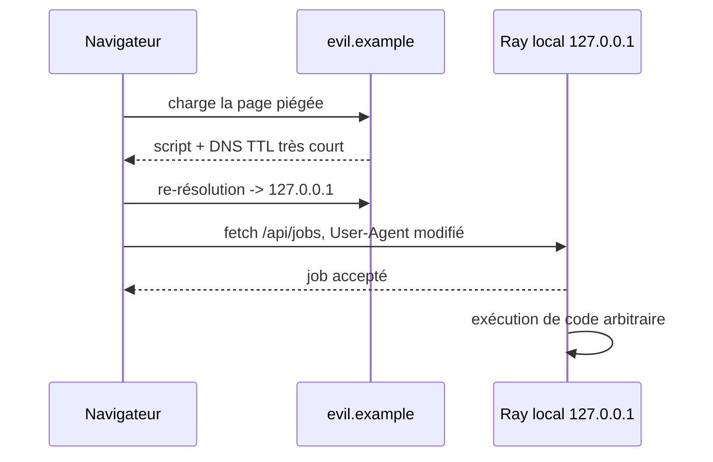
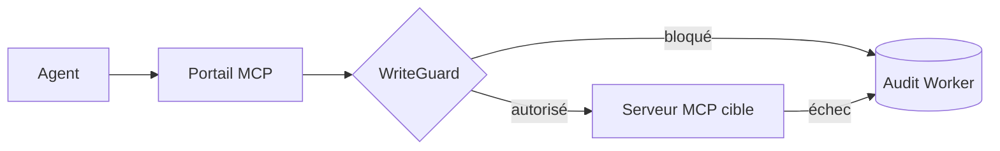
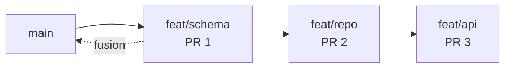

# Tech — Détail du mercredi 19 août 2026

## 1. Ray CVE-2025-62593 — quand un onglet ouvert exécute du code sur ta machine de dev

**Source :** The Register — https://www.theregister.com/security/2026/08/18/cisa-gives-feds-3-days-to-fix-actively-exploited-ray-rce-bug/5289007
**Date :** 18 août 2026

### Contexte

Ray est le framework open source de calcul distribué qui permet de passer d'un script Python local à un cluster avec un minimum de changements de code. Il est utilisé et soutenu par Amazon, Apple et OpenAI, désormais géré par la PyTorch Foundation de la Linux Foundation, après un départ à UC Berkeley et une commercialisation via Anyscale. Les chiffres d'Anyscale d'octobre 2025 donnent plus de 237 millions de téléchargements cumulés et 7 millions par semaine.

Le 18 août, CISA a inscrit **CVE-2025-62593** au catalogue des vulnérabilités activement exploitées. Score CVSS v4 : **9,4**. La faille a été divulguée en novembre 2025, mais l'exploitation observée est nouvelle. Ce qui frappe, c'est le délai imposé : **trois jours** de remédiation aux agences fédérales américaines, au lieu des quatorze standards. La directive BOD 26-04 autorise ce raccourci pour les vulnérabilités considérées comme particulièrement risquées. CISA n'a pas expliqué l'urgence et a laissé le champ « connue pour être utilisée dans des campagnes de rançongiciel » à « inconnu ».

Le point qui te concerne directement : selon l'avis de sécurité du projet, « cette vulnérabilité affecte les développeurs qui font tourner des environnements de développement et de test avec Ray ». Pas les clusters de production derrière un pare-feu. **Ta station de travail.**

### Comment ça marche

La chaîne se comprend en trois maillons.

**Maillon 1 — un filtre anti-navigateur naïf.** Les versions vulnérables de Ray tentent d'identifier et de bloquer les requêtes venant d'un navigateur en vérifiant que l'en-tête `User-Agent` **commence par `Mozilla`**. L'idée était raisonnable : un vrai client Ray n'envoie pas ça, donc si ça vient d'un navigateur, on refuse. Sauf que Firefox et Safari autorisent les scripts utilisant l'API Fetch à modifier cet en-tête. Le filtre saute.

**Maillon 2 — le DNS rebinding.** Le navigateur applique la *same-origin policy* : un script de `evil.example` ne peut normalement pas lire la réponse de `127.0.0.1:8265`. Le DNS rebinding contourne ça par le temps. L'attaquant sert `evil.example` avec un enregistrement DNS à TTL très court. Au premier chargement, il pointe vers son propre serveur ; quelques secondes plus tard, il résout vers `127.0.0.1`. Pour le navigateur, l'origine n'a pas changé — c'est toujours `evil.example` — donc le script continue à s'exécuter et parle maintenant à ton service local.

**Maillon 3 — des endpoints sans authentification.** Le script atteint alors les API HTTP de Ray, notamment `/api/jobs` et `/api/job_agent/jobs/`, et soumet un job. Un job Ray, c'est du code arbitraire. L'avis de sécurité impute la possibilité de l'attaque à l'absence historique d'authentification sur ces endpoints critiques : le modèle de sécurité de Ray supposait que les clusters tournaient dans un réseau de confiance isolé, laissant l'authentification à l'infrastructure environnante.

L'escalade ne s'arrête pas à ta machine. L'avis précise que « cette attaque peut aussi servir à atteindre des instances de Ray voisines du réseau en utilisant le navigateur comme intermédiaire *confused deputy* » — c'est-à-dire à attaquer des instances Ray internes de l'entreprise depuis un poste de dev légitime.



### En pratique — exemple de code

La correction est une montée de version, et une seule :

```bash
# 1. Vérifier la version installée sur CHAQUE poste de dev, pas que sur les clusters.
python -c "import ray; print(ray.__version__)"

# 2. Corriger : 2.52.0 est la première version non vulnérable.
pip install -U "ray>=2.52.0"

# 3. Ray 2.52.0 introduit une authentification par jeton, DÉSACTIVÉE par défaut.
#    À activer explicitement — mais en défense supplémentaire, pas en remplacement
#    de l'isolation réseau, que le projet continue de recommander en premier.
export RAY_AUTH_MODE=token
ray start --head
```

Si tu ne peux pas patcher immédiatement, réduis la surface : ne laisse pas le dashboard Ray écouter pendant que tu navigues, et vérifie que rien n'écoute sur `0.0.0.0`.

```bash
# Qui écoute ? Le port 8265 est le dashboard Ray par défaut.
ss -ltnp | grep -E '8265|10001'
```

### Pourquoi ça compte pour toi

Ta station de dev est un actif de production. Ce cas le montre : un onglet ouvert au mauvais moment, et un service local sans authentification devient un point d'entrée vers le réseau interne. Applique la règle générale — tout service de dev qui écoute en local doit exiger un jeton, même en `localhost`. Et si des collègues data font tourner Ray, remonte-leur l'échéance : trois jours, c'est la mesure de l'urgence estimée par CISA.

### Limites

Ray 2.52.0 introduit une authentification par jeton optionnelle, mais elle **reste désactivée par défaut**. Le projet continue de recommander de déployer les clusters dans un réseau contrôlé plutôt que de traiter l'authentification comme un substitut à l'isolation. Autrement dit : le patch ferme ce vecteur précis, il ne change pas le modèle de menace de fond.

---

## 2. Cloudflare WriteGuard — la politique d'écriture sort des serveurs MCP

**Source :** InfoQ — https://www.infoq.com/news/2026/08/cloudflare-writeguard-mcp-safety/
**Date :** 18 août 2026

### Contexte

Le premier réflexe, quand on branche un agent sur MCP, c'est de tout mettre en lecture seule. C'est sûr et c'est inutile au bout de quelques semaines. Cloudflare le raconte sans détour : « le read-only était un bon point de départ. À mesure que les modèles s'amélioraient et que les équipes gagnaient en expérience, des gens de l'ingénierie, du produit, du design, des ventes et du support ont commencé à demander des outils capables d'agir. »

Le problème se pose alors en termes classiques de contrôle d'accès, mais avec un acteur nouveau : un agent qui appelle des outils sur des bases de données, GitHub, des SaaS, des API internes. **WriteGuard**, annoncé le 18 août en bêta privée, est la réponse de Cloudflare — une couche partagée de politique, d'attribution et d'audit.

### Comment ça marche

WriteGuard se place **juste derrière le portail de serveurs MCP** de Cloudflare et intercepte toutes les requêtes MCP entrantes. Pour chaque requête, il charge la politique associée à l'outil visé, évalue le contexte, et décide : laisser passer inchangée, ou bloquer. Si une requête autorisée échoue ensuite, elle part vers le service d'audit, tout comme les requêtes refusées d'emblée.

La classification est le cœur du dispositif. Chaque outil reçoit un **palier de risque**, de `read-only` — aucun risque — à `critical`. Compléter une merge request, déclencher un déploiement en production ou supprimer des enregistrements en masse sont classés `critical`. Créer une merge request ou mettre à jour un champ d'issue relève du palier « écriture contenue ». Marquer une notification comme lue, s'abonner à une issue ou ajouter un commentaire relèvent de l'« impact minimal ».

L'argument architectural est le plus transposable. Les ingénieurs Scott Roe-Meschke et Kenny Johnson : « Pour GitLab seul, on aurait pu construire ces contrôles directement dans le serveur. Mais il nous fallait les mêmes capacités pour Jira, notre wiki interne, Google Workspace, et chaque nouveau serveur MCP ajouté. Les réimplémenter dans chaque serveur demanderait plus de travail et produirait des comportements incohérents. »

Point d'identité, souvent mal traité ailleurs : WriteGuard **n'exige pas de créer des comptes d'agent dédiés**, ce qui créerait « un second jeu de permissions à gérer ». Les serveurs MCP utilisent les identifiants OAuth existants pour identifier l'utilisateur humain, et WriteGuard ajoute le contexte client et session MCP à cette identité. L'action reste donc attribuable à une personne, tout en restant distinguable d'une action manuelle.



### En pratique — exemple de code

Le modèle est reproductible sans Cloudflare : c'est un middleware d'autorisation devant tes outils. Voici la forme que ça prend, transposée en ASP.NET Core :

```csharp
// Palier de risque par outil, décidé HORS du serveur MCP.
static readonly Dictionary<string, RiskTier> Tiers = new()
{
    ["issues.comment"]   = RiskTier.MinimalImpact,
    ["mr.create"]        = RiskTier.ContainedWrite,
    ["mr.merge"]         = RiskTier.Critical,
    ["deploy.production"]= RiskTier.Critical,
};

public async Task<IResult> Invoke(McpCall call, ClaimsPrincipal user)
{
    var tier = Tiers.GetValueOrDefault(call.Tool, RiskTier.Critical); // fail-closed
    if (!_policy.Allows(user, tier, call.Context))
    {
        // L'événement d'audit porte l'identité HUMAINE + le contexte agent.
        await _audit.EmitAsync(call, user, tier, Outcome.Blocked);
        return Results.Forbid();
    }
    var result = await _next(call);
    await _audit.EmitAsync(call, user, tier,
        result.Ok ? Outcome.Success : Outcome.Failed);
    return result.ToHttpResult();
}
```

Note le défaut : un outil non classé tombe en `Critical`, donc bloqué. C'est le bon sens de la politique — *fail-closed*, pas *fail-open*.

### Pourquoi ça compte pour toi

Si tu exposes des outils MCP sur tes API internes, ne code pas la politique dans chaque serveur : tu obtiendras des comportements incohérents et une dette de duplication. Mets une couche commune devant, classe chaque outil par impact, et fais tomber l'inconnu en refus. Réutilise l'identité OAuth existante plutôt que de créer des comptes de service : un second jeu de permissions, c'est un second endroit où oublier de révoquer.

### Limites

WriteGuard est en **bêta privée**, ce qui laisse à Cloudflare le temps de valider le comportement avant disponibilité générale. L'événement d'audit est nettoyé : il omet les valeurs des clés considérées comme secrètes ou sensibles, et retient le serveur, l'outil, le palier de risque, le résultat, l'utilisateur, le client et la durée. Utile pour l'investigation, insuffisant pour rejouer une action.

---

## 3. GitHub — les pull requests empilées passent en préversion publique

**Source :** InfoQ — https://www.infoq.com/news/2026/08/github-stacked-pull-requests/
**Date :** 18 août 2026

### Contexte

Tout le monde connaît la PR de 2 000 lignes que personne ne relit sérieusement. La parade habituelle consiste à découper le travail en plusieurs PR — mais dès que la deuxième dépend de la première, GitHub montrait jusqu'ici le diff cumulé, ou obligeait à attendre la fusion de la première avant d'ouvrir la seconde. Les équipes s'en sortaient avec des outils tiers ou des conventions maison de branches.

GitHub a annoncé le 18 août que les **Stacked Pull Requests** passent en préversion publique, avec un support natif pour découper un gros changement en plusieurs PR dépendantes, revues et fusionnées indépendamment.

### Comment ça marche

Une pile de PR n'est rien d'autre qu'une chaîne de branches où chacune part de la précédente au lieu de partir de `main`. Le mécanisme se comprend en trois temps.

**Construction.** Tu crées `feat/schema` depuis `main`, puis `feat/repo` depuis `feat/schema`, puis `feat/api` depuis `feat/repo`. Chaque PR déclare comme base la branche du dessous, pas `main`. Résultat : le diff affiché sur chaque PR ne contient que **son** apport. Le relecteur voit 150 lignes cohérentes, pas 2 000 lignes hétérogènes.

**Restructuration.** C'est là que ça se complique sans support natif. Si tu corriges quelque chose dans `feat/schema` après une revue, les branches du dessus pointent encore sur l'ancien commit. Il faut rebaser toute la pile, dans l'ordre, et forcer la mise à jour de chaque branche. C'est exactement ce travail mécanique que le support natif absorbe.

**Fusion.** Les PR se ferment de bas en haut. Quand `feat/schema` fusionne dans `main`, la base de `feat/repo` bascule automatiquement sur `main` et son diff reste intact.



### En pratique — exemple de code

La séquence git sous-jacente, utile à connaître même avec le support natif — c'est ce qu'il automatise :

```bash
# Construire la pile : chaque branche part de la précédente.
git switch -c feat/schema main       && git commit -am "migration + entités"
git switch -c feat/repo   feat/schema && git commit -am "repository + tests"
git switch -c feat/api    feat/repo   && git commit -am "endpoints + contrat"

# Après correction dans feat/schema : rebaser la pile de bas en haut.
# --update-refs (git 2.38+) déplace TOUTES les refs intermédiaires d'un coup.
git switch feat/api
git rebase --onto main main feat/api --update-refs

# Pousser sans écraser le travail d'un collègue arrivé entre-temps.
git push --force-with-lease origin feat/schema feat/repo feat/api
```

Le `--force-with-lease` n'est pas cosmétique : sur une pile, le `--force` nu est le moyen le plus rapide de perdre un commit poussé par quelqu'un d'autre.

### Pourquoi ça compte pour toi

Découpe tes gros changements par couche — migration, repository, endpoints — et fais relire chaque couche séparément. Tu obtiens des revues plus utiles et un `git bisect` exploitable. Retiens surtout `git rebase --update-refs` et `--force-with-lease` : ce sont les deux commandes qui rendent la manœuvre supportable, y compris hors GitHub. Vérifie aussi le comportement de ta CI, qui peut déclencher une build par PR de la pile.

### Points de vigilance

La fonctionnalité est en **préversion publique**, donc le comportement peut encore bouger et l'intégration avec les règles de protection de branche mérite un test sur un dépôt non critique. Attention également au coût CI : une pile de quatre PR, c'est potentiellement quatre pipelines complets à chaque rebase.
