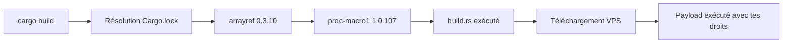
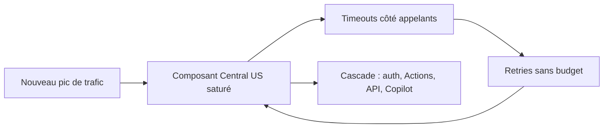
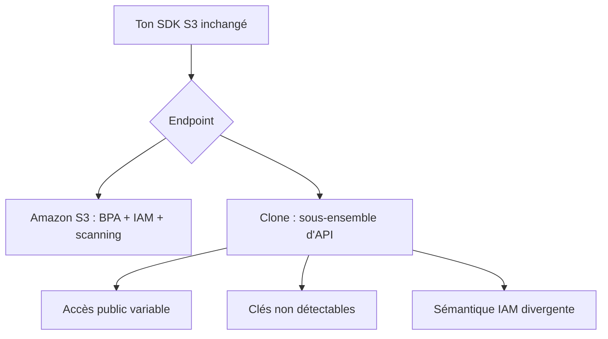

# Tech — Détail du vendredi 21 août 2026

## 1. arrayref 0.3.10 — un build script Rust exécute un payload distant pendant `cargo build`

**Source :** Rust Blog — https://blog.rust-lang.org/2026/08/20/supply-chain-attack-on-arrayref/
**Date :** 20 août 2026

### Contexte

`arrayref` est une micro-crate qui expose des macros pour emprunter des sous-tableaux de taille fixe. Une centaine de lignes, aucune dépendance, environ **245 millions de téléchargements**. Elle est enfouie sous winit, egui, iced, blake3 et une partie de l'écosystème Solana et Ethereum. Personne ne l'écrit dans son `Cargo.toml` ; tout le monde l'a dans son `Cargo.lock`.

Le 20 août 2026 à 07 h 15 UTC, la version **0.3.10** est publiée. Elle ajoute discrètement une dépendance vers `proc-macro1 1.0.107`, un typosquat de `proc-macro2` publié sous une persona GitHub et crates.io fabriquée, `dtolney`, imitant dtolnay. Le compte du mainteneur légitime d'`arrayref` semble avoir été compromis, et les anciennes versions saines ont été **yankées** pour pousser la résolution vers la 0.3.10.

### Comment ça marche

Le vecteur est le **build script**, et c'est ce qu'il faut comprendre en détail.

Cargo autorise une crate à embarquer un fichier `build.rs`. Il est compilé puis **exécuté sur la machine qui compile**, avant que la crate elle-même ne soit compilée. Son rôle légitime : détecter des bibliothèques système, générer du code, configurer des `cfg`. Il tourne avec les droits complets de l'utilisateur qui lance `cargo build`, sans sandbox, sans restriction réseau.

La conséquence est celle qui a piégé tout le monde ici : **il n'est pas nécessaire d'appeler la moindre fonction de la crate**. Ajouter la dépendance et compiler suffit. Un `cargo check`, un `cargo build` en CI, un `rust-analyzer` qui rafraîchit son index — tous déclenchent l'exécution.

Ici, le `build.rs` de `proc-macro1` récupérait un binaire depuis un VPS Hostwinds et l'exécutait. Le poste ou le runner qui compile devient la cible : variables d'environnement, jetons CI, clés SSH, wallets.



Le Rust Security Response Team a reçu le signalement à 07 h 15 UTC — l'équipe de recherche de Nextron Systems GmbH est créditée de la découverte. Les trois crates publiées depuis le même compte le même jour (`arrayref 0.3.10`, `internment 0.8.7`, `append-only-vec 0.1.9`) ont été retirées en **86 à 107 minutes**. Wiz relève un recouvrement significatif avec des campagnes attribuées à la RPDC.

### En pratique — exemple de code

Deux réflexes, l'un curatif, l'autre préventif :

```bash
# 1. Vérifier si tu as résolu une version touchée entre le 20/08 07h15 et ~09h00 UTC
grep -nE 'name = "(arrayref|internment|append-only-vec|proc-macro1)"' -A1 Cargo.lock

# 2. Inventorier TOUTES les crates de ton graphe qui embarquent un build script
cargo metadata --format-version 1 --all-features \
  | jq -r '.packages[] | select(.build != null) | "\(.name) \(.version)"' | sort
```

```toml
# 3. Prévention : figer la date de l'index et couper le réseau au build en CI
# .cargo/config.toml
[net]
offline = true          # échoue si une dépendance n'est pas déjà dans le vendor/

[build]
# Compile depuis un répertoire vendored audité, pas depuis l'index live
```

Si tu as compilé pendant la fenêtre : considère les secrets de la machine comme compromis, fais tourner les jetons CI, les clés SSH et les identifiants de registre, et inspecte l'historique shell et les connexions sortantes du runner.

### Pourquoi ça compte pour toi

Tu n'écris pas de Rust au quotidien, mais tu as le même trou ailleurs : `postinstall` npm, `build.rs` Cargo, tâches MSBuild d'un paquet NuGet. La règle est identique — **installer ou compiler exécute du code tiers**. Applique en CI un runner jetable sans secrets longue durée, du vendoring, et un délai avant d'accepter une version fraîchement publiée. Une fenêtre de 86 minutes suffit à toucher une CI qui tourne toutes les heures.

### Pour aller plus loin

Le mode de découverte est le vrai enseignement : c'est un chercheur externe qui a signalé le typosquat, pas un contrôle automatique de crates.io. Le délai de retrait est excellent ; le délai de détection ne l'est pas.

---

## 2. Panne GitHub du 17 août — 7 h 47 d'indisponibilité et un composant qui n'a pas scalé

**Source :** The GitHub Blog — https://github.blog/news-insights/company-news/the-august-17-outage-and-the-work-ahead/
**Date :** 20 août 2026

### Contexte

Le 17 août, GitHub a été indisponible de **13 h 28 à 21 h 15 UTC**, soit 7 h 47. Ont été touchés github.com, l'authentification, Actions, les API, les pull requests, les issues et Copilot. Au pic, environ **20 %** d'erreurs sur le web et les API, et environ **50 %** sur les téléchargements d'archives et de contenu brut. L'authentification SAML/OIDC, SCIM et Team Sync ont suivi, ainsi que les workflows Actions en GHEC avec résidence des données qui dépendent de définitions d'étapes hébergées sur GitHub.com.

Le post-mortem publié le 20 août est intéressant moins pour la cause immédiate que pour le mécanisme d'amplification.

### Comment ça marche

Le déclencheur est banal : le trafic atteint un nouveau pic, et un composant d'infrastructure critique du datacenter Central US ne monte pas en charge avec lui. Un chiffre de contexte explique pourquoi ce pic n'était pas anticipé : **Azure porte environ 58 % de la charge plateforme et la moitié des opérations Git**, contre 12 % de la charge plateforme en mai. La migration a déplacé le point de saturation plus vite que la modélisation de capacité ne l'a suivi.

Ce qui transforme une saturation locale en panne de huit heures, c'est la **tempête de retries**. Le schéma est classique et vaut d'être déroulé pas à pas :

1. Un composant sature et met plus longtemps à répondre.
2. Les appelants dépassent leur timeout et retentent.
3. Chaque retry ajoute une requête à un composant déjà saturé.
4. La charge effective augmente alors même que le trafic utilisateur est stable.
5. Les appelants des appelants dépassent leur propre timeout et retentent à leur tour.
6. Le système ne peut plus se rétablir seul : même si le trafic entrant redescend, la charge auto-générée le maintient saturé.

C'est de l'**effondrement métastable**. La panne se nourrit d'elle-même, et la sortie demande une intervention pour casser la boucle.



Les remédiations annoncées visent exactement ce mécanisme : limites de retry, **budgets de retry** et timeouts variables appliqués de façon cohérente à toutes les interactions service-à-service. GitHub revoit aussi ses alertes CPU et mémoire de faible priorité pour identifier les composants susceptibles de céder sur un pic soudain.

### En pratique — exemple de code

Un budget de retry n'est pas un compteur de tentatives : c'est un **plafond sur la proportion de retries dans le trafic total**. En .NET, avec `Microsoft.Extensions.Http.Resilience` :

```csharp
// Avant — 3 retries fixes : sous incident, tu triples la charge sur un service à terre
builder.Services.AddHttpClient<GitClient>()
    .AddStandardResilienceHandler(o => o.Retry.MaxRetryAttempts = 3);
```

```csharp
// Après — retries bornés ET circuit breaker : la boucle d'amplification se coupe seule
builder.Services.AddHttpClient<GitClient>()
    .AddResilienceHandler("git", b => b
        .AddRetry(new HttpRetryStrategyOptions
        {
            MaxRetryAttempts = 2,
            BackoffType = DelayBackoffType.Exponential,
            UseJitter = true,              // évite la synchronisation des clients
        })
        .AddCircuitBreaker(new HttpCircuitBreakerStrategyOptions
        {
            FailureRatio = 0.3,            // 30 % d'échecs sur la fenêtre
            SamplingDuration = TimeSpan.FromSeconds(30),
            BreakDuration = TimeSpan.FromSeconds(15),  // on arrête d'appeler
        })
        .AddTimeout(TimeSpan.FromSeconds(10)));
```

### Pourquoi ça compte pour toi

Regarde tes appels service-à-service : combien ont un retry sans jitter et sans disjoncteur ? Sous incident, ils transforment une dégradation en panne. Ajoute un circuit breaker devant chaque dépendance, du jitter sur les backoffs, et vérifie que tes timeouts décroissent en descendant la pile d'appels. Vérifie aussi ce que ta CI fait quand GitHub tombe : sept heures d'Actions indisponibles, ça se prépare.

### Points de vigilance

Le post-mortem note que le pic de trafic était nouveau, pas anormal. La leçon n'est pas « il fallait plus de capacité » mais « il fallait que la saturation reste locale ». Le budget de retry est une propriété d'architecture, pas un paramètre de tuning.

---

## 3. Clones S3 chez les neoclouds — la compatibilité d'API n'est pas la compatibilité de sécurité

**Source :** InfoQ — https://www.infoq.com/news/2026/08/s3-clone-security/
**Date :** 21 août 2026

### Contexte

L'API S3 est devenue le standard de fait du stockage objet. Plus de 90 fournisseurs annoncent un endpoint « compatible S3 », et l'argument commercial est toujours le même : ton SDK ne change pas, ta migration est triviale.

Wiz a examiné les services managés de six neoclouds — Nebius, Crusoe, Vultr, Lambda Labs, Cloudflare R2 et DigitalOcean — et les a comparés à Amazon S3. Scott Piper, chercheur principal en sécurité cloud chez Wiz, en tire une conclusion nette : la compatibilité d'API crée un faux sentiment de portabilité, et **les hypothèses de sécurité AWS ne suivent pas**.

### Comment ça marche

Le raisonnement de Piper part d'un chiffre : il existe près de **300 API** associées à S3 et à ses services dérivés (S3 Tables, S3 Vectors, S3 Express…), accumulées sur plus de vingt ans. Aucun clone n'implémente cet ensemble. « Compatible S3 » signifie en pratique : le sous-ensemble d'opérations sur objets que la plupart des clients appellent.

Le problème est que la sécurité de S3 ne vit pas dans ces opérations. Elle vit dans les API périphériques et dans la sémantique IAM. Trois écarts documentés :

**Accès public.** AWS a **Block Public Access**, un interrupteur qui écrase ACL et bucket policies à quatre niveaux. Aucun clone n'a d'équivalent complet. Crusoe et Lambda Labs n'ont tout simplement pas de capacité de bucket public. Nebius et Cloudflare R2 autorisent le bucket public mais pas le listing anonyme d'objets. DigitalOcean supporte les buckets listables publiquement. Vultr supporte à la fois ACL et bucket policies. Quatre modèles de menace différents derrière une même API.

**Clés d'accès.** Les clés AWS ont un format structuré (`AKIA…`, `ASIA…`) que le secret scanning de GitHub et les scanners tiers reconnaissent. La plupart des clés de services compatibles S3 n'ont **aucun motif exploitable**. Une clé qui fuit dans un commit ne déclenche donc aucune alerte.

**Sémantique IAM.** Les modèles d'autorisation divergent, et ça a déjà produit des vulnérabilités réelles : une élévation de privilèges non autorisée dans MinIO, et CVE-2026-49991 dans RustFS, qui casse l'isolation entre tenants. L'anecdote la plus parlante vient de Corey Quinn : sur l'un des providers testés, **`delete-bucket-policy` supprime le bucket entier**. Même commande, même SDK, effet catastrophiquement différent.



Un point est en revanche uniformément hérité : les **URL présignées**. Tous les clones les supportent, avec leurs implications de sécurité — un lien présigné reste valide jusqu'à expiration, indépendamment de tout changement de permission.

### En pratique — exemple de code

Vérifier la sémantique réelle avant de faire confiance, plutôt que de supposer :

```bash
# 1. Le provider a-t-il un équivalent de Block Public Access ? (souvent : non)
aws s3api get-public-access-block --bucket mon-bucket \
  --endpoint-url https://s3.mon-neocloud.example
# NoSuchPublicAccessBlockConfiguration ou 501 => aucun garde-fou global

# 2. Le listing anonyme est-il possible ? Test SANS credentials
aws s3api list-objects-v2 --bucket mon-bucket --no-sign-request \
  --endpoint-url https://s3.mon-neocloud.example

# 3. NE PAS tester delete-bucket-policy en prod : sur au moins un provider,
#    l'appel supprime le bucket. Valider sur un bucket jetable d'abord.
```

```csharp
// Côté .NET : forcer l'endpoint et désactiver les comportements spécifiques AWS
var config = new AmazonS3Config
{
    ServiceURL = "https://s3.mon-neocloud.example",
    ForcePathStyle = true,          // beaucoup de clones ne font pas le virtual-host style
    UseAccountIdRouting = false,    // routage propre à AWS, à couper explicitement
};
```

### Pourquoi ça compte pour toi

Si tu stockes des uploads utilisateur ou des exports sur un neocloud, tes réflexes AWS ne te protègent plus. Audite le comportement réel de chaque API destructive sur un bucket jetable, écris tes propres règles de détection pour des clés qu'aucun scanner ne reconnaît, et traite les URL présignées comme des tokens porteurs. Le SDK identique est justement ce qui rend l'écart invisible en revue de code.

### Limites

L'étude ne couvre ni Backblaze B2, ni Wasabi, ni Google Cloud Storage. Le message n'est pas « les neoclouds sont dangereux » mais « vérifie explicitement, provider par provider ». Rishi Raj Singh, de Wiz, résume l'action attendue : auditer le comportement des API, vérifier le modèle de permissions, et valider ce qui se passe quand l'outillage AWS standard parle à ces endpoints.
