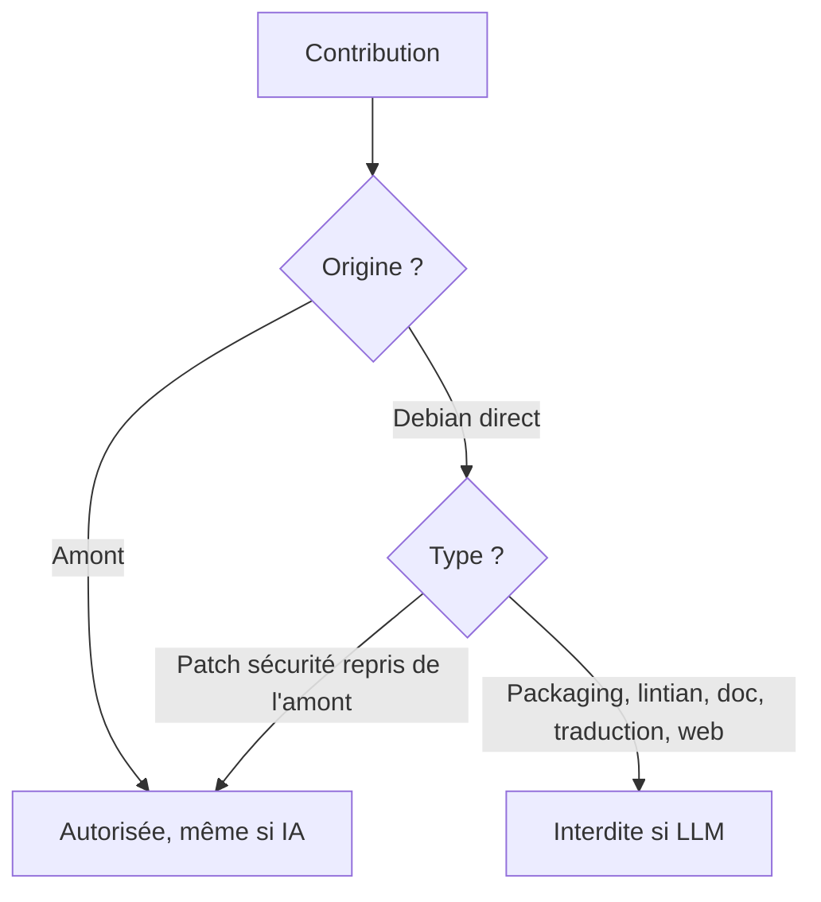
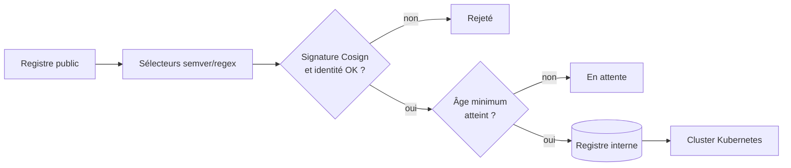

# Tech — Détail du samedi 22 août 2026

## 1. Debian — résolution générale sur les contributions assistées par LLM

**Source :** The New Stack — https://thenewstack.io/debian-ai-contribution-ban-debate/
**Date :** 20 août 2026

### Contexte

Debian tranche ses désaccords structurants par un vote formel appelé résolution générale. Le mécanisme a servi historiquement pour systemd ou pour les micrologiciels non libres. Il est aujourd'hui saisi sur une question neuve : les contributions écrites avec l'aide d'un modèle de langage sont-elles compatibles avec ce que Debian est ?

La proposition attribuée à Matthias Geiger fonde son argumentaire sur la réputation de stabilité du projet. Elle affirme que l'usage massif des LLM procède d'une culture « move fast and break things » — courante ailleurs dans l'industrie, jugée inappropriée pour Debian. Le texte est net : « Nous n'autoriserons pas les contributions directes à Debian écrites avec l'usage ou l'assistance de grands modèles de langage ou d'autres outils d'IA générative. »

### Comment ça marche

Le point qui compte pour toi n'est pas l'opinion, c'est le tracé du périmètre. Il est plus subtil qu'un simple « non à l'IA ».

**Ce qui serait interdit** : les paquets source Debian, les logiciels natifs du projet comme le vérificateur de paquets `lintian`, les ressources web officielles, la documentation et les traductions écrites par des contributeurs Debian. La définition de « contribution directe » englobe explicitement le packaging.

**Ce qui resterait autorisé** : tout ce qui vient de l'amont. Un projet upstream qui utilise massivement l'IA générative peut continuer d'être empaqueté. Les patchs et correctifs de sécurité issus de l'amont ne sont pas bloqués, qu'ils aient ou non impliqué de l'IA. Autrement dit, la règle s'applique au travail des développeurs Debian, pas au contenu de l'archive.

Cette asymétrie est cohérente si l'on considère que la valeur ajoutée de Debian est l'intégration et la revue, pas l'écriture de code amont. Elle est aussi difficile à faire respecter : rien ne permet de détecter un patch de packaging assisté par LLM.

**Les sept contre-propositions** couvrent tout le spectre : autorisation sous conditions, rejet « autant que praticable » assorti d'une mise à jour du code de conduite, acceptation pour le travail spécifique à Debian, simples lignes directrices d'usage responsable, une déclaration sous le mot d'ordre « Debian est créé par des humains », et une proposition qui rejette les LLM au motif de leur coût climatique.



### En pratique — exemple de code

Si une telle politique atterrit dans ton organisation, la seule version applicable est celle qui s'appuie sur des métadonnées déclaratives, pas sur de la détection.

```bash
# Politique déclarative : le contributeur atteste, le CI vérifie la forme.
# .git-trailers attendus dans chaque commit du dépôt packaging.
git commit -m "fix(pkg): corrige les dépendances de build" \
  --trailer "Assisted-by: none" \
  --trailer "Signed-off-by: Charles Lindecker <charles@example.org>"
```

```bash
# Garde-fou CI : refuse un commit sans attestation explicite.
#!/usr/bin/env bash
set -euo pipefail
RANGE="${1:-origin/main..HEAD}"
for sha in $(git rev-list "$RANGE"); do
  if ! git show -s --format=%B "$sha" | grep -qE '^Assisted-by: (none|llm:[a-z0-9.-]+)$'; then
    echo "❌ $sha : trailer 'Assisted-by:' manquant ou mal formé" >&2
    exit 1
  fi
done
echo "✅ tous les commits portent une attestation"
```

Ce garde-fou ne détecte rien — il rend la déclaration obligatoire et traçable. C'est le seul niveau de contrôle honnête.

### Pourquoi ça compte pour toi

Si Debian tranche pour l'interdiction, tes clients et ta DSI vont te poser la question dans les six mois. Prépare une réponse écrite : qu'est-ce que ton équipe autorise, sur quels dépôts, et comment c'est tracé. Une politique claire assortie d'un trailer de commit vaut mieux qu'un flou qui deviendra un point de blocage en audit.

---

## 2. Flux Mirror — transformer ton registre en diode de supply chain

**Source :** InfoQ — https://www.infoq.com/news/2026/08/flux-mirror-gitless-gitops/
**Date :** 20 août 2026

### Contexte

Quand ton `Deployment` Kubernetes tire une image directement depuis un registre public, tu as fait de la disponibilité, des quotas et de la politique de rétention de ce registre une partie de ton architecture de production. Control Plane le formule ainsi, et l'année écoulée l'a illustré : rate limiting Docker Hub, gel du catalogue gratuit Bitnami par Broadcom en 2025.

Flux publie Flux Mirror, un plugin CLI du système de plugins introduit avec Flux v2.9. Il recopie images, charts Helm et artefacts OCI entre registres depuis une configuration déclarative. Le contexte plus large est le mouvement « Gitless GitOps » : les registres OCI deviennent la source de vérité de l'état désiré au runtime, à la place des dépôts Git.

### Comment ça marche

Le pipeline se lit en quatre étages.

**Sélection.** Un fichier de configuration décrit quoi miroiter, depuis quelles sources, vers quelles destinations. Un pipeline de sélecteurs enchaîne expressions régulières, contraintes semver, tri et limitation top-N — tu ne recopies que les versions que tu utilises réellement, pas tout l'historique d'un dépôt.

**Vérification.** Avant toute copie, Flux Mirror contrôle que l'artefact a été signé par la bonne personne ou le bon système de build, via les signatures Cosign et l'information d'identité. SBOM et provenance de build sont reportés dans le miroir, ce qui permet à Flux de revérifier les preuves côté cluster.

**Âge minimum.** C'est la pièce la plus intéressante. Un artefact fraîchement signé est retenu ; il n'est copié qu'après avoir été public assez longtemps. La signature d'un compte compromis est valide — la provenance ne prouve pas l'intégrité, elle prouve l'origine. Le délai laisse à la communauté le temps de détecter la compromission. C'est la réponse directe aux vagues Shai-Hulud et à la compromission de la GitHub Action Trivy d'Aqua Security, où des artefacts malveillants sont restés en ligne plusieurs jours.

**Relocalisation.** Les trois catégories convergent vers un seul flux : images copiées octet à octet avec les listes de manifestes multi-architectures, charts Helm HTTP republiés en artefacts OCI déterministes que Flux consomme sans dépendre des index amont, et artefacts d'état désiré Flux. Les secrets peuvent aussi être miroités, y compris des jetons courts pour charges cloud, et consommés via `imagePullSecrets` ou `secretRef`.

L'ensemble tourne depuis GitHub Actions avec une action de setup qui vérifie les attestations avant premier usage, ou comme `CronJob` Kubernetes colocalisé avec les clusters et les registres.



### En pratique — exemple de code

```yaml
# mirror.yaml — état déclaratif de ce que ton registre a le droit de contenir.
apiVersion: mirror.fluxcd.io/v1
kind: MirrorConfig
spec:
  destination: registry.interne.example.org/mirror
  images:
    - source: ghcr.io/fluxcd/source-controller
      # On ne recopie que les 3 dernières versions stables de la ligne 1.x.
      select:
        semver: ">=1.0.0 <2.0.0"
        sortBy: semver
        limit: 3
      verify:
        provider: cosign
        # L'identité attendue : ni "signé", ni "signé par quelqu'un" — signé par CEUX-LÀ.
        identities:
          - issuer: https://token.actions.githubusercontent.com
            subject: https://github.com/fluxcd/source-controller/.github/workflows/release.yml@refs/tags/*
        # La diode : rien n'entre avant 7 jours d'exposition publique.
        minimumAge: 168h
      carry: [sbom, provenance]
```

```bash
# Exécution : depuis un CronJob dans le cluster, ou depuis la CI.
flux mirror sync --config mirror.yaml --log-level info
# Puis les Deployments ne référencent plus QUE registry.interne.example.org/mirror/...
```

### Pourquoi ça compte pour toi

Même sans Flux, la question s'applique à tes conteneurs .NET et à tes builds Angular : d'où viennent tes images de base, qui peut les changer, et que se passe-t-il si l'amont disparaît. Un registre miroir avec un délai d'âge minimum est le contrôle le plus rentable que tu puisses ajouter — il neutralise la fenêtre d'exposition des attaques éclair sans t'obliger à auditer chaque paquet.

### Limites

Un miroir crée sa propre dette : il faut le purger, le sauvegarder et le surveiller. L'âge minimum retarde aussi les correctifs de sécurité légitimes — prévois un chemin de contournement explicite pour les CVE critiques, sinon la règle sera désactivée dans l'urgence.

---

## 3. Docker VMM — Docker reprend la main sur sa couche de virtualisation

**Source :** InfoQ — https://www.infoq.com/news/2026/08/docker-vmm-layer/
**Date :** 19 août 2026

### Contexte

Sur macOS et Windows, les conteneurs Linux ne tournent pas nativement : Docker Desktop fait tourner une machine virtuelle Linux, et le moteur qui pilote cette VM s'appelle un VMM (virtual machine monitor). Historiquement, Docker s'appuyait sur un VMM tiers — Virtualization.framework côté Apple, Hyper-V ou WSL2 côté Windows.

Docker vient de publier Docker VMM, son propre moniteur, en bêta publique avec Docker Desktop 4.86. Le raisonnement est direct : « nous possédons désormais toute la pile, et nous pouvons régler chaque partie du moteur spécifiquement pour les charges conteneurisées ». On ne pense jamais au VMM jusqu'au jour où il est lent, instable, ou retient de la mémoire qu'il aurait dû rendre.

### Comment ça marche

Trois axes d'amélioration, chacun lié à une friction concrète du quotidien.

**Le démarrage.** Docker annonce un démarrage de conteneur « mesurablement plus rapide de bout en bout » : au premier lancement, lors d'un changement de projet, et pendant la reprise après redémarrage. Ce sont exactement les trois moments où le VMM doit initialiser ou réinitialiser l'invité, et où un moteur générique paie des étapes inutiles pour un conteneur.

**Le partage de fichiers.** C'est le point douloureux historique du développement conteneurisé sur macOS. Chaque lecture d'un fichier du répertoire hôte monté dans le conteneur traverse une couche de traduction. Sur une boucle éditer-compiler-tester — typiquement un `dotnet watch` ou un `ng serve` sur un volume monté — le coût est payé des milliers de fois par heure. Docker annonce des gains particulièrement visibles sur ce profil.

**La mémoire.** Le nouveau VMM rend à l'hôte la mémoire inutilisée quand les conteneurs sont au repos. C'est le comportement qui manquait le plus : une VM qui gonfle puis ne dégonfle jamais transforme une machine de 32 Go en machine de 16 Go au bout d'une journée.

Côté Windows, Docker vise l'isolation de niveau Hyper-V avec des performances proches de WSL2 — historiquement il fallait choisir entre les deux.

Le point stratégique dépasse la performance : le même moteur alimente Docker Sandboxes, les environnements isolés destinés aux agents IA. L'objectif affiché est un runtime unifié couvrant portables, cloud et on-prem, où conteneurs, applications Compose et agents partagent la même fondation.

### En pratique — exemple de code

```bash
# Vérifier ta version et l'état du VMM.
docker version --format '{{.Server.Version}}'
docker info | grep -iE 'operating system|total memory'

# macOS : Docker VMM est activé automatiquement en 4.86.
# Windows : c'est un opt-in, à activer dans les réglages ou via le fichier de config.
#   Settings > General > "Use Docker VMM"

# Mesurer le gain qui te concerne vraiment : le cold start.
time docker run --rm mcr.microsoft.com/dotnet/sdk:9.0 dotnet --version

# Et le partage de fichiers, le vrai goulot en dev sur volume monté.
time docker run --rm -v "$PWD":/src -w /src \
  mcr.microsoft.com/dotnet/sdk:9.0 bash -c 'find . -type f | wc -l'
```

Fais ces deux mesures avant et après bascule : ce sont les seules qui prédisent ce que tu ressentiras.

### Pourquoi ça compte pour toi

Si tu développes en .NET ou Angular dans des conteneurs sur macOS ou Windows, le partage de fichiers et la mémoire retenue sont probablement tes deux irritants quotidiens. Teste la 4.86 sur une branche, mesure ton cold start et ton `watch`, et garde la possibilité de revenir en arrière. Sur Windows c'est un opt-in, donc l'essai est réversible sans risque.

### Points de vigilance

C'est une bêta publique. Linux n'est pas supporté et la GA est attendue fin octobre. Sur macOS l'activation est automatique en 4.86 : si tu as une pile de dev sensible, vérifie le comportement avant de laisser la mise à jour partir sur toute l'équipe.
