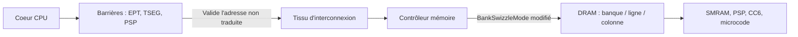
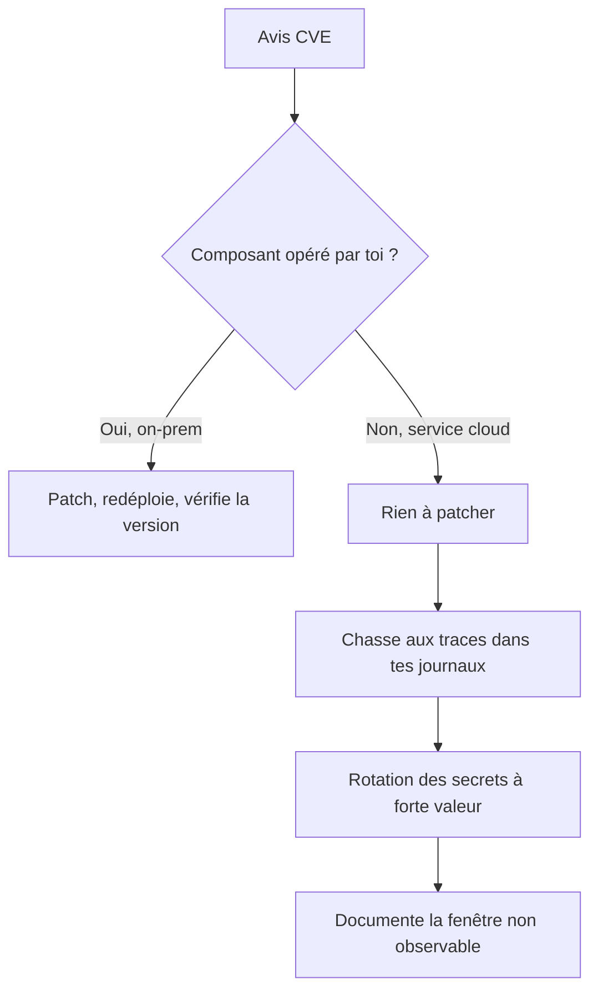
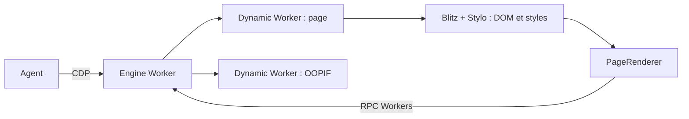

# Tech — Détail du dimanche 23 août 2026

## 1. `skitter-creek-bath-salts` — casser l'isolation mémoire sous les barrières du CPU

**Source :** InfoQ — https://www.infoq.com/news/2026/08/amd-memory-exploit/
**Date :** 23 août 2026

### Contexte

Toute l'architecture de sécurité d'un processeur moderne repose sur un postulat rarement énoncé : une adresse physique désigne de façon déterministe un emplacement précis dans le silicium. Les barrières que tu connais s'appuient dessus. Les tables de pages étendues d'un hyperviseur (EPT) filtrent les adresses qu'une VM peut atteindre. Les limites TSEG protègent la SMRAM utilisée par le System Management Mode. Les carveouts privés du Platform Security Processor réservent des zones au firmware AMD. Ces trois mécanismes ont un point commun : ils opèrent au niveau du cœur et du tissu d'interconnexion système, c'est-à-dire **avant** que le trafic mémoire n'atteigne le contrôleur.

Christopher Domas a publié `skitter-creek-bath-salts`, un projet open source qui exploite précisément cet écart. Son observation tient en une phrase : les registres de traduction du contrôleur mémoire se situent en dessous de ces barrières.

### Comment ça marche

**Le mécanisme d'abord.** Le contrôleur mémoire ne stocke pas des adresses physiques, il les convertit en coordonnées physiques réelles — canal, rang, banque, ligne, colonne. Cette conversion est paramétrable par des registres de configuration. Modifier des bits comme `BankSwizzleMode` change la formule de calcul. L'adresse physique émise par le cœur reste la même ; l'emplacement DRAM qu'elle finit par désigner, lui, a changé.

Le filtre amont ne voit rien. Il valide l'adresse **non traduite**, la juge légitime, la laisse passer — et l'accès atterrit silencieusement dans une enclave qu'il était censé protéger. Pas de faute, pas d'exception, pas de barrière mémoire architecturale déclenchée.

**La chaîne d'exploitation ensuite.** Rewirer un contrôleur mémoire pendant que l'OS tourne dessus est instable par nature. Le projet passe donc par un pipeline en plusieurs étapes. Un module noyau Linux dédié met hors ligne les cœurs non-boot, purge les caches système, préchauffe les TLB et désactive les interruptions, de façon à figer l'activité mémoire pendant la reconfiguration.

**La résolution de la carte enfin.** Une fois le swizzling activé, l'attaquant ne sait pas encore où ses adresses atterrissent. Des scripts de sondage automatisés emploient une heuristique de type collecteur de coupons, combinée à des lectures ciblées depuis l'espace utilisateur, pour cataloguer les collisions de bits d'adresse. La chaîne d'outils modélise ensuite la permutation par arithmétique de corps de Galois et confie à un solveur SMT le soin d'en dériver la correspondance exacte, bit à bit. Une fois la carte résolue, des lectures et écritures ciblées atteignent la SMRAM, les tables de firmware du PSP, les zones de sauvegarde de sommeil CC6 et les buffers de patch de microcode.

**La portée réelle.** L'attaque exige le Ring 0 et vise des registres accessibles surtout sur les familles AMD 14h, 15h et 16h. Ce n'est pas une RCE à distance. La leçon est architecturale, et c'est elle qui compte : accorder au noyau le droit de reprogrammer ces registres revient à traiter le noyau comme intrinsèquement fiable. Un modèle de menace qui admet un noyau adverse — bare-metal cloud, confidential computing — s'écroule sur ce postulat. La recommandation est directe : verrouiller les registres de traduction du contrôleur mémoire au démarrage, et confier la configuration critique de plateforme à une frontière de privilège située au-dessus du niveau CPU.



### En pratique — exemple de code

Il n'y a rien à reproduire ici, mais il y a un inventaire à faire. La première question défensive est : quelles machines de ton parc exposent cette surface ?

```bash
# Inventaire défensif : repérer les hôtes AMD des familles 14h, 15h, 16h.
# La famille CPU est en décimal dans /proc/cpuinfo -> on convertit en hexa.
awk -F: '/vendor_id/{v=$2} /cpu family/{f=$2}
  END { gsub(/ /,"",v); gsub(/ /,"",f);
        printf "vendor=%s family=0x%x\n", v, f }' /proc/cpuinfo

# Exposé si : vendor=AuthenticAMD et family dans 0x14, 0x15, 0x16.
# Sur ces hôtes, vérifie que le firmware verrouille bien la config mémoire :
sudo dmesg | grep -iE 'smm|tseg|iommu' | head -20
```

### Pourquoi ça compte pour toi

Tu ne vas pas patcher un contrôleur mémoire. Ce que tu peux faire, c'est arrêter de considérer « machine virtuelle isolée » comme un synonyme de « données protégées ». Si tu héberges des secrets applicatifs — chaînes de connexion PostgreSQL, clés de signature — sur du bare-metal mutualisé ou chez un fournisseur qui ne documente pas son verrouillage firmware, le chiffrement au repos côté application reste ta seule vraie ligne de défense.

### Limites

- L'accès Ring 0 est un prérequis : ce n'est pas un vecteur d'entrée, c'est une escalade depuis un noyau déjà compromis.
- Les registres visés sont surtout exposés sur des générations AMD anciennes (familles 15h et 16h).
- Le débat communautaire, sur r/asm comme sur r/blueteamsec, converge sur ce point : l'intérêt est architectural, pas opérationnel immédiat.

---

## 2. CVE-2026-69836 — Entra ID à CVSS 10,0, exploité, et rien à patcher

**Source :** Help Net Security — https://www.helpnetsecurity.com/2026/08/21/microsoft-entra-id-vulnerability-cve-2026-69836/
**Date :** 20 août 2026

### Contexte

Le 20 août, Microsoft publie CVE-2026-69836 : une exécution de code à distance sur Entra ID, note de base CVSS 3.1 de 10,0, classée CWE-502 — désérialisation de données non fiables. L'avis indique que la faille a été exploitée dans la nature. Il indique aussi qu'elle a été entièrement mitigée avant divulgation publique et qu'aucune action client n'est requise.

Cette combinaison — sévérité maximale, exploitation confirmée, zéro action attendue — n'est pas un paradoxe. C'est la forme normale d'une vulnérabilité dans un service cloud opéré, et elle mérite d'être comprise, parce qu'elle change entièrement ta procédure de réponse.

### Comment ça marche

**La classe de faille.** CWE-502 décrit un cas précis : une application accepte des données sérialisées d'une source non fiable et les reconstruit en objets sans validation suffisante. Le danger ne vient pas des données elles-mêmes mais du fait que la désérialisation **instancie des types** et peut déclencher du code pendant la reconstruction — constructeurs, callbacks, setters. Un flux forgé qui désigne les bons types transforme une lecture de données en exécution.

C'est pour cette raison que la parade correcte n'est jamais « filtrer le contenu » mais « restreindre les types autorisés » : liste blanche stricte, ou format de données qui ne porte tout simplement pas d'information de type. En .NET, c'est exactement la raison pour laquelle `BinaryFormatter` a été retiré au profit de `System.Text.Json`.

**Ce qui change quand la faille est dans un service opéré.** Le cycle classique — avis, correctif, déploiement, vérification — suppose que tu contrôles le binaire vulnérable. Pour Entra ID, ce n'est pas le cas : Microsoft opère l'infrastructure, déploie la mitigation de façon centralisée, et le délai entre la correction et ta protection tombe à zéro. C'est un gain réel de temps d'exposition.

Le revers est que tu perds toute observabilité sur la fenêtre d'exploitation. Tu ne sais pas quand la faille était active, ni si ton tenant a été touché. Et « aucune action client requise » ne concerne que la remédiation, pas la détection. Aucun code d'exploitation n'est public à ce jour, ce qui limite le risque de vague opportuniste, mais ne dit rien sur ce qui s'est passé avant.



### En pratique — exemple de code

La seule action utile de ton côté est la chasse aux anomalies dans les journaux Entra ID. Voici le type de requête à lancer sur ton espace de travail Log Analytics.

```kusto
// Anomalies d'authentification autour de la fenêtre de divulgation.
// Cible : succès depuis des localisations ou des clients inhabituels.
let debut = datetime(2026-08-10);
SigninLogs
| where TimeGenerated between (debut .. now())
| where ResultType == 0                       // authentification réussie
| summarize Tentatives = count(),
            Pays = make_set(Location, 20),
            Applis = make_set(AppDisplayName, 20)
    by UserPrincipalName, IPAddress
| where array_length(Pays) > 1                // même IP, plusieurs pays : suspect
| order by Tentatives desc
```

```kusto
// Second axe : créations ou modifications de principaux de service et de secrets.
AuditLogs
| where TimeGenerated > datetime(2026-08-10)
| where OperationName has_any ("Add service principal",
                               "Add application", "Update application",
                               "Add owner to application")
| project TimeGenerated, OperationName, InitiatedBy, TargetResources
| order by TimeGenerated desc
```

### Pourquoi ça compte pour toi

Si ton API .NET délègue l'authentification à Entra ID, tu n'as rien à déployer — mais tu as trois choses à faire. Relis tes journaux de connexion sur la période. Fais tourner les secrets clients et certificats de tes enregistrements d'application. Et note quelque part que sur un service opéré, la question n'est plus « ai-je patché ? » mais « saurais-je dire si j'ai été touché ? ». La réponse conditionne ta vraie posture.

### Points de vigilance

- La désérialisation reste une des classes de faille les plus rentables : dans ton propre code, bannis les formats porteurs de type et privilégie une liste blanche explicite.
- La mitigation côté service ne restaure pas les traces : tes journaux Entra ID ont une rétention limitée, exporte-les avant qu'ils n'expirent.

---

## 3. Cloudflare Kitesurf — un moteur de navigateur écrit pour les agents

**Source :** InfoQ — https://www.infoq.com/news/2026/08/cloudflare-kitesurf-browser/
**Date :** 22 août 2026

### Contexte

Faire naviguer un agent sur le Web coûte cher, et la raison est structurelle. Les auteurs du projet la formulent ainsi : « Browser engines like Chromium were built for humans, not agents (...) They consume so much memory and compute that providing every agent with its own instance is prohibitively expensive. » Un Chromium complet embarque un compositeur, une pile vidéo, WebGL, la gestion des onglets, des extensions, la synchronisation — autant de fonctions dont un agent qui veut extraire du HTML ou prendre une capture n'a strictement aucun usage.

Kitesurf, annoncé par Cloudflare le 22 août, part de l'inverse : construire le minimum nécessaire pour qu'un agent lise une page, et l'exécuter là où c'est le moins cher.

### Comment ça marche

**Le modèle d'exécution.** Chaque page — et chaque iframe hors-processus, ou OOPIF — tourne dans un Dynamic Worker de longue durée, isolé, avec son propre environnement JavaScript et son propre DOM. L'isolation n'est donc pas un processus système comme dans Chromium, mais un isolate Workers. Les composants du navigateur tournent en WebAssembly, compilés depuis Rust, sur l'infrastructure Cloudflare Workers.

**La construction du DOM.** Le pipeline est classique dans son principe : parsing du HTML et du CSS, puis exécution du JavaScript. Ce qui change, ce sont les briques. Le rendu s'appuie sur des composants du moteur Rust **Blitz** (DioxusLabs) et sur **Stylo**, le parseur CSS de Firefox issu du projet Servo. Nico Burns, créateur de Blitz — développé depuis deux ans et demi — confirme que Kitesurf est bâti dessus, et indique que Cloudflare compte ouvrir le code et remonter ses correctifs en amont.

**Le rendu final.** Un composant `PageRenderer` prend le DOM et les styles calculés d'une page et produit une image ou un PDF. Il récupère polices et images, rastérise la scène via Blitz Paint et Parley, puis renvoie le buffer résultant au moteur par RPC Workers.

**L'interface.** C'est le choix le plus pragmatique du projet : Kitesurf parle le Chrome DevTools Protocol. Tu n'apprends pas une nouvelle API — Playwright et Puppeteer le pilotent avec le code que tu as déjà.

**Les limites, assumées.** Pas de vidéo, pas de WebGL, pas de challenges anti-bot réalistes fondés sur TLS, pas de sessions authentifiées de longue durée. Cloudflare décrit un moteur « éphémère, totalement isolé, sans état », taillé pour n'exister que le temps d'une tâche et pour absorber des charges IA en rafale. La fidélité visuelle, les onglets, les extensions et la synchronisation sont sacrifiés au profit de la faible consommation de tokens, du coût et de la sûreté des outils.



### En pratique — exemple de code

Puisque l'interface est le CDP, le code de pilotage est celui que tu écris déjà avec Playwright — seule l'adresse de connexion change.

```typescript
// Avant — Chromium lancé localement, un processus complet par instance
import { chromium } from 'playwright';

const browser = await chromium.launch({ headless: true });
const page = await browser.newPage();
await page.goto('https://example.org');
const html = await page.content();
await browser.close();
```

```typescript
// Après — connexion au moteur distant via le Chrome DevTools Protocol.
// Le code de la page ne change pas : seule l'obtention du navigateur diffère.
import { chromium } from 'playwright';

const browser = await chromium.connectOverCDP(process.env.KITESURF_CDP_URL!);
const page = await browser.newPage();
await page.goto('https://example.org');
const html = await page.content();          // extraction : cas d'usage supporté
// await page.video()                        // non supporté : pas de pile vidéo
await browser.close();
```

### Pourquoi ça compte pour toi

Si tes tests end-to-end Playwright servent surtout à extraire du contenu ou à produire des captures, un moteur sans état facturé à la tâche peut alléger ta facture CI. Attention au périmètre : sans sessions authentifiées longues ni WebGL, tes parcours de connexion et tes composants graphiques restent sur Chromium. Traite Kitesurf comme un exécuteur d'extraction, pas comme ton runner de tests.

### Points de vigilance

- Le projet est expérimental : le code n'est ni publié ni open source à ce jour, et le support CDP comme la compatibilité Web Platform Tests restent à compléter.
- Conflit d'intérêts soulevé sur Hacker News et sur r/rust : Cloudflare vend du blocage de scraping IA en SaaS tout en construisant un outil de scraping IA. La question de savoir si son propre CDN laissera passer ces instances reste ouverte.
