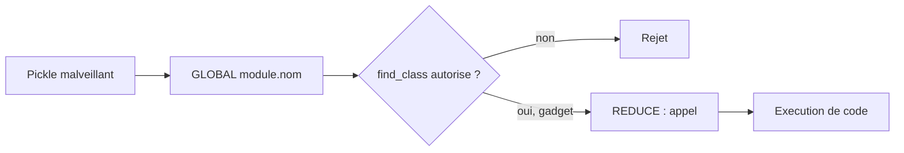
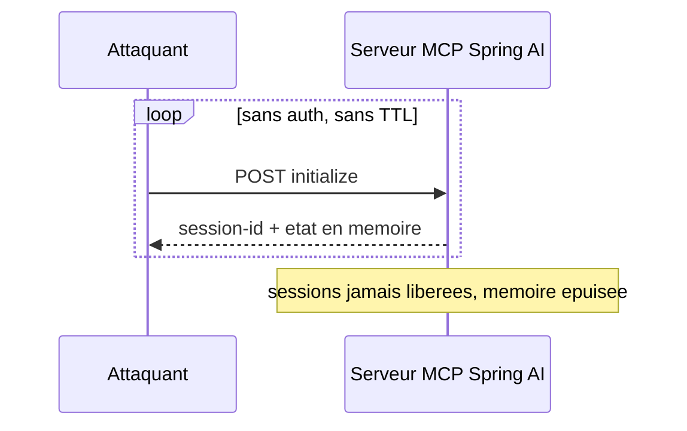
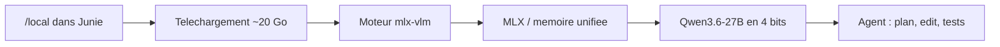

# Tech — Détail du mardi 25 août 2026

## 1. CVE-2026-71513 — l'allowlist de dépicklage de NLTK contournée, RCE à 8,8

**Source :** CVE Brief — https://cvebrief.com/cve/cve-2026-71513/
**Date :** 23 août 2026

### Contexte

NLTK reste une dépendance de fond dans beaucoup de pipelines de traitement de texte : tokenisation, stemming, corpus annotés, prétraitement avant vectorisation. Elle traîne aussi un héritage lourd — une partie de ses corpus et de ses modèles taggeurs sont distribués en **pickle**, le format de sérialisation natif de Python.

Le problème du pickle est connu depuis toujours : dépickler, c'est exécuter. Le format embarque des instructions qui reconstruisent des objets en appelant des fonctions arbitraires. Charger un pickle non fiable équivaut à exécuter un script fourni par l'attaquant. Pour vivre avec, NLTK avait introduit un `AllowlistUnpickler` : un dépickleur restreint qui n'autorise que des classes explicitement listées. C'est exactement ce composant qui est contourné par la CVE-2026-71513, publiée le 23 août, cotée 8,8, affectant les versions 3.10.0 à 3.10.2 incluses. Le correctif est en 3.10.3.

### Comment ça marche

Un pickle n'est pas une structure de données, c'est un **programme pour une machine à pile**. Chaque opcode manipule cette pile. L'opcode critique s'appelle `REDUCE` : il prend un callable et un tuple d'arguments sur la pile, et appelle le callable. Le callable arrive lui-même par l'opcode `GLOBAL`, qui résout un couple `(module, nom)` en objet Python — typiquement `os.system` ou `subprocess.Popen`.

Un dépickleur restreint intercepte `GLOBAL` en surchargeant la méthode `find_class(module, name)`. Il refuse tout couple absent de sa liste blanche. La logique paraît étanche. Elle ne l'est presque jamais, pour trois raisons.

D'abord, il suffit qu'**une seule** classe autorisée expose un chemin d'exécution. Une classe qui accepte un callable en argument de constructeur, une fabrique générique, un objet qui implémente `__reduce__` ou `__setstate__` de façon permissive : chacun rouvre la porte. On appelle ça un *gadget*, et le travail de l'attaquant consiste à en chaîner plusieurs.

Ensuite, la comparaison de noms elle-même est fragile. Alias de modules, différences de normalisation, imports relatifs, sous-modules atteignables par un chemin non anticipé — la liste blanche compare des chaînes, pas des identités.

Enfin, la restriction ne couvre que `find_class`. Les opcodes de reconstruction d'état (`BUILD`, `SETITEMS`) continuent de muter des objets déjà créés, sans repasser par le filtre.



### En pratique — exemple de code

La correction immédiate est un bump de version, à faire dans tous les environnements, y compris les images de build :

```bash
# Repérer les versions vulnérables (>=3.10.0, <3.10.3) dans l'arbre de dépendances
pip index versions nltk
pip install --upgrade "nltk>=3.10.3"

# Vérifier qu'aucune contrainte transitive ne rétrograde le paquet
pip check && python -c "import nltk; print(nltk.__version__)"
```

Le réflexe structurel, lui, dépasse NLTK : ne fais jamais confiance à un dépickleur restreint pour du contenu externe.

```python
# Avant — on suppose que l'allowlist protège
import pickle
obj = restricted_unpickler(untrusted_bytes).load()   # un seul gadget suffit

# Après — le format lui-même ne peut pas exécuter de code
import json
obj = json.loads(untrusted_text)                     # données, pas instructions

# Si le pickle est imposé : vérifier l'origine AVANT de désérialiser
import hmac, hashlib
def load_signed(blob: bytes, sig: str, key: bytes):
    expected = hmac.new(key, blob, hashlib.sha256).hexdigest()
    if not hmac.compare_digest(expected, sig):
        raise ValueError("signature invalide")
    return pickle.loads(blob)   # on ne dépickle que ce qu'on a produit soi-même
```

### Pourquoi ça compte pour toi

Tu n'écris pas de Python au quotidien, mais NLTK arrive par la porte de service : un script d'ingestion, un notebook d'analyse, une image Docker de data pipeline à côté de ton API .NET. Vérifie tes `requirements.txt` et tes images de build. Et retiens la règle transposable en C# : `BinaryFormatter` et les désérialiseurs polymorphes de Newtonsoft avec `TypeNameHandling` ont exactement la même classe de faille.

### Pour aller plus loin

Quatre autres CVE NLTK sont sorties le même jour : traversée de chemin par symlink dans `FrameNetCorpusReader` (7,5), lecture arbitraire via `StreamBackedCorpusView` (7,5), DoS par récursion incontrôlée dans `JSONTaggedDecoder` (7,5), et échec de vérification d'intégrité au téléchargement de code (7,1). La 3.10.3 les traite ensemble.

---

## 2. CVE-2026-59279 — Spring AI expose son transport MCP sans auth ni plafond de sessions

**Source :** CVE Brief — https://cvebrief.com/cve/cve-2026-59279/
**Date :** 23 août 2026

### Contexte

Le Model Context Protocol s'est imposé en un an comme la couche standard entre un agent et les outils qu'il appelle. Son transport moderne s'appelle **Streamable HTTP** : un endpoint HTTP unique, où le client poste des requêtes JSON-RPC et où le serveur peut répondre soit par une réponse simple, soit par un flux Server-Sent Events. Un identifiant de session, porté par un en-tête, permet de reprendre un flux interrompu.

Spring AI 2.0.0 fournit une implémentation serveur de ce transport. La CVE-2026-59279, publiée le 23 août et cotée 7,5, porte sur deux défauts cumulés : **aucune authentification par défaut** sur le transport, et **aucune limite de rétention des sessions**. Classification CWE-770, allocation de ressources sans limites.

### Comment ça marche

Le cycle de vie d'une session MCP Streamable HTTP est le suivant. Le client envoie une requête `initialize`. Le serveur crée un état de session côté mémoire — capacités négociées, outils exposés, éventuel flux SSE en attente — et renvoie un identifiant. Le client réutilise ensuite cet identifiant sur chaque appel. Une session est censée expirer, mais c'est au serveur de décider quand.

Ici, aucun des deux verrous n'existe. Sans authentification par défaut, n'importe quel acteur qui atteint le port peut émettre un `initialize`. Sans plafond de rétention, chaque `initialize` crée un état qui n'est jamais réclamé. La boucle d'attaque tient en une ligne de shell : envoyer des `initialize` en rafale, ne jamais fermer, laisser la mémoire monter.

Le point à comprendre, et il dépasse largement Spring AI, c'est **où se situe la frontière de confiance**. Beaucoup d'équipes traitent un serveur MCP comme un composant interne, parce que l'agent qui l'appelle tourne « chez elles ». Mais Streamable HTTP est du HTTP : dès que le port est joignable, la surface est celle d'une API publique. Les protections habituelles — authentification, rate limiting, TTL de session, plafond de sessions concurrentes par identité — ne deviennent pas optionnelles parce que le protocole est nouveau.



### En pratique — exemple de code

Le correctif de fond est la mise à jour vers la version corrigée de Spring AI. En attendant, ou en défense en profondeur, tu poses les trois contrôles manquants toi-même.

```java
// Après — l'endpoint MCP passe derrière une authentification explicite
@Bean
SecurityFilterChain mcpChain(HttpSecurity http) throws Exception {
    return http
        .securityMatcher("/mcp/**")
        .authorizeHttpRequests(a -> a.anyRequest().authenticated())
        .oauth2ResourceServer(o -> o.jwt(Customizer.withDefaults()))
        .csrf(c -> c.disable())          // JSON-RPC stateless, jeton porteur
        .build();
}
```

```nginx
# Défense en profondeur au reverse proxy : plafonner initialize et sessions
limit_req_zone $binary_remote_addr zone=mcp_init:10m rate=5r/m;
limit_conn_zone $binary_remote_addr zone=mcp_conn:10m;

location /mcp/ {
    limit_req  zone=mcp_init burst=5 nodelay;  # rafales d'initialize bloquées
    limit_conn mcp_conn 4;                     # flux SSE concurrents plafonnés
    proxy_read_timeout 300s;                   # SSE : long, mais pas infini
    proxy_pass http://spring-ai-backend;
}
```

### Pourquoi ça compte pour toi

Si tu as monté un serveur MCP côté .NET pour exposer tes outils métier, la question n'est pas « suis-je concerné par cette CVE Spring » mais « mon endpoint a-t-il une auth, un TTL de session et un plafond de connexions ». Fais l'audit aujourd'hui. Et surveille la mémoire du processus : une montée linéaire sans redescente est la signature exacte de ce bug, quel que soit le langage.

### Limites

Aucun exploit public n'est référencé à ce jour. L'impact est une indisponibilité, pas une exécution de code — mais sur un serveur d'outils dont dépend une chaîne agentique, l'indisponibilité se propage.

---

## 3. Junie Local (JetBrains) — un agent de code entièrement hors ligne, et son plancher matériel

**Source :** The New Stack (Paul Sawers) — https://thenewstack.io/jetbrains-junie-local-agent/
**Date :** 24 août 2026

### Contexte

Faire tourner un agent de code en local n'est pas nouveau. Cline, Continue et Aider se branchent depuis longtemps sur Ollama ou LM Studio, et GitHub a ajouté le support des modèles locaux à Copilot CLI en avril, avec un mode hors ligne pour les environnements coupés du réseau.

Ce qui restait pénible, c'est l'assemblage. Tu choisis un modèle, tu choisis une quantification adaptée à ta machine, tu configures le runtime et la fenêtre de contexte, puis tu découvres empiriquement quelle combinaison tient la route avec l'agent. Et cette dernière étape n'est pas cosmétique : un modèle assez petit pour tourner sur un portable peine souvent sur l'appel d'outils, le raisonnement multi-étapes et les tâches longues — exactement ce qu'un agent de code exige. JetBrains a publié hier **Junie Local**, une version gratuite de son agent qui supprime cet assemblage.

### Comment ça marche

JetBrains a figé la combinaison entière : un modèle, sa quantification, le moteur d'inférence et le harnais d'agent, tunés ensemble.

Le modèle retenu est **Qwen3.6-27B**, un modèle ouvert de 27 milliards de paramètres sorti en avril — pas le Qwen3.8-27B pourtant disponible depuis début août. Le choix est expliqué et il est instructif : Qwen3.8 exige d'activer son mode raisonnement pour fonctionner de manière fiable avec l'agent, et avec le raisonnement activé, les tâches prennent environ quatre fois plus de temps. « Sur les Mac d'aujourd'hui, la 3.6 gagne », résume Dmitry Savelev. Autrement dit, la latence de bout en bout d'un agent l'emporte sur le score de benchmark brut du modèle.

Le modèle tourne en **4 bits** sur un moteur d'inférence maison bâti sur `mlx-vlm`, qui s'appuie lui-même sur MLX, le framework d'Apple pour Apple Silicon — la même approche qu'Ollama avait adoptée en mars pour exploiter la mémoire unifiée.

Côté expérience, tout passe par une commande. `/local` télécharge le modèle et le moteur, démarre un serveur local, et bascule l'agent dessus. Aucun Ollama à installer, aucun endpoint à configurer, aucun profil de modèle à écrire.

Le prix à payer est matériel, et il est raide : macOS 26, une puce Apple M5 ou plus récente, **64 Go de mémoire unifiée**, et environ 20 Go de téléchargement. Sur un MacBook Pro, 64 Go signifie M5 Pro ou M5 Max. JetBrains reconnaît que ça exclut beaucoup de monde.



### En pratique — exemple de code

L'équivalent artisanal, si tu veux reproduire l'idée sans Mac M5, se monte en deux commandes — et te montre au passage tout ce que Junie Local automatise :

```bash
# Servir un modèle local et vérifier qu'il tient l'appel d'outils
ollama pull qwen3.8:27b            # ~17 Go en Q4, 24 Go de VRAM recommandés
ollama serve &                     # expose l'API OpenAI-compatible en local

# Brancher un agent tiers dessus : endpoint local, aucune clé distante
export OPENAI_BASE_URL="http://127.0.0.1:11434/v1"
export OPENAI_API_KEY="local"      # ignorée par Ollama, requise par le client
```

Vérifier que rien ne sort de la machine, ce qui est le seul critère qui compte pour un mode hors ligne :

```bash
# Le processus ne doit ouvrir aucune connexion sortante pendant une tâche
lsof -i -P -n | grep -E "ollama|junie" | grep -v "127.0.0.1"
# Sortie vide attendue
```

### Pourquoi ça compte pour toi

Si ton employeur t'interdit d'envoyer du code source vers un service tiers, un agent local n'est plus un bricolage. Mais regarde le coût réel : 64 Go de mémoire unifiée, c'est le prix d'un poste haut de gamme, à comparer à un an d'abonnement cloud. Et retiens l'arbitrage de JetBrains — un modèle plus ancien mais rapide bat un modèle plus fort mais quatre fois plus lent, dès qu'un agent boucle.

### Limites

Junie Local est aujourd'hui exclusivement Apple Silicon, à partir du M5. Aucun support Windows ou Linux annoncé.
