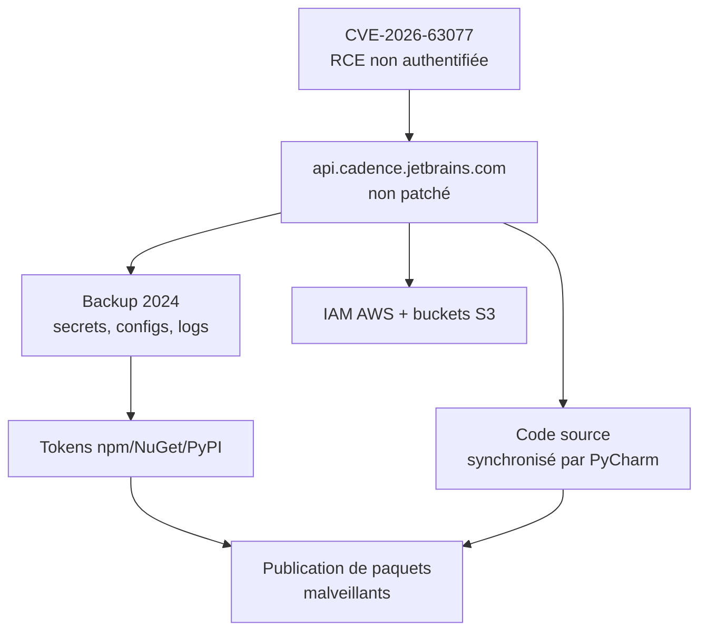
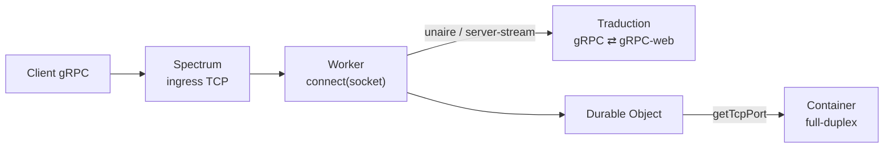
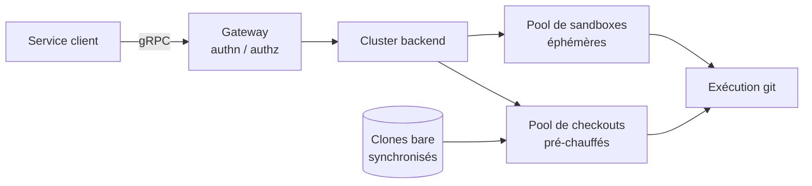

# Tech — Détail du dimanche 30 août 2026

## 1. JetBrains Cadence — le serveur TeamCity que JetBrains a oublié de patcher

**Source :** The New Stack — https://thenewstack.io/jetbrains-told-everyone-to-patch-it-didnt-patch-itself/
**Date :** 28 août 2026

### Contexte

Le 27 juillet, JetBrains divulgue **CVE-2026-63077**, une vulnérabilité critique de TeamCity On-Premises. Un attaquant **non authentifié** disposant d'un accès HTTP ou HTTPS à un serveur vulnérable peut exécuter des commandes du système d'exploitation avec les privilèges du process TeamCity. Le 7 août, l'éditeur annonce que des serveurs non patchés sont **déjà exploités** dans la nature.

Un serveur est resté vulnérable : celui de JetBrains. `api.cadence.jetbrains.com` est le backend de **Cadence**, le service de calcul cloud de JetBrains intégré à PyCharm via un plugin optionnel. TeamCity y orchestrait les charges de travail. Formulation de JetBrains dans sa propre divulgation : « The server should have been patched as part of our response to the vulnerability, but it was not. »

L'activité malveillante commence le **8 août**, soit le lendemain de l'annonce d'exploitation active. JetBrains la détecte le **23 août** et retire le serveur le **24**. Seize jours de fenêtre.

### Comment ça marche

Ce qui rend l'incident instructif, ce n'est pas la faille — c'est la **position** du serveur compromis dans la chaîne. Un système de CI/CD ou d'exécution distante a, par construction, accès aux dépôts privés, aux dépendances, au stockage cloud, aux registres de paquets et aux systèmes de déploiement. Compromettre ce point unique donne accès à tout ce qui transite.

Le déroulé constaté : les attaquants ont récupéré une **sauvegarde complète du serveur Cadence datant de 2024** — soit potentiellement tout ce qu'elle contenait : identifiants, fichiers de configuration, artefacts et logs. Plusieurs **utilisateurs IAM AWS** et leurs identifiants ont été compromis, y compris des IAM appartenant à des employés JetBrains ayant utilisé Cadence. Des fichiers ont été lus dans des buckets S3 des comptes AWS de JetBrains ; l'éditeur dit ne pas encore savoir si les buckets de clients ont été touchés.

Le **code source** est aussi concerné : le plugin PyCharm synchronisait les fichiers de projet vers Cadence avant exécution. Tout secret ou fichier de configuration embarqué dans un projet a donc pu fuiter. S'y ajoutent des noms d'utilisateur, noms réels, adresses e-mail, horodatages de dernière connexion et dernières adresses IP d'accès.

Le point le plus dur à traiter n'est pas la fuite de données. JetBrains demande de considérer les **exécutions passées et leurs sorties** comme **non fiables**. Autrement dit : les artefacts produits par Cadence pendant la fenêtre ont pu être altérés. Une fois l'environnement d'exécution compromis, ni les identifiants qui y ont transité ni les artefacts qu'il a produits ne peuvent être présumés sains.



### En pratique — exemple de code

La rotation ne suffit pas : il faut chercher les traces d'utilisation. Voici l'ordre utile, du plus urgent au plus lent.

```bash
# 1. Révoquer d'abord ce qui permet de publier (le vecteur de propagation le plus grave)
npm token revoke <id>            # puis regénérer, et vérifier les versions publiées
dotnet nuget delete <pkg> <ver> --source https://api.nuget.org/v3/index.json
aws iam list-access-keys --user-name <user>
aws iam delete-access-key --user-name <user> --access-key-id <AKIA...>

# 2. Chercher l'usage des identifiants depuis des origines inconnues (fenêtre 8 -> 24 août)
aws cloudtrail lookup-events \
  --start-time 2026-08-08T00:00:00Z --end-time 2026-08-25T00:00:00Z \
  --lookup-attributes AttributeKey=EventName,AttributeValue=CreateAccessKey
```

Côté source control, l'audit porte sur les clonages inattendus, les commits non autorisés et les modifications de secrets ou de webhooks :

```bash
# Tokens et clés créés ou modifiés pendant la fenêtre, sur l'organisation
gh api /orgs/<org>/audit-log \
  --field phrase='action:protected_branch OR action:repo.add_member OR action:oauth_access.create created:2026-08-08..2026-08-25' \
  --jq '.[] | {action, actor, repo, created_at}'
```

### Pourquoi ça compte pour toi

Si tu as utilisé Cadence, considère comme compromis tout secret stocké dedans, présent dans la sauvegarde ou utilisé pendant une exécution : identifiants AWS, Azure, GCP, tokens GitHub, GitLab, Bitbucket, npm, Maven, NuGet, PyPI, Docker Hub, ECR, ACR, tokens Slack, webhooks, clés SSH et de déploiement, clés de signature. Commence par ce qui permet de **publier** : un attaquant qui pousse un paquet empoisonne tous tes consommateurs en aval.

### Points de vigilance

JetBrains a publié six adresses IP associées à l'exploitation — `150.109.230.104`, `43.153.227.206`, `62.210.127.48`, `210.247.242.190`, `15.235.225.205`, `152.233.30.18` — en précisant explicitement que ces indicateurs **ne sont pas exhaustifs**. Ne pas les voir dans tes logs ne prouve rien. Le seul enseignement transposable est structurel : la liste des serveurs à patcher lors d'une réponse à incident doit être générée depuis l'inventaire, pas depuis la mémoire de l'équipe.

---

## 2. Cloudflare Workers — `connect(socket)`, du TCP entrant après huit ans de HTTP seul

**Source :** InfoQ — https://www.infoq.com/news/2026/08/workers-inbound-tcp-grpc/
**Date :** 29 août 2026

### Contexte

Depuis le lancement de la plateforme en 2017, un Cloudflare Worker pouvait ouvrir des **sockets sortantes** vers une base ou un service, mais ne pouvait jouer le rôle de **serveur** que pour HTTP. Huit ans de contrainte qui excluaient des catégories entières de charge de travail : brokers de messages, proxies de base de données, protocoles binaires maison, tout ce qui attend une socket.

Un nouveau handler `connect(socket)` lève la restriction. L'annonce est arrivée pendant l'Agents Week, cadrée autour de la voix — faible latence et connexion bidirectionnelle persistante entre client et modèle. La primitive dessous est plus large que ce cadrage.

### Comment ça marche

Trois choses ont été livrées ensemble, et elles n'ont pas les mêmes plafonds.

**Le handler `connect(socket)`** accepte une socket entrante brute, routée jusqu'au Worker par **Spectrum**, le proxy d'ingress existant de Cloudflare pour le trafic non-HTTP. Le Worker peut lire et écrire directement sur la socket, la passer à un autre Worker, ou la transmettre à un **Durable Object**. Depuis un Durable Object, la socket peut atteindre un **Container** via `getTcpPort()`. C'est là que le chemin full-duplex se termine : les exemples de Cloudflare incluent un serveur d'écho gRPC en Go et un `socketserver` Python, tous deux **non modifiés**.

**Les Workers eux-mêmes reçoivent moins.** Ils peuvent servir du gRPC **unaire** et **server-streaming**, et appeler des serveurs gRPC externes, sans conteneur — mais **pas de streaming bidirectionnel**. Le mécanisme est une **traduction**, pas un support natif : ton code utilise gRPC-web, et Cloudflare convertit le gRPC entrant en gRPC-web, puis le gRPC-web sortant en gRPC.

La raison est une contrainte de plateforme que le billet assume. **HTTP/2 découpe les requêtes en frames porteuses d'identifiants de flux**, et gRPC dépend de ce contrôle au niveau du flux pour le streaming, l'annulation, le contrôle de flux et les trailers. Les APIs plateforme web comme `fetch()` n'exposent pas ce niveau. Les navigateurs ont exactement le même problème — c'est la raison d'être de gRPC-web. Cloudflare convertit d'ailleurs le gRPC en HTTP/1.1 dans son reverse proxy depuis 2020, pour que ses règles WAF et son Bot Management puissent inspecter les messages.



### En pratique — exemple de code

Le handler tient en quelques lignes. Il reçoit une socket, pas une `Request` :

```typescript
export default {
  // Nouveau handler : appelé pour chaque connexion TCP entrante routée par Spectrum.
  async connect(socket): Promise<void> {
    const writer = socket.writable.getWriter();
    await writer.write(new TextEncoder().encode("Hello, world!\n"));
    await writer.close();
  },
} satisfies ExportedHandler;
```

Côté gRPC, le serveur se monte avec `@connectrpc/connect` en quelques lignes, et les clients existants n'ont **rien à changer** : une app mobile sous `grpc-swift-2` ou `grpc-kotlin` parle au Worker comme à n'importe quel backend gRPC.

### Pourquoi ça compte pour toi

Si tu exposes déjà du gRPC depuis .NET, tu peux désormais poser un Worker devant, comme tu poserais un API gateway devant une API REST — avec la logique de routage en JavaScript, avant que la connexion n'atteigne ton backend. Le Worker voit la connexion avant de décider où elle va. Ce qu'il peut en faire en matière d'inspection ou de politique n'est en revanche pas documenté dans l'annonce.

### Limites

Tout est en **bêta privée derrière un formulaire**, alors que la communication sociale de Cloudflare annonçait « now available » et du gRPC servi nativement « sans couche de traduction ». C'est plus étroit que ça. Le passage le plus honnête du billet est l'explication du choix : Cloudflare **n'utilise pas gRPC en interne** — la maison tourne sur Cap'n Proto, Cap'n Web et le système RPC natif des Workers — et ne veut pas généraliser une techno qu'elle n'exploite pas elle-même. Une question reste ouverte, posée publiquement par Sebastian Buzdugan et sans réponse : les Workers exposent-ils assez de contrôle de **backpressure** pour les flux gRPC ? C'est précisément sur ces cas limites que se juge une implémentation de streaming. Les protocoles UDP sont annoncés comme la prochaine étape.

---

## 3. Uber GitFarm — Git comme service gRPC, checkout complet en moins de 500 ms

**Source :** InfoQ — https://www.infoq.com/news/2026/08/uber-gitfarm-git-as-a-service/
**Date :** 28 août 2026

### Contexte

Les systèmes d'automatisation d'Uber invoquent Git **des millions de fois par jour**, à travers des monorepos couvrant Go, Java, Python, Web, Android et iOS. Chaque service maintenait jusqu'ici son propre checkout complet — pour lire un fichier, valider un changement ou calculer une merge-base.

L'ordre de grandeur explique le problème. Cloner le monorepo Go d'Uber prend environ **15 minutes**, mobilise **6 cœurs CPU**, **32 Go de mémoire** et plus de **40 Go de disque**. Multiplié par des dizaines de services et des milliers d'hôtes, le clonage local et la resynchronisation permanente deviennent le goulot d'étranglement de l'infrastructure — pas Git lui-même, mais sa distribution.

### Comment ça marche

**GitFarm n'est pas un système de gestion de source.** C'est un **client Git centralisé** qui exécute des commandes Git standard pour le compte d'autres services, exposé via une API **gRPC** haute performance. Une Gateway authentifie et autorise les requêtes, puis les route vers des clusters backend où les commandes s'exécutent dans des **sandboxes éphémères isolées**.

Le levier de performance tient en deux pools. Le backend maintient des **clones bare** synchronisés avec les dépôts amont par des mises à jour push et des fetch périodiques. Il maintient aussi des **pools de checkouts** et de **conteneurs sandbox** pré-chauffés. Quand une requête arrive, GitFarm **monte un checkout déjà prêt** dans une sandbox disponible, au lieu de créer un clone et un environnement d'exécution depuis zéro. Le surcoût pour fournir un checkout utilisable tombe sous la seconde — moins de 500 ms selon Uber.

Le troisième élément est le **streaming gRPC bidirectionnel**. Une session permet d'enchaîner plusieurs commandes contre le **même** checkout : récupérer une branche, calculer une merge-base, pousser une référence dérivée — sans réinitialiser l'état du dépôt entre chaque appel. Les clients qui ont besoin de l'état amont le plus frais lancent explicitement un `git fetch` ; ceux qui tolèrent une fraîcheur bornée s'appuient sur l'état déjà synchronisé du backend.



### En pratique — exemple de code

L'interface est un contrat gRPC. Le pattern important est la **session bidirectionnelle**, qui remplace N appels indépendants par une suite de commandes sur un checkout stable :

```protobuf
service GitFarm {
  // Une session : plusieurs commandes contre le MÊME checkout, sans réinit.
  rpc Session(stream GitCommand) returns (stream GitResult);
}

message GitCommand {
  string repo   = 1;   // ex. "uber/go-monorepo"
  repeated string args = 2;   // ex. ["merge-base", "HEAD", "origin/main"]
  bool fetch_first = 3;       // false -> accepte l'état synchronisé du backend
}
```

Côté appelant, l'enchaînement remplace un clone de 15 minutes par trois messages :

```python
with client.Session() as s:                      # checkout pré-chauffé monté en <500 ms
    s.send(repo=REPO, args=["fetch", "origin", BRANCH], fetch_first=True)
    base = s.send(repo=REPO, args=["merge-base", "HEAD", "origin/main"]).stdout
    s.send(repo=REPO, args=["push", "origin", f"HEAD:refs/heads/{DERIVED}"])
```

### Pourquoi ça compte pour toi

Le pattern est transposable bien en dessous de l'échelle d'Uber. Si ta CI ou tes outils internes clonent le même dépôt encore et encore pour lire trois fichiers ou calculer une merge-base, tu paies un clone complet pour une opération en lecture. Un service central avec des checkouts pré-chauffés déplace ce coût une fois pour toutes. Le gain mesuré côté client dépasse **80 %** de réduction de consommation de ressources.

### Pour aller plus loin

Les chiffres de production sont parlants. Un service de code ownership a supprimé les checkouts locaux sur six hôtes : consommation CPU de **plus de 70 cœurs à 16**, mémoire de **400 à 32 Go**, temps de démarrage de **15-20 minutes à moins d'une minute**. Un service d'audit de conformité traitant 10 000 à 20 000 événements par heure sur 9 000 dépôts a vu sa latence médiane passer de **110-160 s avec Buildkite à 20-30 s** avec GitFarm, en supprimant l'ordonnancement, l'initialisation du workspace et la synchronisation du dépôt. L'architecture vise aussi les charges agentiques : les agents de code cherchent, branchent, diffent, expérimentent, réessaient et valident — de façon concurrente, ce qui multiplie mécaniquement la charge sur l'infrastructure Git. GitFarm est en production depuis début 2025 ; la roadmap inclut le streaming de la sortie Git, les sparse checkouts, les workspaces bare, les sessions à durée de vie longue et le mirroring de dépôts. Papier : `arXiv:2604.11977`.
