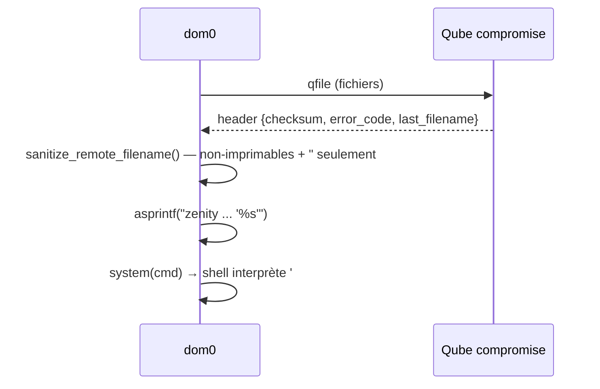
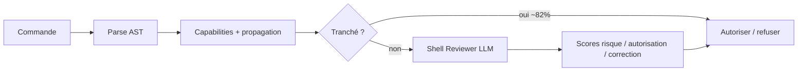
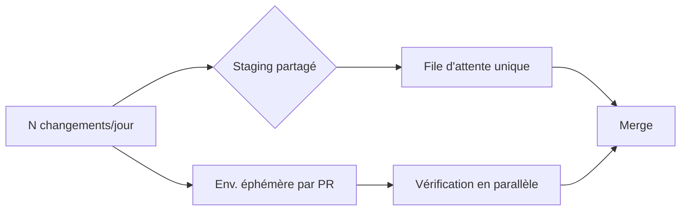

# Tech — Détail du lundi 31 août 2026

## 1. Qubes OS QSB-118 — un nom de fichier renvoyé par une qube compromise exécute du code dans dom0

**Source :** Qubes OS — https://www.qubes-os.org/news/2026/08/29/qsb-118/
**Date :** 28 août 2026 (bulletin), publié le 29 août

### Contexte

Qubes OS cloisonne tout dans des machines virtuelles Xen appelées « qubes ». Au sommet, `dom0` est le domaine administratif : pas de réseau, pas de navigateur, il pilote l'hyperviseur et l'affichage. Tout le modèle de sécurité repose sur une règle simple. Une qube compromise doit rester enfermée dans sa VM.

L'outil `qvm-copy-to-vm` copie un fichier depuis dom0 vers une qube. Il utilise le protocole « qfile », un format d'archive volontairement plus simple que `tar` ou `cpio`. À la fin du transfert, la **cible renvoie une confirmation** à la source : un checksum, un code d'erreur, et le nom du dernier fichier reçu. Ce canal de retour est le point faible. Il transporte une chaîne contrôlée par la qube destinataire vers dom0.

### Comment ça marche

Le bug est un enchaînement de trois décisions raisonnables prises séparément.

**Étape 1 — l'assainissement.** `wait_for_result()` passe le nom reçu à `sanitize_remote_filename()`. Cette fonction remplace par `_` tout octet inférieur à l'espace, supérieur à `~`, ou égal au guillemet double. Autrement dit : elle nettoie le **non-imprimable** et un seul caractère de citation.

**Étape 2 — le rapport d'erreur.** Si le code d'erreur est non nul, `call_error_handler()` remonte vers `gui_fatal()` puis `display_error()`, la variante dom0.

**Étape 3 — l'exécution.** `display_error()` construit une ligne de commande `zenity` ou `kdialog` avec `asprintf`, en insérant le message **entre apostrophes simples**, puis appelle `system()`.

C'est là que tout casse. Le filtre laisse passer l'apostrophe simple `'`, le point-virgule, le pipe, l'esperluette, le dollar et l'accent grave. Une apostrophe bien placée referme la chaîne citée, et le shell interprète la suite comme une nouvelle commande. Résultat : exécution arbitraire dans dom0, c'est-à-dire prise de contrôle complète de la machine.

Détail instructif : la **variante VM du même outil n'est pas vulnérable**. Son `gui_fatal()` fait un `fork()` puis `execlp("/usr/bin/zenity", …)`. Pas de shell dans la boucle, donc pas de méta-caractère à interpréter. Le même bug logique existe des deux côtés ; seul le mode d'exécution diffère.



### En pratique — exemple de code

Le premier bloc montre le mécanisme, le second la correction structurelle : ne jamais reconstruire une ligne de commande à partir d'une donnée distante.

```c
/* Avant — dom0 : la chaîne distante finit dans un shell */
sanitize_remote_filename(last_filename);   /* laisse passer ' ; $ ` | & */
asprintf(&cmd, "zenity --warning --text '%s: %s'", prog, buf);
system(cmd);                               /* le shell coupe sur ' et ; */

/* Après — modèle déjà utilisé côté VM : exec direct, sans shell */
if (fork() == 0) {
    execlp("/usr/bin/zenity", "zenity", "--warning", "--text", msg, NULL);
    _exit(1);                              /* msg est un argv[], pas du code */
}
```

La même règle se transpose telle quelle à ton stack. En .NET, `ProcessStartInfo.ArgumentList` passe les arguments en tableau ; `Arguments` (chaîne unique) réintroduit le problème.

```csharp
// Avant — interpolation dans une chaîne de commande : injectable
var psi = new ProcessStartInfo("sh", $"-c \"convert '{fileName}' out.png\"");

// Après — argv explicite, aucun shell, aucun échappement à écrire
var psi = new ProcessStartInfo("convert");
psi.ArgumentList.Add(fileName);   // même un nom avec ' ; $ reste une donnée
psi.ArgumentList.Add("out.png");
```

### Pourquoi ça compte pour toi

Tu as sûrement du code qui interpole un nom de fichier, un identifiant client ou un message d'erreur distant dans une commande. La leçon n'est pas « mieux filtrer » : la liste noire de QSB-118 était déjà écrite, et elle a échoué. La leçon est **de retirer le shell du chemin**. `ArgumentList` en .NET, `Process` avec tableau en Symfony, `execve` en C. Un assainissement qui protège un `system()` reste un assainissement à un caractère près de l'échec.

### Points de vigilance

Le correctif est `qubes-core-dom0-linux` 4.3.22, d'abord en `security-testing` puis en stable. Toutes les versions de Qubes OS sont affectées. L'exploitation exige que **tu** lances la copie vers une qube déjà compromise — la faille ne se déclenche pas seule.

---

## 2. LM Studio Bionic — juger une commande shell sur son AST plutôt que sur sa chaîne

**Source :** The New Stack — https://thenewstack.io/bionic-shell-command-safety/
**Date :** 28 août 2026

### Contexte

Un agent de code qui exécute des commandes pose une question simple à formuler et difficile à trancher : cette commande est-elle sûre ? L'approche naïve cherche des motifs dangereux dans la chaîne — `rm -rf`, `curl | sh`, `sudo`. Elle échoue dès qu'une variable entre en jeu.

L'exemple de LM Studio est parfait de banalité. `git diff $base` est inoffensif si `$base` contient un hash de commit. Si `$base` vaut `--output=/some/file`, la même commande **écrit sur le disque**. Rien dans la chaîne littérale ne le laisse deviner. LM Studio a publié le 27 août le fonctionnement d'**Auto Review**, la couche de contrôle de son agent Bionic ([détail technique](https://lmstudio.ai/blog/how-auto-review-works)).

### Comment ça marche

Auto Review est un **filtre en deux étages**, déterministe d'abord, probabiliste ensuite.

**Étage 1 — le Shell Judge.** Il ne lit pas une chaîne, il construit un **arbre syntaxique abstrait**. Le parser `mvdan/sh` couvre Bash, Zsh et SH ; PowerShell fournit son propre AST. À partir de cet arbre, le Judge dérive les « capabilities » de la commande : ce qu'elle peut lire, écrire, ou envoyer sur le réseau.

Le Judge fait en plus de la **propagation de valeurs**. Si l'agent exécute `git merge-base` puis injecte le résultat dans `git diff`, le Judge conserve la valeur produite par la première commande pour évaluer la seconde. Quand plusieurs valeurs sont possibles, il en explore jusqu'à **1 000** avant d'abandonner.

Parser la syntaxe ne suffit pourtant pas. Chaque outil a ses règles d'interprétation d'arguments. `ls -la` regroupe deux drapeaux courts ; `tsc -vh` ne se comporte pas comme `tsc -v -h`. D'où **11 651 cas de test** dédiés aux commandes malformées et aux bizarreries d'outils. Selon LM Studio, cet étage tranche jusqu'à **82 %** des commandes sans appeler de modèle — chiffre présenté comme anecdotique, pas comme un benchmark.

**Étage 2 — le Shell Reviewer.** Ce qui n'est pas tranché part vers un agent LLM qui évalue la commande dans le contexte de la conversation. La première version demandait simplement « faut-il exécuter ? ». Elle échouait de façon prévisible : le modèle **approuvait des actions risquées parce qu'elles semblaient nécessaires** pour satisfaire la demande. Le juge finissait par donner raison à l'accusé.

Le correctif est un changement de format de sortie. Le Reviewer note désormais séparément le **risque**, l'**autorisation** et la **correction**, sans connaître les seuils de passage. Il ne peut plus optimiser sa réponse pour obtenir un « oui ».



### En pratique — exemple de code

Le piège, puis la contre-mesure structurelle : couper l'interprétation d'arguments avec `--`.

```bash
# Piège — $base est une donnée, mais le shell la traite comme un argument
base="--output=/tmp/exfil.txt"
git diff $base            # git écrit un fichier : rien dans la chaîne ne le disait

# Une regex sur la chaîne littérale ne voit rien d'anormal
echo 'git diff $base' | grep -E 'rm -rf|curl|sudo'   # aucun match

# Contre-mesure : forcer la fin des options, et citer
git diff -- "$base"       # $base ne peut plus devenir un drapeau
```

### Pourquoi ça compte pour toi

Si tu laisses un agent toucher ton terminal, ton CI ou ta base, tu as le même problème. Deux idées à voler : **analyse structurelle plutôt que motifs de chaîne**, et **notation multi-critères plutôt que question binaire** posée au modèle. La seconde est la plus transposable : un LLM à qui tu demandes « ok ou pas » apprend vite à répondre ce qui débloque la tâche.

### Limites

Le Reviewer voit les messages de l'assistant, pas les résultats d'outils — l'injection indirecte par page web est donc écartée, mais pas l'injection depuis un agent déjà compromis. Le Judge, lui, suppose que `git` n'a pas été altéré et ignore les configurations malveillantes.

---

## 3. GitHub à 2,9 milliards de commits par mois — la vérification n'a pas suivi

**Source :** The New Stack — https://thenewstack.io/scaling-ai-code-verification/
**Date :** 29 août 2026

### Contexte

Les chiffres publics ont fini par rattraper les benchmarks d'éditeurs. GitHub traite aujourd'hui **2,9 milliards de commits par mois**, contre 1,4 milliard en avril : le volume a **plus que doublé en quatre mois**. S'y ajoutent environ 130 millions de pull requests fusionnées et 24 millions de nouveaux dépôts par mois. GitHub attribue la poussée au code généré par agents.

La croissance a cassé la plateforme. Le 17 août, GitHub est resté indisponible **7 h 47** après qu'un composant central du datacenter Central US n'a pas tenu la charge. La réponse est celle d'un hyperscaler : plus de 3 millions de cœurs CPU supplémentaires, 120 pétaoctets de stockage rapide, et une migration accélérée vers Azure, qui porte désormais 58 % de la charge.

*(Article de contribution sponsorisée sur The New Stack — les chiffres proviennent du post-mortem de GitHub et de la presse ; l'analyse est celle de l'auteur.)*

### Comment ça marche

L'intérêt du papier n'est pas la panne, déjà couverte. C'est la **forme de la courbe**.

Pendant des années, le volume de commits a suivi la population de développeurs, parce qu'un commit traçait une personne. Il a doublé en quatre mois **parce qu'il a cessé de tracer une personne**. Un développeur qui pilote trois sessions d'agent en parallèle produit des commits à un rythme qu'aucun plan de recrutement n'a jamais anticipé.

Le raisonnement se poursuit sur une asymétrie de coûts. Le problème de GitHub est un problème de **capacité** : il se règle avec de l'argent, parce que des cœurs et des disques s'achètent. Le tien est un problème de **confiance**, et il ne répond pas de la même façon.

Un commit n'est pas du trafic. C'est une **affirmation** : « ce changement fait ce que dit sa description et ne casse rien en aval ». Vérifier cette affirmation dans un système distribué exige d'exécuter le changement contre les services, les données et le trafic qu'il rencontrera après merge.

Or la partie du pipeline qui a accéléré n'est pas celle-là. La revue assistée par IA trie les diffs, la CI sait sélectionner et mettre en cache les tests, l'analyse statique attrape plus qu'avant. **Aucune de ces étapes n'exécute le changement.** Le test d'intégration et l'end-to-end passent encore par un environnement de staging partagé ou par une copie complète de la stack. L'un est une file d'attente à un seul poste, l'autre coûte trop cher pour être dupliqué par changement.

D'où la thèse : la génération est passée au rythme machine, avec une courbe exponentielle ; la vérification reste au rythme humain, avec une courbe quasi plate. Les agents ne créent pas le goulot — ils le poussent au-delà du point où les contournements historiques tenaient, et ils l'apportent aux petites équipes. Un débit qui saturait une plateforme de 500 ingénieurs apparaît maintenant dans une équipe de 50.



### En pratique — exemple de code

La parade concrète est l'environnement éphémère par changement. En Compose, l'isolation tient dans un nom de projet dérivé du numéro de PR.

```yaml
# .github/workflows/pr-env.yml — une stack isolée par pull request
name: pr-env
on: [pull_request]
jobs:
  verify:
    runs-on: ubuntu-latest
    env:
      # Nom de projet unique -> réseaux, volumes et conteneurs séparés
      COMPOSE_PROJECT_NAME: pr-${{ github.event.number }}
    steps:
      - uses: actions/checkout@v4
      - name: Démarrer la stack et attendre qu'elle soit saine
        run: docker compose up -d --wait
      - name: Tests d'intégration contre un système réellement lancé
        run: docker compose run --rm tests
      - name: Détruire l'environnement, même en cas d'échec
        if: always()
        run: docker compose down -v
```

### Pourquoi ça compte pour toi

Si ton équipe a adopté les agents, tes files de PR ont déjà changé de forme. Le réflexe naturel — ajouter de la revue — sature le seul poste que tu ne peux pas cloner : le tien. Regarde plutôt où ta vérification est **sérialisée**. Un staging unique est une file d'attente déguisée. Un environnement éphémère par PR, ou du test contre des doublures fidèles, se parallélise. C'est là que ton débit se joue maintenant.
