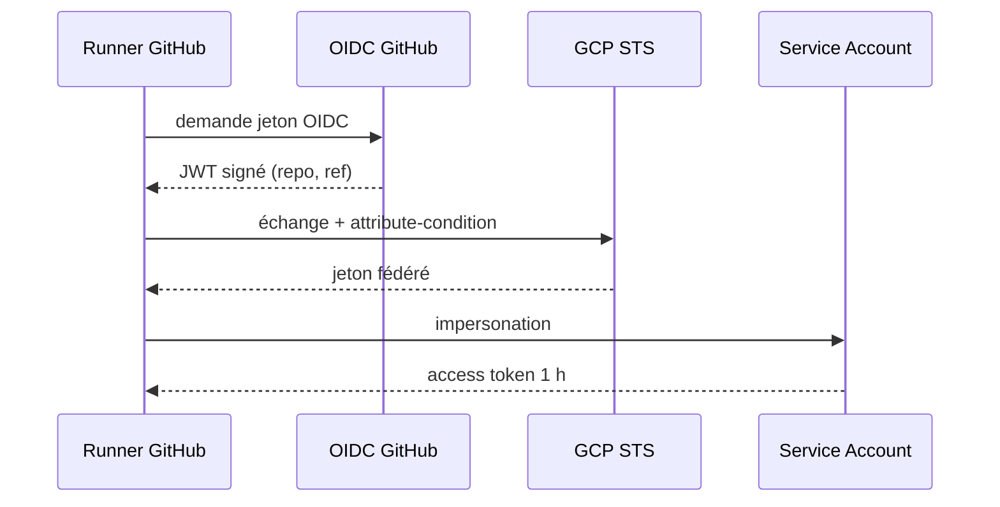
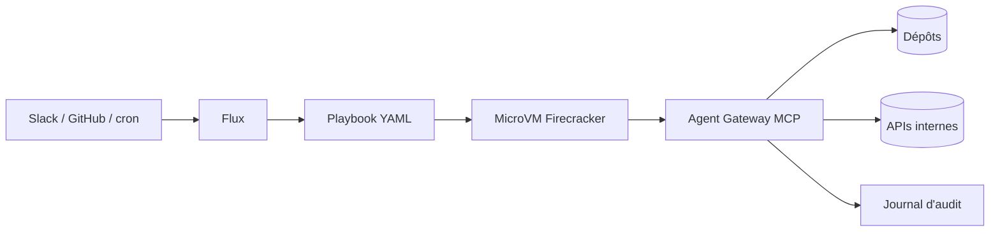

# Tech — Détail du mardi 1er septembre 2026

## 1. Workload Identity Federation sur GCP — remplacer un secret par une relation de confiance

**Source :** InfoQ — https://www.infoq.com/articles/gcp-wif-scale/
**Date :** 31 août 2026

### Contexte

La clé JSON d'un compte de service Google Cloud est le secret le plus banal et le plus dangereux d'une organisation. Elle ne périme pas. Elle se copie en un `cat`. Elle finit dans un secret GitHub, dans un `.env`, dans un ticket, dans un canal Slack. Et surtout : personne ne sait dire lesquelles sont encore utilisées, donc personne n'ose les faire tourner.

Le retour d'expérience publié couvre le passage à la Workload Identity Federation (WIF) sur plus de 120 projets de production. Son intérêt n'est pas la recette — elle est documentée — mais le recadrage : une clé est **un secret que tu gères pour toujours** ; une fédération est **une relation de confiance que tu configures une fois**. Ce n'est pas la même catégorie de travail.

### Comment ça marche

WIF repose sur un échange de jetons en quatre temps. Aucun secret ne se déplace.

**1. Le workload prouve son identité à son propre fournisseur.** Un runner GitHub Actions demande à GitHub un jeton OIDC signé. Ce jeton contient des claims vérifiables : le dépôt, la branche, l'environnement, l'acteur. Il vit quelques minutes.

**2. GCP vérifie la signature.** Tu as déclaré un *workload identity pool* et, dedans, un *provider* qui connaît l'émetteur (`https://token.actions.githubusercontent.com`) et sa clé publique. GCP valide donc le jeton sans jamais avoir partagé de secret avec GitHub.

**3. Le mapping et la condition d'attribut.** C'est l'étape qui fait tout le travail de sécurité. Tu mappes les claims du jeton vers des attributs GCP (`google.subject`, `attribute.repository`, `attribute.ref`), puis tu poses une `attribute-condition` qui rejette tout ce qui ne correspond pas. Sans cette condition, **n'importe quel dépôt GitHub public** peut présenter un jeton valide à ton pool. C'est l'erreur de configuration classique, et elle est totale.

**4. L'échange.** Le jeton fédéré est échangé contre un jeton d'accès de courte durée pour le compte de service ciblé, via l'usurpation d'identité. Le workload obtient ses permissions pour une heure au maximum.



### En pratique — exemple de code

La condition d'attribut est la ligne à ne pas rater.

```bash
# Le provider n'accepte QUE les jetons émis pour ton organisation et ton dépôt.
# Sans --attribute-condition, tout dépôt GitHub peut s'authentifier : faille totale.
gcloud iam workload-identity-pools providers create-oidc github \
  --location=global --workload-identity-pool=ci-pool \
  --issuer-uri="https://token.actions.githubusercontent.com" \
  --attribute-mapping="google.subject=assertion.sub,attribute.repository=assertion.repository" \
  --attribute-condition="assertion.repository == 'mon-org/mon-repo'"
```

```yaml
# .github/workflows/deploy.yml — plus aucune clé JSON dans les secrets du dépôt
permissions:
  id-token: write        # indispensable : autorise le runner à demander un jeton OIDC
  contents: read
steps:
  - uses: google-github-actions/auth@v2
    with:
      workload_identity_provider: projects/123/locations/global/workloadIdentityPools/ci-pool/providers/github
      service_account: deployer@mon-projet.iam.gserviceaccount.com
      # Aucun credentials_json : le jeton OIDC du runner suffit.
```

### Pourquoi ça compte pour toi

Si ton CI/CD pousse vers un cloud avec une clé stockée en secret de dépôt, tu as un secret que tu ne peux ni auditer ni faire tourner sereinement. La bascule vers OIDC te fait passer d'un inventaire de secrets à une politique déclarative. Applique le même raisonnement à Azure et AWS : les trois exposent aujourd'hui la fédération OIDC depuis GitHub Actions. Et écris la condition d'attribut **avant** de tester le pipeline.

### Points de vigilance

Une `attribute-condition` absente ou trop large ouvre ton projet à Internet. Vérifie-la explicitement après création, et restreins aussi sur `attribute.ref` si le déploiement ne doit partir que d'une branche protégée.

---

## 2. DoorDash Flux — 130 000 tâches d'agents, sorties des portables et mises en microVM

**Source :** InfoQ — https://www.infoq.com/news/2026/08/doordash-flux-cloud-agent/
**Date :** 31 août 2026

### Contexte

Le mode d'emploi par défaut d'un agent de code, c'est le portable du développeur. Ça marche pour une tâche à la fois, tant que la machine reste allumée et que personne ne regarde de trop près ce à quoi l'agent accède.

DoorDash a listé les limites qui l'ont poussé à changer, et elles ne sont pas toutes techniques. Le CPU et la mémoire locaux plafonnent. L'exécution dépend de la connexion et de l'état de la machine. Surtout : **un agent autonome hérite de tous les identifiants et de tous les accès internes déjà présents sur le poste**, et rien ne trace où il tourne, ce qu'il touche, ni pour le compte de qui. C'est un problème de gouvernance avant d'être un problème de puissance.

Flux est la plateforme qui en résulte. Les chiffres : 130 000 tâches automatisées en un mois, plus de 25 000 revues de code par semaine, plus de 300 playbooks, plus de 10 000 invocations hebdomadaires.

### Comment ça marche

L'architecture tient en quatre primitives, et leur séparation est le vrai enseignement.

**Les playbooks** décrivent le travail, en YAML : la tâche, les outils requis, les permissions, la validation, les limites de sécurité. Point important — ils **mélangent des étapes pilotées par l'agent et du code déterministe**, là où l'exécution doit être prévisible ou vérifiable. L'agent n'est pas au volant en permanence.

**Les sandboxes** fournissent l'isolation. Ce sont des microVM Firecracker, provisionnées avec les dépôts, l'outillage, les secrets et les dépendances nécessaires à la tâche. DoorDash annonce un SLO p95 sous les 5 secondes pour tout le chemin : démarrage de la microVM, clonage des dépôts, installation des outils de build, configuration du harnais de l'agent. C'est ce chiffre qui rend l'approche utilisable — au-delà, les développeurs retournent sur leur portable.

**Agent Gateway**, la passerelle MCP maison, contrôle l'accès aux systèmes internes : permissions restreintes par tâche et journalisation de toute l'activité pour l'audit et l'application de politiques. L'agent ne parle plus directement aux API internes.

**Les surfaces d'invocation** déclenchent le travail depuis Slack, GitHub, un cron, la ligne de commande ou une interface conversationnelle.

Détail humain qui vaut le détour : DoorDash a déplacé son intégration Slack de canaux privés vers des fils publics, pour que chacun voie tourner les agents des autres. L'observabilité sociale a fait plus pour l'adoption que la documentation.



### En pratique — exemple de code

Un playbook qui borne explicitement ce que l'agent peut faire, et qui garde la validation en code déterministe.

```yaml
# playbooks/triage-ci.yaml — la permission est déclarée, pas héritée du poste
name: triage-ci
trigger: { on: workflow_failure, repos: [billing-api] }

sandbox:
  image: build-dotnet-9
  repos: [billing-api]
  timeout: 15m

permissions:                 # portée minimale : l'agent ne voit rien d'autre
  - github:read:billing-api
  - ci:read:logs
  # aucun droit d'écriture : le playbook propose, un humain dispose

steps:
  - agent: "Analyse les logs du job en échec et identifie le test responsable."
  - run: dotnet test --filter "FullyQualifiedName~$TEST"   # déterministe, vérifiable
  - agent: "Rédige un commentaire de PR expliquant la cause racine."
```

### Pourquoi ça compte pour toi

La question n'est plus quel modèle tu utilises, mais quelle autorité tu lui délègues. Si tu fais tourner des agents sur ton poste, ils héritent de tes tokens Git, de tes accès base et de tes secrets — sans journal. Deux gestes utiles tout de suite : exécuter les agents dans un conteneur avec des identifiants dédiés et à portée réduite, et faire passer leurs accès par une couche unique que tu peux journaliser.

### Limites

Firecracker et une passerelle MCP maison, ce n'est pas un chantier d'équipe produit. Retiens le principe — identité propre, permissions déclarées, journal centralisé, coupe-circuit — plutôt que l'implémentation.

---

## 3. Amazon ECS Express Mode — un appel d'API, un service HTTPS de production

**Source :** The New Stack — https://thenewstack.io/amazon-ecs-express-mode/
**Date :** 29 août 2026

### Contexte

Le contrat des conteneurs était : ça tourne chez moi, ça tournera en production. Il tient. Ce qui ne tient pas, c'est tout ce qu'il faut installer *autour* — équilibreur de charge, certificat TLS, politiques de scaling, réseau, rôles IAM au périmètre minimal, configuration de sécurité. Entre le troisième module Terraform et la deuxième revue de politique IAM, la vitesse promise a disparu.

ECS Express Mode est une nouvelle interface sur le même moteur ECS. Tu fournis une image de conteneur et deux rôles IAM ; tu obtiens un service HTTPS sur Fargate avec load balancer, certificat TLS, autoscaling et déploiements canary. Le point qui le distingue d'un PaaS : **tout est créé dans ton compte**, adressable par ARN.

### Comment ça marche

Quatre décisions de conception font l'essentiel du travail.

**La mutualisation du load balancer.** Chaque service est derrière un Application Load Balancer, mais n'en possède pas un. **Jusqu'à 25 services Express partagent un même ALB dans un VPC.** Express en ajoute quand c'est nécessaire, et les supprime avec les services. C'est la réponse directe au problème d'ALB orphelins qui coûtent tous les mois sans que personne ne sache pourquoi.

**Le déploiement canary par défaut.** Chaque déploiement route **5 % du trafic** vers la nouvelle révision et la laisse « cuire » **3 minutes**. Passé ce délai, le reste du trafic bascule. Une alarme créée pour toi déclenche un **rollback automatique si le taux d'erreurs 4xx/5xx dépasse 1 %**. Tu n'as rien à câbler : c'est le comportement de base, pas une option à activer.

**Le scaling.** Une politique d'autoscaling cible **60 % d'utilisation CPU**, de 1 à 20 tâches par défaut. Tu peux basculer sur la mémoire ou le nombre de requêtes.

**Le cycle de vie complet.** Express possède ce qu'il crée, donc il sait le détruire : supprime le service, et les target groups, politiques de scaling et alarmes partent avec. Comme tu n'as pas câblé ces ressources à la main, le déploiement d'un service ne peut pas toucher celles d'un autre.

L'extensibilité passe par la définition de tâche ECS standard : tu apportes ton sidecar OpenTelemetry, ton image durcie et tes secrets, et tu rends l'ARN. La configuration grandit avec tes besoins, pas la charge d'exploitation.

### En pratique — exemple de code

Le cas simple, puis le cas réel avec sidecar.

```hcl
# Avant — la version longue : aws_lb, aws_lb_target_group, aws_lb_listener,
# aws_appautoscaling_target, aws_appautoscaling_policy, aws_security_group,
# aws_acm_certificate, aws_ecs_service... soit ~150 lignes et 3 revues IAM.

# Après — Express Mode : une ressource, deux rôles, un service HTTPS complet.
resource "aws_ecs_express_gateway_service" "frontend" {
  execution_role_arn      = aws_iam_role.execution.arn       # tire l'image, écrit les logs
  infrastructure_role_arn = aws_iam_role.infrastructure.arn  # crée ALB, alarmes, scaling

  primary_container {
    image = "111122223333.dkr.ecr.eu-west-1.amazonaws.com/mon-api:1.4.2"
  }
}
# Fourni d'office : TLS, canary 5 % / 3 min, rollback si erreurs > 1 %, scaling 60 % CPU.
```

Pour un sidecar, tu déclares une `FargateTaskDefinition` classique et tu passes son ARN via `taskDefinitionArn` : la spec est celle que tu écris déjà si tu fais de l'ECS.

### Pourquoi ça compte pour toi

Le canary et le rollback automatique sont ce que tu remets à plus tard sur un service interne — et c'est précisément là qu'une régression passe inaperçue. Ici, tu les obtiens sans les écrire. Regarde aussi la mutualisation d'ALB : si tu déploies une dizaine de petits services .NET, tu paies probablement une dizaine d'équilibreurs pour rien.

### Points de vigilance

Le seuil de 25 services par ALB est une limite d'architecture à connaître avant de mailler tout un domaine. Et un canary de 3 minutes ne détecte que ce qui casse vite : une fuite mémoire ou une dérive de latence sortira bien après le basculement.
