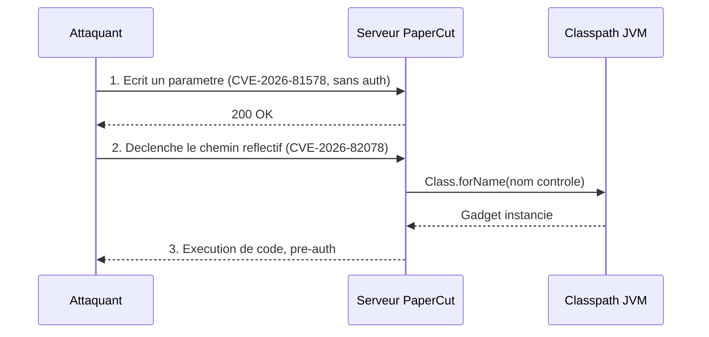
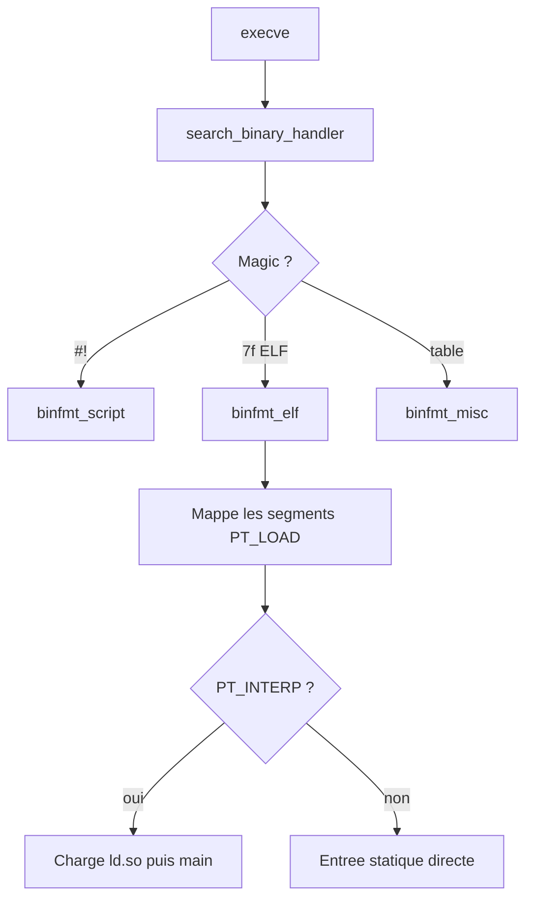

# Tech — Détail du mercredi 2 septembre 2026

## 1. PaperCut NG/MF — CVE-2026-81578 et CVE-2026-82078 : la reflection non contrôlée comme moteur de RCE

**Source :** CISA — https://www.cisa.gov/news-events/alerts/2026/08/31/cisa-adds-two-known-exploited-vulnerabilities-catalog
**Date :** 31 août 2026 (divulgation initiale le 27 août 2026)

### Contexte

PaperCut NG et PaperCut MF gèrent l'impression dans un très grand nombre d'universités, d'hôpitaux et de collectivités. Le serveur d'application est écrit en Java et vit typiquement sur le réseau interne, avec une interface d'administration web. C'est exactement le profil de cible qui échappe aux inventaires : critique en pratique, invisible dans les revues d'architecture.

Le 27 août, deux vulnérabilités sont divulguées, déjà exploitées avant l'existence d'un correctif. Les chercheurs de Huntress ont observé l'exploitation dans deux environnements clients, puis reproduit l'intégralité de la chaîne d'attaque depuis zéro sur une installation propre et non patchée. Le 31 août, la CISA a inscrit les deux CVE à son catalogue des vulnérabilités activement exploitées.

Prises séparément, elles semblent modérées. Chaînées, elles donnent une exécution de code à distance **avant toute authentification**.

### Comment ça marche

**CVE-2026-81578 — authentification manquante (CVSS 8,8).** Une fonction critique du serveur ne vérifie pas l'identité de l'appelant. Un attaquant distant, sans identifiants valides, peut modifier certains paramètres de configuration du système. Prise isolément, cette faille ne donne pas de code. Elle donne de l'**écriture dans un état de confiance**.

**CVE-2026-82078 — unsafe reflection, CWE-470 (CVSS 9,4).** C'est le cœur du sujet. La réflexion est le mécanisme par lequel un programme Java charge une classe à partir de son **nom, sous forme de chaîne de caractères**, puis l'instancie ou invoque ses méthodes. C'est indispensable pour l'injection de dépendances, la sérialisation et les systèmes de plugins. Cela devient une faille dès que cette chaîne provient, directement ou indirectement, de l'extérieur.

Déroulons le mécanisme.

1. Le code appelle quelque chose comme `Class.forName(nomDeClasse)`, où `nomDeClasse` vient d'un paramètre de configuration.
2. La JVM cherche cette classe **sur le classpath de l'application**.
3. Elle l'instancie, puis un constructeur ou une méthode s'exécute.

Le point crucial est le suivant : **l'attaquant n'a pas besoin d'uploader du code**. Une application Java d'entreprise embarque des centaines de dépendances. Parmi elles se trouvent forcément des classes dont la simple instanciation a un effet de bord utile : moteurs de script, chargeurs de ressources distantes, fabriques de sources de données, exécuteurs de tâches. Ce sont des *gadgets*. La réflexion non contrôlée transforme le classpath en catalogue d'armes.

La chaîne devient alors mécanique. L'attaquant utilise **CVE-2026-81578** pour écrire, sans authentification, un nom de classe attaquant dans la configuration. Puis il déclenche le chemin de code vulnérable à **CVE-2026-82078**, qui charge et invoque cette classe. Résultat : exécution de bytecode arbitraire déjà présent, en pré-authentification, dans le contexte du serveur d'application.



### En pratique — exemple de code

Le motif fautif, puis sa correction. Le principe vaut pour toute la famille CWE-470.

```java
// AVANT — le nom de classe vient de la configuration, elle-même modifiable.
// Toute classe du classpath devient atteignable.
String nom = config.get("handler.class");
Object handler = Class.forName(nom).getDeclaredConstructor().newInstance();
((Handler) handler).execute(payload);   // le cast arrive TROP TARD

// APRÈS — allowlist explicite : on ne résout jamais une chaîne arbitraire.
private static final Map<String, Supplier<Handler>> AUTORISES = Map.of(
    "pdf",  PdfHandler::new,
    "post", PostScriptHandler::new
);
Handler handler = AUTORISES.getOrDefault(config.get("handler.kind"), NoopHandler::new).get();
handler.execute(payload);
```

Le même piège existe mot pour mot en .NET, et c'est là que ça te concerne directement.

```csharp
// AVANT — Type.GetType sur une valeur de configuration : identique à Class.forName.
var type = Type.GetType(_config["Pipeline:HandlerType"]);   // chaîne externe
var handler = (IHandler)Activator.CreateInstance(type!)!;   // le cast ne protège rien

// APRÈS — le conteneur DI comme allowlist : les clés sont fermées à la compilation.
// services.AddKeyedSingleton<IHandler, PdfHandler>("pdf");
var cle = _config["Pipeline:HandlerKind"];
var handler = _provider.GetKeyedService<IHandler>(cle) ?? new NoopHandler();
```

### Pourquoi ça compte pour toi

Cherche dans ton code tout `Type.GetType`, `Activator.CreateInstance` ou `Assembly.Load` dont l'argument vient d'une configuration, d'un en-tête HTTP ou d'une colonne en base. Le cast vers ton interface s'exécute après le constructeur : il ne protège de rien. Remplace la résolution par nom par une allowlist ou par des services keyed. Et si tu exploites PaperCut, patche aujourd'hui : la chaîne est publique et exploitée.

### Points de vigilance

Ne compte pas sur le pare-feu interne. Un serveur d'impression est joignable depuis chaque poste du réseau, ce qui en fait un excellent pivot après un phishing. Vérifie aussi tes journaux d'accès sur la période antérieure au correctif : l'exploitation précède la divulgation.

---

## 2. tmp.0ut Volume 5 — comment le noyau Linux charge réellement un exécutable

**Source :** tmp.0ut — https://tmpout.sh/5/
**Date :** 31 août 2026 (relais public et discussion)

### Contexte

tmp.0ut est un zine de recherche binaire, dans la tradition des e-zines underground, art ANSI compris. Le volume 5 rassemble 21 articles signés elfmaster, netspooky, dominikr, febnug et TMZ, sur les internes d'ELF, l'x86-64 et le bas niveau Linux. On y trouve aussi une interview de Doug McIlroy, qui dirigeait le département de recherche informatique des Bell Labs d'où est sorti Unix, et à qui l'on doit le pipe.

Une bonne partie du numéro est ouvertement offensive : construction de virus, évasion, anti-forensique. Ce n'est pas ce qui nous intéresse ici. L'article le plus utile pour un développeur backend est celui qui déroule **comment le noyau charge un fichier exécutable**. C'est de la plomberie que l'on utilise cent fois par jour sans jamais la regarder — jusqu'au jour où un conteneur répond `exec format error`.

### Comment ça marche

Tout part de l'appel système `execve()`. Le noyau ne « sait » pas exécuter un fichier. Il demande à une liste de gestionnaires de format, les *binfmt handlers*, si l'un d'eux reconnaît le contenu.

**Étape 1 — la recherche du gestionnaire.** `execve()` mène à `search_binary_handler()`, qui parcourt les handlers enregistrés. Chacun examine les premiers octets du fichier. `binfmt_script` réclame `#!`. `binfmt_elf` réclame le magic `\x7fELF`. `binfmt_misc` consulte une table configurable par l'administrateur.

**Étape 2 — le cas ELF.** Si `binfmt_elf` accepte, il lit les en-têtes de programme. Chaque segment de type `PT_LOAD` est projeté en mémoire aux droits demandés : le code en lecture-exécution, les données en lecture-écriture. Le noyau installe ensuite la pile, y écrit `argv`, `envp` et le vecteur auxiliaire `auxv`.

**Étape 3 — l'interpréteur.** C'est le point que tout le monde oublie. Un binaire lié dynamiquement contient un segment `PT_INTERP` : une chaîne comme `/lib64/ld-linux-x86-64.so.2`. Le noyau **charge cet interpréteur aussi**, puis transfère le contrôle à son point d'entrée, pas à celui de ton programme. C'est `ld.so` qui résout les bibliothèques, applique les relocations, puis saute enfin dans ton `main`. Un binaire statique n'a pas de `PT_INTERP` et démarre directement.

**Étape 4 — `binfmt_misc`, le point d'extension.** Ce handler permet d'enregistrer un interpréteur en espace utilisateur pour un magic donné. C'est exactement le mécanisme qui fait fonctionner `docker run --platform linux/arm64` sur une machine x86-64 : QEMU en mode utilisateur est enregistré comme interpréteur des binaires ARM64.



### En pratique — exemple de code

Trois commandes pour observer chaque étape sur ta propre machine.

```bash
# 1. Quel interpréteur ton binaire réclame-t-il ?
readelf -l /usr/bin/curl | grep -A1 INTERP
#   [Requesting program interpreter: /lib64/ld-linux-x86-64.so.2]

# 2. Un binaire self-contained .NET reste dynamique : il dépend toujours de la libc.
#    C'est la cause classique d'un "not found" sur une image Alpine (musl vs glibc).
readelf -l ./MonApi | grep INTERP || echo "statique — aucun interpréteur requis"

# 3. Qui sait exécuter quoi ? La table binfmt_misc explique le multi-arch.
ls /proc/sys/fs/binfmt_misc/
#   qemu-aarch64  qemu-arm  register  status
cat /proc/sys/fs/binfmt_misc/qemu-aarch64
#   enabled / interpreter /usr/bin/qemu-aarch64-static / magic 7f454c46...
```

### Pourquoi ça compte pour toi

Trois erreurs de production s'expliquent d'un coup. `exec format error` en conteneur signifie qu'aucun handler ne reconnaît l'architecture — il te manque l'entrée `binfmt_misc`. Un binaire .NET qui refuse de démarrer sur Alpine cherche un interpréteur glibc absent : c'est `PT_INTERP`, pas ton code. Et un `docker run` multi-arch qui marche repose sur QEMU enregistré au niveau du noyau, pas sur une magie Docker.

### Pour aller plus loin

Le numéro couvre aussi BGGP6, le concours du plus petit fichier réalisant une tâche donnée, qui est une excellente porte d'entrée sur la structure minimale d'un ELF valide. Garde en tête qu'une partie substantielle du contenu porte sur des techniques offensives : lis-le pour comprendre les mécanismes de chargement, pas pour en réutiliser les charges utiles.
