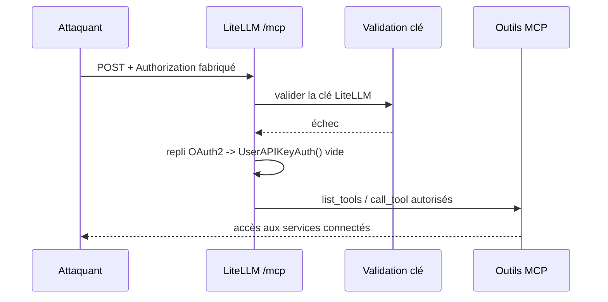
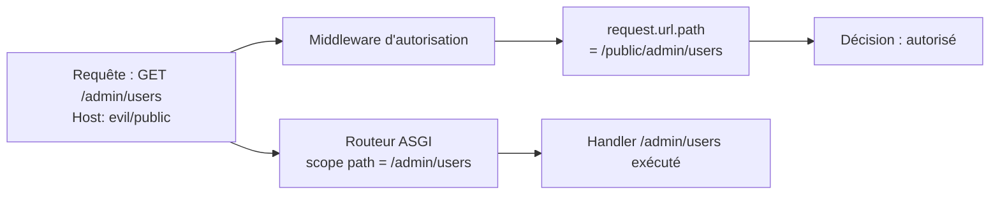
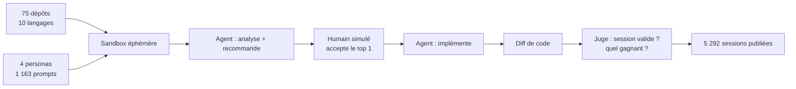

# Tech — Détail du samedi 5 septembre 2026

## 1. CVE-2026-59822 (LiteLLM) — le repli OAuth2 qui remplace une auth échouée par un contexte vide

**Source :** CISA — https://www.cisa.gov/news-events/alerts/2026/09/02/cisa-adds-seven-known-exploited-vulnerabilities-catalog
**Date :** 2 septembre 2026 (ajout au catalogue KEV)

### Contexte

LiteLLM est le proxy que beaucoup d'équipes placent devant leurs fournisseurs de modèles : une API OpenAI-compatible, une gestion de clés, du routage, des quotas. Depuis l'arrivée de MCP, il expose aussi un endpoint **MCP Streamable HTTP** qui donne accès aux outils configurés — et donc, indirectement, aux services derrière ces outils : bases, tickets, dépôts, ce que tu y as branché.

La CISA a ajouté **CVE-2026-59822** à son catalogue des vulnérabilités activement exploitées le 2 septembre 2026, avec une échéance de remédiation au 16 septembre pour les organismes fédéraux couverts. CVSS 8,8 selon l'avis GitHub. Correctif : **LiteLLM 1.84.0**.

### Comment ça marche

Le mécanisme mérite d'être compris parce qu'il se reproduit partout où on empile deux schémas d'authentification.

LiteLLM supporte deux façons de s'authentifier sur l'endpoint MCP : sa propre clé d'API (une « LiteLLM key ») et un passthrough OAuth2 vers un fournisseur en aval. Le code de vérification tente d'abord la validation de la clé LiteLLM. Si elle échoue, il ne rejette pas la requête : il bascule sur le chemin de repli OAuth2, en partant du principe qu'un autre mécanisme prendra le relais. Et sur ce chemin de repli, l'objet d'authentification est initialisé à un `UserAPIKeyAuth()` **vide** — pas nul, pas invalide : vide.

Le reste du pipeline voit alors un contexte d'auth bien formé, sans identité ni permission. Les contrôles en aval, écrits pour filtrer par utilisateur ou par équipe, n'ont rien à refuser. Un attaquant non authentifié envoie un en-tête `Authorization` fabriqué, provoque volontairement l'échec de la validation LiteLLM, atterrit sur le repli, et peut lister puis appeler les outils MCP configurés.

C'est un cas d'école de **fail-open** : la branche d'erreur produit un état permissif au lieu d'un rejet.



### En pratique — exemple de code

Le patron fautif, puis la correction, réduits à leur squelette :

```python
# Avant — l'échec de validation bascule sur un repli qui fabrique un contexte vide
async def authenticate(request):
    try:
        return await validate_litellm_key(request.headers.get("Authorization"))
    except AuthError:
        return UserAPIKeyAuth()          # ⚠ objet valide, zéro identité : fail-open

# Après — chaque schéma est tenté explicitement, et l'absence de résultat rejette
async def authenticate(request):
    header = request.headers.get("Authorization")
    for scheme in (validate_litellm_key, validate_oauth2_passthrough):
        auth = await scheme(header)      # renvoie None si le schéma ne s'applique pas
        if auth and auth.is_authenticated:
            return auth
    raise HTTPException(401)             # fail-closed : aucun repli implicite
```

Vérifier ton exposition, puis corriger :

```bash
pip show litellm | grep -i version     # < 1.84.0 = vulnérable
pip install --upgrade "litellm>=1.84.0"
# Et vérifier qu'aucun /mcp n'est joignable sans passer par ton reverse proxy authentifié
curl -s -o /dev/null -w '%{http_code}\n' -H 'Authorization: Bearer nope' \
  https://ton-proxy/mcp/list_tools     # attendu : 401
```

### Pourquoi ça compte pour toi

Si tu as monté une passerelle LLM interne, elle est probablement plus exposée que tu ne le penses : les outils MCP branchés derrière portent souvent des identifiants de service à privilèges larges. Passe en 1.84.0, puis relis tes propres branches d'erreur d'authentification. La question à te poser sur chaque `except` : est-ce que ce chemin peut produire un contexte qui **ressemble** à une identité valide ?

### Pour aller plus loin

Cinq autres failles ont rejoint le KEV le même jour : Sangoma Switchvox (injection SQL), Kestra OSS (injection de commande OS), JFrog Artifactory (authentification incorrecte), et deux sur SonicWall SMA1000 (SSRF et injection de commande OS).

---

## 2. CVE-2026-48710 (Starlette) — l'en-tête `Host` qui empoisonne `request.url.path`

**Source :** GitLab Advisory Database — https://advisories.gitlab.com/pypi/starlette/CVE-2026-48710/
**Date :** 2 septembre 2026 (ajout au catalogue KEV)

### Contexte

Starlette est le socle ASGI sur lequel repose FastAPI, donc une part importante des API Python en production. La faille, corrigée en **Starlette 1.0.1**, a rejoint le catalogue KEV de la CISA le 2 septembre 2026, avec la même échéance du 16 septembre.

Elle est intéressante bien au-delà de Python, parce qu'elle illustre une classe d'erreurs qu'on retrouve dans n'importe quel framework : **reconstruire une URL à partir d'entrées non validées, puis prendre une décision de sécurité sur le résultat**.

### Comment ça marche

La propriété `Request.url` de Starlette reconstruit l'URL complète de la requête. Pour ça, elle concatène le schéma, l'en-tête `Host` fourni par le client, le chemin et la query string, puis **re-parse** la chaîne obtenue.

Le défaut : avant la 1.0.1, l'en-tête `Host` n'était pas validé contre les grammaires de la RFC 9112 §3.2 et de la RFC 3986 §3.2.2. Or ces grammaires interdisent précisément les caractères qui délimitent les composants d'une URL. Si tu injectes un `/`, un `?` ou un `#` dans la valeur de `Host`, le re-parsing déplace les frontières entre autorité, chemin, query et fragment. Résultat : `request.url.path` diverge du chemin réellement présent sur le fil.

L'exploitation vient de là. Beaucoup d'applications font de l'autorisation par préfixe de chemin dans un middleware : « tout ce qui commence par `/admin` exige un rôle ». Ce middleware lit `request.url.path`. Le routeur ASGI, lui, route sur `scope["path"]`, la valeur brute du fil. En empoisonnant `Host`, un attaquant non authentifié fait évaluer au middleware un chemin **fantôme** — anodin — pendant que la route protégée s'exécute normalement. Contournement d'authentification, sans compte.

Le correctif de la 1.0.1 valide l'en-tête contre la grammaire attendue et retombe sur `scope["server"]` quand la valeur est malformée.



### En pratique — exemple de code

Le middleware vulnérable, et sa version corrigée :

```python
from starlette.middleware.base import BaseHTTPMiddleware
from starlette.responses import JSONResponse

class AuthzMiddleware(BaseHTTPMiddleware):
    async def dispatch(self, request, call_next):
        # Avant — chemin reconstruit à partir du Host client : empoisonnable
        # path = request.url.path

        # Après — la valeur brute du fil, celle sur laquelle le routeur décide
        path = request.scope["path"]

        if path.startswith("/admin") and not is_admin(request):
            return JSONResponse({"detail": "forbidden"}, status_code=403)
        return await call_next(request)
```

Et la vérification côté déploiement :

```bash
pip show starlette | grep -i version      # < 1.0.1 = vulnérable
pip install --upgrade "starlette>=1.0.1"

# Reproduire l'empoisonnement : le Host contient un séparateur d'URL
curl -i -H 'Host: evil/public' https://ton-api/admin/users
# Corrigé : le Host malformé est rejeté ou ignoré, /admin/users reste protégé
```

### Pourquoi ça compte pour toi

Le réflexe transposable : **ne jamais faire d'autorisation sur une valeur reconstruite**. Que tu sois en ASP.NET Core, en Symfony ou en Starlette, le middleware doit lire exactement la donnée que le routeur utilisera. Vérifie aussi ta terminaison TLS : un allowlist de `Host` au niveau du reverse proxy coupe la classe entière d'attaques par en-tête d'hôte, y compris les empoisonnements de cache et de liens de reset.

### Points de vigilance

Cette faille est cousine des « host header injection » classiques, mais avec une conséquence plus directe : ici, ce n'est pas un lien généré qui part de travers, c'est la décision d'autorisation elle-même. Audite tes middlewares pour tout usage de `request.url`, `request.base_url` ou d'équivalents dans une condition de sécurité.

---

## 3. Armature — 16 893 sessions d'agents de code, et 42 % d'accord sur le choix d'un outil

**Source :** Armature — https://armature.tech/blog/which-tools-coding-agents-install
**Date :** 3 septembre 2026

### Contexte

Une part croissante des décisions de dépendance ne se prend plus en revue d'architecture mais dans une session d'agent. Le développeur décrit un besoin, l'agent analyse le dépôt, propose un service, l'installe. Vercel indiquait en avril que plus de 30 % de ses déploiements étaient initiés par des agents de code, en hausse d'un facteur dix en six mois.

Armature — qui vend, précision utile, des services de croissance à des éditeurs d'outils dev — a publié le 3 septembre la plus grosse mesure publique de ce phénomène : **16 893 sessions**, 1 163 variantes de prompts, 75 dépôts, trois agents (Claude Code, Codex, Cursor) qui **implémentent** réellement la solution au lieu de la recommander. 5 292 sessions ont été retenues comme valides et publiées avec leurs traces complètes.

### Comment ça marche

Le protocole vaut autant que les résultats, parce qu'il est réutilisable pour évaluer un agent chez toi.

Les dépôts d'abord : Armature a analysé des milliers de dépôts GitHub publics pour en extraire une distribution réaliste (langages, frameworks, services tiers, plateforme de déploiement, taille d'équipe, âge du code), puis a redressé le biais « startups open source » avec des données publiques. Le panel final compte 75 dépôts en 10 langages, avec noms d'entreprise et historiques Git factices, mais des **lockfiles réels** vérifiés contre les registres.

Ensuite les personas : vibe-coder (décrit un symptôme, jamais la catégorie), ingénieur junior, ingénieur senior (contraintes explicites), ingénieur en grande entreprise (conformité, achats).

Le point méthodologique le plus intéressant est le **humain simulé dans la boucle**, joué par un orchestrateur. Sans lui, en demandant directement d'implémenter, les agents partaient massivement sur du fait-maison, faute de pouvoir demander l'autorisation d'installer un tiers. Avec une étape « analyse puis recommande », suivie d'une acceptation, la distribution devient réaliste : en stockage objet, Cloudflare R2 se met à gagner des sessions où Amazon S3 raflait tout.

Enfin, un juge automatique valide chaque session (le dépôt n'avait-il pas déjà « pré-choisi » ? un service a-t-il vraiment été retenu ?) et identifie le gagnant en lisant la conversation **et les diffs de code appliqués**.



### En pratique — exemple de code

Le résultat le plus actionnable : à prompt identique, le langage du dépôt décide du fournisseur. Tu peux tester ça sur ton propre dépôt en quelques minutes.

```bash
# Même besoin, quatre dépôts : quatre gagnants différents chez Armature
#   TypeScript -> Resend (55/89)   Python -> SendGrid (22/24)
#   Go         -> Postmark (20/24) Java   -> Azure ACS (22/23)

PROMPT="Chaque facture générée doit partir par e-mail au client, \
avec un message soigné. Trouve la meilleure solution et implémente-la."

for repo in ./api-ts ./api-py ./api-go; do
  ( cd "$repo" && git switch -c bench/email && claude -p "$PROMPT" )
  ( cd "$repo" && git diff --stat main )   # le diff dit quel service a gagné
done
```

Le contre-poids, si tu veux que la décision reste la tienne : contraindre le choix dans le contexte du dépôt plutôt que de le laisser à l'agent.

```markdown
<!-- AGENTS.md / CLAUDE.md à la racine -->
## Dépendances autorisées
- E-mail transactionnel : **Postmark uniquement** (contrat en cours, DPA signé).
- Base de données : PostgreSQL managé chez notre fournisseur actuel.
- Toute nouvelle dépendance tierce passe par une ADR avant implémentation.
```

### Pourquoi ça compte pour toi

Trois conséquences directes. Un : si plusieurs personnes de ton équipe utilisent des agents différents, tu vas te retrouver avec des piles divergentes — 42 % d'accord seulement. Deux : le fichier d'instructions à la racine du dépôt n'est plus un confort, c'est ta politique de dépendances. Trois : Claude Code construit en interne deux fois plus souvent (19 % contre 10 %) — surveille les réimplémentations maison de choses qui existent déjà chez toi.

### Limites

Armature vend des services d'influence sur ces choix, et le dit en tête d'article. Les juges et l'humain simulé sont eux-mêmes des modèles, donc porteurs de biais. Traite les classements comme une photographie datée d'un système qui bouge à chaque mise à jour de modèle, pas comme un palmarès stable.
