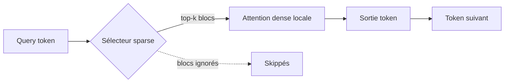

# Rapport hebdo — Semaine W23 (2026-06-01 → 2026-06-07 2026)

Plus de 40 sujets analysés sur 4 catégories actives, dans un alignement rare des trois piliers de la veille. **Angular 22 passe en GA** et stabilise tout l'arsenal signal-first, avec TypeScript 6 désormais imposé au toolchain. Côté IA ouverte, **MiniMax M3** devient le premier open-weight à tenir tête au frontier sur le coding agentique avec 1M de tokens de contexte. Et la **sécurité infra** a vécu une semaine sous tension maximale : RCE non authentifiée sur tous les contrôleurs de domaine, supply-chain npm « Miasma », NetScaler et Cisco SD-WAN exploités, à la veille d'un Patch Tuesday chargé.

## Angular 22 GA — le signal-first sort des flags

Le jalon de la semaine (3 juin) : Signal Forms, `httpResource`/`resource`, Selectorless Components et Angular Aria passent stable, avec le compilateur Rust Oxc (jusqu'à 20× plus rapide) à la clé. La migration impose **TypeScript 6** à tout ton toolchain (rupture universelle), mais `OnPush` par défaut ne concerne que les nouvelles apps générées via la CLI, pas l'existant. La newsletter officielle alerte sur les LLMs entraînés avant fin 2025 qui génèrent encore du `NgModule`-first et du `ChangeDetectionStrategy.Default` : vérifie ce que ton IA produit, et regarde le **Model Context Protocol** qui fait passer l'outillage du scaffolding CLI à un agent raisonnant sur tout le workspace.

Comment ça marche : **Signal Forms** remplace le couple `FormControl`/`valueChanges` (RxJS) par un état réactif dérivé d'un signal source. Le formulaire *est* un signal ; validation et état dérivent par `computed`, sans abonnement à gérer ni `OnPush` à câbler.

```ts
// AVANT — Reactive Forms : RxJS, abonnements, unsubscribe à la main
const form = new FormGroup({ email: new FormControl('', Validators.email) });
form.valueChanges.subscribe(v => this.draft = v);   // fuite si pas unsubscribe

// APRÈS — Signal Forms (Angular 22 GA) : état dérivé, zéro abonnement
const model = signal({ email: '' });
const f = form(model, (p) => {
  validate(p.email, ({ value }) => value().includes('@') ? null : { kind: 'email' });
});
// f.email().errors() et f().valid() sont des signaux : pas de subscribe, pas de leak
```

## IA open source — l'open-weight atteint le frontier coding

La semaine la plus dense de la veille. **MiniMax M3** atteint 59,0 % sur SWE-Bench Pro (devant GPT-5.5 et Gemini 3.1 Pro) avec 1M de contexte et une architecture MSA qui divise par 20 le coût du contexte long — poids attendus sous ~10 jours sur Hugging Face, à valider par un benchmark tiers. **Mellum2** (JetBrains, MoE 12B/2,5B, Apache 2.0) cible la couche infra agentique (routage, RAG, sous-agents on-premise). **Ideogram 4** ouvre un text-to-image from scratch (DiT 9,3 Md, encodeur Qwen3-VL-8B) et **Holo3.1** apporte du computer-use open-weight exécutable en local. En clôture, Ollama 0.30 réintègre llama.cpp aux côtés de MLX et Transformers v5.10.1 ajoute Gemma 4 Unified et DeepSeek-OCR-2.

Comment ça marche : l'architecture **MSA** (Mixture of Sparse Attention) de MiniMax M3 n'attaque pas tout le contexte 1M de manière dense. Chaque tête d'attention ne lit qu'un sous-ensemble de tokens sélectionnés — d'où le coût du contexte long divisé par ~20, sans relire l'intégralité de la fenêtre à chaque token généré.



À valider : 59,0 % SWE-Bench Pro est un chiffre annoncé — benchmarke sur ton repo dès la sortie des poids.

## Sécurité infra — semaine sous tension maximale

La post-compromission et l'infra critique dominent. **Netlogon CVE-2026-41089** (RCE SYSTEM non authentifiée sur tous les contrôleurs de domaine Windows Server 2012→2025) est exploitée in-the-wild : un seul DC non patché = tout l'AD compromis, patche dans la même fenêtre. La supply-chain npm « **Miasma** » a piégé 32 paquets Red Hat (96 versions, ~117K downloads/semaine, vol de credentials au `npm install`) : audite tes dépendances post-1er juin et fais tourner tes secrets CI. NetScaler `CVE-2026-3055` (fuite mémoire SAML IDP, CVSS 9.3) et le 7e zero-day Cisco SD-WAN de l'année sont exploités à grande échelle, sans patch pour ce dernier.

Comment ça marche (côté défense) : une RCE non auth sur un DC se propage à tout l'annuaire. Avant même le déploiement du patch, la première action est de **détecter les DC vulnérables** et de prioriser. Orientation défensive, sans charge offensive :

```bash
# Détection défensive : DC manquant le KB du correctif Netlogon CVE-2026-41089
# (adapte le numéro de KB au bulletin officiel de juin 2026)
KB="KB5040000"
for dc in $(nltest /dclist:contoso.local | awk '/\\\\/{print $1}'); do
  installed=$(wmic /node:"$dc" qfe where "HotFixID='$KB'" get HotFixID 2>/dev/null)
  case "$installed" in
    *"$KB"*) echo "OK   $dc patché" ;;
    *)       echo "RISK $dc -> $KB ABSENT : isoler / patcher en priorité" ;;
  esac
done
```

## .NET & data — virage agentique et PostgreSQL 19 Beta

Pas de release runtime .NET, mais Build 2026 a repositionné Windows, Azure et l'outillage autour des agents : Azure Linux 4.0 en préversion, WSL 3, Windows Agent Store, et un agent Copilot de modernisation .NET (upgrade du stack, Web Forms → Blazor, greffe d'Aspire) à tester sur branche isolée. VS Code 1.123 ajoute les sessions agent parallèles, le contexte 1M et le mode BYOK air-gapped. Côté data, **PostgreSQL 19 Beta 1** apporte l'autovacuum parallèle, l'I/O asynchrone auto-scalé (`io_min_workers`/`io_max_workers`) et `EXPLAIN (ANALYZE, IO)` — GA visée sept./oct. 2026, le bon moment pour benchmarker tes grosses tables. Le **GitHub Copilot SDK** passe en GA (API agentique embarquable, MCP natif, sandboxes isolées).

Comment ça marche : `EXPLAIN (ANALYZE, IO)` expose enfin le temps réellement passé en I/O disque par nœud du plan — la partie invisible jusqu'ici. Tu distingues un scan lent par *contention I/O* d'un scan lent par *mauvais plan*, et tu dimensionnes `io_max_workers` sur des données, pas au feeling.

```sql
-- PostgreSQL 19 Beta : profilage I/O par nœud du plan
EXPLAIN (ANALYZE, IO, BUFFERS, FORMAT TEXT)
SELECT * FROM commandes WHERE cree_le >= now() - interval '90 days';
-- Lire la ligne 'I/O Timings' : si read >> exec hors I/O => borné disque,
-- augmente io_max_workers (I/O async auto-scalé) ; sinon revois index/plan.
```

## À retenir si tu n'as qu'une minute

- **Patche tes contrôleurs de domaine** : Netlogon `CVE-2026-41089` RCE SYSTEM non auth, exploitée, Windows Server 2012→2025.
- **Audite tes dépendances npm post-1er juin** et fais tourner tes secrets CI après « Miasma » (32 paquets Red Hat).
- **Angular 22 GA** : Signal Forms/`httpResource`/Selectorless stables, mais TypeScript 6 obligatoire — planifie la migration toolchain.
- **MiniMax M3** : premier open-weight à battre le frontier sur SWE-Bench Pro (59,0 %), 1M de contexte — poids sous ~10 jours.
- **PostgreSQL 19 Beta 1** : autovacuum parallèle et I/O async — benchmarke tes grosses tables avant la GA d'automne.

## Index de la semaine

- **Tech** : infra critique sous tension (DC, VPN, supply-chain) + PostgreSQL 19 Beta — 18 sujets sur la semaine
- **IA** : l'open-weight atteint le frontier coding, vague de MoE compacts et permissifs — 16 sujets sur la semaine
- **Angular** : GA de la v22, API signal-first stables, migration TypeScript 6 — 4 sujets sur la semaine
- **CSharp** : virage agentique Build 2026, agent de modernisation .NET — 4 sujets sur la semaine

---
*Généré le 2026-06-07 par la routine `weekly` (Claude Cowork).*
