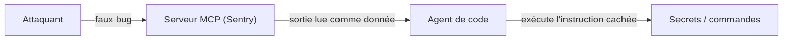
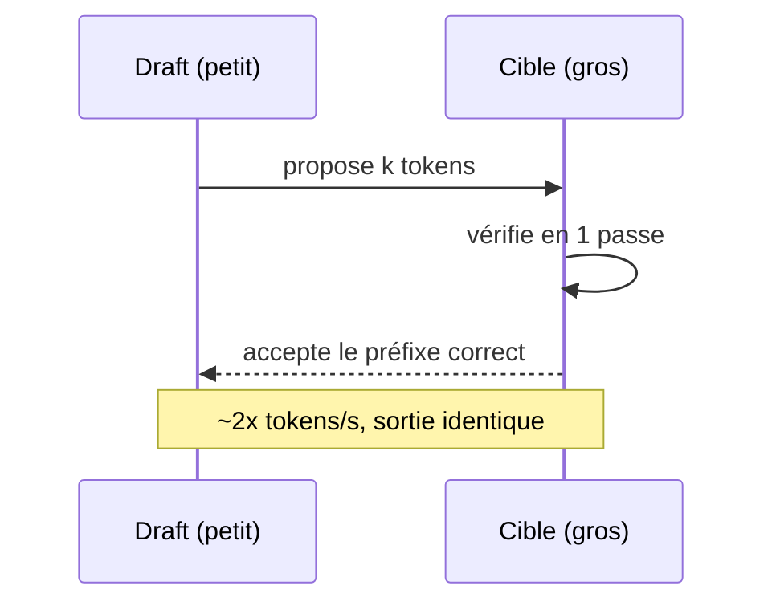

# Rapport hebdo — Semaine W24 (8 → 14 juin 2026)

Une trentaine de sujets marquants sur 4 catégories (Angular en pause), autour de trois mouvements de fond. La **supply chain et les agents IA** sont devenus la première surface d'attaque de la semaine (worm npm `node-gyp`, RCE Langflow non patchée, « Agentjacking » via MCP). En parallèle, la **diffusion** entre dans l'inférence LLM avec `DiffusionGemma`, premier modèle par diffusion nativement supporté dans vLLM. Et **.NET 11 Preview 5** stabilise des nouveautés de langage majeures (union types, closed hierarchies) pendant qu'Angular reste en consolidation post-GA v22. Deux jours (12, 13 juin) sont sans digest.

## 🏆 Top de la semaine

### 1. Agentjacking — ton agent de code exécute les instructions d'un attaquant

Comment ça marche : un faux event est poussé dans un serveur MCP (ici Sentry) ; ton agent le lit comme une donnée de travail, mais il contient des **instructions cachées** qu'il exécute comme si elles venaient de toi. 85 % de réussite sur 100+ organisations testées.



À retenir : **toute sortie MCP est une entrée non fiable.** Restreins les droits des serveurs MCP et fais valider les actions sensibles.

### 2. .NET 11 Preview 5 — union types & closed hierarchies

Comment ça marche : tu modélises des **états mutuellement exclusifs** sans classe abstraite ni `OneOf<T>`, avec **exhaustivité du `switch` garantie** par le compilateur.

```csharp
// Avant — hiérarchie abstraite, un cas oublié passe à la compilation
abstract record PaymentResult;
record Ok(string Ref) : PaymentResult;
record Declined(string Reason) : PaymentResult;

// Après — .NET 11 (syntaxe préversion) : union + exhaustivité garantie
union PaymentResult { Ok(string Ref); Declined(string Reason); Pending; }

string Describe(PaymentResult r) => r switch
{
    Ok(var id)        => $"Payé ({id})",
    Declined(var why) => $"Refusé : {why}",
    Pending           => "En attente",   // pas de 'default' : le compilateur sait que c'est complet
};
```

### 3. vLLM v0.22 + EAGLE 3.1 — décodage spéculatif jusqu'à 2,03×

Comment ça marche : un petit modèle « draft » propose k tokens d'avance ; le gros modèle « cible » les **vérifie en une passe** et garde le préfixe correct. Même sortie, ~2× le débit.



## Supply chain & agents IA — la nouvelle surface d'attaque

Le maillon faible de la semaine, c'est ce que ta CI et tes agents *ingèrent*. Le worm npm `node-gyp` a piégé 57 paquets : code exécuté dès `npm install` (build natif), vol des secrets npm/GitHub/AWS/GCP/Azure/Vault/K8s, propagation automatique. La RCE **Langflow** `CVE-2026-5027` (path traversal sur `POST /api/v2/files`) est exploitée in-the-wild, ~7 000 instances exposées et **aucun patch** au 14 juin : à sortir d'Internet immédiatement. L'**Agentjacking** (cf. Top 1) complète le tableau. Réflexe minimal côté build :

```bash
npm ci --ignore-scripts    # n'exécute pas binding.gyp ni les autres scripts d'install
```

## .NET 11 Preview 5 — le langage change de modèle de domaine

Avant-dernière préversion avant la GA de novembre 2026. C# gagne les **union types & patterns**, les **closed hierarchies** (cf. Top 2) et un `unsafe` plus explicite. Côté data : EF Core bascule en compat **SQL Server 2022 par défaut** (valide tes plans d'exécution), introduit le warning **EF1004** quand une requête async tourne en réalité en synchrone, et ajoute des checks de vulnérabilité/EOL au build. `dotnet ef database update --add` crée et applique une migration en une commande (idéal Aspire/conteneurs).

```csharp
// EF1004 en pratique : async attendu, exécution synchrone => thread bloqué
var users = ctx.Users.Where(u => u.Active).ToList();             // ⚠
var users = await ctx.Users.Where(u => u.Active).ToListAsync();  // ✅
```

## IA open source — efficience et entrée de la diffusion

Début de semaine sur la mémoire et le débit, fin de semaine sur la diffusion comme nouveau levier de vitesse. **DiffusionGemma 26B-A4B** (Google, Apache 2.0) devient le premier LLM par diffusion nativement supporté dans vLLM : > 1000 tok/s sur H100, jusqu'à 4× un autorégressif — expérimental, à prototyper. **Gemma 4 QAT** offre −72 % de VRAM à qualité quasi inchangée (E2B sous 1 Go, Q4_0 chargeable dans Ollama/llama.cpp). Côté self-host, **North Mini Code 1.0** (Cohere, MoE 30B/3B, un seul H100), **Mellum2** (JetBrains) et **Kimi K2.7-Code** visent des sous-agents/RAG privés. Et `vLLM v0.22 + EAGLE 3.1` donne ~2× de débit (cf. Top 3). Beaucoup tournent déjà en local :

```bash
ollama run mellum2:12b "Explique cette méthode C# et propose un test unitaire"
```

## Angular — semaine blanche post-GA v22

Aucune release ni advisory : l'écosystème digère la GA de la v22 (stable courante **22.0.1**). Rien d'urgent à migrer. Bon moment pour consolider tes patterns **Signal Forms**, valider **TypeScript 6** et tester **zoneless** sur un projet pilote.

## À retenir si tu n'as qu'une minute

- **Sors toute instance Langflow d'Internet** : `CVE-2026-5027` RCE non auth, exploitée, ~7 000 instances, sans patch.
- **Durcis ta CI npm** : `--ignore-scripts`, `npm ci` + lockfile, builds en conteneurs éphémères (worm `node-gyp`, 57 paquets).
- **Agents IA** : toute sortie MCP est non fiable (**Agentjacking**) — droits minimaux, validation des actions.
- **.NET 11 Preview 5** : union types, closed hierarchies, EF Core compat SQL Server 2022 par défaut + EF1004 — teste sur branche, GA en novembre.
- **Débit LLM** : `vLLM EAGLE 3.1` ~2× gratuit ; **DiffusionGemma** prometteur mais à benchmarker avant prod.

## Index de la semaine

- **Tech** : sécurité sous très haute tension — supply chain, agents IA, infra critique — 12 sujets.
- **IA** : efficience mémoire + entrée de la diffusion dans l'inférence LLM — 12 sujets.
- **CSharp** : .NET 11 Preview 5 (langage + EF Core) et servicing de juin — 5 sujets.
- **Angular** : semaine blanche, consolidation post-GA v22 — synthèse seule.

---
*Généré le 20 juin 2026 (run de test) par la routine `weekly` (Claude Cowork). Couvre 2026-06-08 → 2026-06-14.*
