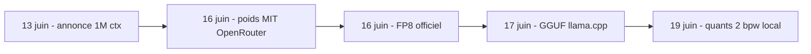
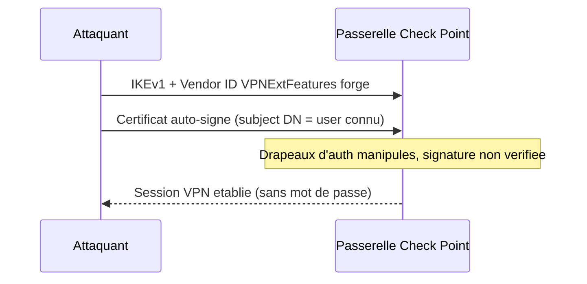
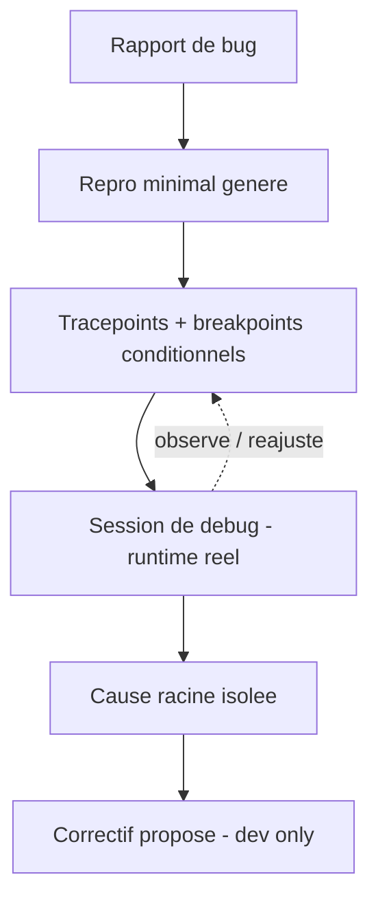

# Rapport hebdo — Semaine W25 (2026-06-15 → 2026-06-21)

Près de 30 sujets marquants sur 4 catégories, dont 3 actives et une (Angular) en veille pour la deuxième semaine consécutive. Trois mouvements de fond traversent la semaine. D'abord une **semaine rouge côté sécurité** : avalanche de CVE critiques *activement exploitées*, du lundi (PeopleSoft, AUR piégé) au dimanche (Check Point VPN, zero-day Chrome). Ensuite, l'**IA open source bascule en local** : GLM-5.2 passe de l'annonce cloud aux quants 2 bpw chargeables sur ta machine en six jours, au milieu d'une vague de portages on-device (Apertus ONNX, FunAudioLLM GGUF, lift VLM). Enfin, côté **.NET, toujours aucune release, mais l'agent entre dans le débogueur et `unsafe` devient un contrat d'appelant** en C# 16.

## Top de la semaine

**1. Sécurité — la fenêtre divulgation vers exploitation se referme.** Le fil rouge n'est pas une faille mais une vitesse : Joomla JCE (CVSS **10.0**), Splunk (**9.8**), Cisco SD-WAN sont passés au catalogue **CISA KEV** avec des deadlines de quelques jours, plusieurs déjà exploités. Le cas le plus instructif pour toi : **Splunk `CVE-2026-20253`** transforme une écriture de fichier non authentifiée en RCE via le `lo_export` de son **sidecar PostgreSQL**. La leçon est transposable à ton infra : un rôle applicatif trop privilégié = surface d'attaque.

```csharp
// PostgreSQL : ton rôle applicatif peut-il abuser de lo_export (écriture -> RCE) ?
await using var conn = new NpgsqlConnection(connectionString);
await conn.OpenAsync();
await using var cmd = new NpgsqlCommand(
    "SELECT rolsuper, rolbypassrls FROM pg_roles WHERE rolname = current_user", conn);
await using var r = await cmd.ExecuteReaderAsync();
if (await r.ReadAsync() && (r.GetBoolean(0) || r.GetBoolean(1)))
    throw new InvalidOperationException("Role trop privilegie : lo_export exploitable.");
```

**2. GLM-5.2 — un « time-to-local » record de six jours.** Le modèle de Z.ai (MoE coding-first, contexte **1M**) est passé de l'annonce aux **poids MIT** sur OpenRouter, puis au **FP8 officiel**, au **GGUF** communautaire, jusqu'à des **quants ~2 bpw** qui tiennent sur une machine de dev — en moins d'une semaine. C'est le signal de fond : un modèle « frontier coding » n'est plus une API distante, c'est un poids que tu télécharges. Z.ai le présente comme « top frontend coding model » : signal, pas preuve — à valider sur ton repo.



**3. C# 16 — `unsafe` devient un contrat propagatif.** En .NET 11 (preview opt-in), marquer un membre `unsafe` ne se contente plus d'autoriser les pointeurs : ça **déclare aux appelants** des préconditions, et chaque appel doit être entouré d'un bloc `unsafe { }`. À l'ère du code généré par IA qui recrache du `Span`/`MemoryMarshal` sans en mesurer les invariants, l'obligation de sûreté redevient **visible et grep-able en revue**.

```csharp
// AVANT : unsafe interne, l'appelant ne sait rien des obligations
public static int ReadInt(byte* p) => *(int*)p;     // risque invisible

// APRES (C# 16) : contrat propage + documente
/// <safety>source >= 4 octets, aligne sur 4, valide pendant l'appel.</safety>
public static unsafe int ReadInt(ReadOnlySpan<byte> source) =>
    System.Runtime.InteropServices.MemoryMarshal.Read<int>(source);
unsafe { int v = ReadInt(buffer); }                 // decision tracee dans la diff
```

## Sécurité — semaine rouge, exploitation active

Sept jours, une dizaine de failles critiques, plusieurs **activement exploitées**. La semaine ouvre sur le zero-day **Oracle PeopleSoft `CVE-2026-35273`** (RCE, vol de données par ShinyHunters) et la campagne supply-chain **« Atomic Arch »** (1 500+ paquets **AUR** piégés : voleur Rust + rootkit eBPF). Elle enchaîne sur **CodeIgniter `CVE-2026-48062`** (CVSS 9.8, RCE par bypass du contrôle d'upload — ne valide jamais un upload sur l'extension dérivée du MIME), **Wazuh 5.0** (CVSS 10, injection dans le pipeline d'inventaire), le M365 Copilot **« SearchLeak » `CVE-2026-42824`** (exfiltration en un clic par injection indirecte de prompt — l'injection de prompt est la nouvelle XSS), **Ubiquiti UniFi OS** (*triple* CVSS 10, RCE root non auth, ~100 000 instances exposées), **Joomla JCE `CVE-2026-48907`** (CVSS 10.0, CISA KEV, exploitation automatisée vers 2.9.99.5 + chasse aux web shells), une salve **Node.js** HIGH (26.x/24.x/22.x), **NGINX HTTP/3 `CVE-2026-42530`** (use-after-free, vers 1.31.2 ou coupe `quic`) et **Splunk `CVE-2026-20253`** (RCE pré-auth). Le week-end ajoute deux urgences : un **zero-day Chrome/V8 `CVE-2026-11645`** (5ᵉ de l'année, vers 149.0.7827.102+) et le **bypass d'authentification Check Point VPN**.

Le cas Check Point **`CVE-2026-50751`** (CVSS 9.3, exploité par un affilié **Qilin**, PoC publique) est un cas d'école de **validation de confiance incomplète** : la passerelle accepte un certificat auto-signé dès que son *subject DN* cite un utilisateur connu — elle vérifie l'identité affichée, **jamais la preuve cryptographique**.



La parade dépasse le hotfix : **IKEv2 uniquement**, certificat machine **obligatoire** (signé par ta CA, pas un DN qui « résout »), et l'audit de tout protocole déprécié laissé actif « au cas où » (IKEv1, TLS 1.0, SMBv1). Référence : [blog Check Point](https://blog.checkpoint.com/security/check-point-releases-important-hotfix-for-vulnerabilities-in-deprecated-ikev1-vpn-protocol/).

## IA open source — le frontier bascule en local

Au-delà du sprint GLM-5.2 (voir Top), la semaine **industrialise le on-device souverain**. **Apertus v1.1** (EPFL/ETH, *entièrement* ouvert) sort en **INT4 ONNX** — donc embarquable in-process dans une appli **.NET** via `Microsoft.ML.OnnxRuntime`, offline, sans serveur d'inférence. La pile audio **FunAudioLLM** (ASR + VAD, Apache-2.0) et **MiniMax-M3** (MLX, Apple Silicon) passent en local ; **GGUF** et **MLX** s'imposent comme les deux cibles par défaut. Côté souveraineté, **Rio-3.5-Open-397B** (base Qwen3.5) confirme la tendance. Côté agents : **FastContext-1.0-4B** (Microsoft, sous-agent d'exploration de dépôt), le papier **« Models Take Notes at Prefill »** (cache KV éditable et composable) et l'API **Bedrock `InvokeGuardrailChecks`** (safeguards par étape). Et durcis ta gateway : **LiteLLM** cumulait **4 CVE** (CVSS 9.9) vers `v1.83.14`+.

Le sujet le plus actionnable du week-end : **`datalab-to/lift`**, un VLM ouvert (~9,6 Md, base `qwen3_5`) qui lit une page PDF **rendue en image** et produit du **JSON structuré** — de quoi remplacer un pipeline OCR + regex fragile par un service auto-hébergé, sans API tierce ni fuite de documents sensibles.

```python
# datalab-to/lift : facture PDF (rendue en image) -> JSON, schema impose dans le prompt
from transformers import AutoProcessor, AutoModelForVision2Seq
from PIL import Image
import json

proc = AutoProcessor.from_pretrained("datalab-to/lift", trust_remote_code=True)
model = AutoModelForVision2Seq.from_pretrained(
    "datalab-to/lift", device_map="auto", trust_remote_code=True)

page = Image.open("facture_001.png")            # PDF rendu en image au prealable
prompt = "Extract fields as strict JSON: invoice_no, total_ttc, due_date"
inputs = proc(images=page, text=prompt, return_tensors="pt").to(model.device)
out = model.generate(**inputs, max_new_tokens=512)
data = json.loads(proc.decode(out[0], skip_special_tokens=True))  # A VALIDER avant insert
```

Règle d'or quel que soit le modèle : **tu ne fais jamais confiance au JSON brut** — valide-le (pydantic, ou JSON Schema côté .NET) et prévois une file de revue humaine. Un VLM peut halluciner un champ absent.

## .NET — l'agent entre dans le débogueur

Aucune release : **.NET 11 Preview 5** (9 juin) reste la dernière, **Preview 6** attendue mi-juillet, GA en novembre. Le mouvement est dans l'outillage. **VS Code 1.124** bascule l'**Autopilot par défaut**, ajoute des sessions agent en arrière-plan et un **contexte 1M** (surveille tes crédits IA). **Visual Studio 2026** (update de juin) fait passer Copilot de la complétion au **débogage** via un *Debugger Agent* qui valide un bug contre le runtime réel, pose tracepoints et breakpoints conditionnels, isole la cause racine et propose un correctif — réservé au dev, jamais branché sur la prod. Le **.NET Day on Agentic Modernization** (16 juin) a cadré la migration assistée du legacy (Web Forms vers Blazor, onboarding **Aspire**). Action concrète hors hype : applique le **servicing de juin** s'il manque — il touche **.NET 8 LTS**.

Le *Debugger Agent* est la pièce marquante : il ne raisonne pas sur du code mort, il **attache un repro au runtime réel** et instrumente l'exécution là où l'état diverge. Tu lui donnes une exception + une stack, il isole la condition d'entrée — pas une hypothèse plausible mais fausse.



Détail : [VS 2026 — Debugging with Copilot](https://devblogs.microsoft.com/visualstudio/visual-studio-2026-debugging-with-copilot/).

## Angular — deuxième semaine blanche post-v22

Aucune release, RFC ni advisory sur les 7 jours : l'écosystème digère toujours la GA de la **v22** (Signal Forms, Selectorless, `httpResource`, zoneless par défaut, TypeScript 6 requis). Rien d'urgent à migrer. Profite du calme pour trois chantiers : consolider tes patterns **Signal Forms**, vérifier que ta CI est bien passée à **TypeScript 6**, et auditer tes derniers `NgZone` avant de basculer en zoneless. À surveiller : le premier patch mineur **v22.1** (correctifs Signal Forms / migrations) et les error boundaries **`@boundary`**, toujours en *developer preview* annoncées pour le Q3 2026.

Le piège du zoneless mérite un rappel : sans Zone.js, Angular ne déclenche plus « magiquement » la détection de changement après une API async. Un état muté hors d'un signal ne rafraîchira pas la vue — d'où l'intérêt de tout porter sur les signals **avant** de couper Zone.

```typescript
// Zoneless : un champ "nu" ne re-rend plus apres un setTimeout
count = 0;                       // mute hors signal -> la vue ne bouge pas
tick() { setTimeout(() => this.count++, 1000); }

// Correctif : passe l'etat en signal, la CD se declenche a la mutation
count = signal(0);               // dependance suivie par Angular
tick() { setTimeout(() => this.count.update(c => c + 1), 1000); }
```

## À retenir si tu n'as qu'une minute

- **Patche en priorité** : Joomla JCE (10.0), Splunk (9.8), Chrome/V8 vers 149.0.7827.102+, NGINX vers 1.31.2, Check Point en IKEv2-only. Plusieurs sont au **CISA KEV**, déjà exploités.
- **Audit Postgres** : aucun rôle applicatif `superuser` / `large objects` — c'est le vecteur de la RCE Splunk, transposable à ton infra.
- **GLM-5.2** tourne en local en **quants 2 bpw** ; **Apertus INT4 ONNX** s'embarque dans une appli .NET offline ; **lift** remplace ton OCR+regex par du PDF vers JSON.
- **.NET** : pas de release, mais teste le **Debugger Agent** (VS 2026) sur un vrai bug, et regarde la preview **C# 16 `unsafe`** sur une branche.
- **Angular** : rien d'urgent ; bumpe TypeScript 6 et porte ton état sur les signals avant le zoneless.

## Index de la semaine

- **Tech** : semaine rouge, ~14 CVE critiques dont plusieurs exploitées (PeopleSoft à Check Point, Chrome) — **~14 sujets** sur la semaine
- **IA** : bascule locale du frontier (GLM-5.2, Apertus ONNX, FunAudioLLM, lift) + durcissement agents — **~12 sujets** sur la semaine
- **CSharp** : zéro release, l'agent dans le débogueur + `unsafe` contrat d'appelant en C# 16 — **4 sujets** sur la semaine
- **Angular** : deuxième semaine blanche, l'écosystème digère la v22 — **0 sujet neuf** sur la semaine

---
*Généré le 2026-06-22 par la routine `weekly` (Claude Cowork). Couvre 2026-06-15 → 2026-06-21.*
