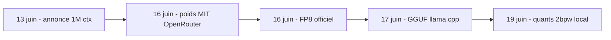
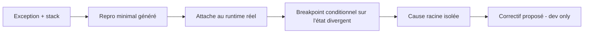

# Rapport hebdo — Semaine W25 (2026-06-15 → 2026-06-21 2026)

Près de 30 sujets marquants sur 4 catégories, dont 3 actives et une (Angular) en veille pour la deuxième semaine. Trois mouvements de fond traversent la semaine. D'abord une **semaine rouge côté sécurité** : avalanche de CVE critiques *activement exploitées* — Joomla JCE (CVSS 10.0), Splunk (9.8, RCE via PostgreSQL), UniFi OS (triple 10), NGINX HTTP/3, Cisco SD-WAN, Oracle PeopleSoft — plus une campagne supply-chain (1 500+ paquets AUR piégés). Ensuite, l'**IA open source bascule en local** : GLM-5.2 passe de l'annonce cloud au tout-local (FP8/GGUF/2 bpw) en six jours, au milieu d'une vague de portages on-device souverains. Enfin, côté **.NET, aucune release mais l'agent entre dans l'IDE et le débogueur**.

## Sécurité — semaine rouge, exploitation active

Le fil rouge de la semaine, c'est la vitesse entre divulgation et exploitation de masse. Trois failles sont passées au **catalogue CISA KEV** avec échéances très courtes : **Joomla JCE `CVE-2026-48907`** (CVSS **10.0**, RCE non authentifiée, exploitation *automatisée* — corrige en **2.9.99.5** et chasse les web shells, un patch ne retire pas une backdoor déjà posée), **Splunk `CVE-2026-20253`** (CVSS **9.8**, RCE pré-auth, deadline le week-end) et **Cisco SD-WAN Manager `CVE-2026-20262`** (2ᵉ faille SD-WAN en deux semaines). En parallèle, infra réseau et runtimes : **Ubiquiti UniFi OS** corrige *trois* CVSS 10 (RCE root non auth, ~100 000 instances exposées), **NGINX** patche en urgence un use-after-free HTTP/3 (`CVE-2026-42530`, CVSS 9.2 en v4 — passe en **1.31.2** ou coupe `quic`), et **Node.js** sort une salve de sécurité HIGH sur 26.x/24.x/22.x. Côté supply-chain, la campagne « Atomic Arch » a piégé **1 500+ paquets AUR** (voleur Rust + rootkit eBPF).

Deux leçons te concernent directement. **Splunk** transforme une écriture de fichier non authentifiée en RCE via `lo_export` de PostgreSQL : en tant qu'utilisateur Postgres, vérifie que ton rôle applicatif n'est ni superuser ni porteur de droits *large objects*.

```csharp
// PostgreSQL : le rôle applicatif peut-il abuser de lo_export (écriture -> RCE) ?
await using var conn = new NpgsqlConnection(connectionString);
await conn.OpenAsync();
await using var cmd = new NpgsqlCommand(
    "SELECT rolsuper, rolbypassrls FROM pg_roles WHERE rolname = current_user", conn);
await using var r = await cmd.ExecuteReaderAsync();
if (await r.ReadAsync() && (r.GetBoolean(0) || r.GetBoolean(1)))
    throw new InvalidOperationException("Role trop privilegie : lo_export exploitable.");
```

Seconde leçon, côté PHP/Symfony : **CodeIgniter `CVE-2026-48062`** (CVSS 9.8) rappelle de ne jamais valider un upload sur l'extension dérivée du type MIME — renomme (`getRandomName()`), stocke hors webroot, coupe l'exécution de scripts. Voir aussi le M365 Copilot « SearchLeak » (`CVE-2026-42824`, corrigé côté service) : l'injection indirecte de prompt est la nouvelle XSS — traite toute sortie LLM rendue en HTML comme hostile.

## IA open source — le frontier bascule en local

La story de la semaine est un **time-to-local** record. **GLM-5.2** (Z.ai, MoE coding-first, contexte **1M**) est passé de l'annonce (13 juin) aux poids **MIT** sur OpenRouter, puis au **FP8 officiel**, au **GGUF** communautaire, jusqu'à des **quants ~2 bpw** chargeables sur ta machine — le tout en six jours. Z.ai le présente comme « top frontend coding model » : signal, pas preuve, à valider sur ton repo.



Au-delà de GLM, la semaine industrialise le **on-device souverain** : **Apertus v1.1** (EPFL/ETH, *entièrement* ouvert) sort en **INT4 ONNX** — donc embarquable dans une appli **.NET** via `Microsoft.ML.OnnxRuntime`, offline, sans serveur d'inférence ; **VibeThinker-3B** (raisonneur MIT) et la pile audio **FunAudioLLM** (ASR + VAD, Apache-2.0) passent en GGUF ; **MiniMax-M3** arrive en MLX sur Apple Silicon. MLX et GGUF deviennent les deux cibles par défaut. Côté infra agents, durcis ta gateway : **LiteLLM** cumulait une chaîne de **4 CVE** (CVSS 9.9, un compte low-priv prend le serveur) — passe en `v1.83.14`+. À surveiller aussi : Microsoft **FastContext-1.0-4B** (explorateur de dépôt qui sépare exploration et résolution) et l'API **Bedrock `InvokeGuardrailChecks`** (safeguards composables par étape d'agent).

Le cas Apertus est le plus actionnable pour toi : INT4 ONNX = pas de serveur d'inférence, le modèle tourne **in-process** dans le runtime .NET, données jamais hors machine.

```csharp
// Apertus v1.1 INT4 ONNX embarqué offline dans une appli .NET (pas de gateway réseau)
using Microsoft.ML.OnnxRuntime;

var opts = new SessionOptions { GraphOptimizationLevel = GraphOptimizationLevel.ORT_ALL };
opts.AppendExecutionProvider_CPU();          // ou DML/CUDA selon la cible
using var session = new InferenceSession("apertus-v1.1-int4.onnx", opts);

// inputIds : tokens du prompt (tokenizer chargé en amont)
using var ids = OrtValue.CreateTensorValueFromMemory(inputIds, new long[] { 1, inputIds.Length });
var inputs = new Dictionary<string, OrtValue> { ["input_ids"] = ids };
using var results = session.Run(new RunOptions(), inputs, session.OutputNames);
// logits -> argmax -> token suivant, en boucle. Zéro octet ne quitte le process.
```

## Outillage .NET — l'agent entre dans le débogueur

Aucune release cette semaine : **.NET 11 Preview 5** (9 juin) reste la dernière, la **Preview 6** est attendue mi-juillet, GA en novembre. Le mouvement est dans l'outillage. **Visual Studio 2026** (update de juin) fait passer Copilot de la complétion au **débogage** : le *Debugger Agent* valide un bug contre le runtime réel, génère un repro minimal, pose tracepoints et breakpoints conditionnels, isole la cause racine et propose un correctif — réservé au dev, jamais branché sur la prod. **VS Code 1.124** bascule l'**Autopilot par défaut**, ajoute des sessions agent en arrière-plan et un **contexte 1M** (surveille tes crédits IA). Et le **.NET Day on Agentic Modernization** (16 juin) a cadré la migration assistée du legacy (Web Forms → Blazor, onboarding **Aspire**, Copilot modernization). Action concrète du jour, hors hype : applique le **servicing de juin** s'il manque — il touche **.NET 8 LTS**.

Comment ça marche : le *Debugger Agent* ne lit pas que ton code statique, il **attache un repro au runtime réel** et pose des breakpoints conditionnels là où l'état diverge. La boucle utile pour toi : tu lui donnes une exception et une stack, il isole la condition d'entrée, pas une hypothèse plausible mais fausse.



## Angular — deuxième semaine blanche post-v22

Aucune release, RFC ni advisory : l'écosystème digère toujours la GA de la **v22** (Signal Forms, Selectorless, `httpResource`, zoneless par défaut, TypeScript 6 requis). Rien d'urgent à migrer — comme la semaine W24. Profite du calme pour consolider tes patterns Signal Forms, vérifier que ta CI est bien passée à **TypeScript 6**, et auditer tes derniers usages de `NgZone` avant de basculer en zoneless. Premier patch mineur **v22.1** attendu après la GA (surtout correctifs Signal Forms et migrations).

Comment ça marche : en **zoneless**, Angular ne patche plus les API async via Zone.js — la détection de changement n'est plus déclenchée « magiquement » après un `setTimeout` ou un `addEventListener` hors framework. Le piège : un état muté hors d'un signal ne re-render plus. L'audit consiste à remplacer ces mutations par des signaux.

```ts
// AVANT (zone.js) — la mutation hors signal re-render quand même, par magie de Zone
export class Ticker {
  count = 0;
  start() { setInterval(() => this.count++, 1000); } // OK en zonefull, figé en zoneless
}

// APRÈS (zoneless) — l'état est un signal : la vue se met à jour de façon déterministe
export class Ticker {
  count = signal(0);
  start() { setInterval(() => this.count.update(c => c + 1), 1000); }
}
```

## À retenir si tu n'as qu'une minute

- **Patche en urgence** ce que tu opères : **Joomla JCE 2.9.99.5** (CVSS 10, exploité), **Splunk 10.2.4/10.0.7** (RCE pré-auth), **NGINX 1.31.2** (HTTP/3), **UniFi OS** (triple 10), salve **Node.js** 24.x LTS.
- **PostgreSQL** : vérifie que ton rôle applicatif n'est pas superuser / *large objects* — `lo_export` change une écriture de fichier en RCE (leçon Splunk).
- **GLM-5.2** est exécutable en local (GGUF/FP8, licence MIT) : essai comparatif sur ton repo possible pour le coût d'un téléchargement.
- **Apertus v1.1 INT4 ONNX** embarque un LLM ouvert dans une appli **.NET** (`Microsoft.ML.OnnxRuntime`), offline.
- **.NET** : rien à installer, **Preview 6** mi-juillet ; applique le **servicing de juin** sur **.NET 8 LTS**.
- **Angular** : deuxième semaine sans action requise — stabilise Signal Forms et finis ta migration TypeScript 6.

## Index de la semaine

- **Tech** : semaine rouge — CVE critiques exploitées (Joomla, Splunk, UniFi, NGINX, Cisco, PeopleSoft), supply-chain AUR, plus Apple Container 1.0 et Linux 7.1 — ~13 sujets sur la semaine
- **IA** : le frontier bascule en local (GLM-5.2 cloud→GGUF), portages souverains on-device et durcissement des gateways — ~13 sujets sur la semaine
- **CSharp** : pas de release, l'agent entre dans l'IDE/débogueur (VS 2026, VS Code 1.124, .NET Day) — ~4 sujets sur la semaine
- **Angular** : deuxième semaine blanche, consolidation post-GA v22 — synthèse seule

---
*Généré le 2026-06-20 par la routine `weekly` (Claude Cowork). Couvre 2026-06-15 → 2026-06-21 (semaine ISO W25), sur la base des digests disponibles jusqu'au 20 juin. Rapport produit le samedi 20 — en amont du créneau lundi habituel ; le dimanche 21 restait ouvert au moment de la génération.*
