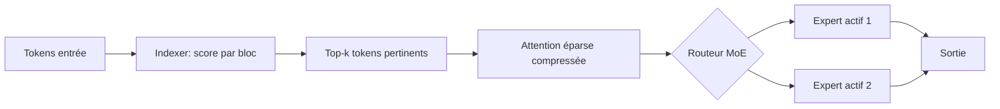
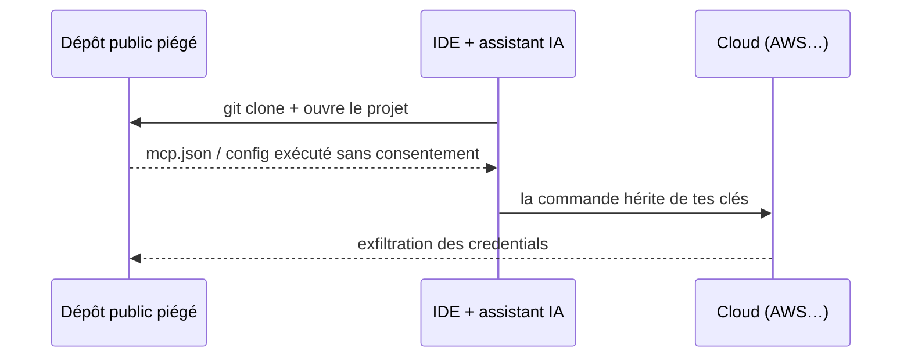

# Rapport hebdo — Semaine W26 (2026-06-22 → 2026-06-28)

Semaine dense : une trentaine de sujets sur les 4 catégories actives, tirée par une **déferlante sécurité** (13 CVE en 7 jours, dont trois CVSS 10 le même jour) et une **vague open-weight agentique** côté IA. Trois mouvements de fond traversent la semaine. D'abord, le **MCP est partout** — diagnostic de build .NET, harnais d'agents, UI générées… et nouvelle surface d'attaque. Ensuite, le **« config locale du dépôt = code exécutable »** devient la leçon sécu numéro un. Enfin, l'**open-weight** (MIT/Apache) s'impose comme socle d'auto-hébergement, pendant que TypeScript bascule son compilateur en natif Go.

## 🏆 Top de la semaine

### 1. TypeScript 7.0 RC — le `tsc` natif en Go, ~10× plus rapide

Microsoft a publié la **RC** du compilateur TypeScript réécrit en **Go** (GA annoncée « dans le mois »). Le portage est volontairement *ligne à ligne* : ta sémantique de typage ne change pas, mais l'exécution devient parallèle (plusieurs *checker workers*) et le type-check tourne **environ 10× plus vite**. Comme chaque build Angular et chaque frappe dans ton IDE passent par `tsc`, c'est le gain d'outillage le plus tangible de l'année — au prix de deux pièges de migration.

```bash
npm install -D typescript@rc      # le binaire tsc fourni est désormais en Go
npx tsc --version                 # Version 7.0.x-rc
npx tsc --checkers 4 --builders 2 # monorepo : ajuste selon CPU/RAM du runner CI
```

```diff
  {
    "compilerOptions": {
+     "rootDir": "./src",          // 7.0 met rootDir à "./" par défaut
+     "types": ["node", "jest"]    // 7.0 met types à [] par défaut
    },
    "include": ["./src"]
  }
```

Les anciens flags dépréciés (`baseUrl`, `moduleResolution: node`, `target: es5`) deviennent des **erreurs dures** : teste sur une branche et garde un alias `tsc6` comme filet le temps que tes outils suivent. Source : [TypeScript Blog](https://devblogs.microsoft.com/typescript/announcing-typescript-7-0-rc/).

### 2. DeepSeek-V4-Pro-DSpark — 889B MoE FP8, le million de tokens (MIT)

`deepseek-ai` a publié la variante haut de gamme officielle : **~889 Md de paramètres**, poids **MIT**, **FP8** natif. Le couple gagnant pour le contexte long : un **Mixture-of-Experts** (seuls quelques experts s'activent par token) plus une **Compressed Sparse Attention** — un *indexer* score les positions par blocs, sélectionne un **top-k** de tokens pertinents, et ne calcule l'attention que sur ce sous-ensemble. Résultat : un contexte au **million de tokens** soutenable sans saturer le KV cache.



Pour toi, le dimensionnement change : tu raisonnes en **paramètres actifs** et en **taille de KV cache**, pas en paramètres totaux. MIT = hébergeable derrière ton API .NET sans contrainte commerciale, mais 889 Md même en FP8 exigent du multi-GPU sérieux. Source : [Hugging Face](https://hf.co/deepseek-ai/DeepSeek-V4-Pro-DSpark).

### 3. Sécurité — un fichier de config local au dépôt est du code exécutable

Le sujet sécu numéro un de la semaine est un *pattern*, pas un produit. **Amazon Q** (CVE-2026-12957) exécutait le `.amazonq/mcp.json` d'un dépôt **dès l'ouverture du projet, sans consentement** — la commande héritait de tes clés AWS, tokens CLI et socket `ssh-agent`. Même classe de faille que **Gemini CLI** (CVE-2026-12537, CVSS **10**) : une entrée de dépôt (nom de branche, contenu de PR) concaténée dans un shell devient une commande. La frontière donnée/code disparaît dès qu'un shell ou un runtime d'agent entre en jeu.



```js
// Même classe de bug côté CLI : entrée de dépôt envoyée dans un shell
const { execFile } = require("node:child_process");
execFile("git", ["log", `--grep=${userInput}`]); // binaire + args : aucun shell, rien n'est réinterprété
```

Traite tout `.amazonq/`, `.vscode/` ou `mcp.json` venu d'un repo tiers comme du code. MAJ : Amazon Q **Language Servers for AWS ≥ 1.65.0**. Source : [Wiz Research](https://www.wiz.io/blog/amazon-q-vulnerability).

## 🅰️ Angular — tsc natif Go et UI par agents

Le vrai game-changer outillage de la semaine pour toi est **TypeScript 7.0 RC** (cf. Top) : adoption à venir via Nx/`tsgo` pour accélérer le typecheck des gros workspaces. Côté framework, **Angular 22 reste en maintenance** (ère signal-first : Signal Forms, selectorless, zoneless), sans v23 à l'horizon. Le sujet neuf est **A2UI 1.0 RC** : un **protocole** (pas un framework) pour que les agents IA décrivent une UI sérialisée en JSON, **rendue nativement** par ta stack Angular — donc **sans `eval` d'HTML généré** ni faille d'injection.

```json
{
  "version": "v0.9",
  "updateComponents": {
    "surfaceId": "main",
    "components": [
      { "id": "root",  "component": "Column", "children": ["title", "body"] },
      { "id": "title", "component": "Text",   "text": "Bienvenue" },
      { "id": "body",  "component": "Text",   "text": { "path": "/message" } }
    ]
  }
}
```

Le pattern « événement → action mappée → requête à l'agent » garde la logique métier côté serveur, où tu peux l'auditer. C'est du GenUI gouvernable. Source : [Angular Blog](https://blog.angular.dev/demystifying-a2ui-how-to-make-ai-agents-speak-ui-in-your-app-e1ffea2303bd).

## 🔷 CSharp / .NET — l'outillage prend le pas

Trois sorties d'outillage, zéro release runtime (on reste entre **.NET 11 Preview 5** et Preview 6). **Aspire 13.4** promeut l'**apphost TypeScript en GA** : tu décris ton stack mixte (.NET + Angular + Postgres) en code-first, et l'orchestration, le service discovery et la télémétrie OpenTelemetry sont câblés pour toi. Le **Binlog MCP Server** expose un `.binlog` MSBuild à un agent (15 outils : tracer une propriété, comparer deux builds). Et **.NET MAUI** passe Android en **Material 3** via une seule propriété `<UseMaterial3>`.

```typescript
import { createBuilder } from './.aspire/modules/aspire.mjs';
const builder = await createBuilder();

const db = await builder.addPostgres('pg').addDatabase('appdb');
await builder.addProject('api', '../Api/Api.csproj').withReference(db); // API .NET + Postgres câblés
await builder.build().run();   // dashboard, OTel et service discovery : automatiques
```

À noter côté sécu : la faille **Amazon Q / MCP** (cf. Top) touche aussi les Language Servers embarqués dans **Visual Studio** — mets l'extension à jour. Source : [Aspire Blog](https://devblogs.microsoft.com/aspire/whats-new-aspire-13-4/).

## 🤖 IA — l'open-weight agentique déferle

Au-delà de DeepSeek-V4 (Top), la semaine confirme une bascule : le **coding agentique en poids ouverts** devient crédible et auto-hébergeable. **poolside Laguna M.1/XS.2** (Apache 2.0, MoE, ~46,9 % SWE-Bench Pro), **DeepReinforce Ornith-1.0** (MIT, qui apprend à écrire son propre *scaffold* RL), **Qwen-AgentWorld** (world models pour faire du *dry-run* d'actions avant exécution) et le harnais **CUGA** d'IBM (tu ne fournis qu'outils + prompt) couvrent toute la chaîne. En parallèle : **LiquidAI LFM2.5-230M** vise l'edge (213 tok/s sur un Galaxy S25), **Baidu Unlimited-OCR** (MIT) structure tes PDF en JSON, **Krea-2** génère du 2K en ~2 s, et **vLLM 0.23** passe à CUDA 13.

```bash
# Servir un modèle de code agentique open-weight, API compatible OpenAI
vllm serve poolside/Laguna-XS.2 --quantization fp8 --max-model-len 65536
# ou un MoE qui n'active que ~3B/token, en local sur un bon workstation :
llama-server -m ./Ornith-1.0-35B-Q4_K_M.gguf -c 32768 --port 8080 --jinja
```

Le fil rouge : ton code propriétaire ne quitte plus ton réseau, et tu raisonnes en *paramètres actifs*. Sources : [poolside](https://poolside.ai/blog/introducing-laguna-xs2-m1), [Ornith-1.0](https://huggingface.co/deepreinforce-ai/Ornith-1.0-35B).

## 📡 Tech — 13 CVE : la chaîne dev/IA visée

Semaine record côté sécurité, et la cible est claire : **tes outils de dev et ta CI/CD**. Le 26 juin, **triple CVSS 10** sur des briques quotidiennes — **Gemini CLI** (injection OS), **Gogs** (path traversal → hook Git → RCE) et **Rclone rcd** (RCE non auth via GET/HEAD). Côté noyau, deux LPE multi-tenant : **ssh-keysign-pwn** (CVE-2026-46333, vol de fd vers root) et **DirtyClone** (CVE-2026-43503, qui rouvre le trou que DirtyFrag avait bouché, branches 6.1→6.12). Côté supply chain, **Klue → LastPass** montre qu'un **token OAuth** volé chez un intégrateur lit ton Salesforce sans MFA. La parade transversale : arrête de courir après tous les CVSS ≥ 9, **priorise par exploitation réelle** via le catalogue **CISA KEV**.

```csharp
// Croise le flux CISA KEV (failles exploitées DANS LA NATURE) avec TES vendors
using System.Net.Http.Json;
record Kev(List<V> vulnerabilities);
record V(string cveID, string vendorProject, string product, string dueDate);

using var http = new HttpClient();
var kev = await http.GetFromJsonAsync<Kev>(
  "https://www.cisa.gov/sites/default/files/feeds/known_exploited_vulnerabilities.json");

string[] maStack = ["Microsoft", "PostgreSQL", "nginx", "Cisco"];
var urgent = kev!.vulnerabilities.Where(v => maStack.Contains(v.vendorProject))
                                 .OrderBy(v => v.dueDate);   // dueDate KEV = priorité
foreach (var v in urgent)
  Console.WriteLine($"{v.cveID} {v.vendorProject}/{v.product} -> {v.dueDate}");
// urgent non vide => exit code != 0 => casse la pipeline avant le déploiement
```

Branche ce diff KEV en job CI quotidien : tu patches sur preuve, pas sur l'angoisse. Source : [CISA KEV](https://www.cisa.gov/known-exploited-vulnerabilities-catalog).

## À retenir si tu n'as qu'une minute

- **TypeScript 7.0 RC** : teste le `tsc` Go sur une branche ; attends-toi à `rootDir`/`types` cassés et aux flags dépréciés devenus erreurs. GA imminente, ~10× sur le type-check.
- **DeepSeek-V4-Pro-DSpark** (MIT, FP8, 1M tokens) : raisonne en paramètres *actifs* + taille de KV cache, pas en paramètres totaux.
- **Sécurité #1** : tout `.amazonq/`, `.vscode/`, `mcp.json` d'un repo tiers est du **code**. MAJ Amazon Q (Language Servers ≥ 1.65.0), Gemini CLI, Gogs, Rclone.
- **Noyaux Linux** : patche tes hôtes multi-tenant (**DirtyClone** 6.1→6.12) et retire `CAP_NET_ADMIN` aux conteneurs qui n'en ont pas besoin.
- **Priorisation** : un diff **CISA KEV** quotidien en CI vaut mieux que la chasse au CVSS élevé.

## Index de la semaine

- **Angular** : TS 7.0 RC (tsc Go ~10×) + A2UI 1.0 (GenUI) ; v22 en maintenance — 2 sujets.
- **CSharp** : Aspire 13.4 (apphost TS en GA), Binlog MCP Server, MAUI Material 3 — 3 sujets.
- **IA** : déferlante open-weight agentique (DeepSeek-V4, Laguna, Ornith, AgentWorld, CUGA), edge (LFM2.5-230M), OCR (Unlimited-OCR), image (Krea-2), infra (vLLM 0.23, Latent Context LMs) — 12 sujets.
- **Tech** : 13 CVE — config=code (Amazon Q, Gemini CLI), triple CVSS 10 (Gemini/Gogs/Rclone), kernel LPE (DirtyClone, ssh-keysign-pwn), supply chain (Klue→LastPass), FortiBleed, CISA KEV — 13 sujets.

---
*Généré le 2026-06-29 par la routine `weekly` (Claude Cowork). Couvre 2026-06-22 → 2026-06-28.*
