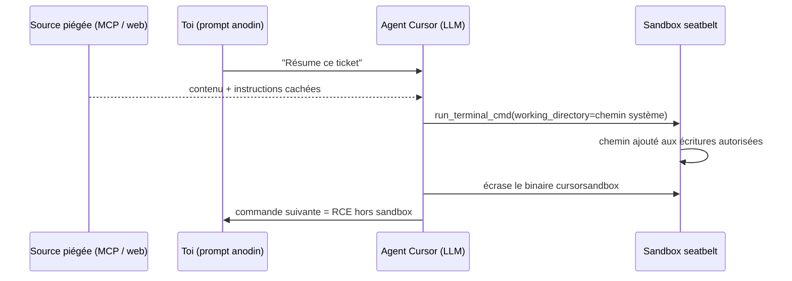
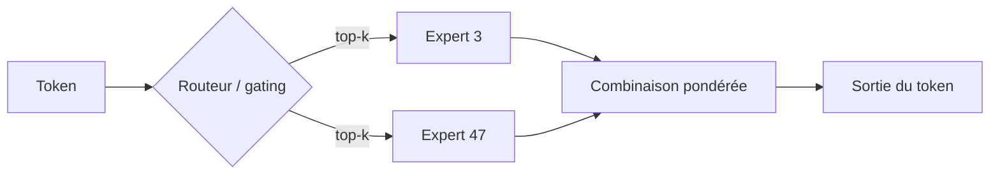

# Rapport hebdo — Semaine W27 (2026-06-29 → 2026-07-05)

Semaine à deux vitesses : une avalanche sécurité (une douzaine de CVE critiques, plusieurs exploitées et ajoutées au CISA KEV) et une salve open-weight côté IA, pendant qu'Angular et .NET consolident. Trois mouvements de fond traversent les jours. D'abord, **la surface d'attaque a glissé vers ton poste de dev** : Cursor, les IDE JetBrains et Langflow deviennent des vecteurs RCE. Ensuite, **l'IA agentique open-weight atteint le niveau frontier** tout en restant self-hostable (Agents-A1, LongCat-2.0, Leanstral). Enfin, **MCP est partout** — scaffolder .NET, `angular/skills`, et… vecteur d'attaque. En toile de fond, deux échéances de migration se rapprochent : fin de support .NET 8/9 et GA de TypeScript 7.0.

## 🏆 Top de la semaine

### 1. Ton poste de dev est la nouvelle cible (DuneSlide, JetBrains, Langflow)

Le fil rouge le plus important de la semaine n'est pas une faille serveur, mais le glissement de la cible vers **l'agent de code et l'IDE**. Cursor (DuneSlide, `CVE-2026-50548/50549`, CVSS 9.8) tombe par **injection de prompt zero-click** : un contenu piégé lu via un serveur MCP « légitime » (Linear) ou une recherche web pousse l'agent à écraser son propre binaire de sandbox → RCE hors bac à sable. En parallèle, JetBrains corrige une cascade (RCE au simple **chargement d'un projet** cloné, `CVE-2026-53915`) et Langflow se fait miner du Monero 20 h après l'advisory.

Comment marche le zero-click : tu ne cliques rien, l'agent lit une source non fiable qui contient des instructions cachées, et son auto-exécution shell (sans validation depuis Cursor 2.x) les applique.



Action : Cursor ≥ 3.0, IDE JetBrains à jour (Rider/WebStorm/DataGrip), « Trusted Locations = Ask », et traite **chaque sortie MCP/web comme non fiable**. Détails : https://www.catonetworks.com/blog/duneslide-two-critical-rce-vulnerabilities/

### 2. .NET 8 et .NET 9 : fin de support le 10 novembre 2026

Microsoft a confirmé (29 juin) que **.NET 8 (LTS) et .NET 9 (STS) meurent le même jour**, le 10 novembre 2026 : plus aucun correctif de sécurité ensuite. La cible est **.NET 10 LTS** (supporté jusqu'en novembre 2028). Le calcul est logique : LTS = 36 mois (8 → nov. 2026), STS = 24 mois (9 → nov. 2026), les deux fenêtres se referment au même Patch Tuesday.

La migration de base tient dans le `TargetFramework`, mais épingle aussi le SDK pour ta CI.

```xml
<!-- Avant -->
<PropertyGroup>
  <TargetFramework>net8.0</TargetFramework>
</PropertyGroup>
<!-- Après : .NET 10 LTS (support jusqu'en nov. 2028) -->
<PropertyGroup>
  <TargetFramework>net10.0</TargetFramework>
</PropertyGroup>
```

```bash
# Reproductibilité CI + migration guidée
dotnet new globaljson --sdk-version 10.0.100 --force
dotnet tool install -g upgrade-assistant
upgrade-assistant upgrade ./MonApi.csproj   # puis relire les breaking changes .NET 10
```

Tu as sûrement des services en .NET 8 « parce que c'est du LTS » : ce LTS expire dans quatre mois. Planifie dès maintenant. Source : https://devblogs.microsoft.com/dotnet/dotnet-8-9-end-of-support/

### 3. L'agentique open-weight atteint le frontier (Agents-A1, LongCat-2.0)

Deux sorties chinoises marquent la semaine côté IA. **Agents-A1** (InternScience, Apache 2.0) est un **MoE 35B à ~3B actifs** qui revendique le SOTA sur GAIA (96,0) et BrowseComp (75,5) — la thèse du papier, *« Scaling the Horizon, Not the Parameters »*, mise sur la tenue de tâches longues plutôt que la taille. **LongCat-2.0** (Meituan, MIT, 1,6 T) marque 59,5 sur SWE-bench Pro, devant GPT-5.5, et aurait été entraîné sans NVIDIA.

Le point commun : le **Mixture-of-Experts**. Un routeur n'active qu'une poignée d'experts par token, d'où le coût d'inférence d'un petit modèle pour la capacité d'un gros.



Concrètement : un 35B-A3B tient des workflows longs (triage d'issues, exploration de repo, astreinte) que tu peux **héberger toi-même** sur tes données, licence commerciale incluse. À valider en POC — les benchmarks agentiques flattent au-delà du réel. Source : https://huggingface.co/InternScience/Agents-A1

## 🔒 Sécurité — le poste de dev visé

Au-delà des outils dev, la semaine a déversé un torrent de **RCE pré-auth sur des infras d'entreprise**, plusieurs exploitées dans la nature et poussées au CISA KEV : PTC Windchill (`CVE-2026-12569`, désérialisation), Cisco CUCM (RCE → root), Progress Kemp LoadMaster (`CVE-2026-8037`, root pré-auth), Oracle E-Business Suite (`CVE-2026-46817`, prise de contrôle), Citrix NetScaler « CitrixBleed » (`CVE-2026-8451`, fuite mémoire exploitée en < 24 h) et SharePoint (`CVE-2026-45659`, deadline fédérale 4 juillet). Deux causes racines reviennent en boucle sur la semaine : la **désérialisation d'entrée non fiable** (Windchill le 29/06, SharePoint le 03/07) et l'**injection shell** (CUCM le 30/06, Kemp le 01/07).

La leçon la plus réutilisable côté .NET, c'est la désérialisation : ne laisse jamais l'attaquant choisir le type instancié.

```csharp
// AVANT — dangereux : le flux JSON porte le type à instancier
var bad = new JsonSerializerSettings {
    TypeNameHandling = TypeNameHandling.All   // l'attaquant choisit la classe -> gadget
};
var obj = JsonConvert.DeserializeObject<Payload>(untrusted, bad);

// APRÈS — sûr : pas de type dans le flux + allow-list stricte
var safe = new JsonSerializerSettings {
    TypeNameHandling = TypeNameHandling.None,        // ignore $type
    SerializationBinder = new AllowListBinder()      // n'autorise que tes types connus
};
var ok = JsonConvert.DeserializeObject<Payload>(untrusted, safe);
```

Même réflexe pour le shell : passe les arguments en tableau (`ArgumentList`, `shell=False`), jamais une chaîne interpolée. Et applique aux entrées KEV un SLA de patch serré — une entrée au catalogue = exploitation réelle. Catalogue : https://www.cisa.gov/known-exploited-vulnerabilities-catalog

## 🤖 IA open-weight — locale et souveraine

Sous la couche « frontier », le vrai fil rouge actionnable est l'**IA locale et privée**. Ollama 0.31 active le **multi-token prediction** par défaut : Gemma 4 grimpe jusqu'à +90 % sur Apple Silicon sans changer une ligne ni altérer la sortie. Google publie **TabFM**, un foundation model **tabulaire** zero-shot (classification/régression en une passe, bientôt en SQL via BigQuery `AI.PREDICT`). Mistral sort **Leanstral 1.5** (Apache 2.0), spécialisé preuve formelle Lean 4 — miniF2F saturé, 5 bugs réels trouvés en dépôts open source. Et **Rampart** masque les PII **entièrement dans le navigateur**.

Rampart est le plus directement utile pour toi (Angular + RGPD) : un MiniLM ONNX tourne côté client via transformers.js, donc aucune PII ne part vers l'API avant nettoyage.

```ts
// npm i @huggingface/transformers
import { pipeline } from '@huggingface/transformers';

// Modèle ONNX chargé et caché côté client, une seule fois
const redactor = await pipeline('token-classification',
  'nationaldesignstudio/rampart');

const text = 'Contacte Charles au 06 12 34 56 78 ou charles@exemple.fr';
const spans = await redactor(text);

// Masque de la fin vers le début pour ne pas décaler les offsets
let masked = text;
for (const s of spans.sort((a, b) => b.start - a.start)) {
  masked = masked.slice(0, s.start) + `[${s.entity.replace(/^[BI]-/, '')}]` + masked.slice(s.end);
}
// -> "Contacte [PERSON] au [PHONE] ou [EMAIL]"
```

À garder comme **défense en profondeur**, pas comme unique garde-fou (le rappel sur formats rares reste imparfait). Source : https://hf.co/nationaldesignstudio/rampart

## 🔷 .NET — échéances et MCP natif

Hors l'échéance EOL (voir Top), le cycle est calme : **Preview 5** reste la dernière préversion .NET 11, la **Preview 6** est attendue courant juillet et le prochain servicing tombe au **Patch Tuesday du 14 juillet**. Côté nouveautés déjà posées : **SkiaSharp 4.148.0**, première stable de la v4 (moteur Skia m148, rendu jusqu'à +24 % sur GPU, fin d'une classe de crashes use-after-free), et les **apps mono-fichier** qui s'ouvrent au multi-fichiers via `#:ref`. Rappel outillage : mets à jour **Rider/DataGrip** (failles JetBrains, voir Sécurité).

Le sujet structurant reste **MCP traité en cible de première classe** : `dotnet new mcpserver` est bundle dans le SDK 11 Preview 5, sans installation. Tu exposes ton métier .NET comme outils pour un agent, en gardant du C# typé et testable.

```csharp
using ModelContextProtocol.Server;
using System.ComponentModel;

[McpServerToolType]                       // classe scannée par WithToolsFromAssembly()
public static class EchoTool
{
    [McpServerTool, Description("Renvoie le message reçu.")]  // exposé à l'agent
    public static string Echo(string message) => $"Réponse C# : {message}";
}
// Program.cs : AddMcpServer().WithStdioServerTransport().WithToolsFromAssembly();
```

À relier au Top sécurité : une config MCP est du **code exécutable** — traite-la comme telle. Source : https://devblogs.microsoft.com/dotnet/build-a-model-context-protocol-mcp-server-in-csharp/

## 🅰️ Angular — cap sur TypeScript 7.0

Semaine volontairement calme et assumée : **Angular 22** reste le socle stable (Signal Forms, Selectorless, `httpResource`, OnPush par défaut, MCP dans la CLI), en consolidation post-GA avec des patches `22.0.x` mais aucune feature neuve. Deux signaux de fond méritent ton attention. Le premier : l'outillage s'aligne sur l'agentique — les **Agent Skills officiels** (`angular/skills`) et **Nx 22.x** (Vitest par défaut, cap sur `tsgo`). Le second, le plus concret : **TypeScript 7.0** vise une **GA imminente** (RC du 18 juin).

TypeScript 7.0, c'est le remplacement du compilateur `tsc` (écrit en TS) par un **portage natif en Go** (`tsgo`) : même langage, même sémantique de types, mais un type-check annoncé **~10× plus rapide** sur gros monorepos. Tu peux déjà le tester en parallèle de ta chaîne actuelle.

```bash
# Essayer le compilateur natif Go en parallèle de tsc, sans rien casser
npm i -D @typescript/native-preview
npx tsgo --noEmit        # type-check natif : compare le temps vs `npx tsc --noEmit`
# Migration réelle à préparer pour la GA (impact CLI Angular, Nx, VS 2026)
```

Rappel EOL : **Angular v19** est en fin de vie depuis mai — si tu traînes une v19, planifie le saut vers v22. Roadmap : https://angular.dev/roadmap

## À retenir si tu n'as qu'une minute

- **Patche ton poste de dev** : Cursor ≥ 3.0, IDE JetBrains à jour (Rider/WebStorm/DataGrip), « Trusted Locations = Ask ».
- **.NET 8 et .NET 9 : EOL le 10 novembre 2026** → migre vers **.NET 10 LTS** dès maintenant (bump `TargetFramework` + `global.json`).
- **Sécurité serveur** : 6+ CVE pré-auth exploitées au CISA KEV cette semaine (Windchill, CUCM, Kemp, Oracle EBS, NetScaler, SharePoint) — vérifie ton exposition.
- **IA self-hostable** : Agents-A1 (35B-A3B, Apache) et LongCat-2.0 (1,6 T, MIT) pour l'agentique ; Ollama 0.31 (+90 % Gemma 4 local) ; Rampart pour du masquage PII 100 % navigateur.
- **TypeScript 7.0 GA imminente** : teste `tsgo` (`@typescript/native-preview`) avant la bascule.

## Index de la semaine

- **Tech** : déluge sécurité, la cible passe aux outils dev + RCE pré-auth serveur — 12 sujets sur la semaine
- **IA** : vague open-weight (agentique, tabulaire, preuve formelle, PII locale) — 6 sujets sur la semaine
- **CSharp** : échéance EOL .NET 8/9, MCP natif, SkiaSharp v4, apps mono-fichier — 4 sujets + statut de cycle
- **Angular** : consolidation Angular 22, cap sur TypeScript 7.0 et l'agentique — 4 sujets (semaine calme)

---
*Généré le 6 juillet 2026 par la routine `weekly` (Claude Cowork). Couvre 2026-06-29 → 2026-07-05.*
