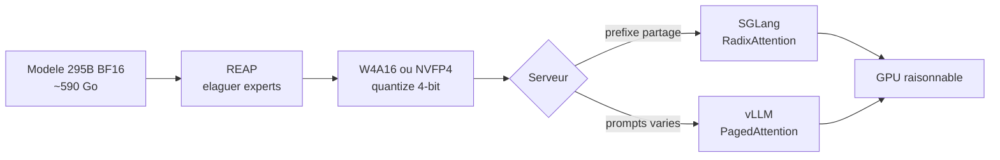
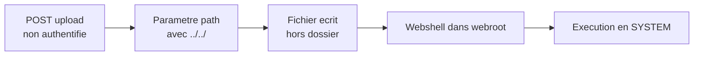

# Rapport hebdo — Semaine W28 (2026-07-06 → 2026-07-12)

Semaine à trois secousses, **31 sujets marquants** sur **4 catégories actives**. Un : **TypeScript 7.0** passe stable — le compilateur réécrit en Go arrive, avec un type-check jusqu'à ~10× plus rapide, mais il ne débloque pas encore l'éditeur Angular. Deux : côté IA, l'**auto-hébergement d'un modèle open-weight frontier devient réaliste**, porté par une chaîne complète élagage → quantization 4-bit → serving. Trois : **semaine noire de la sécurité** — deux escalades root noyau (Bad Epoll, GhostLock), le tournant `npm v12`, et une salve de failles pré-auth sur les appliances de bordure. Fil rouge discret mais net : l'IA infuse la BDD et l'outillage (recherche vectorielle native dans EF Core 10, diagnostics MCP en CI).

## 🏆 Top de la semaine

### 1. TypeScript 7.0 stable — le compilateur natif Go débarque

Après un portage annoncé en 2025, `tsc` réécrit en **Go** devient GA le 8 juillet. Les gains sont d'un ordre de grandeur : VS Code passe de **125,7 s à 10,6 s** de build (11,9×), Slack voit son type-check CI tomber de **7,5 min à 1,25 min**. Trois leviers : code natif (plus de JIT V8 ni GC JS), **type-check multi-worker** (`--checkers 4` par défaut, découpage déterministe), et un language server passé à **LSP** (−80 % de commandes en échec). Le piège : TS 7 durcit les défauts et transforme les dépréciations en **erreurs dures**.

```jsonc
// Avant (TS 6.0) — options implicites, tolérées
{
  "compilerOptions": {
    "target": "es5",            // supprimé en 7.0 -> erreur dure
    "baseUrl": ".",             // supprimé en 7.0 -> erreur dure
    "moduleResolution": "node"  // -> passer à bundler / nodenext
  }
}
// Après (TS 7.0) — défauts durcis, types explicites
{
  "compilerOptions": {
    "module": "esnext",
    "moduleResolution": "bundler",
    "rootDir": "./src",
    "types": ["node"]           // défaut = [] : liste tes @types
  }
}
```

Point clé pour toi : TS 7 **n'expose pas d'API programmatique**, donc `typescript-eslint`, Volar et le **type-checking des templates Angular** restent sur TS 6.0. La bonne recette dès maintenant : `tsc` TS 7 en job CI (build rapide), TS 6.0 côté éditeur, installés côte à côte via alias npm. C'est TypeScript **7.1** qui débloquera le natif pour Angular. Détails : https://devblogs.microsoft.com/typescript/announcing-typescript-7-0/

### 2. Auto-héberger un LLM frontier devient réaliste

La semaine empile les briques qui rendent un open-weight géant réellement servable. Tencent publie **Hy3**, un MoE **295B-A21B** (192 experts, top-8), **256K** de contexte, Apache 2.0 — mais **~590 Go de VRAM** en BF16. Puis arrivent les leviers de compression : **REAP** élague les experts inutiles en one-shot (−50 % d'experts, ≤ 2 % de perte sur le code), **llm-compressor** sort des poids **W4A16** (un 32B passe de 64 Go à ~18-20 Go), et **NVFP4** apporte le FP4 matériel des Tensor Cores Blackwell (~2× vs FP8). Côté serveur, le choix se joue sur le KV cache.



Comment lire le diagramme : **PagedAttention** (vLLM) découpe le KV cache en pages non contiguës — idéal pour des prompts tous différents ; **RadixAttention** (SGLang) met en cache le préfixe commun (prompt système + contexte RAG) et ne le calcule qu'une fois — jusqu'à **6,4×** de débit sur des charges à préfixe partagé. Combine élagage + 4-bit et un 295B « inservable » vise un serveur multi-GPU au lieu d'un cluster. Réflexe : mesure ton **taux de partage de préfixe** réel avant de choisir le moteur.

### 3. Semaine noire de la sécurité — de la supply-chain au root

Deux **use-after-free noyau** offrent le root local à n'importe quel process : **Bad Epoll** (CVE-2026-46242, ~99 % de réussite) et **GhostLock** (CVE-2026-43499, une race dans l'héritage de priorité des futex, dormante depuis 15 ans, ~5 s / 97 %, avec **évasion de conteneur**). En parallèle, `npm v12` (attendu fin juillet) retourne un défaut vieux de 16 ans : `allowScripts` passe **off**, coupant l'exécution implicite des scripts d'install — le vecteur de Shai-Hulud, Axios et Miasma. Ne subis pas la bascule, prépare-la :

```bash
# N'attends pas v12 : bascule en mode advisory dès aujourd'hui
npm install -g npm@11.16.0
npm approve-scripts --allow-scripts-pending   # liste ce que v12 bloquera (3-8 pkgs)

# Approuve SEULEMENT les paquets à addon natif, refuse le reste
npm approve-scripts sharp bcrypt
git add package.json && git commit -m "chore: npm v12 allowlist"
# En CI : --strict-allow-scripts + smoke test qui require() tes modules .node
```

Le piège de v12 : un addon natif bloqué fait sortir `npm install` en **code 0** silencieux, l'erreur ne surgit qu'au runtime (`cannot find module X.node`). Migre pendant que tu contrôles le timing. Et retiens le fil rouge de la semaine : la fenêtre divulgation → exploitation se compte désormais **en heures** (ColdFusion CVE-2026-48282 exploité le jour même).

## 🅰️ Angular — Signal Forms typées, TS 7 en fond

Cœur du framework calme : **Angular 22** reste stable depuis juin (Signal Forms, `httpResource`/`rxResource` et zoneless en GA, `OnPush` et `fetch` par défaut), dernier patch **22.0.5** le 1er juillet. L'actualité est pédagogique et outillage. Le sujet TypeScript 7 (voir Top) domine : Visual Studio 2026 l'active automatiquement selon le workspace, gare aux solutions mixtes ASP.NET Core + front TS avec un `tsconfig.json` legacy. Côté tests, la newsletter du 7 juillet remet en avant le **Vitest Full Browser Mode** (composant monté dans un vrai Chromium piloté par Playwright, pour attraper les bugs de focus/z-index/overflow que `jsdom` laisse passer) et les **Extended Diagnostics** du compilateur (`invalidBananaInBox` en `error` casse le build sur un `([ngModel])` inversé). Le raffinement le plus concret pour ton quotidien : `getError()` typé dans Signal Forms.

```typescript
// Avant : accès brut aux erreurs, non typé (any implicite)
@if (loginForm.email().errors()?.['required']) {
  <span>Email requis</span>
}
// Après (Angular 22) : getError() -> type réduit par narrowing, complétion IDE
@if (loginForm.email().getError('required'); as err) {
  <span>{{ err.message }}</span>   <!-- l'IDE connaît la forme de err -->
}
```

Le narrowing est purement statique (zéro coût runtime) : TypeScript associe le littéral `'required'` à la signature du validateur déclaré dans `form(model, schema)`. À surveiller : `@boundary` en developer preview pour le T3 2026, Webpack déprécié en v22, et **Angular v19 en fin de vie depuis mai 2026** — planifie le saut vers v22.

## 🔷 CSharp / .NET — EF Core 10 monte en puissance

Creux estival côté runtime (on reste sur **.NET 11 Preview 5**, Preview 6 attendue mi-juillet, GA novembre 2026), mais **EF Core 10** (LTS, livré avec .NET 10) concentre trois avancées très actionnables. D'abord les **filtres de requête nommés** : fini le filtre global unique qui écrasait le précédent et le `IgnoreQueryFilters()` tout-ou-rien qui pouvait lever l'isolation tenant par accident.

```csharp
// Avant (EF Core 9) : un seul filtre, tout ou rien
modelBuilder.Entity<Invoice>()
    .HasQueryFilter(i => !i.IsDeleted && i.TenantId == _tenant.Current);
// IgnoreQueryFilters() enlève AUSSI l'isolation tenant -> fuite possible

// Après (EF Core 10) : filtres nommés, indépendants
modelBuilder.Entity<Invoice>()
    .HasQueryFilter("SoftDelete", i => !i.IsDeleted)
    .HasQueryFilter("Tenant",     i => i.TenantId == _tenant.Current);

// L'admin voit les lignes supprimées MAIS reste borné à son tenant
var deleted = db.Invoices
    .IgnoreQueryFilters(["SoftDelete"])   // on ne lève QUE le soft-delete
    .Where(i => i.IsDeleted).ToList();
```

Ensuite, les opérateurs LINQ **`LeftJoin` / `RightJoin` natifs** remplacent le triptyque `GroupJoin` + `SelectMany` + `DefaultIfEmpty()` (même SQL généré, zéro régression de perf, traduction identique sur Npgsql/PostgreSQL). Enfin, la **recherche vectorielle native** (`SqlVector<float>`, `EF.Functions.VectorDistance("cosine", ...)` traduit en `VECTOR_DISTANCE()`) — le pont direct avec le fil rouge IA : tu ajoutes de la similarité sémantique sans déployer pgvector/Qdrant, à condition d'être sur **SQL Server 2025 / Azure SQL** et de rester en recherche exacte (pas d'index ANN au-delà de ~50 k lignes). Côté outillage, le **Binlog MCP en CI** laisse un agent LLM interroger le `.binlog` MSBuild depuis GitHub Actions pour isoler une cible lente ou une réf manquante. Rappel dur : **.NET 8 et .NET 9 sortent de support le 10 novembre 2026** — migre vers .NET 10 LTS.

## 🤖 IA — compresser, router, opérer l'open-weight

Au-delà de la compression (Top 2), trois fils traversent la semaine. **Réduire le coût d'inférence** : `ThinkingCap-Qwen3.6-27B` coupe ~50 % des *thinking tokens* à précision constante (>60 % sur GPQA-Diamond) en récompensant la brièveté conditionnée à la justesse ; et le **model routing** place un classifieur ultra-léger en amont pour n'envoyer au frontier que le difficile.

```python
# Routeur local 51M (Supra-Router, llama.cpp) : classer, puis dispatcher
router = Llama(model_path="supra-router-51m.Q4_K_M.gguf", n_ctx=512)

def answer(prompt: str):
    label = router(f"[ROUTE] {prompt}", max_tokens=4, temperature=0)
    if label["choices"][0]["text"].strip() == "simple":
        return call_local_small(prompt)   # 3B local, ~gratuit
    return call_frontier_api(prompt)      # gros modèle payant, si besoin
```

Mais le papier « The Routing Plateau » tempère : la plupart des routeurs apprennent des tendances globales (« le modèle B est meilleur ») et convergent vers la même politique médiocre — un **kNN sur de bons embeddings** est un baseline dur à battre, teste-le avant de coder du sur-mesure. **Opérer** l'open-weight : `transformers` v5.13 standardise les définitions de modèle pour un export **ONNX/ExecuTorch** propre (appelable depuis ONNX Runtime en .NET), `vLLM 0.24` remplace la magie `CUDA_VISIBLE_DEVICES` par un `device_ids` explicite (audite tes wrappers K8s ; épingle Starlette ≥ 1.0.1 pour CVE-2026-48710), et Microsoft ouvre **HF models on Foundry Managed Compute** (curation licence + SafeTensors, poids pré-stagés, patch CVE runtime sans redéploiement — endpoint OpenAI-compatible branchable sur `Microsoft.Extensions.AI`). Enfin, **sécurité** : `Heretic` retire l'alignement d'un modèle open en ~45 min sur une RTX 3090 — ne compte jamais sur l'alignement comme rempart, mets tes garde-fous **côté infrastructure**.

## 📡 Tech — noyau, supply-chain, edge : tout patcher

Au-delà des deux UAF root et de `npm v12` (Top 3), la semaine aligne les failles d'**appliances de bordure** : Adobe ColdFusion (**7 × CVSS 10.0**, CVE-2026-48282 *path traversal* exploité en quelques heures), Citrix NetScaler (« HTTP/2 Bomb » CVE-2026-8452 en DoS + lecture de fichiers non authentifiée CVE-2026-10816), Gitea (CVE-2026-20896, CVSS 9.8) et BeyondTrust RS/PRA (bypass pré-auth CVSS 9.2). Deux enseignements se recoupent — **ne fais jamais confiance à une donnée que le client contrôle** : un en-tête d'identité (`X-WEBAUTH-USER` avec `TRUSTED_PROXIES = *` → n'importe qui devient admin) ou un chemin d'upload.



Ce motif est exactement celui de tes handlers d'upload .NET/Symfony : **allowlist** d'extensions (jamais denylist), **nom de fichier généré** (pas celui du client), **canonicalisation du chemin** (`Path.GetFullPath` + `StartsWith(root)`), et stockage dans un dossier non exécutable hors webroot. Côté HTTP/2, borne tes ressources par connexion dans Kestrel (`MaxStreamsPerConnection`, `MaxFrameSize`, `MinRequestBodyDataRate`). Dernier réflexe issu de **ChocoPoC** (RAT planqué dans `requirements.txt` de faux PoC, C2 via API Mapbox) : un PoC est du code d'attaquant — lis les **dépendances**, exécute en conteneur jetable `--network none`, ne monte jamais tes secrets.

## À retenir si tu n'as qu'une minute

- **TypeScript 7.0 stable** : `tsc` Go en CI dès aujourd'hui (~10× plus rapide), éditeur/Angular restent sur TS 6.0. Purge `baseUrl`, `target: es5`, `types` implicite.
- **EF Core 10** : filtres nommés (isolation tenant + soft-delete cumulables), `LeftJoin`/`RightJoin` natifs, recherche vectorielle sur SQL Server 2025.
- **`npm v12`** (~fin juillet) : `allowScripts` off. Passe en advisory (`npm@11.16.0`) et versionne ton allowlist **avant** que la CI casse en silence.
- **Patch noyau prioritaire** sur runners CI / hôtes Docker/K8s : Bad Epoll (CVE-2026-46242) et GhostLock (CVE-2026-43499, évasion de conteneur).
- **Auto-héberger un LLM** : élague (REAP) + quantize (W4A16/NVFP4), et choisis SGLang si tes prompts partagent un gros préfixe (RAG), vLLM sinon.

## Index de la semaine

- **Angular** : TS 7 en toile de fond, Signal Forms `getError()`, Vitest browser mode, Extended Diagnostics — 4 sujets sur la semaine.
- **CSharp** : EF Core 10 (filtres nommés, joins natifs, vecteurs) + Binlog MCP en CI ; cycle .NET 11 en creux — 4 sujets sur la semaine.
- **IA** : compression (Hy3, REAP, W4A16, NVFP4), serving (vLLM/SGLang, Ollama, llama.cpp), routing, ops (Foundry) et sécurité (Heretic) — 15 sujets sur la semaine.
- **Tech** : deux UAF root noyau, `npm v12`, et failles pré-auth d'appliances (ColdFusion, Citrix, Gitea, BeyondTrust) — 8 sujets sur la semaine.

---
*Généré le 2026-07-13 par la routine `weekly` (Claude Cowork). Couvre 2026-07-06 → 2026-07-12.*
