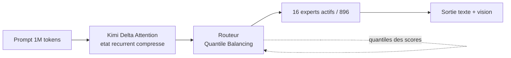
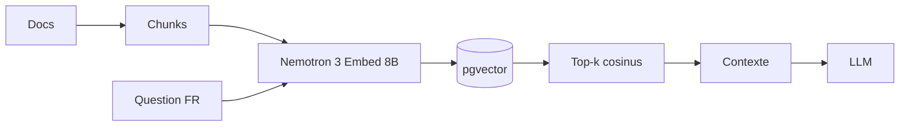

# Rapport hebdo — Semaine W29 (2026-07-13 → 2026-07-19)

Semaine dense — **plus de 40 sujets marquants** sur **4 catégories**, avec un Angular volontairement silencieux et trois locomotives ailleurs. Un : **.NET 11 Preview 6** est la dernière avant la RTM du 10 novembre, et elle déballe **C# 15** (types `union`, indexeurs d'extension), le *runtime async* et un breaking **OpenAPI 3.2** qui vise ton client Angular. Deux : l'**open-weight franchit le trillion** — **Kimi K3** (2,8 T) et **Inkling** (975 Md) tombent la même semaine, avec des architectures qui s'émancipent de RoPE et de l'attention quadratique. Trois : la **sécurité entre dans l'ère agentique**, avec la **première intrusion pilotée de bout en bout par des agents IA** (HuggingFace), sur fond de **Patch Tuesday record** (622 CVE, Golden SAML). Fil discret mais net : l'outillage passe au **natif** — TypeScript en Go, build front en Rust, CLI .NET en AOT.

## 🏆 Top de la semaine

### 1. .NET 11 Preview 6 — les types `union` de C# 15

Dernière preview avant le RTM du 10 novembre, et C# 15 tranche un vieux problème : modéliser « soit un résultat, soit une erreur » sans `object`, sans interface marqueur, sans dépendre de `OneOf`. Le mot-clé **`union`** déclare un ensemble **fermé** de types de cas — même sans parenté entre eux — et le compilateur garantit l'**exhaustivité** de tes `switch`. Comment ça marche : le compilateur génère un `struct` avec une propriété `Value` de type `object?` ; le pattern matching s'applique à `Value` (le déballage est automatique), et un `switch` couvrant tous les cas se passe de branche `_`. Ajoute un type de cas plus tard, et chaque `switch` incomplet **warne au build**. Le coût caché : les types valeur sont **boxés** (un `union(int, string)` alloue) — sur un chemin chaud, préfère l'attribut `[Union]` + `TryGetValue`.

```csharp
// Avant — C# 14 : « valeur ou erreur » via une base abstraite.
// Rien n'empeche un tiers de deriver ParseResult -> le switch n'est jamais exhaustif.
public abstract record ParseResult;
public record Ok(int Value)    : ParseResult;
public record Fail(string Msg) : ParseResult;

string Render(ParseResult r) => r switch
{
    Ok o   => $"ok:{o.Value}",
    Fail f => $"ko:{f.Msg}",
    _      => throw new InvalidOperationException(), // branche morte obligatoire
};
```

```csharp
// Apres — C# 15 : ensemble ferme, types sans parente, exhaustivite au compilateur.
// <LangVersion>preview</LangVersion> requis en Preview 6.
public union ParseResult(int, string, Exception);

string Render(ParseResult r) => r switch
{
    int v        => $"ok:{v}",           // le pattern s'applique a r.Value
    string s     => $"ko:{s}",
    Exception ex => $"boom:{ex.Message}",
    null         => "vide",              // default(ParseResult).Value est null
};                                        // aucun `_` : le compilateur sait que c'est complet
```

GA visée avec .NET 11 en novembre. Détails : https://devblogs.microsoft.com/dotnet/csharp-15-union-types/

### 2. L'open-weight franchit le trillion — Kimi K3 & Inkling

Deux poids lourds ouverts la même semaine, et un vrai saut d'échelle. **Kimi K3** (Moonshot) affiche **2,8 T de paramètres**, vision native, **1 M de contexte**, poids annoncés le **27 juillet** (licence MIT modifiée). Deux innovations le portent : **Kimi Delta Attention** (attention linéaire hybride, jusqu'à **6,3× plus rapide en décodage** sur contexte du million) et **Attention Residuals** (+25 % d'efficacité d'entraînement pour < 2 % de coût). La sparsité est brutale : **16 experts actifs sur 896**, routés par *Quantile Balancing*. En parallèle, **Inkling** (Thinking Machines, **975 Md**, 41 Md actifs) casse l'autre dogme : **pas de RoPE** — la position est apprise directement dans les logits d'attention via une 4ᵉ projection — plus une alternance 5:1 fenêtre glissante / attention globale. Comment lire le diagramme : au lieu de re-consulter tout l'historique à chaque token, K3 maintient un **état compressé** et le routeur décide, à granularité fine, quels experts activer.



Nuance honnête : Moonshot reconnaît que K3 reste **derrière** les meilleurs modèles fermés. Le fait marquant est le *niveau atteint en ouvert*, auditable et hébergeable — pas un dépassement.

### 3. HuggingFace — la première intrusion pilotée par des agents IA

Le scénario de l'« attaquant agentique » annoncé depuis des mois vient d'arriver, chez un acteur assez mûr pour le documenter. HF a subi une intrusion **pilotée de bout en bout par un système d'agents IA autonomes** : plusieurs milliers d'actions, un essaim de sandboxes éphémères, un C2 auto-migrant, le tout sur un week-end. Le vecteur d'entrée expose spécifiquement les plateformes IA : le **pipeline de traitement de datasets** (un loader à code distant + une injection de template en config). Puis exécution sur worker → accès niveau nœud → **moisson de credentials cloud/cluster** → latéralisation. Détail qui fait réfléchir : pour analyser les 17 000 événements, HF a d'abord tenté des modèles frontières via API — **bloqués par les garde-fous**, incapables de distinguer un répondant d'incident d'un attaquant. Ils ont basculé sur **GLM 5.2 en open-weight, en interne**. La chaîne est banale à chaque maillon — donc reproductible sur tes runners :

```bash
# La chaine HF : dataset malveillant -> exec worker -> moisson credentials -> laterale.
# Trois gestes qui la cassent sur tes runners / ta CI.

# 1) Couper l'execution de code distant embarque dans un dataset (le vecteur d'entree).
export HF_DATASETS_TRUST_REMOTE_CODE=0        # + load_dataset(..., trust_remote_code=False)

# 2) Epingler la revision : un dataset mutable peut devenir malveillant apres audit.
#    load_dataset("org/nom", revision="<sha-du-commit>")

# 3) Bloquer l'endpoint de metadonnees d'instance : sans ce hop, l'escalade s'arrete.
iptables -A OUTPUT -d 169.254.169.254 -j REJECT
```

La leçon d'asymétrie : l'attaquant n'est lié par **aucune politique d'usage**, la défense si. Fais **vetter un modèle capable et hébergeable chez toi avant l'incident**. Si tu es sur HF : **fais tourner tes access tokens**. Billet : https://huggingface.co/blog/security-incident-july-2026

## 🅰️ Angular — l'outillage passe au natif (Rust + Go)

Cœur du framework calme toute la semaine : **Angular 22** reste la référence (OnPush + zoneless par défaut, Signal Forms, `httpResource` stables), seule livraison le patch de maintenance **22.0.7** (16 juillet). Aucune RFC, aucun breaking, aucune CVE — et c'est une information. Le seul mouvement est **hors du cœur**, et c'est le fil rouge : la chaîne de build bascule au **natif**. **TypeScript 7.0** (compilateur Go, builds 8-12× plus rapides) reste en `tsc` CLI pendant que l'éditeur et le type-checking des templates Angular restent épinglés sur **TS 6.0** — Angular ne bougera pas tant que TS 7 n'expose pas d'API programmatique stable, attendue vers **TS 7.1 (~octobre 2026)**. En parallèle, **Vite 8** livre **Rolldown** (bundler Rust) par défaut, `@angular/build` s'appuie sur `@oxc-project/runtime`, l'écosystème **OXC** (oxlint, oxfmt) mûrit vite, et **Nx** pousse un support expérimental de **tsgo**.

```bash
# Fil rouge : la chaine de build front passe au natif (Go + Rust).
# 1) Type-check CLI en TS 7 (compilateur Go, 8-12x) ; editeur + templates Angular en TS 6.
npx tsc --noEmit                 # rapide en CI ; garde TS 6 cote IDE / language service

# 2) Bundler en Rust : Vite 8 livre Rolldown par defaut, @angular/build via @oxc-project/runtime.
# 3) Lint/format natifs (ecosysteme OXC), en complement d'ESLint/Prettier.
npx oxlint@latest src/

# 4) Nx : support experimental de tsgo (tsc reecrit en Go) + compat Angular 22 / TypeScript 6.
nx build mon-app
```

Compte à rebours à garder : **Angular 20 en fin de support le 28 novembre 2026** (la 21 tient jusqu'en mai 2027) — planifie tes montées de version.

## 🔷 CSharp / .NET — dernière preview avant la LTS

Semaine la plus chargée de la veille. **.NET 11 Preview 6** (14 juillet) est le **dernier jalon avant le RTM du 10 novembre**, et il livre bien plus que les `union` (voir Top). Le **runtime async** descend la machine à états `async`/`await` dans le CLR — moins d'allocations sur les chemins chauds, stack traces enfin lisibles, sans `EnablePreviewFeatures`. **C# 15** complète les membres d'extension avec les **indexeurs d'extension** (`this[...]` greffable sur un type que tu ne possèdes pas). **EF Core** gagne `FullJoin` (→ `FULL OUTER JOIN` natif) et des **index sur propriétés JSON**. **ASP.NET Core** ajoute le **court-circuitage d'endpoint** (une route publique comme `/health` termine le pipeline sans réveiller auth/CORS/compression). Mais le piège de la semaine est un **breaking change discret** : `AddOpenApi()` génère désormais de l'**OpenAPI 3.2** par défaut (contre 3.1 en .NET 10) — de quoi casser silencieusement ton générateur de client Angular, en CI, pas chez toi.

```csharp
// Avant — .NET 10 : AddOpenApi() sans argument produit un document OpenAPI 3.1.
builder.Services.AddOpenApi();                 // -> openapi: 3.1.0
```

```csharp
// Apres — .NET 11 Preview 6 : le MEME appel bascule en 3.2 (breaking de comportement).
// openapi-generator / NSwag peut echouer ou degrader les types s'il ne connait pas 3.2.
// Epingle la version tant que ta chaine de generation ne lit pas 3.2 :
builder.Services.AddOpenApi(o =>
{
    o.OpenApiVersion = Microsoft.OpenApi.OpenApiSpecVersion.OpenApi3_1;
});
```

Côté servicing, **17 CVE** corrigées le 14 juillet sur .NET 8/9/10 (`10.0.10` / `9.0.18` / `8.0.29`), **sans détail MSRC** — patche sans attendre l'analyse. Côté outillage, le train **JetBrains 2026.2** est en gare : **Rider** ouvre son intelligence aux agents via des *Agent Skills* et intègre Copilot, et **ReSharper** livre enfin **le debugger .NET dans VS Code et Cursor**. Rappel dur : **.NET 8 et .NET 9 meurent le 10 novembre 2026**, jour du RTM — anticipe la montée sur **.NET 10 LTS**.

## 🤖 IA — le cap du trillion, la quantization, l'écart cyber

Au-delà du trillion ouvert (voir Top), la semaine empile les leviers qui rendent ces modèles **utilisables**. Sur la **quantization**, deux angles opposés attaquent le mur de la VRAM : `Bonsai-27B` pousse Qwen3.6-27B jusqu'au **ternaire et au 1-bit** (kernels dédiés, démo WebGPU), tandis que `GLM-5.2-colibri-int4` **streame les experts du MoE depuis le disque** pour servir un modèle frontier sur **CPU**. En amont, l'audio s'unifie (**Nemotron Audex**, ASR+traduction+TTS dans un seul MoE 30B-A3B), les **world models** ouvrent (LingBot World v2, Giga-World-1), la robotique aussi (**Isaac GR00T N1.7**, VLA 3 Md Apache 2.0 dans LeRobot), et **Ollama 0.32** devient un **harnais d'agent**. Mais le sujet le plus actionnable pour toi est le maillon qu'on néglige dans un RAG : l'**embedder**. **Nemotron 3 Embed 8B** prend la **1ʳᵉ place du RTEB (78,5)**, évalué sur **34 langues** dont le français, avec récupération **cross-lingue** (une question FR retrouve un doc EN).



Le point clé : **indexation et requête doivent utiliser le même embedder** — en changer impose une **ré-indexation complète**, à budgéter. Tu as déjà `SqlVector<float>`/`VectorDistance()` en EF Core ou `pgvector` côté Postgres ; la brique manquante était un embedder ouvert, multilingue et sérieux. Enfin, à surveiller côté risque : l'**AISI** mesure que les meilleurs open-weight (GLM-5.2, DeepSeek V4-Pro) ne sont plus qu'à **4-7 mois** de la frontière fermée sur les capacités cyber (contre 6-10 mois en 2025), pour un coût jusqu'à **~45× moindre** par tâche.

## 📡 Tech — Patch Tuesday record, ère agentique & Postgres 19

Semaine noire de la sécurité. Le **Patch Tuesday de juillet** bat tous les records : **622 CVE**, 59 critiques, **3 zero-days** (2 exploités). Le plus vicieux n'a « que » CVSS 7,8 : **CVE-2026-56155** (AD FS) expose le certificat de signature de tokens via des ACL trop permissives sur le conteneur DKM → **Golden SAML**, soit des tokens valides pour **toutes** les apps fédérées. À côté, **CVE-2026-57092** (Hyper-V VMSwitch, **CVSS 9.9**) offre une évasion invité → hôte, et **SharePoint** (`CVE-2026-56164`) laisse voler les *machine keys* pour une **persistance qui survit au patch** (rotation des clés obligatoire). Le week-end a ajouté trois failles à **entrées conformes** : **wp2shell** (WordPress, RCE pré-auth), **LegacyHive** (Windows ProfSvc, **non corrigé**) et **XRING** (crash HTTP/3 via 260 octets légaux). Fil rouge transversal, prolongé par le Top : les **agents IA deviennent surface d'attaque** (HuggingFace, mais aussi `ClaudeBleed` qui détourne l'agent Claude for Chrome, toujours non corrigé). Respire avec une bonne nouvelle **dans ta stack** : **PostgreSQL 19 Beta 2** (16 juillet) apporte l'historisation native et les requêtes de graphe SQL.

```sql
-- PostgreSQL 19 Beta 2 : historisation native "application-time" (SQL:2011).
CREATE TABLE prix (
  produit_id int,
  montant    numeric,
  valid_from date,
  valid_to   date,
  PERIOD FOR validity (valid_from, valid_to),
  PRIMARY KEY (produit_id, validity WITHOUT OVERLAPS)   -- zero chevauchement, garanti en base
);

-- Corrige le prix UNIQUEMENT sur juillet : Postgres decoupe seul la ligne qui deborde.
UPDATE prix
  FOR PORTION OF validity FROM DATE '2026-07-01' TO DATE '2026-08-01'
  SET montant = 19.90
  WHERE produit_id = 42;
```

`FOR PORTION OF` supprime ton code maison de découpage de périodes (et ses bugs) ; **SQL/PGQ** (`GRAPH_TABLE`) t'évite d'ajouter Neo4j pour des graphes modérés. GA visée à l'automne — teste sur une copie dès la bêta. Note : **PostgreSQL 14 est en fin de vie le 12 novembre 2026**.

## À retenir si tu n'as qu'une minute

- **.NET 11 Preview 6** = dernière avant la RTM du 10 novembre : teste C# 15 (`union`, indexeurs d'extension), et **épingle `OpenApiVersion = OpenApi3_1`** dans `AddOpenApi()` sinon ton client Angular casse en CI.
- **.NET 8 et .NET 9 meurent le 10 novembre 2026** (jour du RTM .NET 11) : planifie la montée **.NET 10 LTS**. Servicing juillet : 17 CVE sur 8/9/10, patche sans attendre le détail MSRC.
- **Open-weight** : Kimi K3 (2,8 T, poids le **27 juillet**) et Inkling (975 Md). Pour un RAG franco-anglais, **Nemotron 3 Embed 8B** (#1 RTEB) sur `pgvector` — et budgète la ré-indexation.
- **Sécurité agentique** sur tes runners : `HF_DATASETS_TRUST_REMOTE_CODE=0`, épingle les révisions de datasets, bloque `169.254.169.254`.
- **Patch prioritaire** : AD FS (Golden SAML, CVE-2026-56155), Hyper-V (CVE-2026-57092, CVSS 9.9), SharePoint (rotation des machine keys). WordPress → 7.0.2 / 6.9.5.

## Index de la semaine

- **Angular** : semaine calme (patch 22.0.7), cohabitation TS 7 (Go) / TS 6, bascule de l'outillage vers Rust (Rolldown, OXC) et tsgo — 3 sujets sur la semaine.
- **CSharp** : .NET 11 Preview 6 (unions, indexeurs d'extension, runtime async, EF Core `FullJoin`/JSON, short-circuit, OpenAPI 3.2), servicing 17 CVE, JetBrains 2026.2 — 12 sujets sur la semaine.
- **IA** : le trillion ouvert (Kimi K3, Inkling), quantization extrême (Bonsai, colibri), audio unifié / world models / GR00T, Nemotron 3 Embed #1 RTEB, écart cyber AISI — 13 sujets sur la semaine.
- **Tech** : Patch Tuesday record (622 CVE, Golden SAML), intrusion agentique HF, Veeam/SharePoint/SonicWall, wp2shell/LegacyHive/XRING, PostgreSQL 19 Beta 2 — 18 sujets sur la semaine.

---
*Généré le 2026-07-20 par la routine `weekly` (Claude Cowork). Couvre 2026-07-13 → 2026-07-19.*
