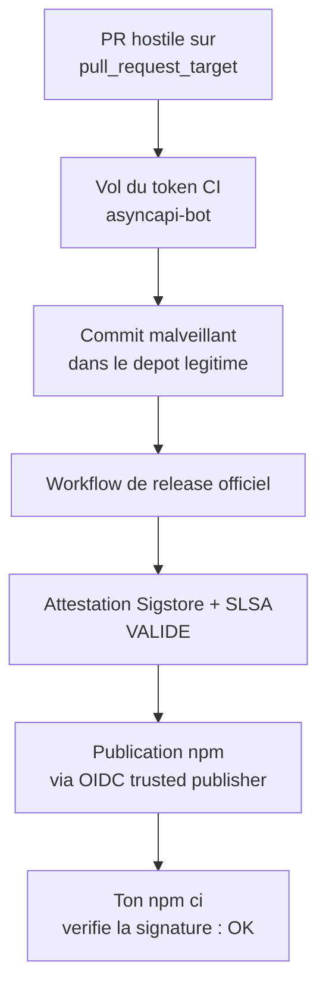
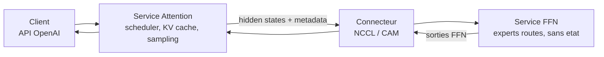

# Rapport hebdo — Semaine W30 (2026-07-20 → 2026-07-26)

Semaine de **consolidation** — **28 sujets** sur **4 catégories actives**, sans release fracassante mais avec trois mouvements de fond qui se répondent. Un : la **chaîne d'approvisionnement npm** a démontré que la signature et l'attestation ne prouvent rien sur le contenu, et que les configs de tes assistants de code sont devenues une cible de premier plan. Deux : **.NET 11 se stabilise avant la LTS du 10 novembre**, et EF Core 11 livre de la performance gratuite — 22 à 29 % sur du LINQ inchangé, ×9 à ×22 sur les entités porteuses d'embeddings. Trois : côté IA, la semaine appartient à l'**infrastructure** — désagrégation attention/FFN dans vLLM, 4-bit qui accélère dans `diffusers`, budget de contexte MCP divisé — pas aux modèles. En toile de fond, Angular sort une RC discrète mais structurante et le kernel Linux publie ~440 CVE en 24 h.

## 🏆 Top de la semaine

### 1. Supply chain npm — la signature dit vrai et ne dit rien

Deux incidents distincts convergent vers la même conclusion. Le paquet `jscrambler` (obfuscateur JS, donc présent dans les builds front) a été publié en cinq versions piégées le 11 juillet via un **token de publication volé** ; la charge **IronWorm** (Rust, lignée Shai-Hulud) a d'abord utilisé un hook `preinstall`, puis a **basculé sur l'exécution à l'`import`** — ce qui annule `--ignore-scripts` et le nouveau défaut d'npm v12. Sa cible inclut explicitement les configs de **Claude Desktop, Cursor, Windsurf, VS Code et Zed**, qui contiennent aujourd'hui clés de modèles et credentials MCP. En parallèle, quatre paquets `@asyncapi` (2,25 M de téléchargements/semaine) ont été backdoorés **avec une provenance Sigstore et SLSA parfaitement valide**.

Comment ça marche : une attestation SLSA affirme que l'artefact `X` provient du workflow `W`, du dépôt `R`, du commit `C`, via l'identité CI `I`. Elle n'affirme **jamais** que `C` contenait du code sain, ni que `I` était aux mains d'un mainteneur légitime. L'attaquant AsyncAPI a volé le token `asyncapi-bot` via un workflow `pull_request_target` — signalé et corrigeable depuis 58 jours — puis a laissé le pipeline officiel signer honnêtement du malware.



Actionnable immédiat : audite chaque `pull_request_target` de tes dépôts, mets `permissions: contents: read` par défaut, passe `actions/checkout` en v7 avec `persist-credentials: false`, et **ne checkoute jamais le HEAD d'une PR dans un job qui voit les secrets**. Côté poste, `npm ls jscrambler --all | grep -E '8\.(14|16|17|18|20)\.0'`, montée en 8.22.0, rotation de toutes les clés exposées — configs d'assistants IA comprises.

### 2. EF Core 11 — de la performance sans toucher à ton code

Trois optimisations livrées dans .NET 11 Preview 6, toutes invisibles côté LINQ. En **split query**, EF réappliquait mécaniquement les jointures to-one dans la requête de collection et ordonnait sur des clés fonctionnellement déterminées par celle du parent. EF 11 **élague la jointure inutile** et **allège l'`ORDER BY`** : +29 % mesuré sur un scénario split query courant, +22 % sur une requête simple. Troisième correctif de la même famille : suppression des `CAST` no-op générés par les value converters, qui **empêchaient purement et simplement l'usage d'un index**.

```sql
-- Avant EF Core 11 : jointure et tri inutiles dans la requete de collection
SELECT [p].[Id], [p].[BlogId], [p].[Title], [b].[Id], [b0].[Id]
FROM [Blogs] AS [b]
INNER JOIN [BlogType] AS [b0] ON [b].[BlogTypeId] = [b0].[Id]  -- aucune colonne projetee
INNER JOIN [Post] AS [p] ON [b].[Id] = [p].[BlogId]
ORDER BY [b].[Id], [b0].[Id];                                   -- redondant

-- EF Core 11 : jointure elaguee, tri reduit a la cle du parent
SELECT [p].[Id], [p].[BlogId], [p].[Title], [b].[Id]
FROM [Blogs] AS [b]
INNER JOIN [Post] AS [p] ON [b].[Id] = [p].[BlogId]
ORDER BY [b].[Id];
```

Profite de la montée pour relire tes plans d'exécution : la disparition des `CAST` peut réactiver des index que tu croyais morts, et certains plans en cache méritent une invalidation. Un breaking change à lire avant migration : `UseSqlServer` passe par défaut au niveau de compatibilité **160 (SQL Server 2022)**.

### 3. Angular 22.1.0-rc.0 — encapsulable et introspectable

Une RC courte mais qui débloque deux publics précis. Angular sait enfin **démarrer une application sous un shadow root** : au bootstrap, le framework remonte les parents du host pour trouver le `ShadowRoot` le plus proche, le mémorise dans `SharedStylesHost`, et y injecte les balises `<style>` au lieu du `<head>`. L'isolation devient **bidirectionnelle** — bien plus fort que `ViewEncapsulation.Emulated`, qui se contente de préfixer des sélecteurs. Le nettoyage suit le même chemin à la destruction, ce qui évite les styles orphelins quand un conteneur micro-frontend alterne les fragments.

```ts
// widget-element.ts — un Web Component qui embarque une app Angular isolee
import { bootstrapApplication } from '@angular/platform-browser';
import { WidgetApp } from './widget-app';

class VeilleWidget extends HTMLElement {
  private appRef?: Awaited<ReturnType<typeof bootstrapApplication>>;

  async connectedCallback() {
    // 1. Frontiere shadow : le CSS de la page hote ne descend pas ici
    const shadow = this.attachShadow({ mode: 'open' });

    // 2. Host Angular a l'interieur du shadow root
    const host = document.createElement('widget-app');
    shadow.appendChild(host);

    // 3. Angular remonte jusqu'au shadow root et y enregistre ses styles
    this.appRef = await bootstrapApplication(WidgetApp, { providers: [] });
  }

  disconnectedCallback() {
    this.appRef?.destroy();   // les <style> partent du shadow root, pas du <head>
  }
}

customElements.define('veille-widget', VeilleWidget);
```

Second apport : l'outil in-page **`angular:di-graph`**, enregistré en mode dev uniquement, sérialise **tout le graphe d'injection** (type d'injecteur, parent, tokens fournis) en un appel — là où `ng.getInjector` t'obligeait à explorer nœud par nœud. De quoi répondre à « pourquoi ce singleton est-il instancié deux fois ? » en raisonnant sur la structure. Vérifie que ton build de prod strippe bien ces outils : c'est une surface d'introspection à ne pas exposer. Attends la 22.1.0 stable avant de miser dessus. Rappel d'échéance : **Angular 20 sort de support le 28 novembre 2026**.

## 🅰️ Angular — silence radio, puis une RC

Cinq jours sur sept sans rien de neuf, et c'est une information honnête : le blog officiel n'a rien publié depuis la newsletter du 17 juillet, `22.0.8` est sortie en servicing le 22 juillet, et `@angular/aria` est déclaré **GA**. Le vrai mouvement de la semaine est **hors du cœur** : l'outillage bascule vers le natif. **Vite 8** livre **Rolldown** par défaut, `@angular/build` s'appuie de plus en plus sur la chaîne **OXC** (`oxlint`, `oxfmt`), et **Nx** pousse un support expérimental de **tsgo**.

Le point le plus marquant reste le **verrou TypeScript 7**. TS 7.0 est GA depuis le 8 juillet et son `tsc` natif Go tourne 8 à 12× plus vite, mais un projet Angular 22 ne peut pas l'adopter : `@angular/compiler-cli` casse au build sur des incompatibilités `readConfiguration` / `DiagnosticCategory` (issue #69704). Angular reste épinglé sur **TS 6.0** pour le type-checking de templates via le paquet de compat, en attendant l'API programmatique stable de **TS 7.1**.

```json
// package.json — la configuration valide aujourd'hui sur Angular 22.x
{
  "devDependencies": {
    "typescript": "~6.0.0",              // requis par @angular/compiler-cli
    "@typescript/typescript6": "~6.0.0", // paquet de compat pour le Language Service
    "@angular/build": "^22.1.0"
  }
}
```

À faire : ne migre pas `typescript` en 7.x sur un projet Angular, même si `tsc` seul passe. Surveille la sortie de TS 7.1 — c'est elle qui débloquera la bascule côté outillage Angular et ESLint.

## 🔷 CSharp / .NET — stabilisation avant la LTS

Pas de Preview 7 cette semaine : le cycle se stabilise vers la **RTM du 10 novembre 2026**, date à laquelle **.NET 8 et .NET 9 sortent de support** simultanément. Les servicing releases de juillet (`10.0.10` / `9.0.18` / `8.0.29`, 17 CVE) sont à appliquer si ce n'est pas fait. Deux conforts EF Core à activer dès maintenant via l'outil `dotnet-ef` préversion : l'analyseur **EF1004**, qui attrape au build les `ToAsyncEnumerable()` sur un `IQueryable<T>` qui s'exécutent en réalité de façon synchrone — la cause classique des deadlocks sous charge, à corriger en `AsAsyncEnumerable()` — et la migration en une commande, `dotnet ef migrations add Add_X --apply`. Côté plateforme, **.NET MAUI passe entièrement sur CoreCLR** (Android, iOS, Mac Catalyst) : même runtime que le cloud et le desktop, diagnostics cohérents, NativeAOT à la clé ; Mono ne survit que pour Blazor WebAssembly.

Le sujet le plus actionnable de la section est le **nouveau défaut sur les colonnes vectorielles**. Un embedding de 1 536 dimensions pèse ~6 Ko par ligne, et EF Core 10 le transportait à chaque matérialisation d'entité — même sans jamais le lire. EF 11 sort les propriétés `SqlVector<T>` de la **projection par défaut** : **×9** en local, **×22** contre Azure SQL. Le vecteur reste pleinement utilisable côté serveur dans un `Where`, un `OrderBy` ou un `VectorDistance()`.

```csharp
// Avant EF 11 : l'embedding partait sur le reseau a chaque ligne materialisee
// Apres  : la colonne vecteur est exclue du SELECT — aucun changement de code
var blogs = await context.Blogs.OrderBy(b => b.Name).ToListAsync();
// SQL emis : SELECT [b].[Id], [b].[Name] FROM [Blogs] AS [b] ...

// Tu veux le vecteur ? Projection explicite, cout assume
var withVectors = await context.Blogs
    .Select(b => new { b.Id, b.Embedding })
    .ToListAsync();

// Recherche approchee (ANN) — experimental cote SQL Server comme cote EF
var similar = await context.Blogs
    .VectorSearch(b => b.Embedding, queryEmbedding, "cosine")
    .OrderBy(r => r.Distance)
    .Take(5)
    .WithApproximate()          // sans lui : kNN exact, plus lent
    .ToListAsync();
```

Piège silencieux : si un bout de ton code lit `entity.Embedding` **après** matérialisation, il lira désormais une valeur vide, sans exception. Grep avant de migrer. Autres déblocages EF 11 : types complexes et colonnes JSON compatibles avec l'héritage **TPT/TPC**, configuration par chaînage `.Property(e => e.Details.Description)`, et batches transactionnels par défaut sur Cosmos DB.

## 🤖 IA — la semaine de l'infrastructure

Aucun modèle frontière n'est tombé : **Kimi K3** (2,8 T, contexte 1 M) attend ses poids au 27 juillet, **GLM-5.2** (744 Md, MIT) garde la tête open-weight (91,2 % GPQA Diamond, 62,1 % SWE-bench Pro) et **MiniMax M3** son meilleur SWE-bench Pro. Ce qui a bougé, c'est tout ce qui sert les modèles. **Poolside** publie **Laguna XS 2.1**, MoE 33B total / **3B actifs**, 256 experts, contexte 256K, attention mixte fenêtre glissante + globale (3:1) et cache KV FP8 : SWE-bench Multilingual 57,7 → **63,1 %** sur un seul GPU. Hugging Face fait entrer **Nunchaku (SVDQuant)** dans `diffusers` — du 4-bit W4A4 chargé par `from_pretrained()`, **~12 Go de VRAM au lieu de 24** et **~30 % plus rapide** : un cas rare où quantizer accélère. **Ollama v0.32.3** élargit le matériel (CUDA sur Windows ARM64, B200, iGPU Linux) et corrige les téléchargements bloqués. Le **serveur MCP de Hugging Face** remplace sa douzaine d'outils par un `hf_fs` unique (~1 000 tokens) et ajoute des Sandboxes d'exécution. Rappel de la semaine précédente qui prend son sens ici : Hugging Face a repoussé un agent attaquant avec **GLM-5.2 auto-hébergé**, parce que les modèles frontières **refusaient** d'analyser les payloads — le refus dual-use handicape le défenseur autant que l'attaquant.

Le sujet le plus structurant est le **plugin AFD de vLLM** (23 juillet). Dans un MoE, l'attention est *stateful* — KV cache, scheduler, longueur de séquence — tandis que le bloc FFN est *stateless* : des activations entrent, des matrices s'appliquent, un résultat sort. Jusqu'ici les deux partageaient la même topologie de workers, donc un seul jeu de compromis pour deux profils de charge opposés. Le plugin les sépare en deux services reliés par un connecteur.



Le chiffre contre-intuitif : sur DeepSeek V3.2 W8A8 à 16K d'entrée, la baseline EP64 fait 232,6 tokens/s/die ; la config **48A16F tombe à −5,3 %**, la config **64A16F monte à +11,3 %**. Désagréger ne garantit rien — **c'est le ratio attention/FFN qui décide**. Sur le prefill asynchrone, le TTFT médian passe de 15,1 s à 8,0 s à 12 req/s (−47 %). Statut : expérimental, épinglé sur vLLM 0.19.1, model runner v1 seulement, poids complets chargés des deux côtés. À évaluer si tu dimensionnes un MoE interne, pas à mettre en prod.

## 📡 Tech — semaine noire côté CVE

Au-delà du dossier supply chain traité dans le Top, six failles ont exigé une action, et deux enseignements traversent la semaine : **patcher ne suffit pas** quand la persistance survit au correctif, et **l'exposition réseau reste le vrai facteur aggravant**. **SharePoint** cumule deux RCE non authentifiées exploitées — `CVE-2026-50522` (CVSS 9.8, PoC public le 20 juillet, **vol des machine keys IIS en une requête** → rotation des secrets obligatoire) et `CVE-2026-58644`, ajoutée au CISA KEV le 22 juillet. La chaîne **wp2shell** de WordPress (`CVE-2026-63030` + `CVE-2026-60137`) entre au KEV : RCE pré-auth du batch processor REST chaînée à une injection SQL — patche et coupe `/wp-json/batch/v1`. **xrdp** corrige deux heap overflows en 0.10.7, dont un **pré-auth** via le canal EGFX. **Check Point SmartConsole** (`CVE-2026-16232`, ~9.1) subit un bypass d'authentification exploité dans la nature qui donne l'**admin complet du firewall** — restreins les *Trusted Clients*. **ServiceNow** (`CVE-2026-6875`) transforme une évasion de sandbox `gs.include()` en RCE pré-auth exploitée. **7-Zip** (`CVE-2026-14266`) exécute du code à l'extraction d'une archive `.xz` forgée — 26.02. Deux notes plus calmes : **CodeQL 2.26.0** livre la première requête grand public de détection d'**injection de system prompt** (`js/system-prompt-injection`), et le kernel Linux a publié **~440 CVE en 24 h** — un numéro de CVE kernel ne veut pas dire « exploitable à distance », trie plutôt que paniquer.

La faille la plus large de la semaine est **RefluXFS** (`CVE-2026-64600`, Qualys, divulguée le 22 juillet) : une *race condition* dans le chemin copy-on-write de **XFS**, présente depuis le noyau **4.11 (2017)**, donne un **root local** sur ~16,4 millions de systèmes, dont des installs RHEL par défaut. Deux écritures `O_DIRECT` concurrentes sur un même fichier reflinké écrasent des fichiers protégés — le PoC modifie `/etc/passwd` ou un binaire SUID-root, et la modification **survit au reboot** avec ses permissions intactes.

```bash
# 1. Suis-je concerne ? XFS + reflink actif = surface exposee
findmnt -t xfs -no TARGET,SOURCE
xfs_info / | grep -o 'reflink=[01]'          # reflink=1 -> vulnerable

# 2. Le correctif est merge depuis le 16 juillet : patche PUIS redemarre
#    (un live-patch ne couvre pas ce chemin, le kernel doit etre recharge)
uname -r && sudo dnf update kernel && sudo reboot

# 3. Mitigation d'attente si le reboot doit attendre : couper le levier local
#    (limite l'acces shell non privilegie aux systemes multi-utilisateurs)
sudo chmod 0700 /tmp/*_shared 2>/dev/null; getent passwd | wc -l
```

Rappel transverse : xrdp, SharePoint et Check Point ont tous en commun d'être **exposés là où ils ne devraient pas l'être**. Ne laisse jamais 3389 ni une console de management sur Internet.

## À retenir si tu n'as qu'une minute

- **Audite tes `pull_request_target`** : c'est la faille qui a coûté un token à AsyncAPI, signalée 58 jours avant l'attaque. `permissions: contents: read`, `actions/checkout@v7`, `persist-credentials: false`.
- **Ajoute les configs de tes assistants IA à ton inventaire de secrets** (Claude Desktop, Cursor, VS Code, Zed) — IronWorm les cible explicitement. `--ignore-scripts` ne protège pas d'un paquet exécuté à l'`import`.
- **Patche et redémarre** pour RefluXFS (`CVE-2026-64600`, XFS, root local depuis le noyau 4.11) ; **fais tourner tes machine keys IIS** après le patch SharePoint — le correctif n'expulse pas l'attaquant déjà installé.
- **EF Core 11 = perf gratuite** : +22 à +29 % sur du LINQ inchangé, ×9 à ×22 sur les entités à embeddings. Vérifie juste qu'aucun code ne lit `entity.Embedding` après matérialisation.
- **Calendrier .NET** : LTS .NET 11 et EF Core 11 le **10 novembre 2026**, jour où **.NET 8 et .NET 9 sortent de support**. Angular 20 : fin de support le **28 novembre 2026**.

## Index de la semaine

- **Angular** : 5 jours de silence puis 22.1.0-rc.0 (shadow root, `angular:di-graph`, `@angular/aria` GA), verrou TypeScript 7, outillage Rust (Vite 8/Rolldown, OXC, tsgo) — 4 sujets sur la semaine.
- **CSharp** : EF Core 11 (types complexes TPT/TPC, +29 % split query, colonnes vectorielles non chargées), MAUI sur CoreCLR, analyseur EF1004, migrations `--apply`, Microsoft Agent Framework — 6 sujets sur la semaine.
- **IA** : vLLM AFD (désagrégation attention/FFN), Nunchaku 4-bit dans `diffusers`, Ollama v0.32.3, HF MCP `hf_fs`, Laguna XS 2.1, MOSS-VL-Realtime, défense GLM-5.2 auto-hébergé — 7 sujets sur la semaine.
- **Tech** : jscrambler/IronWorm et provenance AsyncAPI, RefluXFS, SharePoint ×2, wp2shell au KEV, Check Point SmartConsole, ServiceNow, xrdp, 7-Zip, CodeQL 2.26.0, ~440 CVE kernel — 11 sujets sur la semaine.

---
*Généré le 2026-08-01 par la routine `weekly` (Claude Cowork). Couvre 2026-07-20 → 2026-07-26.*
