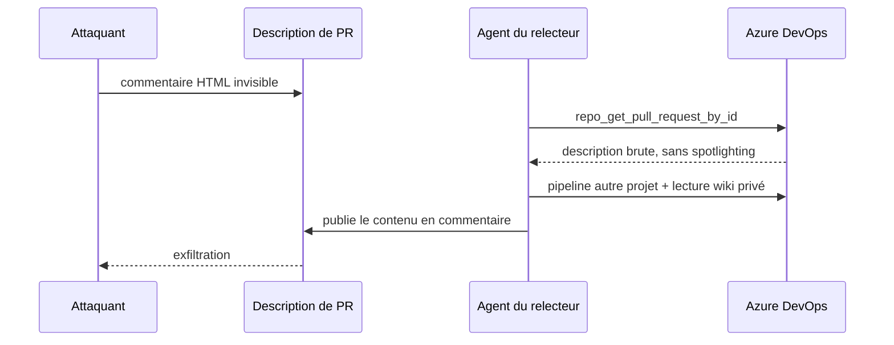
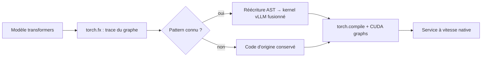

# Rapport hebdo — Semaine W31 (2026-07-27 → 2026-08-02)

Semaine **courte en volume, lourde en structure** — **17 sujets** sur **4 catégories actives**, concentrés sur deux journées de digest (1er et 2 août) qui couvrent l'actualité du 28 juillet au 1er août. Trois mouvements de fond la traversent. Un : **MCP franchit son cap industriel** avec la révision `2026-07-28` — plus de session, plus de handshake, un SDK C# v2.0 stable — et découvre dans le même souffle ses **angles morts de sécurité**, avec deux failles d'outillage MCP dont une RCE non authentifiée. Deux : **l'agent cesse d'être une fonctionnalité d'IDE pour devenir un runtime partagé** (Copilot SDK commun à Visual Studio et au CLI, Agent Skills livrées d'usine, outils MCP du CLI Angular stabilisés) — et, côté offensif, un modèle à poids ouverts sort quatre chaînes d'exploitation RCE contre Redis. Trois : **les moteurs se réécrivent sans changer l'API** — Rolldown par défaut dans Angular 22.1, Model Runner V2 par défaut dans vLLM, réécriture d'AST à la volée pour le backend `transformers`. En toile de fond, deux consoles d'administration réseau entrent au catalogue KEV de la CISA en trois jours.

## 🏆 Top de la semaine

### 1. MCP 2026-07-28 — le protocole abandonne l'état

C'est le changement le plus structurant de la semaine, et il tombe en stable côté .NET avec le **SDK C# v2.0** publié le 28 juillet. MCP était jusqu'ici un protocole à état : `initialize`, `initialized`, un `Mcp-Session-Id` rejoué à chaque requête. Ça impose des sticky sessions ou un store de sessions partagé dès qu'on veut plus d'une instance. La révision supprime l'état **au niveau du protocole**.

Comment ça marche : chaque requête devient **auto-descriptive**. Le handshake disparaît (SEP-2575, remplacé par un RPC `server/discover` facultatif), l'en-tête de session disparaît (SEP-2567), et les métadonnées montent dans des en-têtes HTTP obligatoires `Mcp-Method` / `Mcp-Name` (SEP-2243) — ta gateway route et autorise sans parser le corps JSON. Corollaire : `sampling`, `roots`, `logging` et le transport HTTP+SSE historique sont **dépréciés**, fenêtre minimale de douze mois. L'interactivité passe par **MRTR** (SEP-2322) : au lieu de pousser une question au client, l'outil renvoie un résultat `input_required` et le client **rejoue l'appel complet** avec les réponses attachées. L'état remonte donc côté client.

```csharp
// Avant — SDK 1.x : sessions d'office, sticky sessions requises côté LB
builder.Services.AddMcpServer()
    .WithHttpTransport()              // Stateless implicitement false
    .WithToolsFromAssembly();

// Après — SDK 2.0 : Stateless = true par défaut, round-robin possible
builder.Services.AddMcpServer()
    .WithHttpTransport()              // Stateless = true
    .WithToolsFromAssembly();

// Transition — clients mixtes (anciens SSE, nouveaux Streamable HTTP)
builder.Services.AddMcpServer()
    .WithHttpTransport(o =>
    {
        o.Stateless = false;          // comportement historique conservé
        o.EnableLegacySse = true;     // SSE servi sur /sse et /message
    });
app.MapMcp();                         // les deux transports en parallèle
```

Le piège est silencieux : `Stateless = true` est un **breaking change à la montée de version**. Si un de tes outils stocke quoi que ce soit dans un état connexion-scopé, il cassera sans erreur explicite. La recommandation officielle est d'émettre un **handle métier explicite** depuis un outil et de laisser le modèle le repasser en argument — l'état devient visible au lieu d'être caché dans le transport. Détail à connaître sur MRTR : le client rejoue l'appel **entier**, donc valide tes prérequis en toute première ligne d'exécution, sinon tu paies deux fois le travail coûteux.

### 2. L'outillage MCP découvre ses angles morts

Deux failles indépendantes, publiées la même semaine, disent exactement la même chose : **une défense partielle sur un protocole d'agent ne défend rien**. Le serveur MCP officiel **Azure DevOps** de Microsoft applique du *spotlighting* — envelopper le contenu non fiable dans des délimiteurs — via un helper partagé `createExternalContentResponse`. Les outils wiki et logs de build passent par lui ; l'outil `repo_get_pull_request_by_id` **ne l'appelle pas** et renvoie la description de PR brute. Or c'est précisément la surface où un attaquant écrit : un commentaire HTML `<!-- ... -->` est invisible dans l'interface web mais renvoyé **verbatim** par l'API REST. L'agent porte alors les credentials du relecteur, plus senior que l'auteur de la PR.



Chaque appel était individuellement autorisé — c'est la **séquence** qui était malveillante. Reproduit avec Copilot CLI et Claude Code : ce n'est pas lié à un agent. Aucun CVE, aucune release corrective à ce jour. Second cas, plus brutal : **IBM Langflow, CVE-2026-12940, CVSS 9,8, non authentifiée**, versions 1.0.0 à 1.10.1. Le lanceur MCP en transport stdio filtrait les variables d'environnement par **blocklist** (`DANGEROUS_ENV_VARS`) — il y manquait `SHELLOPTS`, `BASHOPTS` et `PS4`. Poser `SHELLOPTS=xtrace` active le mode trace du shell, et `PS4` — le préfixe de trace, soumis à expansion — exécute la substitution `$(...)` qu'il contient. RCE sous l'identité du service.

La leçon commune est actionnable tout de suite dans ton code : **allowlist, jamais blocklist**, et lance tes sous-processus en `argv` sans passer par un shell — `ProcessStartInfo.ArgumentList` côté .NET, jamais une chaîne concaténée. Côté agents, coupe la trifecta : données privées, contenu non fiable, canal de sortie. Token à privilège minimal scopé au projet relu, pas de pipeline ni de wiki dans le tool set d'une revue de code, approbation par outil plutôt qu'auto-approve.

### 3. Angular 22.1.0 — cadence annuelle et `linkedSignal` inscriptible

La 22.1.0 du 29 juillet porte deux nouvelles à impacts très différents. La première est **calendaire** et vaut pour toute ta planification : Angular passe à **une majeure par an, en juin**. La v23 arrive en **juin 2027**, pas en novembre 2026 ; les mineures sortent toutes les deux mois ; une majeure est supportée **deux ans** au lieu de dix-huit mois. Une seule fenêtre de breaking changes par an, que tu peux enfin étaler. En parallèle, **Rolldown** — la réécriture Rust de Rollup — devient le **défaut** de l'étage de chunk optimization, et cette optimisation s'applique désormais aussi aux **builds serveur**. Repli si régression : `NG_BUILD_CHUNKS_ROLLDOWN=false ng build`.

La seconde est un vrai gain de modélisation. `linkedSignal` accepte maintenant un **setter personnalisé**, ce qui transforme une dérivation à sens unique en boucle contrôlée : une écriture sur la valeur dérivée peut à son tour écrire dans la source.

```ts
// Avant — v22.0 : selectedItem se réinitialise, mais set() n'informe jamais items
readonly items = signal<Array<ItemModel>>([]);
protected readonly selectedItem = linkedSignal(() => this.items()[0]);

protected selectItem(item: ItemModel) {
  this.selectedItem.set(item);  // items reste inchangé, même si item n'y figure pas
}

// Après — v22.1 : le setter écrit en retour dans la source
protected readonly selectedItemV22_1 = linkedSignal(() => this.items()[0], {
  set: (item: ItemModel) => {
    const items = this.items();
    // garde d'idempotence : sans elle, tu boucles sur la re-dérivation
    if (items.indexOf(item) < 0) {
      this.items.set([item, ...items]);
    }
  }
});
```

Concrètement, tu supprimes les `effect()` de recollage qui resynchronisaient une sélection et sa liste : la règle de cohérence vit dans la déclaration du signal, pas dans un side effect ailleurs dans la classe. Écris le setter idempotent — vérifie avant de muter, comme ci-dessus — sinon ta dérivation se rejoue en boucle. Troisième point de la release : **JSONP est déprécié**, `withJsonpSupport()` déclenche un warning en dev. La technique contourne ta CSP et transforme toute réponse compromise en XSS ; bascule sur `withFetch()` et exige du CORS côté API tierce.

## 🅰️ Angular — une 22.1 dense, puis silence radio

Toute l'actualité Angular de la semaine tient dans la 22.1.0 du 29 juillet — le blog officiel n'a rien publié depuis l'Angular Weekly du 17 juillet et aucune 22.2 n'est sortie. Au-delà de la cadence et de `linkedSignal` traités dans le Top, la release livre le **schematic de migration manquant** vers `@Service()`, et corrige un bug de réactivité subtil : un `effect()` déclenchant une requête HTTP capturait comme dépendances **tous les signaux lus dans les intercepteurs**. Un intercepteur qui lit un signal d'auth ou de langue rendait l'effet dépendant de ce signal, avec des re-exécutions inexplicables. La chaîne d'intercepteurs tourne maintenant en contexte `untracked`.

Le schematic fait une réécriture AST **volontairement conservatrice**. Il convertit `providedIn: 'root'` en `@Service()`, un `@Injectable()` nu en `@Service({ autoProvided: false })`, et **ignore** trois familles : injection par constructeur plutôt qu'`inject()`, options autres que `providedIn`, et `providedIn` valant autre chose que `'root'`. Il préfère te laisser un reste à faire plutôt que produire une conversion douteuse.

```bash
# Migration sur tout le workspace — passe-la maintenant, pas sous pression en v23
ng generate @angular/core:service
```

```ts
// Avant
import { Injectable } from '@angular/core';
@Injectable({ providedIn: 'root' })
export class UserService { private readonly http = inject(HttpClient); }

// Après — @Service() implique providedIn: 'root'
import { Service } from '@angular/core';
@Service()
export class UserService { private readonly http = inject(HttpClient); }

// Un @Injectable() nu devient explicitement non auto-fourni
@Service({ autoProvided: false })
export class LegacyTokenStore {}
```

À faire cette semaine : lance le schematic pendant que le diff reste lisible, et reteste les `effect()` qui se re-déclenchaient sans raison autour de tes appels HTTP — la cause était probablement un signal lu dans un intercepteur. Garde quand même le réflexe `untracked()`. À surveiller : **TypeScript 7** se diffuse dans VS Code et Visual Studio, l'alignement Angular reste le prochain jalon de compatibilité ; **Webpack est déprécié en v22** (`@angular-devkit/build-angular`, `@ngtools/webpack`). Note connexe au fil rouge « agent » : la 22.1 stabilise quatre outils MCP du CLI (`run_target`, `devserver.start`, `devserver.stop`, `devserver.wait_for_build`), enregistrés par défaut, et partage le cache de build entre worktrees git.

## 🔷 CSharp / .NET — l'agent devient une dépendance du projet

Au-delà du SDK MCP v2.0 traité dans le Top, la semaine côté Microsoft raconte une **consolidation du runtime d'agent**. Le nouvel **Agent (Preview)** de Visual Studio 2026 ne réimplémente pas sa boucle : il consomme le **GitHub Copilot SDK**, c'est-à-dire une interface JSON-RPC vers le **runtime de Copilot CLI**. Même planification, mêmes outils, dans le terminal comme dans l'IDE — et une tâche commencée dans le CLI se reprend dans Visual Studio, parce que l'état vit côté runtime. Le SDK est publié pour .NET, TypeScript, Python, Go, Java et Rust : tu peux câbler ce runtime dans tes propres outils internes plutôt que réécrire une boucle d'agent maison.

Le sujet le plus immédiatement rentable est ailleurs : depuis **Visual Studio 18.8**, des **Agent Skills** écrites par les équipes .NET et Azure sont livrées d'usine, dans la catégorie *Built-in* du tool picker — mais **désactivées par défaut**, et visibles seulement si le workload correspondant est installé. Deux skills .NET sont identifiées : `dotnet-webapi` (verbes et codes HTTP, métadonnées OpenAPI, gestion d'erreurs cohérente) et `analyzing-dotnet-performance`, qui balaye environ **50 anti-patterns** — async mal formé, allocations, manipulation de strings, choix de collections, LINQ, regex, sérialisation, I/O. Côté Azure, la séquence `azure-prepare` → `azure-validate` → `azure-deploy`. Le dépôt public [`dotnet/skills`](https://github.com/dotnet/skills) va beaucoup plus loin, sans être installé d'office.

Le mécanisme mérite d'être compris parce qu'il détermine ce que tu peux en faire : une skill est un **dossier avec une description**, et l'agent fait du **routage par description** — il lit d'abord le résumé court, décide de la pertinence, puis charge les instructions. La qualité du champ `description` détermine seule si la skill se déclenche au bon moment. Tu peux donc encoder tes conventions maison au même endroit.

```markdown
---
name: conventions-api-interne
description: Applique nos conventions d'API REST internes (pagination,
  enveloppe d'erreur RFC 9457, versioning par header) sur un projet ASP.NET Core.
---

### Pagination
Toujours exposer `?page` et `?pageSize`, plafonner `pageSize` à 200.
Renvoyer le total dans le header `X-Total-Count`.

### Erreurs
Utiliser `Results.Problem(...)` — jamais un `500` nu ni un message brut.
```

Traite l'activation d'une skill comme une **dépendance ajoutée au projet**, pas comme un réglage d'IDE : c'est du texte que ton agent exécutera comme instruction. Et garde la revue de diff manuelle — l'agent Visual Studio est explicitement étiqueté preview, même si le SDK est GA dans son dépôt.

## 🤖 IA — l'inférence se réécrit sous le capot

Aucun modèle frontière cette semaine : tout le mouvement est dans la couche de service. **vLLM v0.25.0** fait de **Model Runner V2** le défaut pour tous les modèles denses et **retire le chemin PagedAttention historique**. Attention au contresens que le nom encourage : la **pagination du KV cache reste** — c'est un modèle mémoire, blocs de taille fixe, table par séquence, copy-on-write sur les préfixes partagés. Ce qui est réécrit, c'est le **model runner**, la couche qui prépare les métadonnées d'attention, compose le batch et capture les graphes CUDA. Les gains concrets : prefix caching sur les **hybrides Mamba**, decoding spéculatif dynamique **compatible full CUDA graphs** (plus de repli eager), attention bidirectionnelle sur préfixe multimodal. La montée se fait sans changer ta ligne de commande, mais **teste tes plugins maison** : la release retire du code public.

Le sujet le plus structurant pour ton calendrier d'adoption est le **backend `transformers` de vLLM, qui atteint la vitesse native**. Jusqu'ici, servir vite un modèle exigeait d'attendre un portage vLLM écrit à la main. Désormais les optimisations s'appliquent **dynamiquement au chargement**, sur le code `transformers` d'origine : `torch.fx` trace le graphe, un pattern matcher reconnaît les motifs connus (trois linéaires Q/K/V → `QKVParallelLinear`, boucle sur experts MoE → kernel d'expert parallelism), puis le backend **réécrit l'AST** pour substituer les kernels fusionnés. Le résultat reste du Python valide, compilable et capturable en CUDA graphs.



Deux effets de bord comptent autant que la vitesse : la reconnaissance des blocs fusionnés permet d'**inférer les plans de parallélisme** (TP depuis les linéaires fusionnées, PP depuis la liste des blocs décodeur), et le code `transformers` **reste utilisable en entraînement** — même fichier de modèle pour servir, évaluer et faire tes rollouts. En pratique, `vllm serve <modèle> --model-impl transformers`, et le flag compose avec tous les modes de parallélisme. Limites honnêtes : l'attention linéaire n'est pas encore supportée, et le code de modèle custom hébergé sur le Hub a peu de chances de matcher les patterns.

Deux autres sujets à retenir. Côté retrieval, **LateOn-regularized** (LightOn) explique pourquoi MUVERA et SMVE s'effondraient sur les modèles à interaction tardive récents : la similarité cosinus moyenne entre tokens vaut **0,24 sur ColBERT-v2 contre 0,95 sur LateOn** — les embeddings s'entassent dans un cône, et un hyperplan aléatoire ne sépare rien. Le centrage seul fait passer MUVERA de 2,89 à 32,66 NDCG@10 ; entraîner à travers la discrétisation par **Straight-Through Estimator** ferme l'écart avec PLAID. Retiens la règle générale : **centre tes embeddings avant toute quantification ou projection aléatoire**, c'est gratuit. Côté sécurité, **Kimi K3** (poids ouverts, Moonshot AI) a produit quatre chaînes d'exploitation RCE authentifiées contre Redis, qui a répondu par **sept releases de sécurité le 23 juillet**. Les deux classes passent par `RESTORE` — use-after-free « shared-NACK » sur les Streams, écriture hors-bornes dans le loader TDigest de RedisBloom. Deux des versions ciblées, 6.2.22 et 7.4.9, étaient précisément les correctifs de mai.

```bash
# Mitigation immédiate, sans redéploiement : révoquer RESTORE au user applicatif
redis-cli INFO server | grep redis_version      # version exacte, pas "récemment patché"

redis-cli ACL SETUSER app_worker on '>motdepasse' \
  '~cache:*' '+@read' '+@write' '-restore' '-eval' '-xgroup'

redis-cli ACL GETUSER app_worker                # RESTORE ne doit plus apparaître
```

Versions correctives : **6.2.23, 7.2.15, 7.4.10** (Streams) ; **8.2.8, 8.4.5, 8.6.5** (Streams + TDigest) ; **8.8.1** (loaders RedisBloom et TDigest). Ni CVE ni score CVSS attribués — **tes scanners ne les verront pas**.

## 📡 Tech — les plans de management en première ligne

Deux consoles d'administration réseau entrent au catalogue **CISA KEV** en trois jours, et c'est le fil rouge de la section. **CVE-2026-16812** frappe **Arista VeloCloud Orchestrator on-prem** : injection de commande OS, **CVSS 10,0**, activement exploitée, avis publié le 27 juillet. La cause est une fonctionnalité interne exposée à distance — des routes prévues pour un usage interne, jamais restreintes au réseau d'administration. Arista écrit noir sur blanc que compromettre le VCO « peut donner accès aux équipements VeloCloud Edge » : l'incident se déplace du serveur vers la topologie réseau entière. Versions à corriger : 5.2.x < 5.2.3.14, 6.1.x < 6.1.3.4, 6.4.x < 6.4.2.4, 7.0.x < 7.0.0.1. Trois IP d'attaque sont publiées — cherche-les dans tes logs, et **préserve les preuves avant de remédier**. Arista recommande la restauration ou le remplacement de l'orchestrateur depuis une source de confiance, pas un nettoyage en place.

**CVE-2026-20316** est du même ordre sur **Cisco Secure Firewall Management Center** : un **mot de passe codé en dur** (CWE-798), CVSS 9,5, ajouté au KEV le 29 juillet. Un identifiant statique dans le produit ne peut pas être changé par l'administrateur, n'apparaît dans aucun audit de comptes, et surtout se **découvre une fois pour toutes** : un attaquant extrait la chaîne d'un firmware puis l'utilise sur chaque instance qu'il trouve par balayage. Le coût de l'attaque n'augmente pas avec le nombre de cibles.

```bash
# 1) Inventaire des consoles joignables depuis ton réseau d'admin
nmap -p 443 --script ssl-cert 10.20.0.0/24 -oG - | grep -i "firepower\|fmc"

# 2) Aucune console ne doit répondre depuis Internet — FMC, VCO, vCenter, runner CI
curl -s -o /dev/null -w "%{http_code}\n" --max-time 5 https://fmc.exemple.com/

# 3) Authentifications réussies hors plages d'admin : le compte codé en dur
#    n'apparaît dans aucune liste d'utilisateurs locaux
grep -E "Login Success" /var/log/fmc/audit.log \
  | awk '{print $1, $NF}' | grep -vFf /etc/allowed-admin-subnets.txt
```

Dans les deux cas, **patcher ne suffit pas** : compare tes politiques déployées à ta référence en gestion de configuration, et fais tourner les secrets que la console détenait.

Second fil de la semaine : **une bibliothèque de traitement d'images est une surface d'exécution**. **CVE-2026-66066** (*KindaRails2Shell*, CVSS 9,5) touche Active Storage : depuis `load_defaults 7.0`, Rails passe par **libvips**, dont certains loaders lisent des fichiers arbitraires. Le point crucial est que la faille se déclenche à l'**analyse** de la pièce jointe, pas à la génération d'une variante — tu n'as **pas besoin** d'exposer une fonctionnalité de redimensionnement. Ce qui fuit : `secret_key_base`, `master.key`, credentials base et services. Corriger puis **faire tourner les secrets** — sans rotation, un attaquant déjà passé garde l'accès. Même famille, autre couche : **CVE-2026-63223** sur CodeIgniter4 (< 4.7.4, CVSS 9,8) exploite une validation d'extension défaillante, mais elle ne devient une RCE que si deux autres maillons s'alignent — le fichier atterrit dans le webroot, et le serveur exécute tout ce qui *contient* `.php` plutôt que ce qui s'y *termine*. Ces deux maillons t'appartiennent, et casser un seul suffit : écris **hors racine web**, régénère le nom, déduis l'extension du contenu, sers par un contrôleur. La même logique vaut pour ImageSharp ou SkiaSharp côté .NET.

## À retenir si tu n'as qu'une minute

- **MCP `2026-07-28` = stateless par défaut.** Si tu exposes un serveur MCP en ASP.NET Core, supprime sticky sessions et store partagé — mais vérifie d'abord qu'aucun outil ne stocke d'état connexion-scopé, `Stateless = true` est un breaking change silencieux.
- **Allowlist, jamais blocklist**, et `argv` sans shell pour tout sous-processus (`ProcessStartInfo.ArgumentList`). C'est ce qui neutralise d'un coup la famille `SHELLOPTS` / `PS4` / `LD_PRELOAD` — celle qui a coûté une RCE 9,8 à Langflow.
- **Aucune console d'administration sur Internet.** Arista VCO (CVSS 10,0) et Cisco FMC (9,5) sont au KEV en trois jours ; dans les deux cas, patcher n'expulse pas l'attaquant — rotation des secrets et comparaison des configs déployées.
- **Angular v23 en juin 2027**, cadence annuelle, support porté à deux ans. Lance `ng generate @angular/core:service` maintenant, et retire ton JSONP.
- **Révoque `RESTORE`** à ton user Redis applicatif : les deux classes de bug exploitées passent par là, et **ni CVE ni CVSS n'ont été attribués** — tes scanners sont aveugles.

## Index de la semaine

- **Angular** : 22.1.0 du 29 juillet (setter `linkedSignal`, schematic `@Service`, intercepteurs `untracked`, Rolldown par défaut, JSONP déprécié, cadence annuelle en juin), puis blog silencieux — 3 sujets sur la semaine.
- **CSharp** : SDK MCP C# v2.0 stateless et MRTR, Agent (Preview) de Visual Studio sur le Copilot SDK, Agent Skills .NET et Azure livrées d'usine en 18.8 — 4 sujets sur la semaine.
- **IA** : vLLM v0.25.0 (Model Runner V2 par défaut, retrait du PagedAttention historique), backend `transformers` à vitesse native via `torch.fx` + réécriture d'AST, LateOn-regularized par Straight-Through Estimator, Kimi K3 et les sept correctifs Redis — 4 sujets sur la semaine.
- **Tech** : Arista VeloCloud Orchestrator (CVSS 10,0, KEV), Cisco Secure FMC (mot de passe codé en dur, KEV), IBM Langflow (RCE non authentifiée via `SHELLOPTS`/`PS4`), Rails Active Storage / libvips (*KindaRails2Shell*), CodeIgniter4 (upload → RCE), serveur MCP Azure DevOps (confused deputy) — 6 sujets sur la semaine.

---
*Généré le 2026-08-03 par la routine `weekly` (Claude Cowork). Couvre 2026-07-27 → 2026-08-02.*
