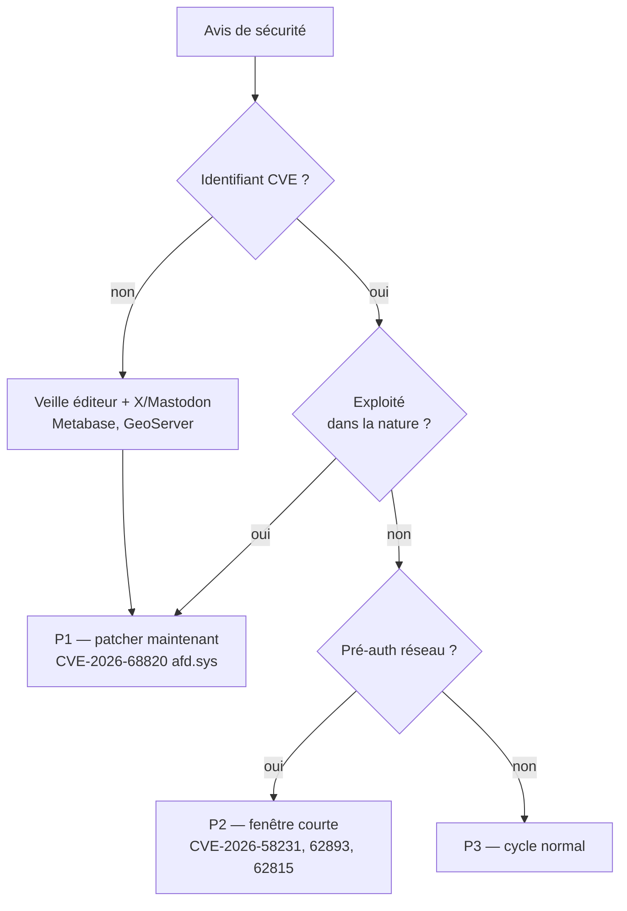
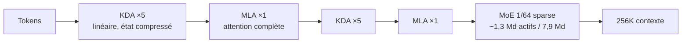

# Rapport hebdo — Semaine W33 (2026-08-10 → 2026-08-16)

Semaine **très dense** — **45 sujets** sur **4 catégories actives**, réparties sur six journées de digest (10, 11, 12, 14, 15 et 16 août). Trois mouvements de fond la traversent. Un : **la confiance implicite est retirée par défaut, partout à la fois** — `npm 12` coupe les scripts d'installation, Amazon ECR signe les images au registre sans jamais te donner la clé, NuGet.org plafonne les clés API à 30 jours. Deux : **le CVE cesse d'être un index fiable** — Microsoft livre le plus gros Patch Tuesday de son histoire (398 CVE) le même jour que deux failles CVSS 10,0 chez SAP, pendant que Metabase et GeoServer se font exploiter *sans identifiant CVE du tout*. Trois : **l'application devient un serveur d'outils pour agents**, et l'outillage qui va avec arrive en même temps — WebMCP expérimental dans Angular v22, `RoutingChatClient` côté .NET, l'agent tracing de Cloudflare, et le runtime d'agents open source de DeepSeek. En toile de fond, le plafond des poids ouverts continue de monter côté chinois : Qwen publie son premier Max téléchargeable, 2 400 milliards de paramètres.

## 🏆 Top de la semaine

### 1. Angular v22 — WebMCP : ton app expose des outils typés aux agents

C'est le morceau le moins commenté de la v22, et probablement le plus structurant. Jusqu'ici, un agent de navigateur qui voulait « agir » sur ton application n'avait qu'une option : scraper le DOM et cliquer à l'aveugle. **WebMCP** renverse la logique — tu déclares des **fonctions typées par JSON Schema**, l'agent les appelle par leur nom.

Comment ça marche : Angular branche ces outils sur le **cycle de vie de l'injecteur**. Tu fournis les outils via `provideExperimentalWebMcpTools` au bootstrap ou sur une route ; le callback `execute` s'exécute **en contexte d'injection**, donc `inject()` fonctionne normalement dedans. À la destruction de l'injecteur, l'outil disparaît de la surface exposée — à condition d'avoir activé `withExperimentalAutoCleanupInjectors()` sur le router, sinon un outil déclaré sur une route reste visible à l'agent après navigation. Le piège principal : **Angular n'applique pas le schéma au runtime**. Le JSON Schema type ton callback côté TypeScript, il ne valide pas les arguments reçus.

```ts
// main.ts — un outil global, typé par JSON Schema
bootstrapApplication(AppRoot, {
  providers: [
    provideExperimentalWebMcpTools([{
      name: 'searchCatalog',
      description: 'Cherche des produits dans le catalogue.',
      inputSchema: {
        type: 'object',
        properties: {
          query: {type: 'string', description: 'Mots-clés.'},
          maxResults: {type: 'number', description: 'Nombre max de résultats.'},
        },
        required: ['query'],          // => `query: string`, et non `string | undefined`
        additionalProperties: false,  // => aucun autre argument accepté côté types
      },
      execute: ({query, maxResults}) => {
        // Valide toi-même : le schéma n'est PAS appliqué au runtime par Angular.
        if (typeof query !== 'string') throw new Error(`query invalide: ${query}`);
        const catalog = inject(CatalogService); // contexte d'injection disponible ici
        return {content: [{type: 'text', text: catalog.search(query, maxResults ?? 5)}]};
      },
    }]),
  ],
});
```

Le second volet va plus loin : un **Signal Form** peut devenir un outil implicite via l'option `experimentalWebMcpTool` sur `form()`. Le schéma est **inféré du modèle** — types déduits des valeurs initiales, champs requis déduits des validateurs `required`, tableaux typés depuis leur premier élément. L'agent voit les erreurs de validation et les échecs de `submission.action`, donc il peut réessayer tout seul. Contraintes : valeurs initiales concrètes obligatoires (`''`, `0`, `false`), tableaux non vides, et les validateurs asynchrones ne sont pas déclenchés. Le tout reste **expérimental** : les API peuvent bouger hors d'une majeure. Documentation : [angular.dev/ai/webmcp](https://angular.dev/ai/webmcp).

### 2. 398 CVE en un jour, et deux failles exploitées qui n'ont pas de CVE

Microsoft a livré le 11 août le **plus gros Patch Tuesday jamais publié** : 398 CVE, 42 critiques, trois zero-days. Un seul est exploité — **CVE-2026-68820**, un use-after-free dans `afd.sys` (le pilote derrière Winsock), attribué par Check Point à **Lazarus**, qui l'enchaîne pour charger une nouvelle version de son rootkit noyau **FudModule**. Son CVSS ? **7,0**. Le même jour, SAP publiait **CVE-2026-58231** à **CVSS 10,0** sur Commerce Cloud, et Windows Deployment Services **CVE-2026-62893** à 9,8. Et pendant ce temps, **Metabase** (zero-day SQL, admin non authentifié, credentials de toutes les bases connectées) et **GeoServer** (`jsonArrayContains`, SQLi → RCE, sondé dans l'heure suivant la divulgation sur X) étaient exploités **sans aucun identifiant CVE** — donc invisibles pour ton scanner.

Comment ça marche, la règle de tri qui tient : le CVSS mesure la gravité théorique, pas la probabilité que ça te tombe dessus cette semaine. Trier par CVSS décroissant t'aurait fait patcher `CVE-2026-62893` (9,8) **avant** `CVE-2026-68820` (7,0), c'est-à-dire l'inverse de la bonne décision. L'ordre qui marche est : *exploité dans la nature* → *pré-auth réseau* → *local*. Et une branche entière échappe au flux CVE : les avis éditeur sans identifiant.



L'actionnable Metabase mérite d'être retenu tel quel : la signature à chercher dans tes logs est un `POST /api/session/reset_password` en **400** immédiatement suivi d'un `GET /api/user/current` en **200**. Et le patch ne suffit pas — il faut vider `core_session`, auditer les comptes superuser et **faire tourner les mots de passe de chaque base connectée**. Correctifs en `x.58.24`, `x.59.21`, `x.60.17`, `x.61.11`, `x.62.9`, `x.63.5`.

### 3. Qwen3.8-2.4T-A95B — le premier Qwen-Max téléchargeable

Alibaba a franchi une ligne le 12 août : pour la première fois, un modèle de la classe **Max** est publié en poids ouverts. `Qwen3.8-2.4T-A95B` est un MoE de **2 400 milliards de paramètres** dont **~95 milliards s'activent par token**, avec une build FP8 disponible et des quantisations GGUF communautaires apparues le jour même.

Deux réserves, et elles comptent. Les poids sont **text-only** : pas de vision, pas de contexte 1 M, contrairement à ce que sert l'API — le raisonnement n'est d'ailleurs pas désactivable. Et la licence n'est **pas Apache 2.0** mais une licence maison nommée `qwen3.8-max`, écrite pour cette release. La page de discussion du modèle a réagi vivement. À lire avant tout usage produit.

Comment ça marche, côté déploiement : ce qui rend un 2,4 T servable, c'est le ratio actifs/totaux. Tu paies la **mémoire** des 2 400 Md (les experts doivent être résidents ou paginés) mais le **calcul** de 95 Md par token. C'est exactement pour ça que la nouvelle vLLM de la semaine compte autant que le modèle : `v0.27.0` (9 août) et `v0.27.1` (11 août) totalisent **561 commits**, livrent le support complet de **Kimi K3** en une seule release, un plan de contrôle **gRPC** dans le frontend Rust, et activent en amont les cibles `sm_107` (NVIDIA Rubin) et `gfx1250` (ROCm).

```bash
# Servir un MoE frontière : le sharding est la vraie décision, pas le --model
vllm serve Qwen/Qwen3.8-2.4T-A95B \
  --quantization fp8 \            # build FP8 publiée par Alibaba
  --tensor-parallel-size 8 \      # découpe intra-nœud des couches denses
  --enable-expert-parallel \      # les experts sont distribués, pas répliqués
  --max-model-len 262144          # pas de contexte 1 M dans les poids ouverts
```

Le message des deux nouvelles est le même : **servir de l'open-weight frontière est devenu une affaire d'infrastructure, pas de `pip install`**. Source : [huggingface.co/Qwen/Qwen3.8-2.4T-A95B](https://huggingface.co/Qwen/Qwen3.8-2.4T-A95B).

## 🅰️ Angular — le compilateur, et npm qui change les règles

Côté framework, la semaine est calme : aucun tag depuis `22.2.0-next.2` du 13 août, blog officiel silencieux depuis le 31 juillet hors récap communautaire. Le mouvement est dans le **compilateur de templates** : `@switch` gagne le matching multi-cas (`@case (A, B)`) avec **vérification d'exhaustivité par `never`** — ton build échoue désormais quand une union grandit sans que tu couvres le nouveau membre. S'ajoutent la syntaxe **spread/rest** dans les templates, les **arrow functions inline** et les commentaires à l'intérieur des balises. La `22.2.0-next.2` corrige par ailleurs un paquet de bugs de **scoping CSS** : nested CSS enfin scopé, `::ng-deep` sur sélecteur parent, éléments `script` MathML retirés à la compilation, `SafePropertyRead` en navigation chaînée.

Mais le sujet le plus marquant de la section vient d'à côté : **`npm 12` désactive les scripts d'installation par défaut**. C'est la réponse directe à `ChainDrop`, le ver npm de la semaine précédente qui déclenchait sa charge Bun sur un hook `preinstall` — avant même la fin de l'installation, donc avant tes tests. Le registre passe à un modèle de **confiance déclarée, paquet par paquet**, et les installs depuis Git ou tarball arbitraire sont durcies. Concrètement : tout paquet à build natif (`sharp`, drivers, binaires de test) demande une action côté CI.

```ini
# .npmrc — AVANT (npm 11) : tout s'exécutait, on bricolait un opt-out global
ignore-scripts=false

# .npmrc — APRÈS (npm 12) : le défaut est sûr, on déclare les exceptions
# Les paquets autorisés vivent dans le manifeste, pas dans un flag global.
# Fichier committé pour que la CI applique exactement la même politique que toi.
audit-signatures=true
```

À noter aussi : **Astro 7** sort avec un compilateur réécrit en **Rust** (jusqu'à **61 %** de build en moins sur les projets de contenu), un pipeline Markdown natif et **Vite 8** — même trajectoire que `tsgo` côté TypeScript et Rolldown côté Angular. Et dimanche, Expedia Group a ouvert **`mockql-rs`**, un proxy Rust qui remplit les champs GraphQL annotés `@mock` avec des données générées par LLM : c'est la **troisième** tentative publique en six mois sur ce problème, après le `@generateMock` d'Airbnb (avril, au build) et une RFC GraphQL Foundation (février, `@mock` sur l'opération). Deux d'entre elles utilisent le même nom de directive pour des sémantiques incompatibles, et la RFC est en **Stage 0 sans champion** — standardiser dessus aujourd'hui, c'est parier sur une lecture propriétaire.

## 🔷 CSharp / .NET — dernière ligne droite avant la LTS

`.NET 11 Preview 7` (11 août) est la **dernière preview** avant la GA du **10 novembre 2026**. Deux bascules par défaut changent ton quotidien immédiatement : le **CLI `dotnet` est compilé en NativeAOT** (toute la surface de commandes, `--help` inclus, sort du chemin managé) et le **serveur MSBuild reste debout entre les builds**. Ce ne sont pas des features visibles, ce sont des latences fixes que chaque étape CI courte cesse de payer — avec la contrepartie qu'un serveur MSBuild persistant garde de l'état en mémoire, donc sache le couper. Côté langage, **C# 15 ajoute `break` et `continue` étiquetés** : `break outer;` remplace le drapeau booléen testé à chaque niveau ou le `goto`, et peut cibler une boucle **ou** un `switch` englobant. Côté ASP.NET Core, les **Server-Sent Events sont enfin décrits en OpenAPI 3.2** via `itemSchema` — la génération de clients typés fonctionne désormais sur un flux, plus seulement sur une réponse unitaire. Et Blazor Server gagne la **pause automatique de circuit sur onglet caché** (paquet opt-in, déclenché par `visibilitychange` + délai d'inactivité), qui complète enfin le `RequestCircuitPauseAsync` côté serveur : le serveur savait pauser, il ne savait pas *quand*.

Le sujet le plus marquant reste **`Microsoft.Extensions.AI` 10.9.0** : c'est la réponse officielle à « modèle cher pour les tâches dures, modèle bon marché pour le reste, et un plan B quand le fournisseur tombe ». Quatre nouveaux `IChatClient` — `RoutingChatClient` (classe de base, sélection par requête via `SelectClientAsync`), `SemanticRoutingChatClient` (route sur le **sens** du dernier message, par similarité d'embeddings contre des énoncés d'exemple), `FailoverChatClient` et `OrderedFailoverChatClient`. Le point de conception qui compte : la resélection n'est possible que **tant qu'aucune sortie n'a été livrée au caller** — c'est la garde que ton `try/catch` maison n'avait pas en streaming.

```csharp
// Avant — fallback maison : pas de télémétrie, pas de garde sur la sortie déjà engagée
try { return await primary.GetResponseAsync(msgs, opts, ct); }
catch { return await backup.GetResponseAsync(msgs, opts, ct); }

// Après — bascule ordonnée, options clonées par requête, tentatives observables
var failover = new OrderedFailoverChatClient([primary, backup, lastResort]);
var response = await failover.GetResponseAsync(msgs, opts, ct);
```

Tout est marqué `[Experimental]` sous le diagnostic **`MEAI001`** — isole-le derrière ton abstraction. Deux échéances à inscrire au calendrier maintenant : **17 août**, les nouvelles clés API NuGet.org sont plafonnées à **30 jours** ; **1er novembre**, toutes les clés longue durée existantes expirent. Si ta CI publie avec un secret de dépôt, la bascule vers Trusted Publishing se prépare maintenant. Enfin, **Rx.NET 7.0** sort les intégrations WPF, WinForms, UWP et WinRT de `System.Reactive` — migration à planifier si tu livres en self-contained.

## 🤖 IA open source — le plafond monte, l'attention se déplace

Le bilan semestriel du Hub publié dimanche démonte plusieurs intuitions confortables. Sur presque chaque mois de 2026, le **plus gros modèle ouvert d'un labo chinois dépasse tout ce qu'un labo américain a publié** — de 754 Md à 2,78 T de paramètres par mois côté chinois, contre moins de 130 Md cinq mois sur sept côté américain. Contre-intuitif : les **licences les plus permissives sont sur les plus gros modèles**, avec sur 178 sorties chinoises > 20 Md, **59 % Apache 2.0**, 22 % MIT et **zéro clause non commerciale**. Autre chiffre qui recadre : **attention ≠ adoption**, un seul dépôt commun entre le top 25 des téléchargements et le top 25 des likes. Et pour la première fois, les agents sont mesurables comme utilisateurs du Hub — **Claude Code pesait 44,4 % du trafic agent en juillet**, après 6,4 % en mai. La couche runtime suit : dépôts déclarant `gguf` **+464 %**, `mlx` +148 %, contre **+16 %** pour `transformers`.

La semaine a livré, en six jours : **Muse Glimmer 30B** (Meta revient à l'open source, Apache 2.0, multimodal dense, mais **28,4 % de taux de réussite d'attaque** sur Siren AgentDojo — l'injection de prompt reste ton problème), **Ling-3.0-tiny** (Ant Group, MIT, 7,9 Md totaux / ~1,3 Md actifs), **GLM-5.3** (Z.ai, même base que 5.2, **tous les gains viennent du post-training**, poids retenus deux semaines pour durcissement — une première dans la série, CyberGym passe de 77,2 % à **84,5 %**), et **Qwen3.8-27B** (dense 27 Md, 55,6 Go non quantisé, DeepSWE de **14,2 à 42,2 points**, vision incluse).

Le sujet le plus marquant côté architecture est `bailing_hybrid`, le socle commun de Ling-3.0. Ant n'a pas greffé d'attention linéaire après coup : ils ont **pré-entraîné en hybride dès le départ**, en alternant **cinq couches de Kimi Delta Attention pour une couche de Multi-head Latent Attention**. L'idée est une division du travail — l'attention linéaire (KDA, avec gating diagonal fin injecté dans la règle Delta de mise à jour d'état) porte le **volume** à coût mémoire quasi linéaire, l'attention complète (MLA) porte la **précision** de rappel long-contexte. Résultat annoncé : 256K de contexte sans la courbe quadratique classique.



Deux autres signaux à ne pas rater. **DeepSeek Harness** (MIT, Node.js, preview, **33 000+ étoiles GitHub en quelques heures**) pousse le « everything is a plugin » jusqu'à rendre **la boucle d'agent elle-même remplaçable** ; tout dérive d'un journal append-only, d'où resume / fork / replay gratuits, avec sandbox Landlock (Linux), Seatbelt (macOS) et jeton ACL-restreint (Windows). Et le hackathon de reproduction **ICML 2026** a fait repasser **2 226 papiers par des agents** : 51 % ont au moins une affirmation vérifiée, **23 % au moins une falsifiée ou contestée**, et 242 papiers reçoivent des verdicts opposés de deux équipes indépendantes. Les fausses falsifications existent aussi — une « méthode 2× plus lente » n'était qu'une erreur de normalisation dans la reproduction.

## 📡 Tech — prouver ce qui s'est passé

Au-delà du volume de patches, la semaine dessine une bascule : on arrête de faire confiance à la déclaration, on cherche la **preuve vérifiable** — et on découvre partout ce que la preuve ne couvre pas. **Amazon ECR Managed Signing** déplace la signature d'images du poste développeur vers le registre : jusqu'à dix règles par registre, AWS Signer garde certificat **et clé privée**, donc aucune clé dans un dépôt, un runner ou un log de build. Ce qui est signé, c'est un payload Notary décrivant le **manifeste** (type, digest, taille), pas les octets de l'image ; la signature est asynchrone, le push commit d'abord. Et surtout : **sans enforcement à l'admission, rien ne change** — Kyverno ou Gatekeeper + Ratify, et la trust policy est le vrai document.

```yaml
# Sans cette étape, la signature ECR n'empêche strictement rien de tourner.
apiVersion: kyverno.io/v1
kind: ClusterPolicy
metadata: {name: verify-ecr-signed}
spec:
  validationFailureAction: Enforce   # Audit = tu observes, tu ne bloques pas
  rules:
    - name: require-notary-signature
      match: {any: [{resources: {kinds: [Pod]}}]}
      verifyImages:
        - imageReferences: ["*.dkr.ecr.*.amazonaws.com/*"]
          type: Notary               # payload = manifeste (digest/type/taille)
          attestors: [{entries: [{certificates: {cert: "{{ aws_signer_root }}"}}]}]
```

Même leçon côté observabilité : **Cloudflare agent tracing** ouvre des spans dédiés (`invoke_agent` → `chat` → `execute_tool` → `tool_approval`, un trace par tour, sous-agents imbriqués) aux conventions **OpenTelemetry GenAI**. Mais la doc dit noir sur blanc que **ce n'est pas un journal d'audit** : traces ni complètes ni sans perte, payloads tronqués, et des défauts de confidentialité incohérents selon le produit (Think ne stocke rien sans `storeMessages`, Flue stocke tout sauf `content: false`). Date à retenir : **1er octobre 2026**, chaque span devient un événement facturable — y compris les spans internes que le dashboard n'affiche pas.

Trois autres dossiers valent le détour. **Blacklight** (SpecterOps) inventorie ce que les agents de code laissent sur ton disque : `~/.codex/auth.json` et équivalents contiennent access tokens et refresh tokens, mais le plus sous-estimé reste les **transcripts de session** — chemins internes, noms de dépôts, URLs et commandes de déploiement. **Anthropic** a audité **141 006 runs d'évaluation** après la divulgation d'OpenAI et confirmé **trois incidents** d'accès Internet non prévu, avec cibles réelles touchées ; évaluations offensives suspendues, audit externe annoncé. Et un ticket **systemd** chiffre une amplification d'écriture spectaculaire : **49 Ko+ sur ext4, 110 Ko+ sur Btrfs pour une seule ligne de log**, par `fsync` par entrée et copy-on-write — `Storage=volatile` ou `SyncIntervalSec` sur les charges non critiques est le levier immédiat sur tes VM bavardes.

## À retenir si tu n'as qu'une minute

- **Patch en priorité `CVE-2026-68820`** (`afd.sys`, exploité par Lazarus, CVSS *seulement* 7,0) avant les 9,8 non exploitées, puis `CVE-2026-58231` (SAP, 10,0) et `CVE-2026-62815` (MsQuic, 9,8). Si tu exposes **Metabase ou GeoServer**, traite-les hors flux CVE : ils n'en ont pas.
- **`npm 12` casse tes builds à dépendances natives** : `ignore-scripts` est le défaut, les exceptions se déclarent paquet par paquet. Teste ta CI Angular avant la prochaine montée de `package.json`.
- **Deux dates NuGet.org** : **17 août**, nouvelles clés plafonnées à 30 jours ; **1er novembre**, toutes les anciennes expirent. Automatise la rotation ou passe en Trusted Publishing maintenant.
- **`.NET 11` GA le 10 novembre** — Preview 7 est la dernière preview, deux RC en septembre-octobre. CLI en NativeAOT et serveur MSBuild sont **activés par défaut** : valide tes pipelines dessus dès maintenant.
- **WebMCP (Angular v22) est expérimental mais utilisable** : `provideExperimentalWebMcpTools` + `withExperimentalAutoCleanupInjectors()`, et **valide les arguments toi-même** — le JSON Schema ne s'applique pas au runtime.

## Index de la semaine

- **Angular** : WebMCP expérimental, garde-fous du compilateur de templates, `npm 12` qui coupe les scripts d'install — **7 sujets** sur la semaine.
- **CSharp** : dernière preview avant la LTS du 10 novembre, routage/failover dans `Microsoft.Extensions.AI`, SSE en OpenAPI 3.2 — **8 sujets** sur la semaine.
- **IA** : premier Qwen-Max en poids ouverts, plafond chinois confirmé par les chiffres du Hub, architectures hybrides KDA/MLA — **14 sujets** sur la semaine.
- **Tech** : record de 398 CVE, deux exploitations sans CVE, signature au registre et traçage d'agents — **16 sujets** sur la semaine.

---
*Généré le 2026-08-19 par la routine `weekly` (Claude Cowork). Couvre 2026-08-10 → 2026-08-16.*
