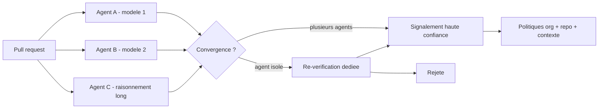
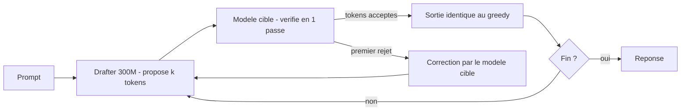
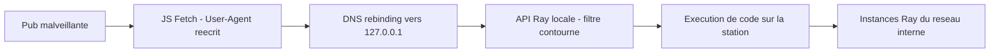

# Rapport hebdo — Semaine W34 (2026-08-17 → 2026-08-23)

Semaine **plus courte mais plus tranchante** que la précédente — **32 sujets** sur **4 catégories actives**, concentrés sur quatre journées de digest (19, 21, 22 et 23 août). Trois mouvements de fond la traversent. Un : **compiler est devenu une exécution de code non fiable** — la crate Rust `arrayref` (≈ 245 millions de téléchargements) embarque une dépendance typosquattée qui télécharge et lance un binaire distant *pendant* `cargo build`, et CISA donne trois jours au lieu de quatorze pour corriger une RCE Ray déclenchable depuis une simple pub dans ton navigateur. Deux : **vérifier coûte désormais plus cher que générer** — LinkedIn chiffre sa revue de code multi-agents à 63,9 % de suggestions acceptées, AWS sort un benchmark qui provisionne de vraies ressources, et NVIDIA fait passer un modèle de 30,2 % à 100 % sur ARC-AGI-3 sans toucher aux poids. Trois : **la latence se règle par la topologie, plus par le rendu** — Next.js 16.3, Harper, les sync engines et le décodage spéculatif attaquent tous le même aller-retour réseau, par quatre bouts différents. Angular, lui, est resté muet toute la semaine (`22.1.2` du 13 août reste la dernière stable) ; tout le mouvement front vient de l'outillage.

## 🏆 Top de la semaine

### 1. arrayref 0.3.10 — le code s'exécute avant que tu l'appelles

Le 20 août à 07 h 15 UTC, `arrayref 0.3.10` est publiée sur crates.io avec une dépendance ajoutée en silence : `proc-macro1 1.0.107`, typosquat de `proc-macro2` usurpant l'identité de dtolnay. Deux autres crates du même propriétaire tombent le même jour (`internment 0.8.7`, `append-only-vec 0.1.9`). Retrait en 86 à 107 minutes — mais `arrayref` cumule ~245 millions de téléchargements et vit sous `winit`, `egui`, `iced`, `blake3` et des crates Solana et Ethereum.

Comment ça marche : le poison n'est pas dans le code de la bibliothèque, il est dans son **build script**. Cargo compile et exécute `build.rs` **avant** de compiler ton crate, avec tes droits utilisateur, ton réseau, ton `~/.ssh`. Tu n'as jamais besoin d'appeler une seule fonction de la crate : `cargo build`, `cargo check`, voire l'analyse en arrière-plan de ton IDE suffisent. Aggravant : l'attaquant a **yanké les anciennes versions**, ce qui pousse mécaniquement les résolutions de dépendances vers la release malveillante.

```toml
# Cargo.toml de arrayref 0.3.10 — la ligne ajoutée en silence
[build-dependencies]
proc-macro1 = "1.0.107"   # typosquat de proc-macro2, identité dtolnay usurpée
```

```bash
# Repérer les versions empoisonnées dans un lockfile
grep -n -A2 -E 'name = "(arrayref|internment|append-only-vec)"' Cargo.lock

# Voir qui tire la dépendance (et donc quoi mettre à jour)
cargo tree -i arrayref

# Se protéger structurellement : interdire les crates non auditées / non listées
cargo install cargo-deny && cargo deny check bans   # allowlist explicite
cargo install cargo-vet  && cargo vet init          # attestation d'audit par dépendance
```

Le réflexe à garder : dans Rust comme dans npm (`postinstall`) ou NuGet (targets MSBuild), **le build est une surface d'exécution**. Un lockfile committé et une CI qui builde en réseau coupé règlent 90 % du problème.

### 2. Vite+ passe en bêta — une seule commande pour toute la chaîne front

VoidZero (la société d'Evan You) livre la bêta de **Vite+**, premier lot testé ensemble de Vite 8 + Vitest + Rolldown + tsdown + Oxlint + Oxfmt, sous MIT et agnostique du framework. Plus de 1 300 dépôts publics en dépendent déjà (Dify, BlockNote, `vinext` de Cloudflare), et plus de 500 pull requests sont tombées depuis l'alpha.

Comment ça marche : tu n'installes plus sept outils qui se coordonnent mal, tu installes **un binaire `vp`** qui les appelle avec des versions validées ensemble. La matrice de compatibilité `eslint × prettier × vitest × bundler` disparaît — c'est le vrai gain, pas la vitesse. Pour un projet Angular, l'intérêt est asymétrique : `vp check`, `vp test` et `vp run` se superposent à ce que tu fais déjà, alors que `vp dev` et `vp build` restent sur le terrain de l'Angular CLI.

```json
// AVANT — package.json : 6 outils, 6 versions à accorder à la main
{
  "scripts": {
    "dev": "vite", "build": "vite build", "test": "vitest",
    "lint": "eslint .", "format": "prettier --write .", "pack": "tsup"
  },
  "devDependencies": { "vite": "^7", "vitest": "^3", "eslint": "^9",
                       "prettier": "^3", "tsup": "^8", "typescript": "^5.7" }
}
```

```json
// APRÈS — un seul paquet, un seul point de vérité de versions
{
  "scripts": {
    "dev": "vp dev", "build": "vp build",
    "test": "vp test",          // Vitest
    "check": "vp check",        // Oxfmt + Oxlint + typecheck en une passe
    "pack": "vp pack"           // tsdown
  },
  "devDependencies": { "vite-plus": "^0.1.0-beta" }
}
```

La critique la plus sérieuse (Jared Wilcurt) ne porte pas sur la technique mais sur le **verrouillage d'écosystème** : « une abstraction au-dessus des scripts npm », avec `vp env` comme maillon faible. À surveiller avant d'y adosser une CI d'entreprise.

### 3. LinkedIn chiffre la revue de code multi-agents — 63,9 % d'acceptation

LinkedIn publie les chiffres de sa plateforme de revue de code IA : **5 230 commentaires sur 1 727 pull requests**, 90,1 % évaluables avec une confiance élevée, **63,9 % de suggestions acceptées** au global. La granularité est plus intéressante que la moyenne : **100 % des bugs de concurrence**, 80 % des erreurs de logique, 58,1 % des corrections de bugs, 43,5 % des refactorings, 40,6 % des correctifs de sécurité.

Comment ça marche : le design refuse le relecteur unique. Plusieurs agents indépendants, **avec des modèles et des approches de raisonnement différents**, produisent chacun leurs signalements ; la convergence de plusieurs agents sur un même point vaut preuve forte, un signalement isolé n'est pas jeté mais **revérifié séparément**. Par-dessus, trois niveaux de personnalisation composables — politiques d'organisation, conventions par dépôt, règles contextuelles.



Le taux à 100 % sur la concurrence dit exactement où ça paie : les bugs que la relecture humaine rate systématiquement parce qu'ils demandent de simuler un entrelacement. Le 40,6 % en sécurité dit où ça ne paie pas encore.

## 🅰️ Front — la latence est un problème de topologie

Angular n'a rien publié : `22.1.2` (stable) et `22.2.0-next.2` (pré-release) du 13 août restent les dernières balises, blog muet depuis la newsletter du 14. Tout le mouvement vient d'à côté, et il converge. **Next.js 16.3** fait tomber Turbopack de 21,5 Go à 2 Go de RAM en dev sur le dashboard Vercel, sort des builds CI jusqu'à **5,5× plus rapides** grâce au cache disque, et reconstruit le SSR sur les streams Node natifs (**+22 % de requêtes encaissées** sans changer une ligne, runtime edge déprécié au passage). **Harper 5.2** attaque le même problème d'en dessous : en fusionnant base, cache et messagerie dans un seul process Node, un read personnalisé passe à **~0,4 ms in-process contre ~3 ms** vers un Neon Postgres distant, avec un écart annoncé jusqu'à ~14× sur les chemins « live » (mesuré sur 474 tests de charge, dataset chaud en mémoire — à lire comme une cartographie, pas un classement ; Vercel garde le cacheable et le fan-out à forte concurrence). Les **sync engines** (Electric, TanStack DB, session QCon de James Arthur) tirent la même conclusion par la réplication locale. Et **React Router v8** pose deux jalons que tout le front finira par franchir : build **ESM-only** (plus aucun CommonJS publié, planchers Node 22.22, React 19.2.7, Vite 7) et **middleware activé par défaut** — avec fin de vie de React Router v6 et Remix v2.

Le sujet le plus marquant, c'est le mécanisme des **Instant Navigations** de Next.js, parce qu'il est transposable. Comment ça marche : au lieu de prefetcher une réponse complète par lien — donc N requêtes pour N liens visibles — le client prefetche **un shell de page réutilisable** par route, et ne va chercher au clic que la partie dynamique. `cacheComponents` découpe le rendu entre ce qui est cachable et ce qui ne l'est pas ; `partialPrefetching` n'envoie que le premier.

```ts
// next.config.ts — les deux flags qui activent le shell prefetché
export default {
  cacheComponents: true,      // sépare shell cachable / segments dynamiques
  experimental: {
    partialPrefetching: true, // ne prefetch que le shell, pas la réponse entière
  },
};
```

```tsx
// Le segment dynamique reste hors du shell : il est streamé au clic.
export default function Page() {
  return (
    <Shell>                                  {/* prefetché, réutilisé par route */}
      <Suspense fallback={<Skeleton />}>
        <UserCart />                         {/* non cachable → streamé */}
      </Suspense>
    </Shell>
  );
}
```

Le transposé Angular existe déjà et s'appelle autrement : `PreloadAllModules` / stratégie de preload custom pour le shell, `@defer` pour la partie coûteuse, et un `resolve` qui ne bloque que sur le strict nécessaire. Le raisonnement à retenir : **ce qui coûte, c'est le nombre d'allers-retours, pas le rendu**.

## 🔷 .NET — le langage se durcit, l'outillage s'ouvre

Semaine sans release runtime — le blog .NET est muet depuis le 13 août — mais les notes de **.NET 11 Preview 7** (11 août) contiennent deux évolutions qui touchent du code quotidien, et le calendrier se resserre : **GA le 10 novembre 2026**, RC1/RC2 entre septembre et octobre, runtimes de production à jour en 10.0.11 / 9.0.19 / 8.0.30. Côté ASP.NET Core, la **localisation des messages de validation devient native** (elle s'active dès qu'un `IStringLocalizer` est enregistré, fini `ErrorMessageResourceType` sur chaque attribut), `ValidatableType` et `SkipValidation` sortent de préversion, et une décision de Preview 6 est **annulée** : la protection cross-origin automatique revient en opt-in, alignée sur .NET 10, pour ne pas casser l'existant. EF Core traduit `int.Parse` en `CAST` SQL Server et réécrit plusieurs patterns `GroupBy` en jointure unique. Côté outillage, **Aspire 13.5** pose un terminal interactif dans le dashboard via `WithTerminal()` (expérimental), ouvre l'Interaction Service aux imports JSON/YAML et passe l'AppHost TypeScript en GA à parité avec C# — avec des breaking changes à noter (`ServiceProvider` → `Services`, intégration GitHub Models dépréciée). Le **serveur MCP distant d'Azure DevOps** passe GA sur `mcp.dev.azure.com/{org}` — plus de PAT en clair — mais Entra ne supportant ni le Dynamic Client Registration ni les Client ID Metadata Documents, **Claude Code, ChatGPT et Cursor ne peuvent pas s'y connecter** : le serveur MCP local reste la voie de secours. Enfin, les **Passkeys de MAUI Essentials** ne couvrent que la moitié cliente de WebAuthn : challenge, options et validation d'assertion restent entièrement à ta charge côté relying party.

Le sujet le plus marquant pour ton code, c'est l'**exhaustivité des `switch` sur hiérarchies `closed` derrière un générique**. Comment ça marche : jusqu'ici, le compilateur ne savait pas qu'un `T` contraint à un type `closed` ne peut prendre que les formes déclarées, et réclamait un bras `_` que tu ne savais pas remplir intelligemment. C# 15 propage la contrainte : si tes bras couvrent toutes les formes, l'avertissement disparaît — et surtout, **ajouter une forme à la hiérarchie fait réapparaître l'erreur sur tous les `switch` concernés**. C'est l'inverse d'un `default` silencieux qui laisse passer les nouveaux cas en production.

```csharp
// AVANT — le générique perdait la contrainte : CS8509 non exhaustif
static string Render<T>(T shape) where T : Shape => shape switch
{
    Circle c => $"cercle r={c.R}",
    Square s => $"carré c={s.C}",
    _ => throw new UnreachableException(), // bras subi, jamais testé
};

// APRÈS — hiérarchie `closed` : le compilateur connaît toutes les formes
public closed record Shape { }
public record Circle(double R) : Shape;
public record Square(double C) : Shape;

static string Render<T>(T shape) where T : Shape => shape switch
{
    Circle c => $"cercle r={c.R}",
    Square s => $"carré c={s.C}",
    // plus de `_` : ajoute un Triangle à la hiérarchie → ce switch casse à la compilation
};
```

Attention au périmètre : les **types union restent derrière un drapeau de préversion** (leur matching passe à une approche « try-both » : le motif est testé contre l'union, puis contre la valeur contenue). Ne les mets pas sur un chemin de production avant la GA de novembre.

## 🤖 IA — le score ne mesure pas ce que tu crois

La semaine IA n'a produit presque aucun poids nouveau, et beaucoup de méthode. Le fil rouge est brutal : **trois publications indépendantes montrent que l'évaluation est cassée à trois niveaux différents**. Hugging Face et Hume AI documentent le *benchmark fitting* en ASR — sur 11 modèles testés, plusieurs reproduisent le transcript de référence même quand l'audio le contredit ; **6 sur 11** omettent un « Thank you » clairement audible parce que la référence l'omet, les mieux classés sur LibriSpeech « récupèrent » **30 à 40 %** de nombres physiquement effacés de l'audio, et certains atteignent **~90 % de switch rate** orthographique (« Mr. » vs « Mister ») selon le dataset d'origine. NVIDIA fait passer Claude Opus 5 de **30,2 % à 100,00 RHAE** sur les 25 environnements du set public d'ARC-AGI-3 **sans toucher au modèle**, juste en l'enveloppant dans le harnais AVO (mémoire persistante au-delà de la fenêtre de contexte + superviseur programmatique qui intervient quand la progression stagne) — donc le benchmark mesurait le harnais autant que le modèle. Et **SWE-Bench ProMax** plafonne les meilleurs agents à **41,2 %** sur 170 instances de refactoring réel en 7 langages, pendant qu'un audit cité estime que **~60 %** des instances non résolues de SWE-bench Verified contiendraient des tests défectueux. En regard, **`aws-bench`** d'AWS déplace le curseur au bon endroit : plus de fixtures figées, des ressources réellement provisionnées par CDK dans des comptes jetables, l'agent en conteneur sandboxé, et une notation par inspection de l'état AWS live (aucun leaderboard au lancement). Côté outils : **Sentence Transformers v6.0** rend la recherche multi-vecteurs façon ColBERT accessible en une ligne — au prix réel de **311,5 Mo** en float32 pour 4 874 passages Natural Questions contre 7,5 Mo en dense (~42×), ramenés à **92 Mo** via l'index PLAID. Et IBM montre avec **ALTK-Evolve** que la mémoire agentique est une dose, pas un interrupteur : **+16,1 pt pour +5 % de tokens** sur gpt-oss-120b en récupération curatée, **+9,5 / +16,1 pt pour +78 % de tokens** sur DeepSeek-V3.2 avec le jeu complet, et **0,0 de gain** sur GLM-5 (745 Md), déjà saturé.

Le sujet le plus marquant côté exécution, c'est **LFM2.5-DSpark** de Liquid AI : trois modèles brouillons de ~296-328 M de paramètres qui accélèrent des LFM2.5 existants — jusqu'à **3,18× de débit sur H100**, 2,87× sur MacBook M4 Max, et **-57 % de latence en moyenne** sur les scénarios d'appel d'outils. Comment ça marche : le décodage spéculatif fait produire *k* tokens d'un coup par un petit modèle, puis les fait **vérifier en un seul passage** par le gros modèle. Chaque token accepté est gratuit ; au premier rejet, on repart du modèle cible. La sortie est **identique au greedy de base par construction** — c'est de la vitesse pure, sans compromis qualité.



Support jour un dans llama.cpp (`--spec-type draft-dspark`) et SGLang (`--speculative-algorithm DSPARK`), implémentations poussées upstream. La limite à connaître : sur un modèle MoE comme LFM2.5-8B-A1B, le gain tombe à **+18 % en moyenne sur Metal**, parce que vérifier *k* tokens d'un coup active bien plus d'experts qu'un token seul.

## 📡 Tech — chaîne d'appro, frontières et pannes

Semaine chargée sur tout ce qui entre dans ton build ou ton runtime. Au-delà d'`arrayref` (cf. Top), **GitHub** publie le post-mortem de la panne du 17 août : **7 h 47 d'indisponibilité** (13 h 28 – 21 h 15 UTC), ~20 % d'erreurs web/API et ~50 % sur les téléchargements d'archives et de contenu brut, cause racine un composant d'infrastructure critique en Central US qui n'a pas suivi un nouveau pic — Azure porte désormais **~58 % de la charge plateforme contre 12 % en mai**. **Flux Mirror** propose la contre-mesure structurelle aux attaques éclair : un registre que tu opères, alimenté par copie octet à octet avec vérification de signature Cosign, sélecteurs semver/regex, et surtout un **âge minimum** avant recopie — un artefact fraîchement signé est retenu. **Debian** met au vote une résolution générale qui interdirait toute contribution écrite avec l'aide d'un LLM (paquets source, `lintian`, ressources web, doc et traductions ; hors périmètre : les projets amont et les correctifs de sécurité venus de l'amont), face à **sept contre-propositions** — un précédent qui pèsera sur les autres distributions. **Wiz** démonte l'illusion de portabilité des stockages « compatibles S3 » chez six neoclouds : sur un provider, `delete-bucket-policy` supprime **le bucket entier**, et les clés d'accès échappent souvent au secret scanning. **Docker Desktop 4.86** remplace son moniteur de VM tiers par Docker VMM (bêta publique, d'office sur macOS, opt-in Windows) — même moteur que Docker Sandboxes, donc que les environnements isolés d'agents ; Linux et GA fin octobre. **Cloudflare** sort deux briques opposées : **WriteGuard** (bêta privée), qui met paliers de risque et audit devant les serveurs MCP en réutilisant l'OAuth existant, et **Kitesurf**, moteur de navigateur pour agents en Rust/WebAssembly sur Workers, pilotable par Playwright via CDP — ni vidéo, ni WebGL, code pas encore ouvert, et une contradiction assumée avec son offre de blocage de scraping IA. Côté bas niveau, **`skitter-creek-bath-salts`** (Christopher Domas) contourne l'isolation mémoire AMD par en dessous, en reprogrammant les registres de traduction du contrôleur DRAM sous les barrières qui ne valident que l'adresse physique non traduite — SMRAM, tables PSP et buffers de microcode deviennent lisibles, mais il faut le Ring 0 et des familles 14h/15h/16h. Enfin **CVE-2026-69836** (Entra ID, CWE-502, **CVSS 10,0**, exploitée dans la nature) est déjà mitigée côté service : rien à patcher, donc rien à vérifier non plus — sauf tes journaux.

Le sujet à traiter en priorité reste **Ray CVE-2025-62593**, inscrite au catalogue KEV avec une échéance de remédiation à **3 jours** au lieu de 14 (BOD 26-04), CVSS 4.0 à **9,4**, toutes versions antérieures à **Ray 2.52.0**. Comment ça marche, et pourquoi ça vise ta machine de dev : le filtre anti-navigateur de Ray teste si l'en-tête `User-Agent` **commence par `Mozilla`** — or Firefox et Safari laissent l'API Fetch réécrire cet en-tête. Une pub malveillante suffit donc à faire émettre à ton navigateur une requête qui passe le filtre, puis le **DNS rebinding** fait pointer un domaine contrôlé vers `127.0.0.1` : ton navigateur devient le *confused deputy* qui parle à ton Ray local, puis aux instances Ray voisines du réseau interne.



```bash
# Vérifier et corriger — le seuil est 2.52.0
python -c "import ray; print(ray.__version__)"
pip install -U 'ray>=2.52.0'
# Et en attendant : ne jamais exposer le dashboard Ray sur 0.0.0.0 en local
```

## À retenir si tu n'as qu'une minute

- **`cargo build` = exécution de code.** Vérifie tes lockfiles pour `arrayref 0.3.10`, `internment 0.8.7`, `append-only-vec 0.1.9`. Le même raisonnement vaut pour `postinstall` npm et les targets MSBuild.
- **Ray < 2.52.0 sur ta station : à corriger aujourd'hui.** CISA a raccourci l'échéance à 3 jours ; le vecteur est une simple visite de site dans Firefox ou Safari.
- **GA .NET 11 le 10 novembre**, RC1/RC2 en septembre-octobre. Et **1er novembre : toutes les anciennes clés API NuGet.org expirent** — automatise la rotation avant, pas le jour même.
- **Un benchmark mesure aussi son harnais.** 30,2 % → 100 % sur ARC-AGI-3 sans changer de modèle ; 6 modèles ASR sur 11 recopient la référence contre l'audio. Ne compare jamais deux scores issus de harnais différents.
- **La revue de code multi-agents paie sur la concurrence** (100 % d'acceptation chez LinkedIn), beaucoup moins sur la sécurité (40,6 %). Calibre tes attentes par catégorie.

## Index de la semaine

- **Angular** : framework silencieux (`22.1.2` du 13 août), tout le mouvement vient de l'outillage — Vite+ bêta, Next.js 16.3, Harper 5.2, sync engines, React Router v8 ESM-only — 5 sujets sur la semaine
- **CSharp** : pas de release, mais Preview 7 déballée — exhaustivité `closed`, validation localisée native, Aspire 13.5, Azure DevOps MCP GA, Passkeys MAUI — 7 sujets sur la semaine
- **IA** : semaine de méthode plus que de poids — évaluation cassée à trois niveaux, `aws-bench`, revue multi-agents LinkedIn, DSpark, multi-vecteurs, mémoire agentique — 9 sujets sur la semaine
- **Tech** : supply chain et frontières — `arrayref`, Ray KEV, panne GitHub de 7 h 47, Flux Mirror, vote Debian sur les LLM, clones S3, Docker VMM, Kitesurf, Entra CVSS 10,0 — 11 sujets sur la semaine

---
*Généré le 2026-08-24 par la routine `weekly` (Claude Cowork). Couvre 2026-08-17 → 2026-08-23.*
